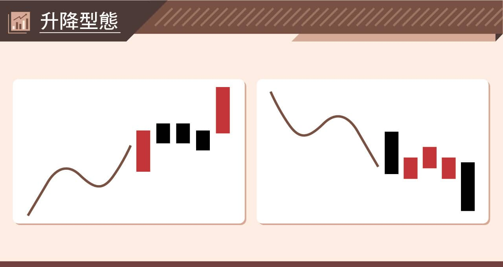
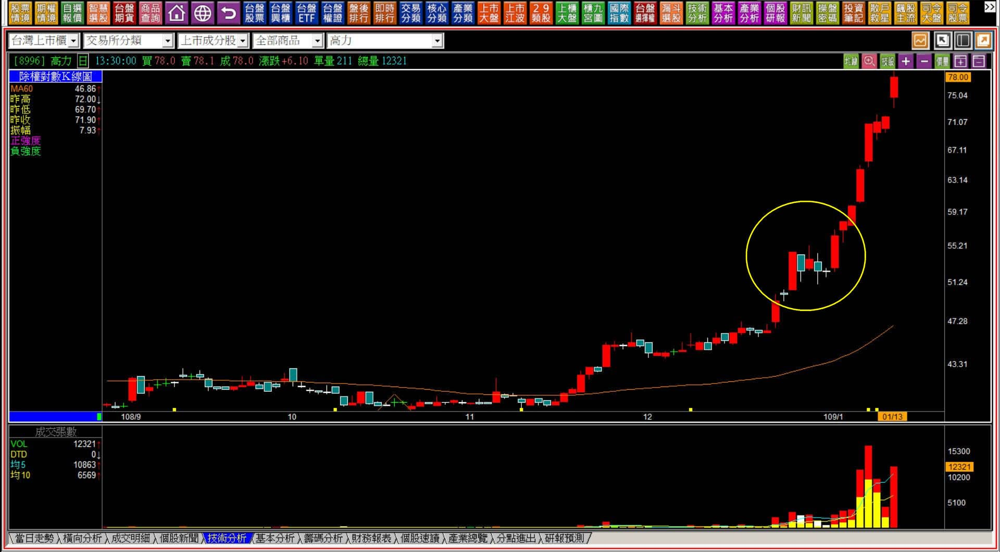
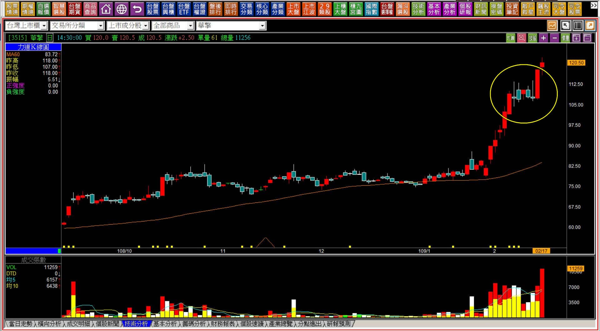
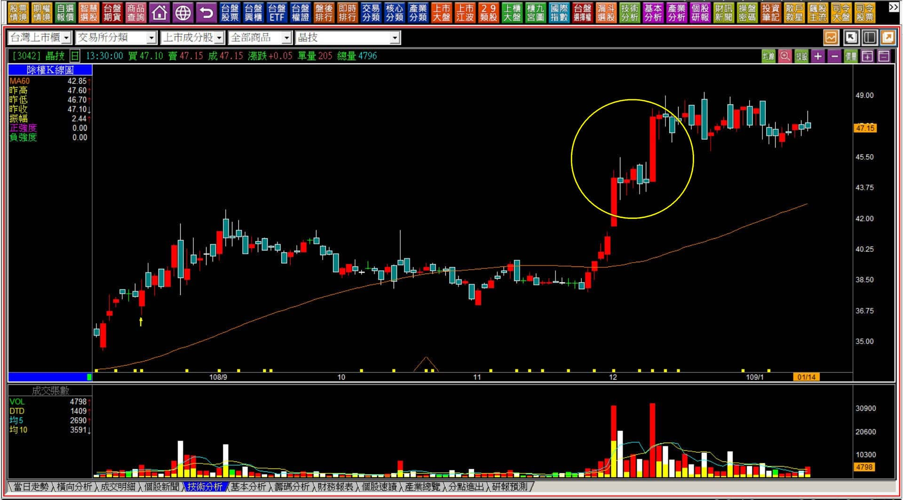
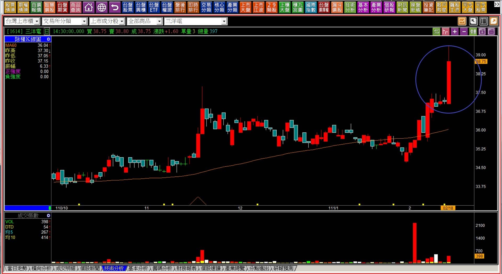

# 【組合K線補充】非轉折組合：升降組合型態的應用

定義：意義接近廣為人知的上升三法與下降三法，在力量型紅黑K出現之後，盤勢進入短期的狹幅整理狀態，再接續一根原本同方向的力量型K線，中間的整理不限天數。

時機：以原始的趨勢為方向，這個型態組合並沒有逆向研判的意義。後半段型態也算是咬定型態，不同之處在於之前已經先有一根原本方向的力量K線出現。可以說這是上升(或下降)三法拖延較久之後，才出現咬定型態。

---

---

**範例與說明**

升降型態之所以訂名為升降，主要採用往上一階或者往下一階之意，也同樣沒有買點或加碼點的意義，而是現在進行式的確認。通常漲勢的過程比較可能出現升降往上，跌勢往往不會等黑K之後整理一段再跌，因為長黑又弱勢之下要有橫向撐住並不容易，所以通常咬定型態之前已經呈現出明顯的弱勢了。

上升的型態中，也有區分力量上的不同，但無法在整理期判斷出來以後的漲幅會有多大，還是單純只是進入另外一次的高檔整理。

倘若原本已經在攻擊狀態中，上升型態再創新高之後，很容易繼續原本的往上拉抬攻勢，相對的如果沒有繼續，反而開始出現中期的區間震盪，那只能用區間整理的姿態來面對這個走勢。

**109-01-13高力(8996)**

高力是典型的攻擊走勢之後才出現往上升一階的表現。從成交量來說，上升一階之後一切才剛剛開始。

通常這個型態在整理的階段，型態看起來與高檔推升的攻擊型態是一樣的，也就是創新高的紅K之後，進入狹幅橫向，不僅創新高的紅K低點價格沒破，短期內也有狹幅整理或者低點推升的態勢，最強的走法就是再往上突破之後，再次展開另一波的日出攻擊。

**109-02-27華擎(3515)**

同樣的狀態，不一樣的是股價在中間橫向的過程中，偶有股價創新高出現，並沒有呈現弱勢的整理，使得籌碼略顯凌亂，對於不穩定的力量，短線交易者在創新高價之後也會選擇出場，這是股價在突破往上升的時候，成交量異常放大的主因。

**109-01-14晶技(3042)**

中長期已經是多頭趨勢的個股，最常出現的就是這種類型的上升， 一個階梯接著一個階梯。因為原本已經有過中期多方的表現，股價通常已經高於基本面應有的價格，所以再突破之後，開始整理，又突破、又繼續整理，定義上符合升降型態，不過除非基本面有更好的表現，不然慢慢的一段一段來，而不是強勢攻擊，表示這個價位對於市場資金的吸引力也已經不高。

經過這樣的例子，還可以區分為第一次攻擊或者已經中期多方趨勢之後，力量施展的角度當然大不相同。

**111-02-18三洋電(1614)**

型態上雖然符合升降的定義，但是成交量實在太低的，那麼型態相似也只可以算是巧合，因為人為因素可能性更高，但多方卻不需要花費力氣，所以基於攻擊成本的原理，介入風險會相對較大，因為一樣是長紅，攻擊耗費的總成本並不高。

股價上漲的時候，成交量代表的就是多方的成本，如果非常低，名詞都談不上主力成本，因為根本就沒有施力往上拉，才少少的張數就可以形成上升的紅K。

沒有成本在此的意義，就不用討論是否符合升降的型態，因為形狀符合但是力量上卻還沒看到拉抬資金在乎的跡象。