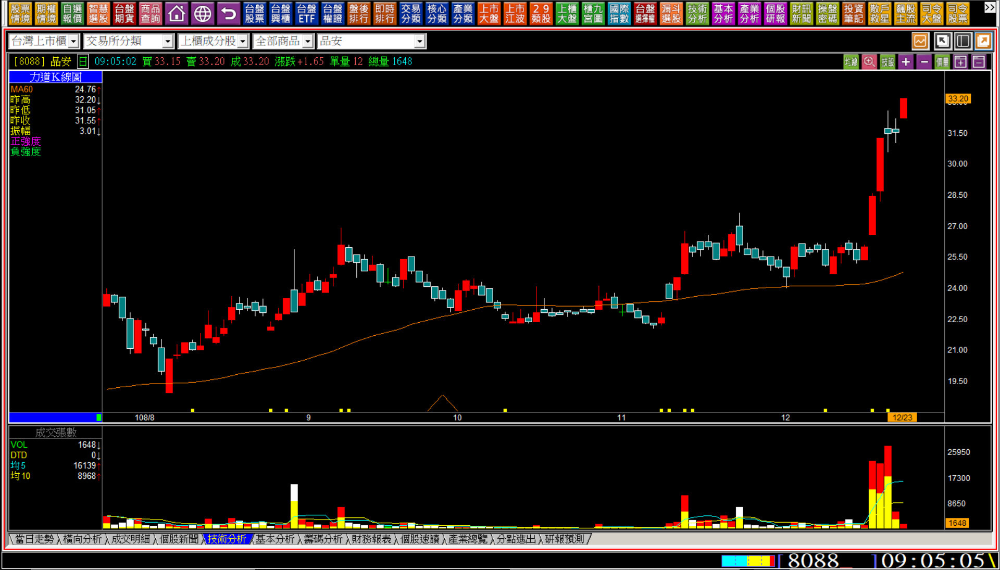
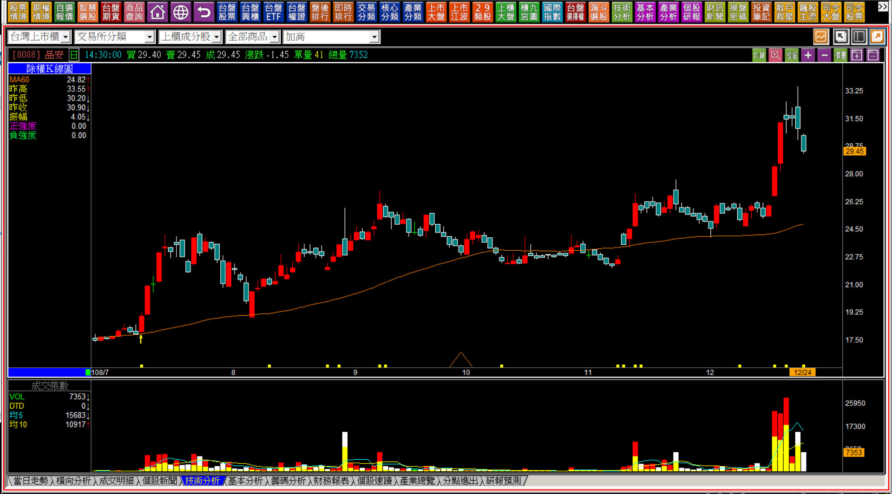
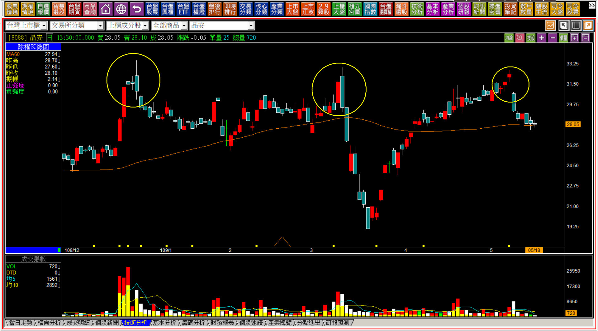

# 【多空轉折】向下跳空形成的壓力：雙鴉躍空與延伸解說

先思考兩根黑K並排是什麼意思？兩根紅K並排又是什麼意思？

不管是兩根黑K或者兩根紅K並排，答案都是弱勢的呈現，不過也都還需要隔天是否有壓力現象來確認。

以兩根紅K並排來說，既然第一天是紅K了，表示是有一些資金力量是願意把股價往上買的，那又為什麼隔天還是開低呢？如果是短期整理也無不可，所以如果並排的紅K之後，隔天卻有一根長黑摜破，那就是「暗夜雙星」的轉折組合成立。

上一篇學過暗夜雙星之後，那麼兩根黑K是不是也這樣看？

這就表示本篇與暗夜雙星的定義上可以合併一起來看，但又不能不討論雙鴉躍空的最後一個成立條件：躍空。

**雙鴉躍空定義：股價來到高檔壓力區附近，先跳空開高卻收黑K，隔日又出現小黑K(形成雙鴉)，併排黑K顯示由此轉弱，以雙鴉出現之後隔天「開盤跳空向下」作為轉折成立的確認。**

---

**延伸解說雙鴉躍空的原因**

上一篇在講跳空反轉的延伸解說時，我已經有先說明過了，光用圖型來講解定義並不難，給了大家圖例也都看得懂，問題是常常遇到了實務判斷時，卻因為形狀上的變化很容易錯判。

雙鴉躍空更是如此，因為定義上紅K之後出現兩根黑K，與上升三法裡紅K後整理兩天，接下來一個是往下跳空、一個是拉出長紅，就差一天意義卻是完全相反，這是容易忽略之處。

**雙鴉躍空示意圖**

**雙鴉躍空的重點在於壓力與躍空**

與其他轉折組合不同之處，是雙鴉躍空通常不會出現在創新高的位置，而是反彈遇到壓力的地方，所以關鍵在於K線上的壓力結構，同時隔天開盤就往下跳空。

而雙鴉躍空與上升三法，只有一線之隔，也就是如果併排雙黑K的股價隔天往上拉高，就可能變成上升三法，但一定要記得，上升三法也不是作為買點使用，所以不能看到上漲就當作是買點，依然要檢視其他的面向，例如雙鴉雖然是兩根黑K，但也可能只是短K線，甚至是十字線，就不能不評估「醞釀K線」的狀態與意義。

以下是連續走勢判斷的實例。

**108-12-23品安(8088) 09:05**

這張K線圖有許多實務面的探討，首先紅K之後接續著的兩天黑K，頗有並排兩黑K的問題，令人擔憂雙鴉躍空的出現，於是已經學會多空轉折的人，就會擔心隔天往下跳空，卻忘記了雙鴉躍空出現的位置是在股價上漲「遇到前壓」的時候。

那麼另一個角度看就是上升三法了，也就是整理兩天後在往上拉出一根長紅。上圖時間是在早上九點五分，好像定義都蠻符合的。

延伸說明的要點就是這個細節變化：

一、十字線到底會不會變盤？市場上有一種說法是看隔天。好了，上圖就是隔天了，目前股價又創新高，表示不會變盤了嗎？  
二、既然創新高，前一天卻完全沒有量，對比前十字線之前的量似乎不太合理。

沒錯，這樣的走勢就表示股票大部分籌碼都已經暫時在拉抬者的手上了，因為以前的冷門，本來散戶就不會去買，籌碼當然算是穩定，上圖在所有的技術分析判斷技巧中都還沒有疑慮。

那麼，下一個重點就是**「股價如果有心要攻擊，不可以回頭。」**

**108-12-24品安(8088)**

結果當天不但沒有上漲，還反向回檔，隔天再往下走。

這就是雖然有了定義上的教學，還需要延伸力量變化講解的最佳實務範例，因為一切好像都太完美，卻往下走讓人有機會拉回逢低承接，就是K線圖上**「力量的矛盾」**。

**109-05-18品安(8088)**

半年後我們重看同一檔股票，就會明白學習空方轉折，就算定義上不符合雙鴉躍空，也就是兩黑的隔天並沒有往下跳空，只有前半段的定義符合，背景也不對，最簡單的方式就是重回「力量上的原理判斷」。

既然股價回檔不符合攻擊，自然是不要繼續持有或者根本不要進場。

三個月後、五個月後，**在同一個價位都出現了遇壓的現象**，表示就算是公司派也知道自己股價到底值多少，並不會因為股市大好，公司派就專心拉抬自己的股票，他們也會考量很多現實因素。

未達雙鴉躍空但不合乎邏輯、遇到前高紅K之後包覆的黑K、連續三紅拉不開行情，隔天往下跳空這三個位置都可以看出這一檔股票完全沒有拉抬的意圖，這是延伸轉折組合到連續走勢的判斷能力，並不是都不學會比好，也不是學了上升三法會被騙，而是K線需要行進接續的判斷。

---

**謹記趨勢優先、力竭其次**

學習轉折組合需要力竭原理，很多人苦於不知道怎樣看出力竭。

原理上是要先有拉抬的力量，並且這股力量已經呈現出有幅度的獲利，理論上他們才會想要盡可能的高價出脫，因為買盤不但沒有繼續追高買進，還把手上的持股賣出來變成賣方，這是創新高的力竭判斷。

遇壓型的轉折，例如雙鴉躍空、大敵當前，都是遇到了阻力的反轉類型，所以關鍵是上漲了但是遇到了過去的「套牢」阻礙，然後呈現弱勢表現，就像是最簡易的判斷**「遇壓向下跳空」**。

其實觀念只要正確，知道了套牢壓力就是攻擊資金拉抬時會遇到的阻礙，並不是「形狀」長成怎樣的組合，就有了「重意不重形」的認知，對於判斷股價的變化會有幫助，也更容易體會力量的消長變化。