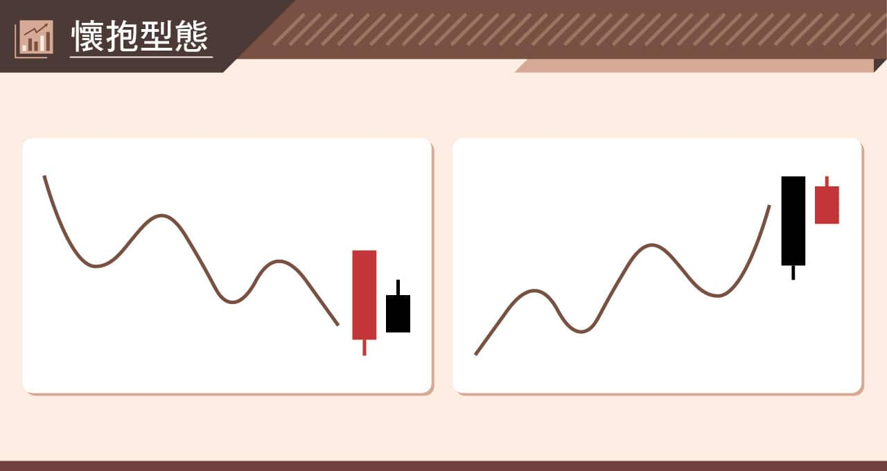
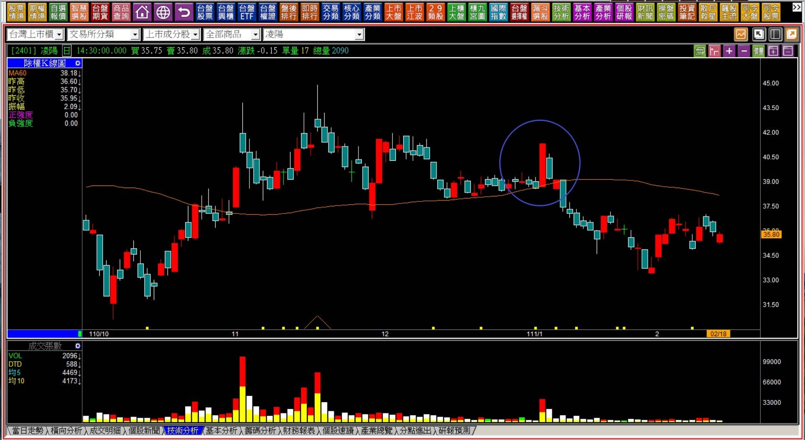
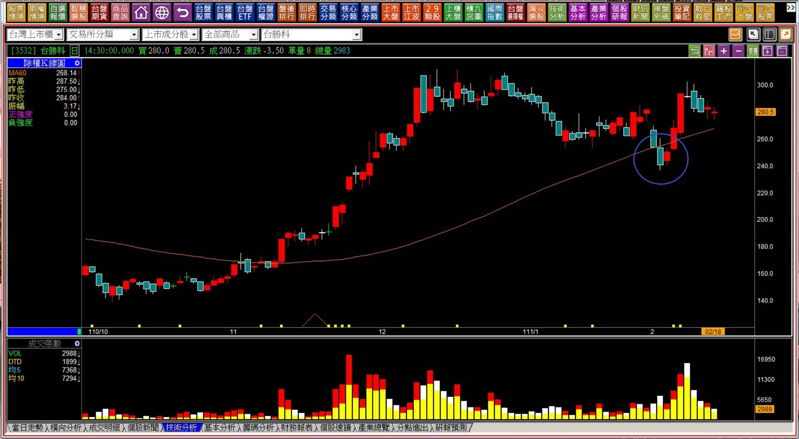
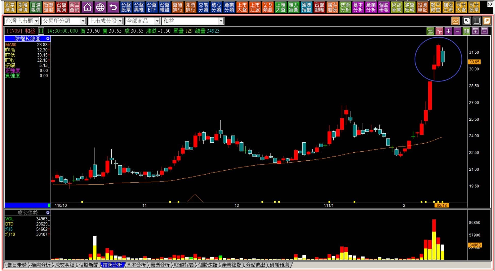

# 【組合K線補充】非轉折組合：懷抱型態組合的分類

定義：懷抱型態的別名也稱之為孕線，不過「懷抱型態」定義較為明確，與孕線的差異點在於前一天必須是「力量型K線」，隔天是醞釀型短K線，紅黑K都可以採用這個角度視之。

時機：通常出現在股價已經跌到某程度的低，多方先有著反抗的意圖，但隔天卻只有一根沒有表態的小K線；或者反之，多方狀態出現了黑K，隔日卻沒有明顯的殺盤。如果顏色相反，意義也就跟著改變。

例如下跌之後的長黑K隔日紅K孕線，或者是上漲長紅K之後隔日黑K孕線，也都是懷抱的型態，也單純就是醞釀相反的狀態，也有反向抵抗的力量意義。

---

---

**範例與說明**

懷抱型態的例子多不勝數，不僅僅是個股，大盤也常有這樣的狀態出現，指的是價格醞釀變化的狀態，也等於是原有的力量開始出現不穩定，或者原本是整理，看起來好像有向上或者向下的意圖。

這是內困之前的狀態，之所以還不被稱之為內困，是因為反向的力量還未戰勝原本力量型K線方向的緣故。

倘若懷抱型態出現之後，加上原本的方向被改變了，才稱之為內困翻紅或者翻黑。

懷抱型態在轉折組合的K線中，多方又被稱之為「母子晨星」，或者「母子雙星」，前提是收盤需要站在創新低的黑K中值之上。若無力竭意義的背景，就不應該視多空轉折的組合，只是透過這個型態來理解多空力量彼此的消長變化。

既然如此，研判出力量的變化之後，還需要理解，站在力量的角度來說，下跌只需要沒人願意買就可以跌了，上漲則需要追高意願，所以並不是出現就可以直接判定為反向變化，幅度上多方也不見得會有明顯的拉抬，單純了解力量，已經可以幫助操作時的短期決策。

**111-02-18凌陽(2401)**

原本看似整理了兩週過後有根紅K，隔天卻出現了懷抱型態，這個型態出現之後接下來兩天後的黑K代表著空方又取得力量上的優勢。

在盤整的過程中，懷抱型態之所以可以判斷出力量上的變化，就是因為多方也不在拉抬或者攻擊的意圖之中，往往很容易就只有一日行情，特別是成交量萎縮的狀態下，紅K懷抱黑K，常常會是空方取得優勢，因為本來就是處在多方無力拉抬的狀態中。

**111-02-18台勝科(3532)**

下跌創下近兩個月新低的時候，當時紅K懷抱是有著成交量的，表示多方並沒有就這樣讓股價進入明顯連續跌勢的意願。

雖然不是力量型的K線之後，但是成交量放大代表著有多方較強的力量抵抗，因此不宜在這個型態出現之後還過度看空，因為這個有量的醞釀組合已經代表多方並未放棄。

懷抱型態搭配成交量往往會有不一樣的理解，假如同樣的狀態卻沒有放量，那麼這個懷抱型態因為黑K不屬於力量型，也就沒有太大的抵抗意義。

**111-02-18和益(1709)**

這是標準的內困型態中，前兩根的懷抱組合。因為原本是在多方的漲勢之中，且前一天是力量型K線，也就是長紅、創新高，卻在隔日出現孕線，多方之後卻出現了空方抵抗的醞釀。

這個高檔出線的懷抱型態，重點在於隔天，倘若隔天出現了黑K並且明顯跌破紅K低點，就等於是進一步進入了內困翻黑的型態。

內困的背景有特殊的方向性，也就是「漲勢的紅K」之後孕線黑K，才有內困翻黑的組合；「跌勢的黑K」之後孕線紅K，才有內困翻紅的組合。如果不是這樣的狀態，那就單純只是懷抱組合，若很短期的力量變化都不明顯，也可以忽略，因為那就是盤整階段的股價上下正常顯現。

作為內困型態的前半段，懷抱型態有著警示力量變化的意義存在，是我們需要開始觀察股價是否醞釀著轉變的位置，之前的走勢越明顯、帶著成交量的醞釀懷抱組合，力量轉變的可能性就越大。