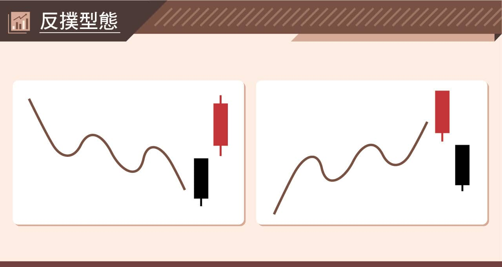
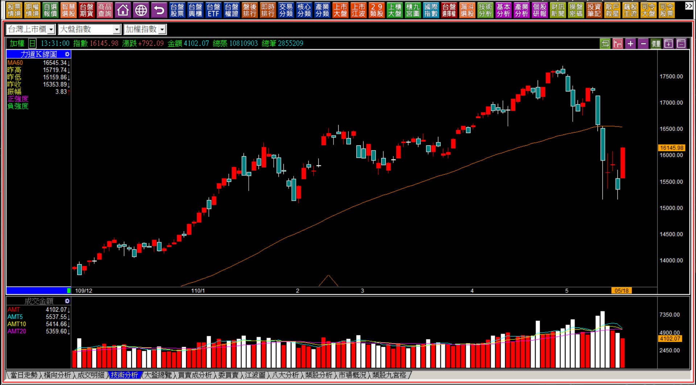
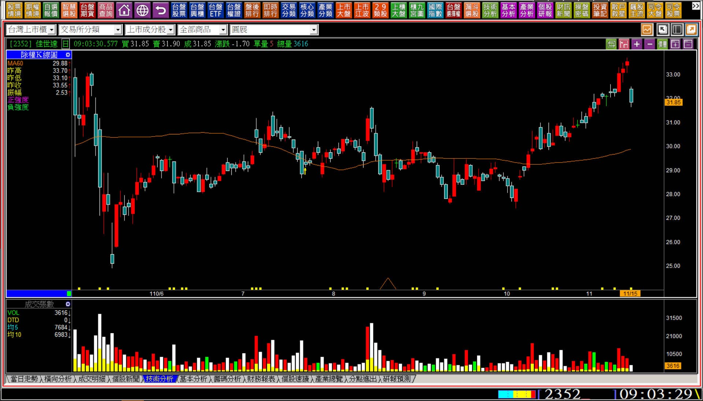
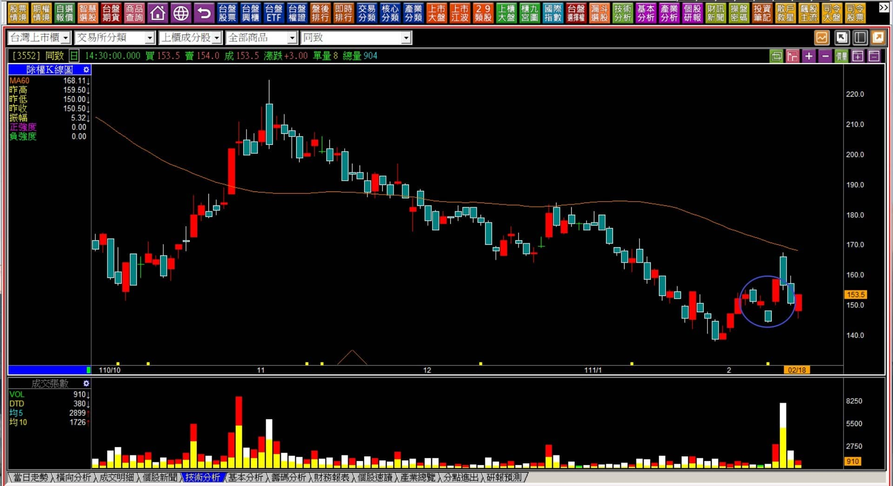

# 【組合K線補充】非轉折組合：反撲型態組合的辨別

定義：跌勢的狀態之下黑K先創下短期新低價，多方不僅僅只是出現抵抗力量，還以戰勝前一日所有價位的姿態，呈現紅K；若此紅K有著力量型的表徵，代表力量的轉變更強；漲勢的過程中創新高的紅K隔日，空方的抵抗態勢明顯，股價完全處在前一日創新高紅K的價位之下，就代表空方氣盛更強烈勝於前日多方。

時機：反撲型態的出現，往往被原本在習慣趨勢中的人吃驚，因為力量的變化轉彎強度讓人措手不及，但形狀代表力量的意義如此，有時候K線的長度本身並不長，那麼力量上的意義也會隨之下降。

---

---

**範例與說明**

反撲這兩個字，加上圖片的解說，很容易讓人以為這是一種反轉的意義。實務的走勢中反撲只是抵抗的力量強烈，例如持有大量股票的股東，發覺股價已經過度偏低，不至於有這麼低的價格，於是用力的進場承接，就可能形成反撲的型態，但這還不代表股價的趨勢已經因此而改變。

反撲型態之所以不被列入轉折組合，是因為通常不出現相對高點或者相對低點也同樣具備意義。只是短期的反向走勢，因為在於前一天的低價或者高價，如果是一種轉折，基於力竭原理，沒有必要等到這一天用這麼大的力道反撲，前一天就可以開始，或者當日從低點往上拉抬對有心的多方更為划算。

抵抗與反轉之間的力量差異，是反撲型態理解的重點所在。

**110-05-18大盤K線圖**

連續的下跌往往是受市場消息面刺激的影響，股市出現了與過往波動幅度明顯擴大的震盪，特別是跌勢，殺盤常常令人恐慌感嚴重，尤其是下跌初期還在逢低承接的人，又看到了連續三四天的弱勢大跌，會有暫時縮手的反射動作。

急跌後的抵抗型態比較強烈的就是反撲，也就是一開盤就直接站在前一天的開盤價或者之上，形成一種前一天賣掉的人再也買不回來的狀態，這也是被定名為反撲型態最有畫面感的原因。

**110-11-15佳世達(2352)**

一開盤直接嚇到所有的持有者，這是空方抵抗所形成的力量意義，上圖是開盤三分鐘後的K線圖，其中向下的跳空缺口如果更大，那反撲的力量就越大。

對於個股的拉抬，往往是攻擊力量上的延續才有可能讓股價維持在多方有角度往上走的趨勢。不論原因為何，一開盤就低於前一天的最低點，甚至還有向下跳空缺口，直接呈現了空方的反撲力道。這裡的空方指的是對股價覺得不合理的持有者出場，包括原有的多單；也有可能呈現出來的意義是買盤力量嚴重地缺乏，因為股價推升了一個多月，卻輕而易舉的出現幅度大的開盤跌價。

反撲型態作為力量變化的組合，至少可以幫助使用者辨別，這裡被抵抗力量強大的阻擋了短期趨勢的延續，需要理解這個型態出現的原因，不能貿然的拉回再加碼。

---

**反撲型態的注意事項**

與跳空缺口的判斷一樣，紅K在空方趨勢的反撲，不能因為利多消息而出現，如果是，就表示這個反撲意義很小，也因人性中總有跌深了就會反彈的預期，所以誤以為反撲是一種強勢的反轉，但並不是。

因為是出現利多消息的反撲型態，股價通常會很快又回到原本的軌道，這一點與因為利多而出現的跳空缺口意義相同。

**111-02-18同致(3552)**

上圖圈示位置，是公佈一月營收突破九億元的利多消息公告日。

資金力量對於股價來說，重點在於「漲勢的延續性」，不在於施力點的位置。當反撲型態出現之後，股價不能又重回原本的空方態勢，這並不是反撲的成功或者失敗，而是跌深的反彈剛好短期內走出與反撲型態相同畫面的組合而已。

反撲型態的定義上可以說是多方的抵抗力量不夠強，但更正確的說法，是跌深的時候市場會有一種「可能跌幅已經滿足了」的假象出現，以至於很快原本趨勢的力量又繼續發揮，這是反撲型態往往不視為轉折的原因，因為多方資金並未在低檔佈好打算拉抬的部位，不足以視為往上的醞釀。