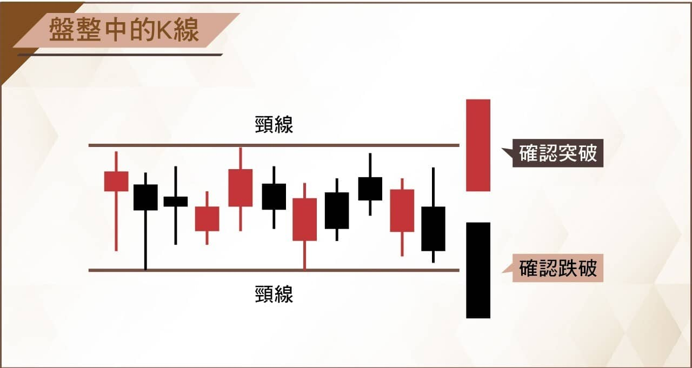
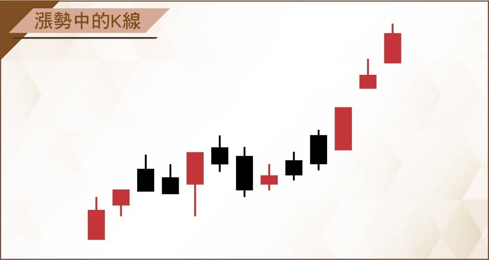
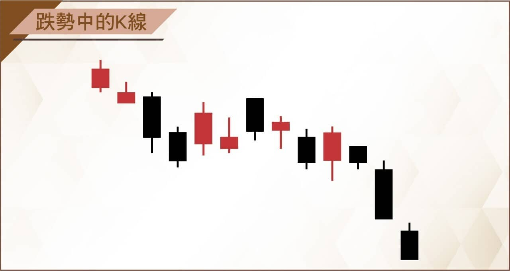
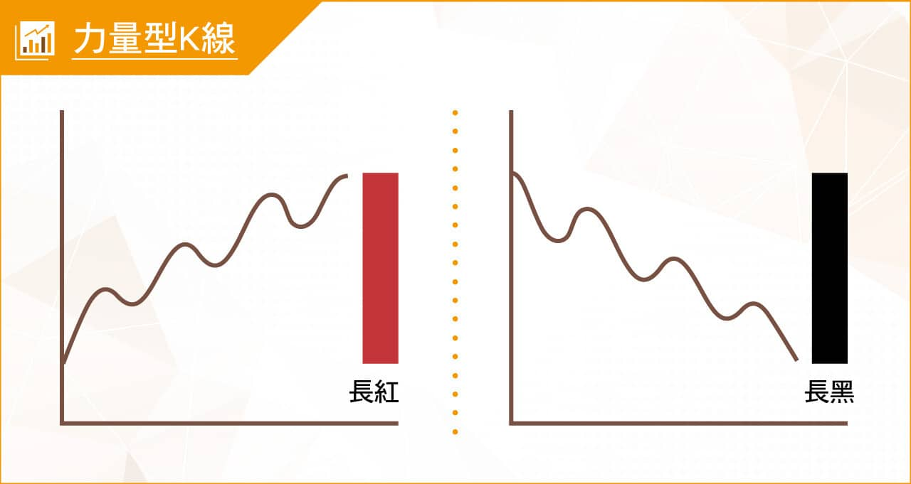
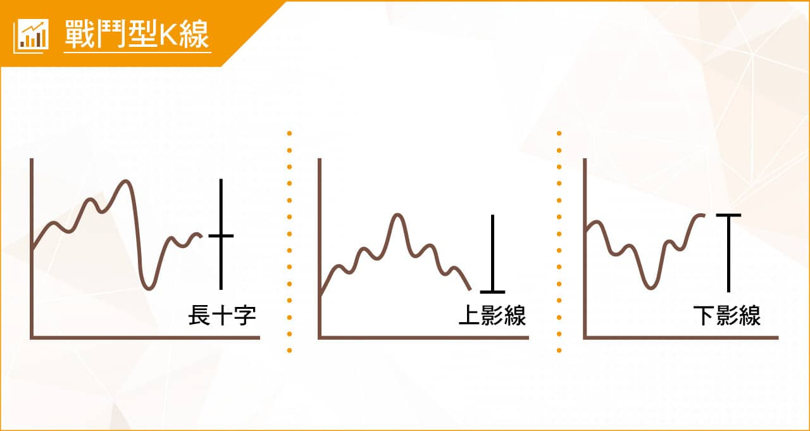
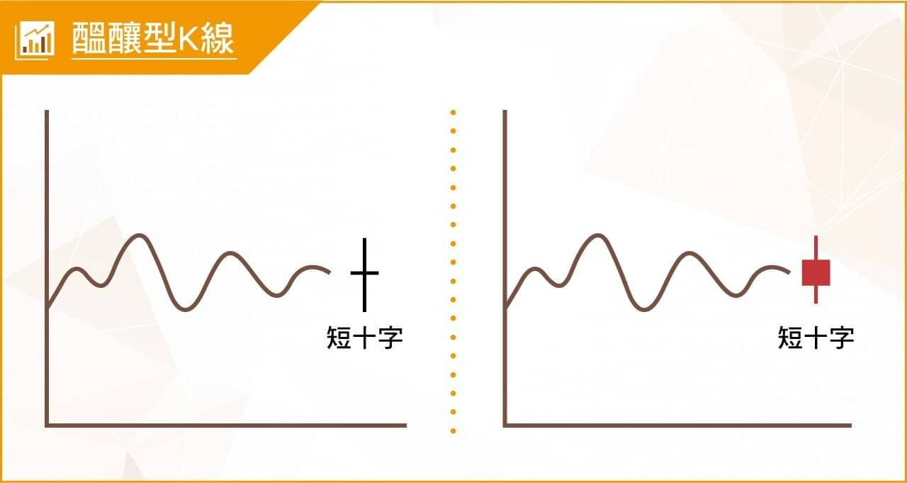
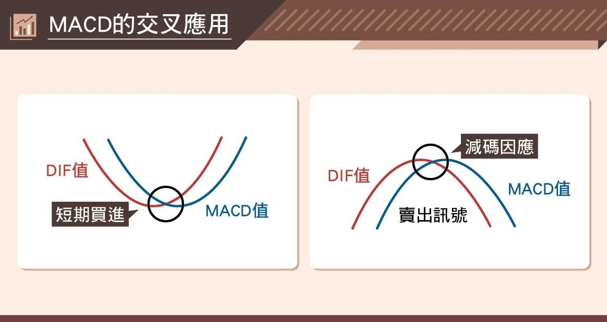

# 【組合K線補充】非轉折組合：前言與K線的類別

**非轉折組合K線 【前言】**

K線做為過去股市交易裡的最佳紀錄工具，人們往往學來想要的是用來找買賣點，當然，轉折組合的K線基於力竭的原理，可以做為原有部位的出場使用，但K線的本身沒有買賣意義，卻有著力量的意義，因此除了一根K線的力量，也需要組合起來判斷力量的轉變。

中期角度來說，一個趨勢型的漲勢或者跌勢也只有一個轉折位置，不可能隨時都在轉折，所以除了轉折組合之外，還有一些短期內力量變化的型態，這些型態不需要力竭的意義，因為那是短期力量的變化呈現，也就是原有趨勢沒有改變，但短期力量有些變化，稱之為非轉折的組合K線。

所以在判別這些組合之前需要有認知，這些組合如果出現在相對高檔或者相對低檔，可以做為轉折的可能，但不能違背正常的攻擊原理或者趨勢，如果出現整理階段或者還沒有明顯的拉抬或下跌，還是可以判斷短期力量，至於要怎樣運用在操作決策上，那就看每個人使用的角度。

沒有力竭意義的背景，就不能視為轉折，只能視為力量變化，這是組合K線的重點。

---

**K線的分類**

**K線透過所在位置的角度，可以分為漲勢中的K線、跌勢中的K線、盤整中的K線。**

**盤整中的K線**

盤整中的K線沒有任何需要判斷之處，因為趨勢未定，直到股價突破或者跌破區間之後，才能以頂或者底為頸線，這是型態學的根本；力量的辨識，就從突破或者跌破確認開始。

**漲勢中的K線**

漲勢中的K線要點在於連續狀態的高點，K線的高點代表著當日最高價位的進場者成本，所以只要漲勢的狀態之下，股價是持續創新高的，就表示有著攻擊的意圖。

**跌勢中的K線**

跌勢中的K線，重點不只是K線的低點，還有波動狀態之下的前低又破了，又有新低價，也稱之為破底。當股價進入了破底的走勢，代表的是缺乏任何力量的意義，價格雖然變低了，卻是無力的呈現。

---

**K線透過形狀的辨識，可以分為力量型K線、戰鬥型K線、醞釀型K線。**

**力量型K線**

力量型，顧名思義就是多空方展現出實力的時候，所以K線上的呈現是長紅或者長黑，除了跳空缺口之外，實體長紅黑都是當日力量的最強展現。

**戰鬥型K線**

****

戰鬥型的意思是盤中經過了激烈的交戰。但不以形狀來確認多空的輸贏，只可以定義在這一天有著激烈的戰鬥。要確認多空上的意義，就要合併型態來看，如果這個型態是突破狀態，就有攻擊意義的可能。如果是跌破原有趨勢，就是弱勢的表徵，也不論K線形狀為何，因為低檔也有人逢低承接而買，而低接的力量並不代表有高價也會願意去追。

**醞釀型K線**

醞釀的意思就是還沒有答案，當日多空雙方都採取觀望的態度。至於是十字線或者有實體都是相同的意思，狹幅區間呈現很微小的震盪。唯一的例外是非常冷門的股票，有的甚至一天成交個位數，那種股票就算是短十字線也沒有醞釀的意義。

---

**指標的輔助運用**

指標的組成，是透過價格與成交量的數字，佐以各種加權方式的計算得知，之所以被稱之為輔助工具，意義上就是真的是輔助，用在K線狀態混沌不明的時候，幫助判斷價格上的細微力量，人腦難以計算的各種加總與平均，所以適用於盤面沒有明顯力量的時候，不是隨時都可以用。

市場上有各種教學指標的方式與用途，甚至有人把天數計算的參數改變了，當作是自己獨到的指標，這沒有什麼不可以，可是要稱之為很神奇的指標，那意義就很小了。

要知道，RSI指標的創辦人威爾德，發明了RSI之後十年，撰寫了亞當理論這本書，書中又徹底的推翻了RSI。再看看現在人們指標使用、還隨意改參數，當作自己的發明，很令人啼笑皆非。不過，指標做為輔助，在盤整期間依然是可行的，那就要看投資人在盤整沒有明顯趨勢的階段，打算怎樣應對股價的持有與否了。

擺盪指標的缺點，就是鈍化，也就是連續強漲或者連續急跌，指標會鈍化失效。

以下舉出我認為可以算是最客觀的MACD做為標準說明，如果還打算輔以背離來判斷，那麼我會建議不能單純用指標背離，每個人都還是需要具備確切的攻擊K線邏輯，才不會因噎廢食的誤用指標。

**MACD做為指標的判斷方式**

這張圖網路上隨處可見，也有很多文字方面的教學，這裡我們就不把這些解說一一詳述，簡單的用黃金交叉、死亡交叉來呈現。也有不少教學的書籍，又加上了0軸之下或者之上，這就見仁見智。因為這就好像均線本來就是短期跟長期之分，硬要用兩條不同天期的線看有沒有交叉，然後說是黃金交叉、死亡交叉當作買賣點，是很無用的。

所謂的黃金交叉，是在投資學上的落後指標判斷定義，意思是當股價先行，短期力量出現了，進一步帶動了中期的力量，於是在指標上顯示了黃金交叉；但也有短期力量好像有出現，力量卻不夠，在指標上並沒有呈現黃金交叉的意義。

所以重點在於力量變化的角度，參考自己的判斷是否被一日行情誤導了，就像是M1B與M2的貨幣黃金交叉，證明了資金行情的存在，既然叫做證明，當然是落後指標。有時候我們身處的環境中，發現聊股票的人越來越多，但是資金動能夠不夠，就得要回到M1B與M2的變化來看了，這顯然是落後指標的輔助意義。

簡單的結論，指標的輔助是為了幫助判斷更正確，而不是反客為主的當作是買賣決策的標準。

---

**非轉折的組合**

接下來的連載，將進行的是「非轉折的組合K 線」判斷，也將為大家說明每一種組合的實務變化意義，做為多空轉折組合的輔助，也就是某些狀態之下我們需要理解K線上呈現的力量變化意義時，這些組合就可以做到協助。

例如個股出現了利多，組合K線上卻根本就不是資金正向出力的意義，那就要小心；或者是有了利空事件的發生，組合K線上卻有著轉強的表現，那麼持股就不需要被消息面影響出場。