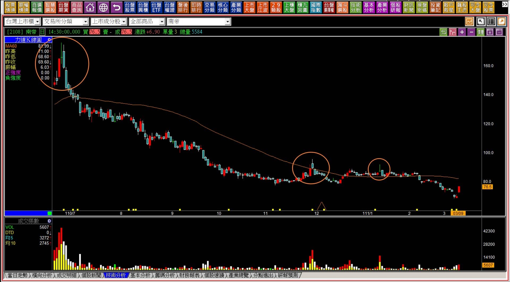
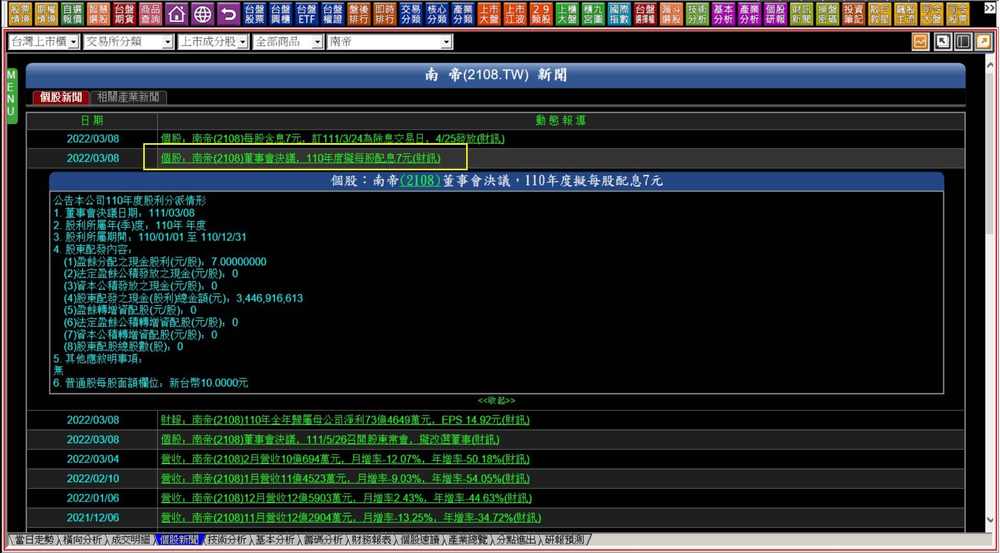

# 【多空轉折】三根K線連續判斷十字線之後：晨星與島狀反轉

晨星與島狀反轉，無法單純的只把夜星與島狀反轉反過來用就帶過。一般在教學的角度往往採用多空相反的心態來做為教學方式，的確有些技巧可以如此使用，但是多數是不行的，原因就在於多方與空方形成的力量因素不相同，同時，上漲與下跌需要的力量組成又不一樣，實難單純反向使用。

例如空頭吞噬與多頭吞噬，形狀上紅黑相反、位置也相反，彷彿可以就這樣當作是反過來的意義，可是黑K吞噬出現在股價攻擊拉抬之後，往往下來很快，缺少了攻擊力量就會下跌了，但是紅K吞噬並非如此，空方力竭之後，股價如果要往上走，還得要有市場資金願意拉股票才行，同時，因為是空方趨勢過後，上漲還不能馬上遇到大量套牢賣壓區，因此，賣壓中空結構才有V型反轉的可能，這不能單純就反過來使用。

島狀反轉，晨星與夜星也是如此，有更多細節需要加以判斷。

---

**晨星定義****：出現於相對低檔區的十字線，隔日跳空向上，有長紅K線可以視為強烈訊號。低檔當日K線實體短(十字線)，左方有時會有向下跳空缺口。右方缺口越大，反轉意義越強烈，不能只看到低檔十字線就視為晨星。**

**島狀反轉定義****：****先有跳空向下形成左方缺口，經過一根或者一根以上的走勢，之後再以跳空向上出現右方缺口。中間形成孤島型態，中間不只一根K線稱為島狀反轉。**

單純的定義頗為容易，也就是左右都有跳空缺口就視為島狀反轉的成立，其中如果缺口的中間只有一根，且為十字，稱之為晨星；若為一根且為實體K線，不論紅黑，都稱為孤島。

**108-01-08大盤K線圖**

左右都有缺口就符合島狀反轉的定義了，雖然這是孤島的型態，也是島狀反轉的一種。

這張圖等一下會與下一個狀態，使用者容易混淆，所以我們先討論到島狀反轉會失敗的原因，再來解說這張的實務判斷對比要點。

---

**多方島狀反轉的補充要點**

島狀反轉已經是顯學，大多數投資人都知道這個兩邊都有缺口的型態，所以我們不需要太多的舉例，實務上出現的機會也是大盤高於個股，不過出現的機率都不高，一旦出現卻很常被誤用。

島狀反轉的重點依然是跳空，尤其是單看最後一個跳空就已經可以知道其中的意義，讀者如果已經很熟悉跳空反轉的話，就是最右邊有一個跳空向下，之前有沒有向上跳無所謂，這樣說明就更足以讓大家明白關於夜星也好、島狀反轉也罷，懂得判斷跳空也已經足夠。

不過真正會出現問題的依然是太過於拘泥在轉折的形狀，往往會誤用，例如「多方島狀反轉的失敗」。

**島狀反轉會失敗的原因****：島狀反轉只要定義成立，就是反轉成立，但是往往判斷者忽略了賣壓的存在位置影響了反彈。因此多方島狀反轉會失敗最主要的原因就是向上的跳空是因為有利多、或者缺乏賣壓中空的結構，一往上跳空就遇到的賣壓。**

**111-03-17大盤K線圖**

雖然不是標準的島狀，不過在當日收盤依然有著很多網路上的分析說這是島狀反轉，我們就當作形狀成立也行，可是這根紅K再上去，就會遇到一月以來的套牢壓力區，因此島狀反轉會失敗。

請留意島狀反轉會失敗的原因，其中一項是**缺乏賣壓中空的結構，一往上跳空就遇到的賣壓。**

**111-04-29大盤K線圖**

前一次看起來像是多方島狀反轉，至此已經確定當初失敗主因就是壓力。那麼，上圖這裡又是島狀反轉的型態，這次是否會成功呢?

答案一樣都是會失敗，因為一往上跳就是過去的壓力區段，這一個壓力區段還延伸上去一月份，同時這個向上跳空是因為前一晚美股大漲5%所致。

因此正確的解讀是，島狀反轉的定義的確是成立的，但深入的判斷就是不能反轉成立了之後，隔天又往下回補缺口。

這樣的解讀不僅僅考慮到了賣壓結構，也順應了跳空缺口出現的力量變化判斷。

**108-02-20大盤K線圖**

回到第一個例子，當初的孤島出現的時候，為什麼那次可以成功?答案是指數的位階不同所致。

同時，真正的大量且長期的套牢區段，是在前一年十月份之前的那一大段，與後來這個例子，要越過就要創下歷史新高，結構意義差別就在賣壓中空的這個區段。

---

**個股島狀反轉失敗**

失敗的意思，指的是形狀組合上，是符合島狀反轉的定義，但是實務上卻無法成功。所以從個股的角度如果發現了島狀反轉，有兩件事情一定要先做：

**一、確認K線圖上最近且明顯的賣壓何在。  
二、從營運面理解空頭趨勢早早成型的主因。**

**111-03-09南帝(2108)**

回顧一下三月九日的背景，這一天之前的三個交易日，台股因為戰爭利空的因素累積下跌超過一千點，這一天出現了上漲190點的孕線反彈，而南帝一早就開盤跳空，原因就是因為前一天新聞公告了將要配息7元，也就是說這是「因為有了利多的因素」才往上跳空。

同時，股價漲停板之後，將在隔天再漲就要馬上遇到過去的壓力區。當然，如果就此越過前兩個壓力區，那麼接下來是賣壓中空的區段，但是南帝有這麼好的基本面嗎？需要認真思考風險問題。

以當時的盤面，其實短打主力真的很多，且還保持著越短越好的心態，所以隔日沖或者隔幾天就賣了。這種環境對於我們短線交易者來說很不利，因為攻擊難以持續。

所以必須多加考慮個股營運的狀況，還有轉強的當天，是不是因為有著表面上看起來的利多。

配7元這件事，乍看之下殖利率超過10%好像有利可圖，實際上法人不會上這個當，因為如果隔年獲利數字大幅下降，這個配息也就一年而已，那也就沒有什麼實質利多可言，這就像是減資，也是把股價弄下來，換成不用課稅的錢分潤而已，並不算是真實的利多一樣。

最近的行情都有這種狀況，公布了去年營利之後打算配息，股價就強一天，燦坤(2430)也是，公布了配息數字，再搞減資，不過後來大盤不佳，主力暫時也還沒機會出掉而已，現在除息後，股價就掉了。

**營運面的審慎評估**

回到南帝的狀況來說，疫情開始的初期，醫療橡膠手套原料最大生產地的中國因為封城的緣故，台股中的南帝、申豐因此受惠，盈餘暴增，所以去年每股盈餘數字都很亮眼，就連馬來西亞股市裡，醫療手套連結到橡膠股也成為當時的飆漲題材。

如今大陸產能全面開出，營收盈餘馬上就受到大幅影響，申豐尤為嚴重且明顯，那麼，島狀反轉出現的南帝，倘若賣壓天險明顯的存在，是否是搶反彈的優選呢？值得深思。

**111-04-25南帝(2108)**

從這個例子我們可以對轉折有更深一層的認識。往往人們學習的時候是透過形狀來學，這沒有問題，可是實務上還需要一併判斷的層面還是得要知道，並不是島狀反轉不好用，而是單純想要套用，不打算思考結構，是學習上的一種障礙，需要花時間克服才行。