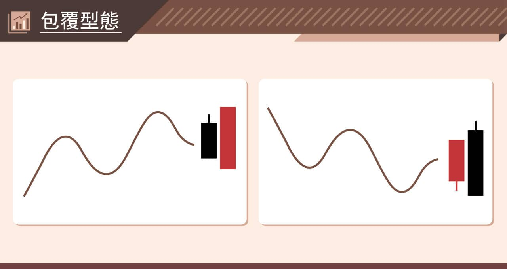
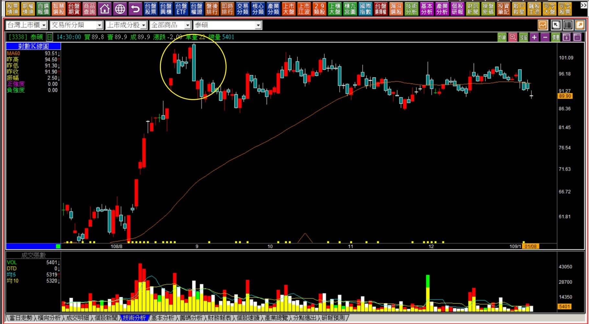
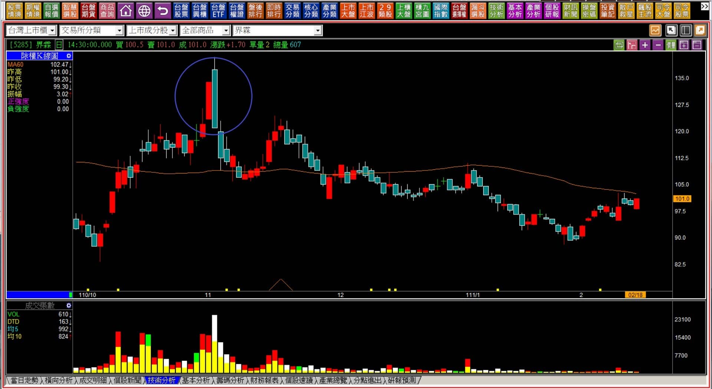
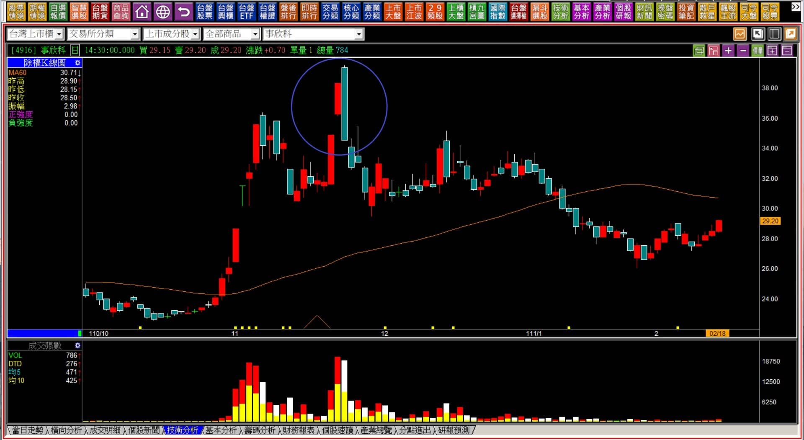
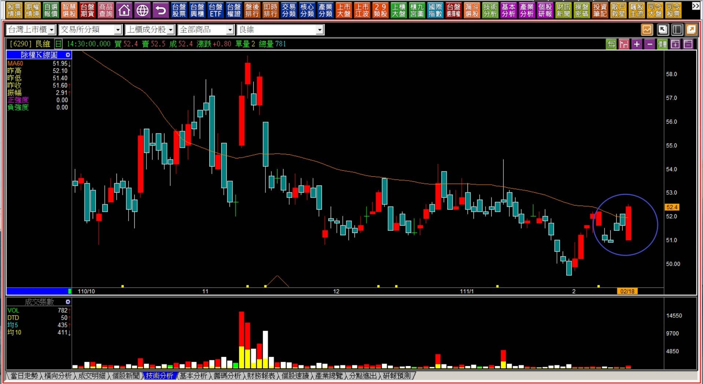

# 【組合K線補充】非轉折組合：包覆型態組合的意義

定義：在一段趨勢性的走勢過程中(包括盤整趨勢)，有一根明顯的K線，被另外一根**力量型K線包覆**，如果這根力量型的K線是紅K，表示多方力道明顯的增強；如果這根力量型K線是黑K，代表股價轉趨弱勢。

不單純只是形狀呈現包覆就好，前提是包覆者必須是力量型K線(長紅或者長黑)才有如此判斷的意義。

時機：若前一根K線有著特殊的意義狀態，例如當天出現利空或者利多，這個後來的包覆力量代表的意義更大，那麼這根K線的成交量就具有關鍵判斷的作用。

---

---

**範例與說明**

若股價出現了力量型紅K線或者創新高價，也就代表著多方的氣勢正盛，卻被更大的力量給反噬，在轉折組合中也被稱之為「吞噬線」，基於力竭的原理代表反轉的意義。

但是如果不是在相對高檔或者相對低檔，包覆的型態照樣也是力量上的反噬現象，只不過是屬於短期現象，要確認趨勢有轉變，依然得要其他的跡象或邏輯輔助。

包覆型態如果是黑包紅，最重要的判斷就是不要貿然的加碼或攤平，因為我們無法得知這根黑K的賣壓，是否與前一日的紅K買進者的力量相同，如果在區間整理的狀態，這個黑K往往就是出貨的現象，一旦出貨完畢，股價更可能以長黑跌破盤整區，帶動整個趨勢轉往空方，此處需要以「趨勢線或型態輔助」判斷。

**109-01-08泰碩(3338)**

站在黃圈長黑出現的那一天，當然就是「黑K吞噬」的意義，轉折組合中這是最簡易的型態判斷。

但對於其他非轉折組合K線在運用的時候，就要留意當時的組合出現後一段時間，股價是否開始進入盤整階段，往往等到盤整區跌破之後，會是空頭趨勢的開始，因為區間低點等於與頸線定義相符。

**111-02-18界霖(5285)**

同樣的形狀，但並不是出現在有被明顯拉抬過後股價的高檔區，也不是出現在明顯的大段多方攻擊之後，這個組合K線型態就只是單純的包覆型態，還不算是吞噬。

「包覆型態」的功用就是在多方投資的考量期，必須要先有一定的認知，這個位置有著明顯的賣壓存在，必須考慮當時的價位以現在的每股盈餘狀況，是否股價已經偏高？或者當時是否有著利多，卻反向走出黑K。

個股有沒有投資價值暫不考慮，這個「包覆型態」就是最明顯的上漲阻礙，假如是投資目的的買進，就要先有心理準備，股價要越過這個天險有很大的難度，輔以成交量一併判斷，就是確認有著大量套牢區的存在。

短線交易更不需要考量，因為天險存在等於風險明顯大於機會，並不值得參與。

**111-02-18事新科(4916)**

黑K包覆紅K是很常見的組合，答案也都很相近，就是股價的漲勢遇到了阻礙。雖然每一檔出現時的原因不一定相同，但共通點往往是股價已經脫離基本面較遠，所以多單盡量逢高出脫所致，如果再加上有量，同樣就是投資或交易時股價的天險。

---

**111-02-18良維(6290)**

往往紅K的包覆型態比較少見，轉折的紅K吞噬就更少見了，因為先要遇到中期空頭，或者環境重大利空，還要剛剛好在最低價當日出現創新低再包覆前日黑K，當然就更少見。

比較常見的是這種沒有轉折意義的單純包覆。這個型態「沒有買賣點的意義」，單純就是多空方彼此的掙扎。

有時候因為交易的人數很少、成交量冷清，只需要一點點力量也可以包覆住前一天的黑K，因此在這種狀況中，成交量是很重要的判斷要素，如果無量，這個型態就完全沒有力量上的轉變意義。

---

**111-02-18岱稜(3303)**

### 圖6

在股價非處於低檔區域的紅K包覆，傳統一點的說法稱之為「不甘心」的展現，意思是多方上漲遇到阻礙的時候，可能是因為環境不佳，大盤弱勢所致，多方不甘於進場的拉抬就這樣被帶下來，因此故意展現一下拉抬的力量。

當持股遇到這樣的組合，可以繼續持有觀察攻擊的強度，但是空手者來說這不會被視為買點，沒有進場邏輯的意義存在，應對上雖然是紅K逆勢往上，但並不是給不在場中的人買進使用的判斷組合。