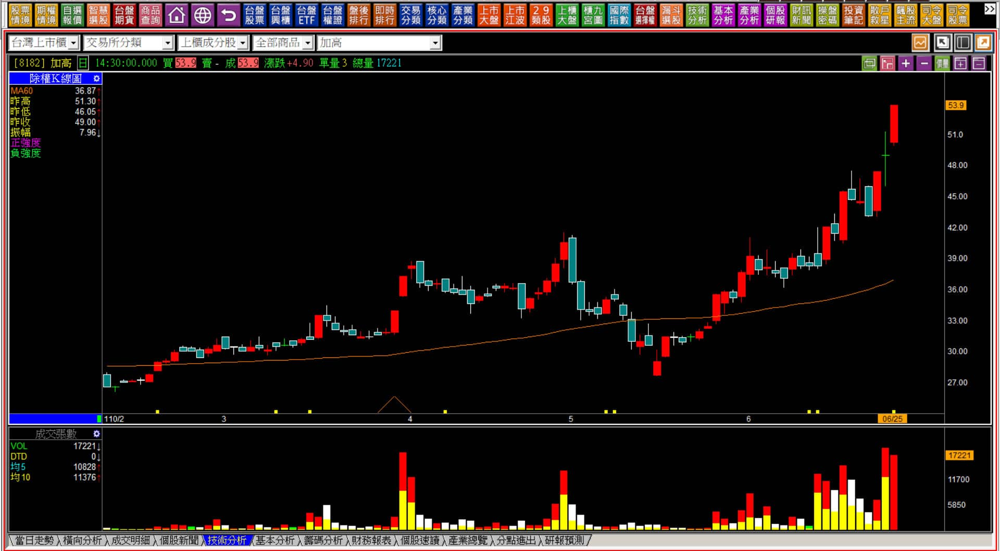
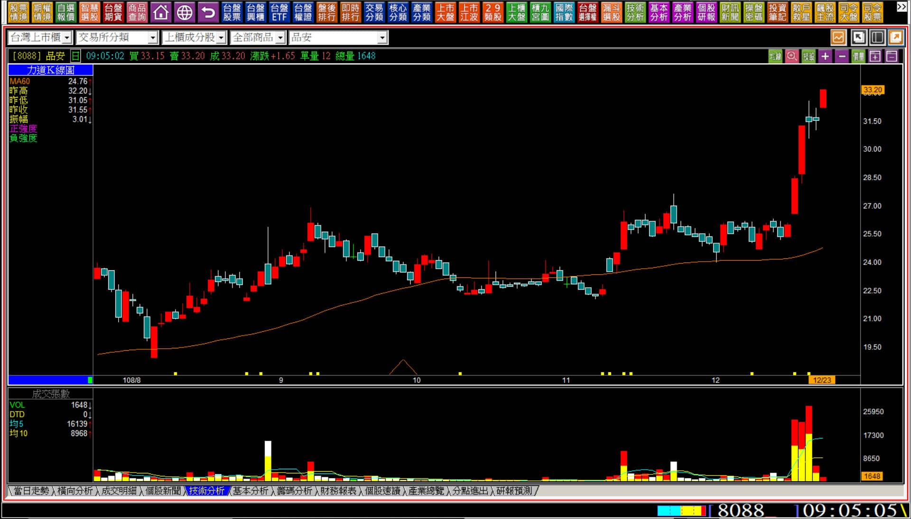
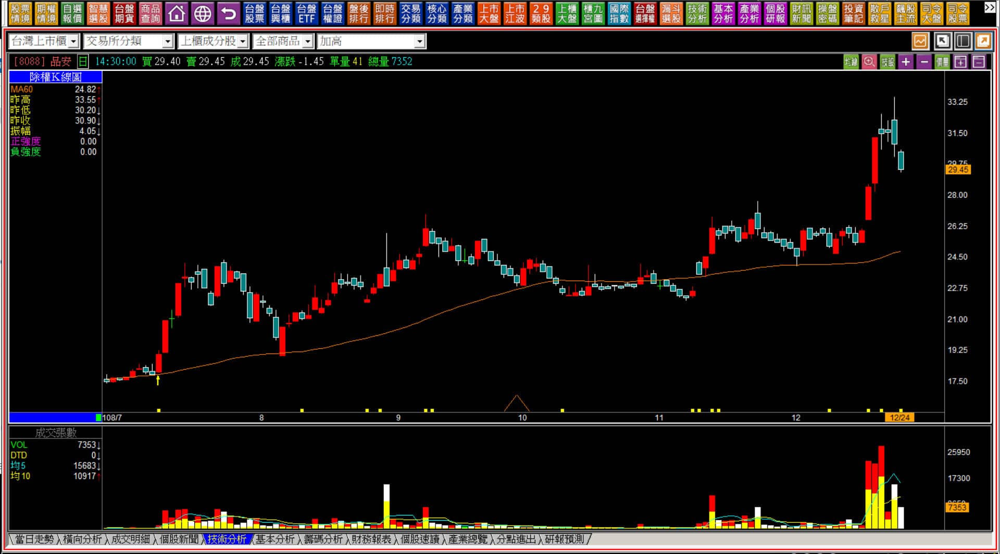
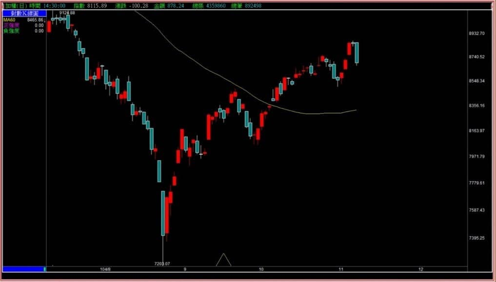
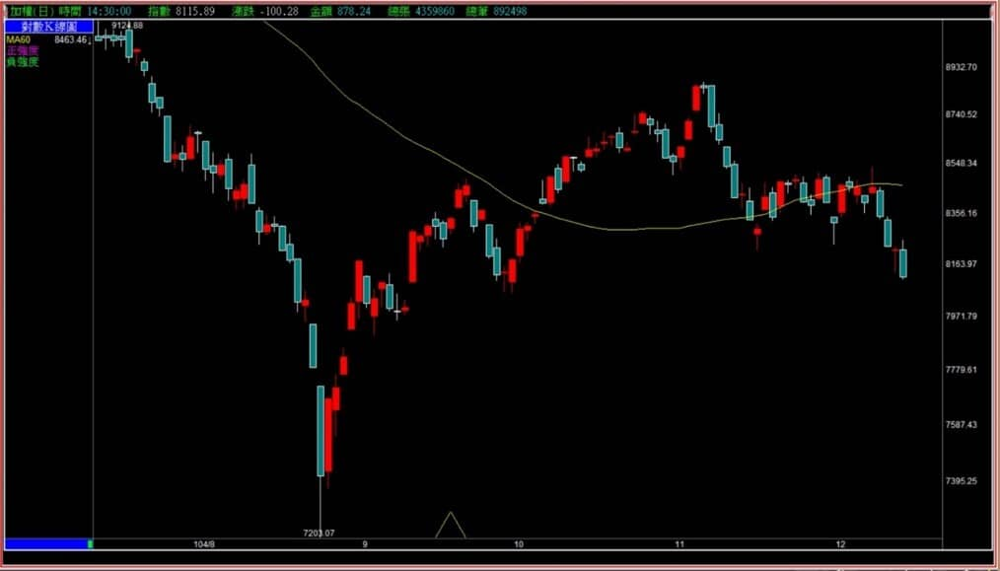
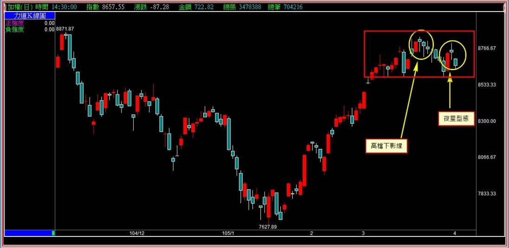
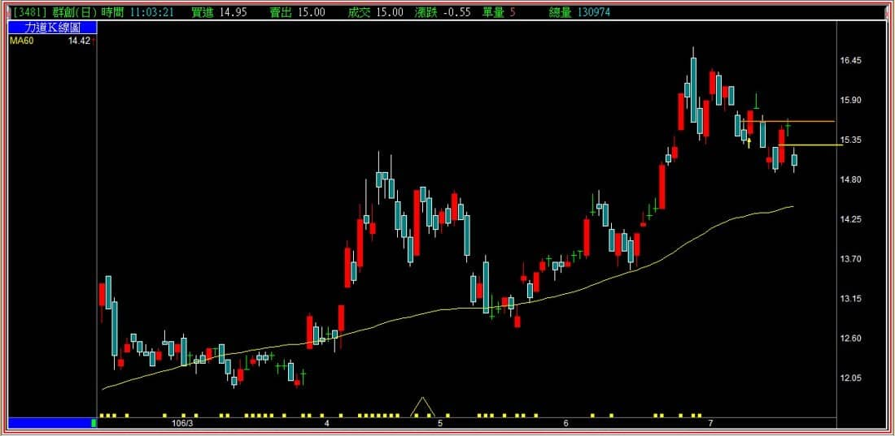

# 【多空轉折】三根K線連續判斷在十字線之後：夜星棄嬰

十字線是除了上影線之外，最容易被人誤用的單一根K線。市場上有一種說法是「十字變盤」，那麼十字線之後到底會不會變盤呢？並不是人云亦云就是正確的，十字線的確有著中繼的意義，力量的意義也屬於醞釀，人們喜歡變盤二字，是基於好像有一種機會可以佔到便宜，滿足逢高放空或者逢低買進的想法。

**110-06-25加高(8182)十字線的隔天**

單純以為十字線代表變盤的人，不求甚解的狀況實在是太嚴重了，相信每個人都可以舉出無數例子證明，十字線不代表一定會變盤。

因為十字線後又接續上攻，就有人衍生出另外的說法，那就看十字線的隔天是否開高，如果開高就是續攻，如果開低就是變盤。

**108-12-23品安(8088) 09:05**

連續兩根十字線之後，這是隔日開盤五分鐘之後的K線圖，如果依照這個市場傳聞所說的教學邏輯，表示股價中繼休息，而後開高代表將要續攻，但實際上的走勢卻不是如此。

**108-12-24品安(8088)**

原本讓人以為可能是十字中繼，隔天續漲，或者進一步認為這是上升三法的人，若用力加碼，結果走勢並不是那麼一回事，就會對十字線的判斷有錯誤的解讀。

所以K線上的判斷是否如市場傳聞的十字線用簡單方式就能判斷呢？當然不是，相信讀者至此都有答案。有了這個前言之後，再回頭來學習這個頗為常見的轉折定義：「夜星棄嬰」，會更有體會，也因為很常見，所以不能不理解定義中的必要條件。

---

**夜星棄嬰定義：在長紅之後出現小紅小黑的十字線走勢，已經先表示多方力量初步衰退(不一定有跳空缺口)，以隔天收盤跌破紅K中值作為確認。前方如有壓力型態，表示遇壓之後的力竭現象，將視為比創新高時遇到的還要強烈。**

夜星棄嬰這個名詞當然出自於酒田戰法裡就有這樣的古老定義，不過中文是我們華語自己翻譯的就是了。這四個字中的前兩個字夜星，顯然這就是從夜星型態演變而來的延伸。夜星的定義是十字線左右都有對稱跳空缺口，屬於島狀反轉的一種，可是夜星型態很難得才會遇到一次，孤島型態比較常見，後來把十字右邊有向下跳空也稱之為夜星，因此算是將定義擴大。

**夜星棄嬰示意圖**

夜星棄嬰屬於十字線出現之後，回檔跌破紅K均值的力量，是經過下跌之後的確認的走勢，也就是把十字前一天的紅K中值跌破，代表確認的意義。轉折中因為採用的是力竭原理，所以空方轉折的確認一定是回檔，不會有那種在紅K當日，或者股價根本就還沒有回跌，就已經確認是轉折的那種理論邏輯。

因為十字線是醞釀型K線，夜星棄嬰並不屬於多方創新高時期的使用，通常是上漲遇到了前波壓力位置，所以定義上寫著「漲勢是短期內已有漲勢，也可能是漲多回檔之後再往上」還沒有創新高，遇到高檔的壓力區，力竭意義才會顯現。

**分解範例圖一**

定義很簡單，K線的形狀也很容易記憶，漲勢之後的十字線隔天，跌破了紅K的低點。

上圖的最左邊就是過往的壓力位置，因此夜星棄嬰的定義成立又是遇到之前的壓力位置，那麼轉折的意義就再明顯也不過了。

此處最大的問題就趨勢的判斷者往往會因為季線剛剛開始上揚，誤以為這裡不過就是短期的回檔而已，其實季線是我們自行加諸於K線圖上用收盤價計算的線而已，這裡的季線上揚有很大的原因是因為正在扣抵三個月前的股價急跌段，不能說不是季線上彎，但有更大的原因是扣低值帶動平均值上升。

**分解範例圖二**

經過了上圖的變化，季線因為已經扣完急跌段了，現在往上扣，所以價格越低季線也就越來越低。

回顧當時的夜星棄嬰成立的位置，就會知道轉折組合的速度優於趨勢的判斷，這就像是黑K吞噬的時候，股價一定是在多頭正在進行中一樣，切忌股價下跌的時候用趨勢來安慰自己持有或者逢低買進。

---

**範例圖三**

下影線的意義不代表支撐，所以同樣的十字線也有下影線，十字線沒有支撐的意義。

下影線通常是因為短線股價讓人總是買低沒有風險，所以漸漸的盤中下跌就越來越不畏懼，以至於收盤後形狀上看到的是下影線，盤中看的是掉下來之後又被拉高。

上圖最右邊的十字線隔日跌破了紅K中值，表示就是夜星棄嬰的組合，我在K線圖寫夜星是因為當初這張圖是放在FB粉絲團講解大盤用的，既然FB沒打算教夜星棄嬰這個轉折，也就寫個夜星作為代表，並不是手誤寫錯的原因。

**個股的壓力現象說明**

拉回的過程很多人都會被一天的紅K影響，群創在106年就曾經出現這種反彈之後十字，再隔一天跌破紅K中值的轉折型態，這是前兩次，上圖我都有劃下紅K中值的位置，事後股價一度跌破5元，雖然近期股價漲到20元，但那是四年後的事了，讀者如果當初持有卻看不懂夜星棄嬰的轉折，也不見得就有那個能力持有到5元以下才撐到今天。

---

**夜星棄嬰的綜合說明**

夜星棄嬰的轉折組合，因為中間有個十字線，所以也常常出現在大盤K線圖中，個股也很常見，所以這是出現頻率僅次於黑K吞噬、跳空反轉的組合型態，重點要放在十字線本身的意義先有理解。

多空力量的對峙之中，是否有著力竭的意義，意思就是如果股價沒有先經過一段漲勢，或者沒有遇到壓力，那就沒有做為轉折判斷的必要。

尤其是長期低檔整理的股價，如果才剛剛突破不久就出現十字，甚至是長十字線，那也就沒有研究是否代表轉折的意義，因為多方根本就還沒有出力，也就不會有力竭。

不過大盤K線圖很難有明顯的力竭發現，所以通常以遇壓來判斷是否為夜星棄嬰中的定義，個股需要先有多方趨勢出現才有遇壓力且多方力竭的意義。