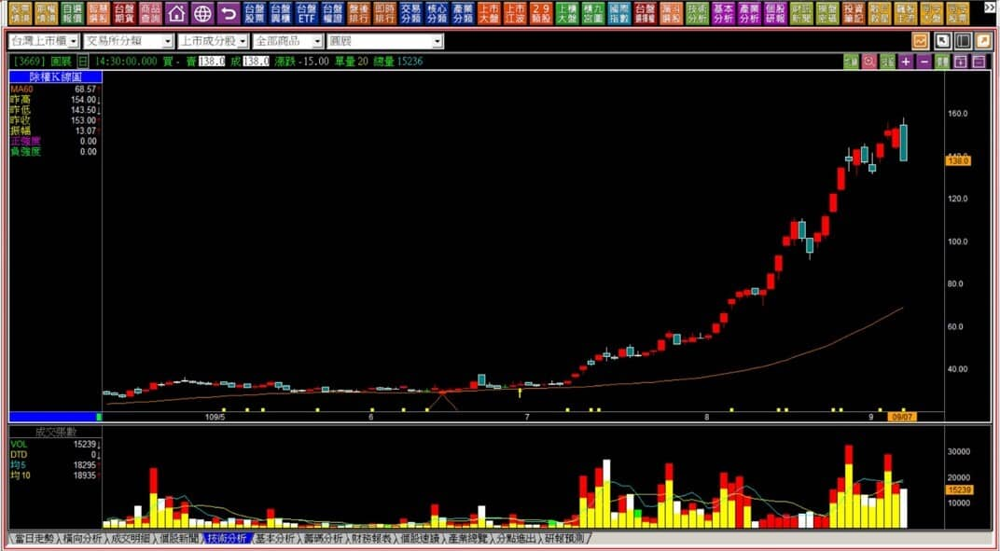
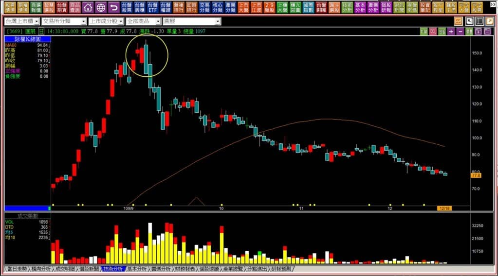
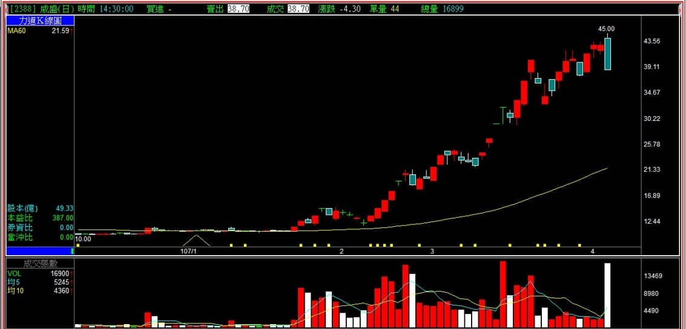
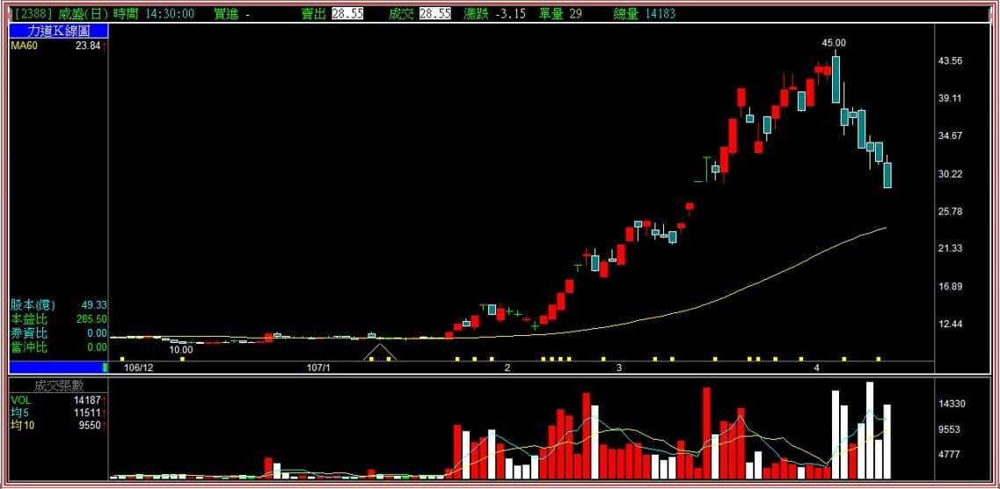
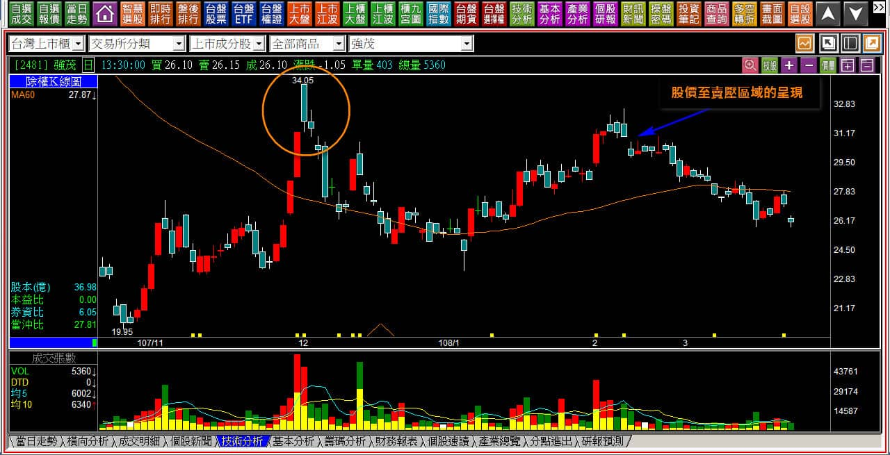
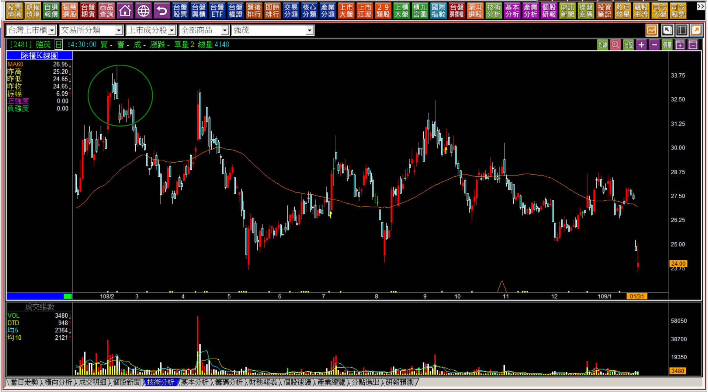

# 【多空轉折】三根K線連續判斷阻礙力量的行動：暗夜雙星

三根連續的K線走勢，雖然沒有兩根的強烈反應且直接，例如黑K吞噬那般的明顯，但往往就是因為已經三天的連續動作，更能看出資金在某檔股票的反向意圖。意義上有著紅K出現之後卻沒有接續攻擊的力量，也是力竭原理中的判斷精華所在。

上一篇談到的「大敵當前」，市場上有很多教學的人偏重於圖形解說，而不是力量之間消長的判斷，這樣做往往會讓人產生誤解，尤其是需要在遇壓的背景之下，偏偏被拿到創新高的位置使用，就沒有力竭的意義，並不像是黑K吞噬的狀態；或者是中值未跌破，也沒有遇阻的呈現，只看三根紅K沒有拉開就提前出場，因此大敵當前雖然算是顯學，還是有很多人誤教、誤用。

---

**暗夜雙星的出現位置**

暗夜雙星為什麼編列放在大敵當前的型態講解之後？因為這三根很像是大敵當前判斷的最後三根，只不過不考慮兩根並排的紅K之前有沒有長紅。其中不同之處有兩個，第一是暗夜雙星往往出現在新高價位置，大敵當前因為是遇壓受阻的背景，往往不是在創新高的時期；並排之後的第三根必須是長黑摜破的意義，與大敵當前的最後一根黑K是跌破中值價位，判斷確定點不相同。

**暗夜雙星的定義：在相對高檔區，以長黑殺破兩根型態相似併排K線。此處造成初步的高檔大量套牢區，明顯轉弱的形態出現，長黑高點有創新高則常以空頭吞噬呈現，同時兩種型態成立，屬於強烈空方訊號 。**

定義上的說明是長黑跌破兩根並排K線，不過依然有區分黑K與前一根紅K的形狀之間的關聯性。假如沒有黑K包覆前一天紅K，一樣是暗夜雙星的轉折定義成立，但如果有「包覆」，力量上的定義就是更加的強烈，因為黑K吞噬也是成立，所以兩個轉折定義都存在。

以下我們逐一說明。

**109-09-07圓展(3669)**

在新高價有兩根紅K並排很常見，攻擊的整理型態就是混著K線的排列狀況。但是力竭現象的原理，會因為多方的拉抬到底有多猛來判斷，漲勢越強烈，未來力竭的可能性就越高，於是高檔長黑如果出現了，不能忽視，何況這根長黑還包覆了前一天的紅K，顯示多方氣氛雖然正熱，但是轉折的力量已經出現。

**109-12-18圓展(3669)**

轉折組合用於出場點的判斷，在這個例子中可以很明顯的看出來。那麼，為什麼這麼明顯的範例，不要把轉折當作是放空使用呢？原因在於我們可以透過K線圖看出力竭，卻無法看出主力當下賣光手上籌碼了沒。

要知道股價本來就已經大幅拉抬，漲得超過基本面甚多，倘若主力硬是要再拉上去、或者只打算區間來回震盪出脫，是哪一種，無法事先猜測出來的。2021年期間繪圖卡相關個股，因為比特幣的報價訊息調高售價且股價也因而大漲，但也會因為比特幣價跌而弱勢，股價反轉下來之後，卻耗費很多時間上上下下區間整理，這個狀況放空股票不會有價差利潤。

這就像是跌深反彈一樣，好像低檔有買可以賺錢，但是無法辨別攻擊力量會不會出現一樣，買了低沒人拉抬，照樣難以獲利。

---

**上漲的力量決定了力竭的程度**

假如多方趨勢的時期出現了空方的轉折組合，雖然看起來有多方的漲勢，實際上卻不是算幅度很大，那麼力竭之後股價的跌勢就不一定會快速且也不一定會大幅下跌。

**107-04-09威盛(2388)**

以漲幅來說，短時間內從12元漲到45元不能說是小幅度，但是是否股價就會因此而大跌，這也不一定。這是前面談到為什麼不應該視之為放空意義的原因。

同時在沒有基本面可以期待的股票中，下跌之後主力如果還沒有完全出脫，或者是這個跌勢後來遇到了大盤的回檔，主力若出不完就會展開自救，自救不代表未來股價一定會再創新高又攻擊一次。所以，單純把轉折視為出場的意義來使用其實就很足夠了。

**107-04-17威盛(2388)**

短短不到兩週，從45元跌到29元，已經可以看出轉折用法上的威力，對於交易的角度而言，轉折視為出場的意義就已經足夠幫助判斷。

要被視為力竭意義的轉折向下，當然原本就得是多頭的攻擊，才會更加明顯，這是一定要留意的背景，如果沒有這樣的背景，就是非轉折的組合判斷，其中包括下降型態、咬定型態都是延伸在原本非明顯趨勢的背景之下輔助使用。

---

**延伸遇壓跳空的補充說明**

這裡補上遇壓跳空的解說，是為了讓讀者在行進的過程中，特別留意壓力的意義。

雖然暗夜雙星在新高之後出現，大敵當前在反彈遇到壓力時呈現，一個是獲利了結的賣壓、一個是套牢賣壓，但都一樣是遇到壓力，因此我們在看K線圖的連續走勢時，不必刻意的區分形狀為何，或者是符合哪一種轉折的形狀，單純判斷過去的壓力就可以有答案。

其中遇壓跳空是沒有組合圖型需要判斷的，單純就是紅K上漲之後股價遇到了前一波高點的壓力，隔天卻往下跳空，形狀相似於跳空反轉。

為了把三根組合做一個結論，故在此舉例補充說明。

**108-03-25強茂(2481)**

遇到了前一次的壓力，紅K出現之後連續四根K線都沒有上去越過前壓，然後出現了向下跳空缺口，沒有特定名稱，單純稱之為遇壓跳空。

**109-01-31強茂(2481)**

十個月後的走勢可以看出當時的遇壓跳空判斷有多麼重要，因為壓力是K線圖上最確切的存在，對於轉折來說，不一定是多方趨勢創新高價才看轉折，往往遇壓也會呈現力竭現象。

出場的判斷是轉折組合K線的重點，不宜視為反向操作的標準，因為如果要視為反向進場意義，那麼下一步就要討論放空之後股價會跌到怎樣的狀態回補。空方是無力承接就可以下跌的，沒有辦法在無力的狀況判斷出跌勢的滿足，既然沒有辦法光是看多方結束的組合來判斷會不會跌，會跌多少，也就不需要多此一舉。

真的打算空方操作，還是要以型態學的「頸線跌破」來進場才對，如同盤整時期的多方進場要等待頸線突破、賣壓化解之後，是一樣的。