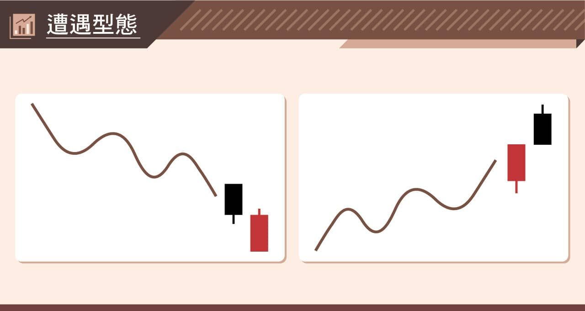
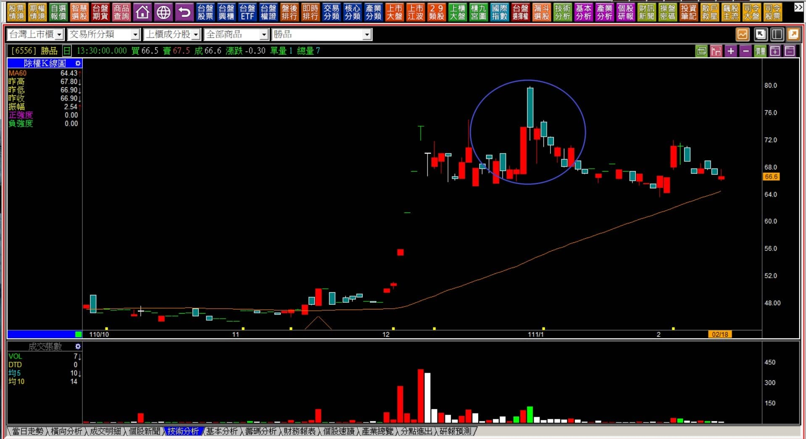
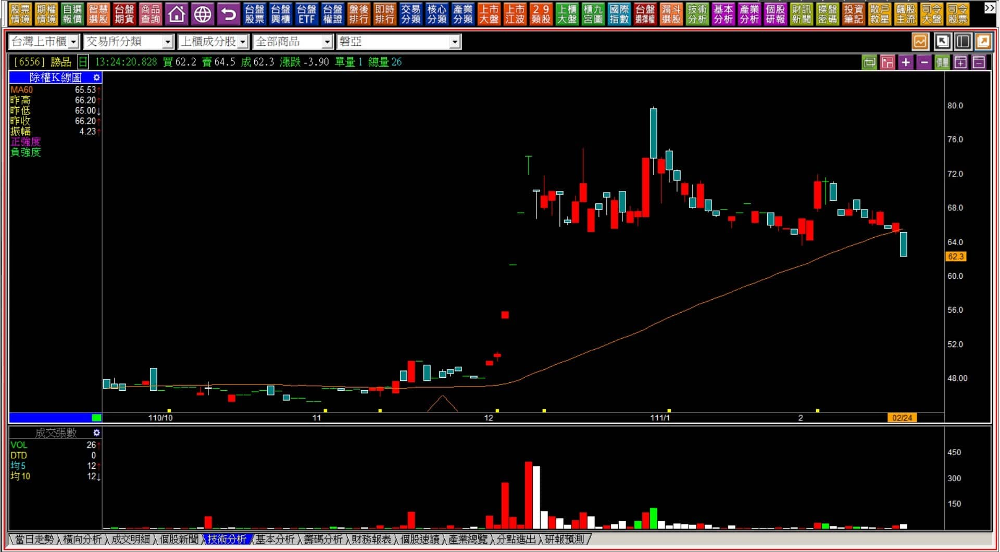
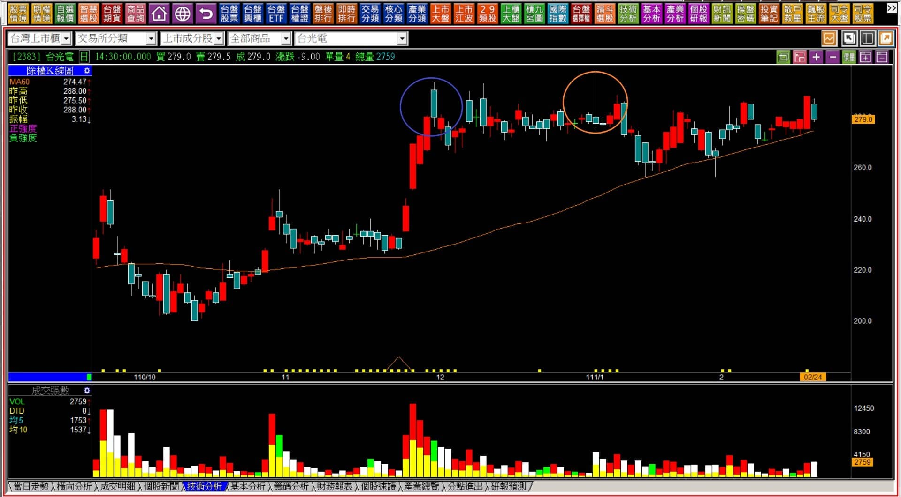
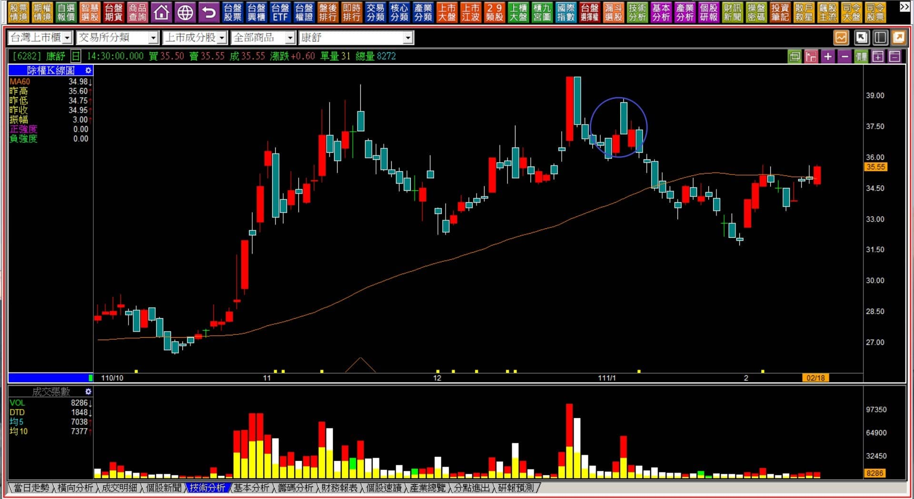

# 【組合K線補充】非轉折組合：遭遇型態組合的變化

定義：在略顯跌勢後出現的黑K，隔日遇到紅K的抵抗，收盤價與前一天的收盤價「相同」；或者是漲勢後的紅K，隔日遇到黑K的抵抗，收盤價與前一天的紅K收盤價「相同」。

時機：收盤價相同的意思，就是力量上抵抗與原本的趨勢對抗，暫時無勝負之分的狀態。

倘若前一根為**力量型K線**，那麼這個抵抗阻礙的意義就會更大。

---

---

**範例與說明**

遭遇型態實務面上出現的機率不高，因為剛好兩天的收盤價要相同，也就是最後一天是平盤作收。實務交易裡很少有刻意收在平盤的行為，所以是自然巧合的現象居多，例子也就很少。

對於多方來說，可以稱之為攻擊缺口的封口，意思就是本來開盤的時候出現的跳空攻擊的狀況，收盤的時候卻封閉了這個缺口；反之在空方，本來是跳空下跌的弱勢，卻被多方抵抗的力量封閉。

一日缺口封閉，可以被視為原本力量方向轉為弱勢的意義。

有的教學會說這是作為反向操作的訊號，實務上不應該有這樣的觀念，因為以多頭趨勢來說，判斷的要點就在於股價的高低點，只要有持續的創新高，就代表攻擊的力量還在。只不過是缺口封閉不應視為反向意義，正確的做法應該是要看這個抵抗的力量出現之後，多方會如何應對，也有可能多方氣盛，隔日繼續日出攻擊。

空方的角度，因為股價本來就反映基本面，倘若這個跌勢是因為利空導致，那麼這個封閉缺口的行為，可以視為投資型資金的逢低承接力量，但也沒有視為反轉的意義，因為股價的上揚需要資金願意買進更高價，低檔封閉無法直接確認這是往上拉的意圖。

**111-02-18勝品(6556)**

****

既然遭遇型態的意義也就是巧合地封閉缺口，那麼我們在判斷K線圖的時候，對於「以前曾經出現過遭遇型態」，就需要特別警覺多方力量被空方抵抗成功的狀況。

**111-02-24勝品(6556)**

回顧過去的結構，是遭遇型態最常見的用法，也就是發現的跳空上攻的狀態缺口卻被封閉，那就對於進場做多要保持很大的風險意識。

---

**111-02-24台光電(2383)**

一樣是缺口封閉的遭遇型態，搭配後來「再創新高的上影線」低點被跌破，證明了攻擊力量暫時不存在。這樣的走勢就得要小心，因為橫向的整理，時間已經超過三個月，一旦來一根長黑如果季線下彎，會使得整個中期趨勢直接反轉。

透過這個例子，可以再證明一次，遭遇型態的用途，不會是反向使用的意義，不宜作為多單賣出之後，還要當作放空使用，因為如果真的去放空就會變成現在卡在那裡的窘境。

---

**111-02-18康舒(6282)**

作為後期輔助判斷的角色，遭遇型態也可以合併其他型態「判斷賣壓所在」壓力的位置。

康舒一月初的遭遇型態出現，十二月才剛剛出現過「貫穿創新高紅K」的型態，那根紅K是力量型K線，被貫穿之後已經呈現出攻擊力量不足的現象，然後出現了遭遇組合。雖然跳空不屬於攻擊跳空，但前壓明顯就應該要謹慎應對，不宜輕易地買進多單。

作為輔助的功能，非轉折組合的位置都在關鍵位置使用，例如創新高之後、創新低之後、或者遇壓、型態改變位置。畢竟不是每一檔個股的走勢都有轉折K線的組合出現，輔助是必要的，但要對組合K線有正確的認識，轉折基於力竭原理，非轉折組合主要是反向力量抵抗的意義。