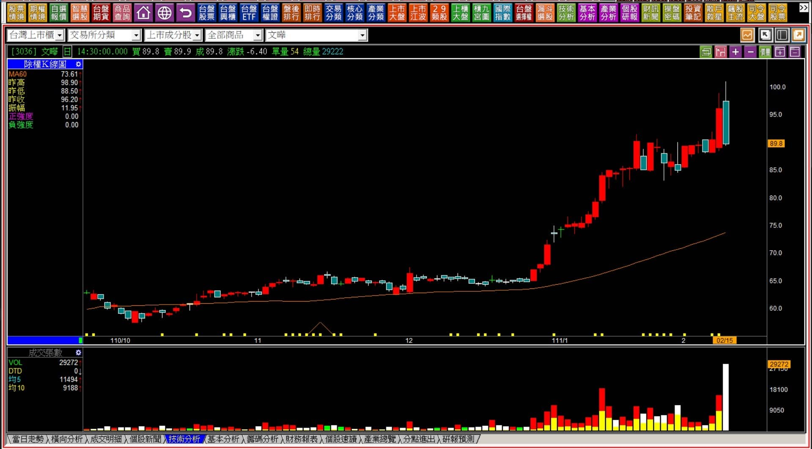
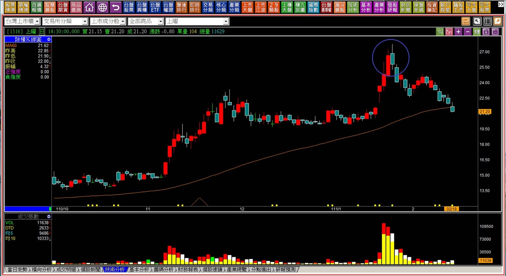
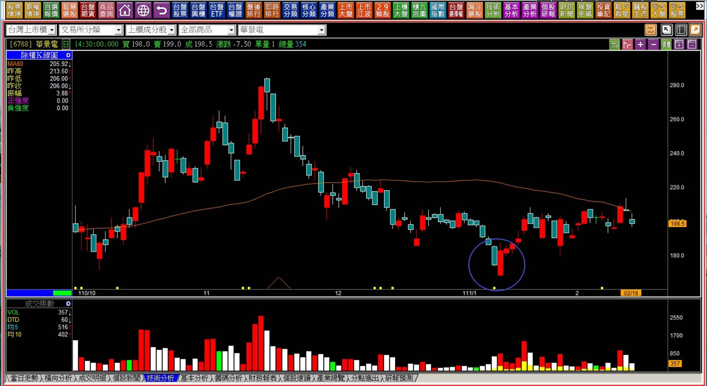

# 【組合K線補充】非轉折組合：貫穿型態組合的力量

定義：趨勢處在多方的時候，一根長黑跌破了前一天紅K的中值；趨勢處於空方的時期，紅K突破了前一天黑K的中值。

這樣的型態組合稱之為「力量上的抵抗」，也就是與原本趨勢反方向的抵抗力量出現。貫穿型態在多方出現時稱之為「烏雲罩頂」，空方出現時稱之為「曙光乍現」。

時機：原本趨勢的意義越大，抵抗的力量越大，既然是抵抗，就要看誰贏，所以隔天開始的呈現才能看得出來是哪方面獲勝。

---

---

**範例與說明**

當多方的創新高紅K，隔日遇到了黑K，從收盤價相同的「遭遇線」，到低於紅K收盤的反轉線，再到紅K中值被跌破的「貫穿線」，代表著三種不同程度的反方向抵抗，僅次於「包覆線」，貫穿在黑K的狀態別名為烏雲罩頂的型態，當然，這並非酒田戰法的原始用詞，而是近代人依照形狀而自創的形容。

空方定義相似但是方向相反，當紅K突破了前一根創新低的黑K中值之上，也是貫穿型態的多方抵抗，別名為曙光乍現，在所有非轉折的組合型態中，只有貫穿線各自有另外的別稱，是後人為了誇張反轉用途的命名，雖然沒有必要，但還是讓讀者知道一下。

定義上之所以採用中值，是基於平均成本的概念，並非中值一定是成本，要計算確切的成本可以用當日分價量表算。

所以當中值被越過的時候，表徵就是多空主控權的易位，帶有反轉可能的意義在，但實務判斷時，「漲多有回檔、跌深有反彈」都是正常波動，所以還不能光依靠這兩根就要決定方向上的改變。

多方狀態出現的黑K之後，接下來只要價格沒有再創新高，或者空方狀態的紅K之後，價格沒有創新低，那麼都顯示貫穿力量是有效存在的。

**111-02-15文曄(3036)**

貫穿的力量沒有比黑K吞噬來的大，但是往往也是很驚人的抵抗力型態，特別是帶著成交量的黑K，有著獲利了結賣壓出現的意味。

不過，這個類型的個股，如果暫時有著不錯的基本面，代表多方的拉抬已經被組檔，但並不會快速的回跌，與黑K吞噬需要的力竭背景不太相同。

**111-02-18上曜(1316)**

轉折的角度往往有隔日確認的邏輯感存在，因為用來作為進出場點定義。但是非轉折的組合，體會「力量轉變的意義」大於買賣點。

貫穿型態出現之後，理論上如果抵抗成形，那麼繼續往下走證明了多方已經沒有再往上拉抬的企圖，股價已經轉為讓空方主導，不是確認反轉成立的意思，更多是順理成章的判斷態度。

---

**111-02-18華景電(6788)**

曙光乍現的型態通常是對股價已經有一定程度的悲觀時出現，但又不是中期空頭的時期就已經可以辨別，長度尚未包覆整個黑K，但貫穿的意思，就是原本的空方力量已經減弱。

然而一定要注意的，股價的上漲需要資金有著追高意願的拉抬，下跌只要沒有買盤就可以形成長黑，這也是型態上無法單純的多空轉變就這樣用的主因。因為就算紅K貫穿了創新低的黑K，照樣還沒有大漲彈回上次高點的實力，頂多只能被視為空方已經失去主導股價權而已。

這也是為什麼反轉型態不應該被視為反向操作的原因，因為K線上的力量，不是非多即空或者非空即多的二分法則。

---

**補充說明**

貫穿型態與其他所有的非轉折組合型態相似，成交量往往占了決定性的因素，倘若要有反向的表現，特別是空方態勢遇到了貫穿紅K，成交量不能萎縮，如果萎縮，往上走的力量就會更小，主因在於K線結構中，賣壓主導了股價上漲的障礙。

另外，市場上有一種說法是貫穿黑K的紅K越長，代表力量越強；貫穿紅K的黑K越長，力量越強，

上述論點實務上只有黑K是正確的，因為漲了之後如果買盤沒有再追價，跌成長黑就變成空方氣盛，很正常；但如果是曙光乍現的紅K，越長不見得就是力量越強，關鍵是在成交量的大小，越小的成交量表示長度代表的力量意義越小。