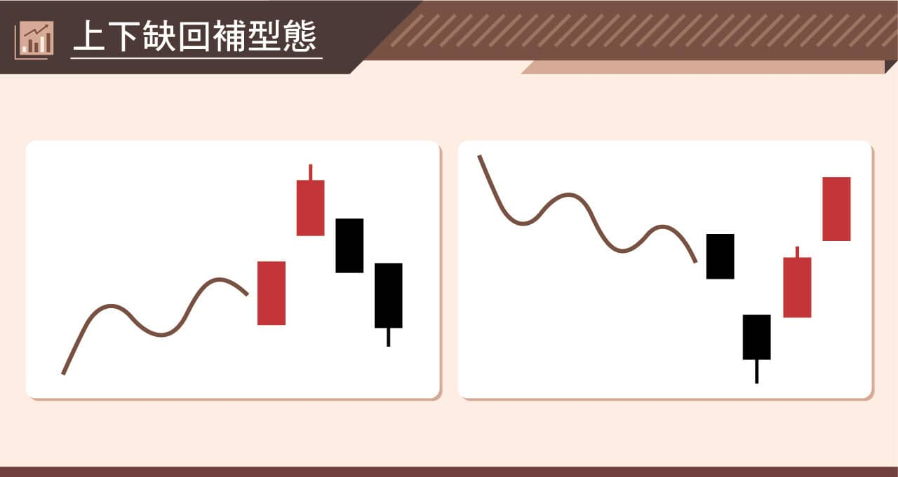
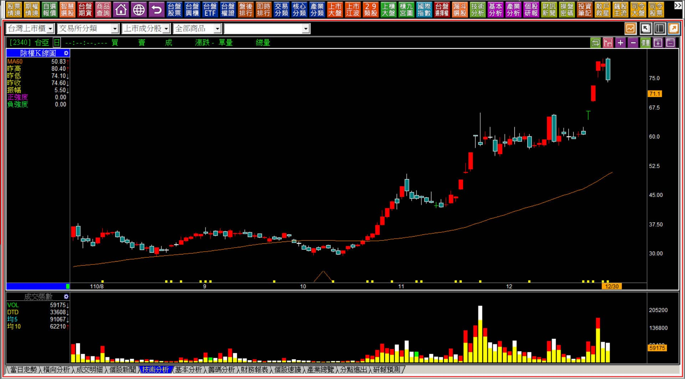
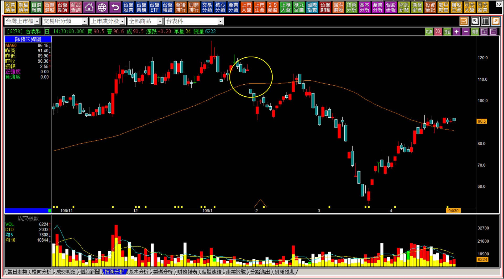
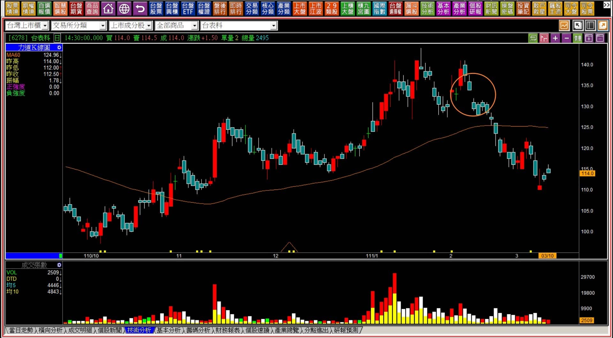
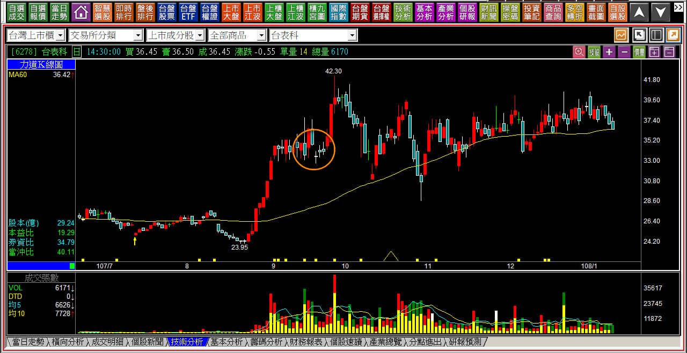
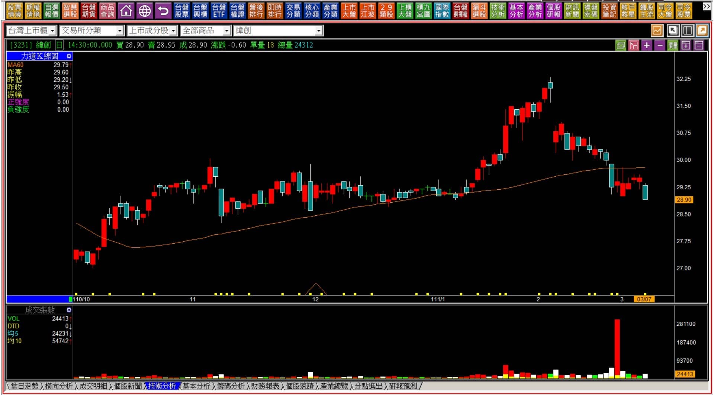
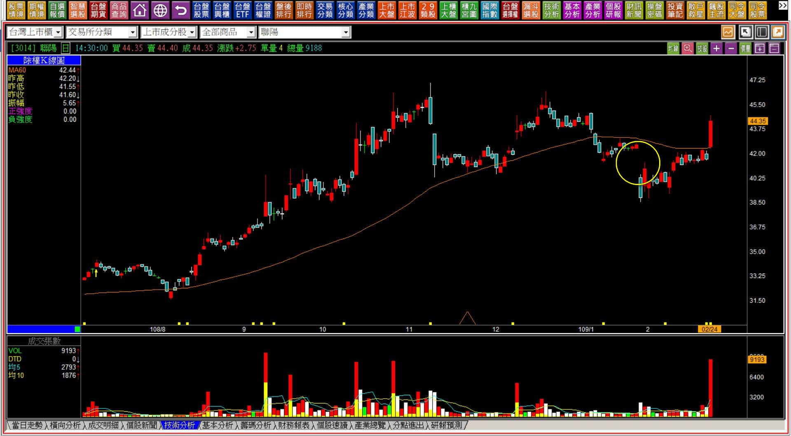

# 【組合K線補充】非轉折組合：上下缺回補型態組合的輔助

定義：上下缺回補是自上肩缺口與下肩缺口的型態衍生而來，意義剛好是相反。當缺口回補之後顯示力量的消失；其中，向下跳空的回補，顯示市場資金已經接受利空；而向上缺口的回補顯示攻擊的力道與誘空洗盤的可能性消失。

時機：原有趨勢的力量自此已經無法再輔助股價原本的走勢，雖然沒有代表多空轉折的意義，但有短期內力量變化已經改變的態勢，原本的動能消失不代表反向，除非原本就是處在整理區間型態。

---

---

**範例與說明**

從某一個角度單純的看待，缺口被回補往往就是力量意義的消失。上下肩缺口被回補，表示是在某個前提之下發揮了力量，結果這個力量的意義消失了。

例如，上肩缺口出現的意義是誘空、或者是洗盤，所以判斷的時機要在股市混沌不明，且股價剛剛突破之後看起來往上有跳空，隔天又轉弱但還沒有回補。所以原趨勢的背景意義很重要，否則就單純採用缺口判斷即可。

同時，如果當時的環境背景沒有誘空的必要，那也就不需要用上肩缺口看待。

上下缺口回補型態沒有上述這麼複雜，有時也就很單純的可能是攻擊跳空缺口，之後呈現弱勢(或者隔日醞釀，再隔日轉弱)，一併把缺口補上，也就是上行缺口被快速的回補了，自此要留意力量消失之後的走勢演變。

**110-12-29台亞(2340)**

台亞改名之前為光磊，原本的漲勢可以說是多方的妖魔鬼怪，沒有基本面的營運改變支持，單純就是改名為半導體的熱情，所以趨勢主導了股價走勢。

但是在跳空缺口被回補之後，由於這是攻擊跳空，因此這個向上缺口被回補，也代表著多方的熱情已經開始消失，雖說形態上很接近暗夜雙星，但這裡我們不討論多空轉折，單純只看組合型態中的缺口意義，一樣可以辨識力量是否改變。

**109-04-30台表科(6278)**

**111-03-10台表科(6278)**

這兩張圖都是台表科，是不同時間的下行缺口。兩次狀況都一樣，原本都並非強勢的攻擊走勢，在整理的過程中突然某日出現往下跳空，且缺口都沒有回補，這表示下降的原因或者力量還是存在，必須是要等到回補缺口的狀態，才有機會重回原本走勢狀況。

對於多方的角度來說，很可惜的是，原本就不是攻擊走勢中，所以意義上就算是缺口回補，也只不過就是回到整理趨勢，但是對於空手者而言，缺口意義也是其中的一個壓力呈現，對於層層套牢來說，沒有回補就表示這裡存在著一層套牢。

簡單的說，缺口回補才考慮進一步有沒有可能往多方，有可能但不一定，可是缺口沒有回補，那就暫時不用討論了。

**108-01-10台表科(6278)**

上圖的圈示缺口是在107年發生的，原本連續的上揚又經歷過攻擊整理，突然向下跳空，但是隔日這個缺口就被回補，原持有者已經可以不理會缺口發生的原因。

當突如其來的向下跳空，迅速被回補，才有轉向危機消失的意義。

---

**下缺未回補與下降型態混合運用**

通常在多方趨勢持續比較久的時間之後，最常見的就是這種本來正在攻擊進行中，股價漲得還好好的，但突然就往下跳空，代表著多方本來就還沒有耗費太多成本去拉抬，所以一轉弱也就看不到撐上去的力量。

不僅如此，股價來到過去的橫向整理區時，先有黑K，然後整理五天，再往下跌破的向下升降型態(上圖最後七根K線)，組合起來就可以理解這一檔股票在可預期的一段時間內都很難有攻擊表現。

也就是未來即使出現反彈，上面也還有這個缺口的壓力存在，等於是多方的天險壓力位置，這樣就可以理解當時的向下跳空有沒有快速回補的差別。

**108-02-24聯陽(3014)**

個股的整理型態中，不泛有轉弱可能的向下跳空，特別是大盤氣氛悲觀的時候更是容易出現。下缺回補的意義，在於不管當時這個缺口是基於什麼原因，市場資金都已經無視這件事了。

換言之，若對某一檔股票有投資的興趣，偏偏又出現了盤整之後的向下跳空，必須要等到缺口回補再來思考投資的層面，對比緯創(3231)，這是比較容易讓人理解的力量變化。