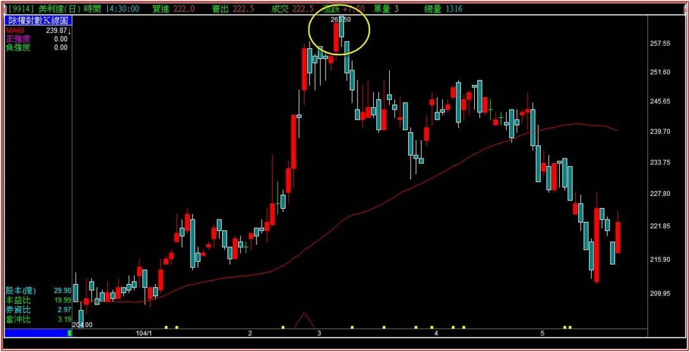
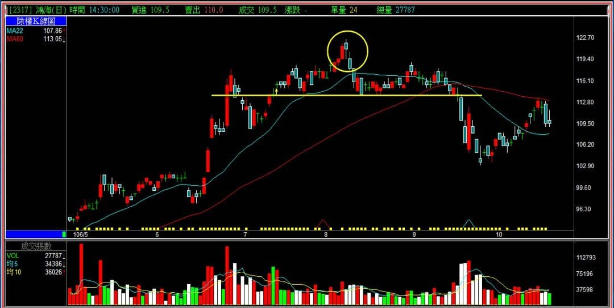
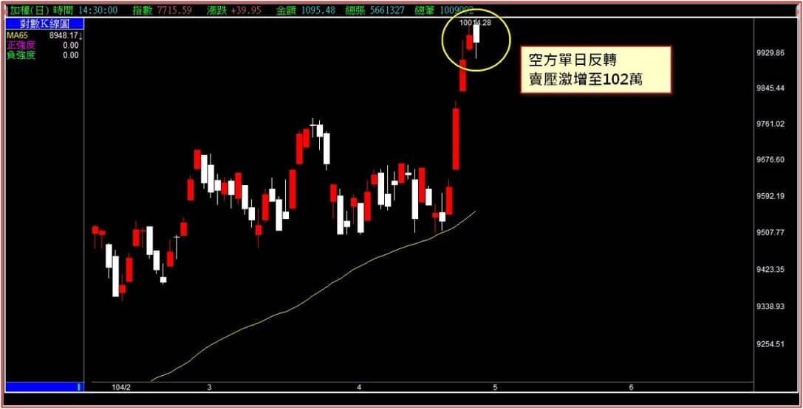
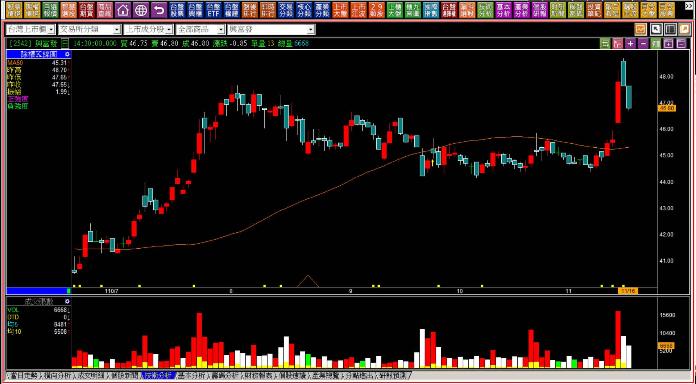
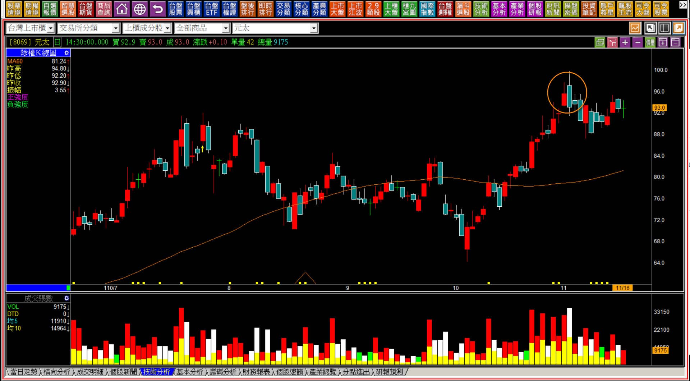
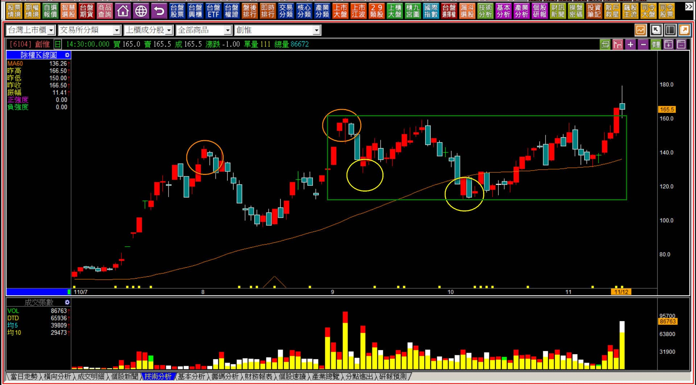
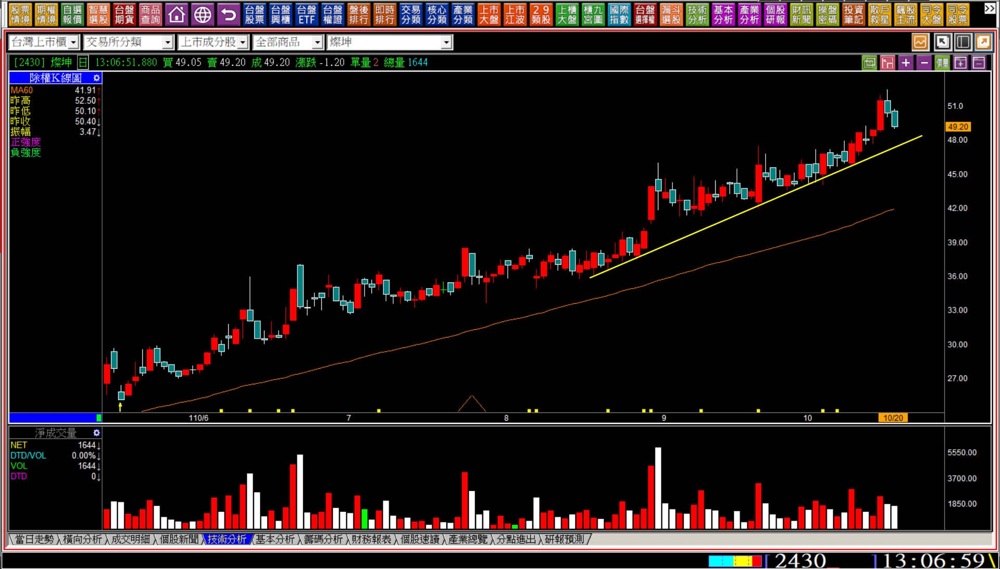
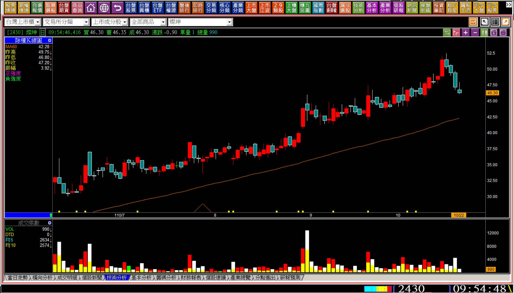

# 【多空轉折】空方單日反轉的定義與日出日落

關於「轉折組合」的K線教學，過去在各種文章與不同的時機中，講過了非常多種組合的型態，唯獨「單日反轉」始終沒有特別撰文探討，原因是單日反轉的組合型態無法單獨直接兩根就確認力竭使用，必須搭配接下來的K線走勢來合併判斷，所以功能上需要更複雜一點的確認。

網路上或者某些教學者的說法，是用隔日確認，但依照實務經驗與教學判斷，隔日確認這樣的說詞還不夠妥當，是隔日的開盤確認？還是盤中或者收盤確認？這樣的模糊狀態對於K線的使用者會有更迷惑與不清之處。

更詳細正確的說法是都有可能，所以很複雜的狀態下只好個別的解說，且無法完整分類，因為不同的背景之下答案又不太一樣。

空方單日反轉的背景，當然是**多方持續進行之後**的結束，這是確定的，以下我們先舉一個例子，再加上定義。

**美利達在104年的走勢範例**

上圖圈示之處，紅K續創新高之後，隔日是一根日出的黑K，定義上是收盤價在前一天的高點之下，以這兩根來看定義符合，不過型態上還是日出，再隔日才是出現日落走勢。

這只是一個有著事後看可以確認反轉的K線圖範例，以下我們從定義上說明。

**空方單日反轉的定義與說明**

**空方單日反轉定義：在一段持續上漲的多方走勢中，股價明顯創新高之後，當天就回跌走弱，收盤價比前一日最高價還要低。當日有利多視為強烈訊號 。**

光是這個「當日有利多」的條件，就已經是很不容易界定的狀態，其實要成為轉折的重點在於接下來輔助判斷的項目，有很多類型來輔助確認，以下列舉各種狀態一一說明。

**【日落】**

前一段我們已經談到了日落，日落是單純的K線表徵，也是攻擊狀態的負面表列，意思是如果股價繼續強勢，理應是再創新高的走勢，不會是變成日落。雖然說如果不是日出攻擊的狀態下，日落也不算是嚴重的問題，不過還是要列出來，因為日落的本身有著短線上暫時不強勢的意義存在，再輔助其他的要件判斷會更加清楚。

**【利多與日落】**

利多隔天卻出現日落，在多頭趨勢的狀態下，往往是一個力量停滯的意義。因為正常狀態下如果是真正的實質利多，理論上股價不會回檔給散戶有機會低接股票。

鴻海當時的狀況，是因為外資麥格理發表了一本鴻海目標價200元的研究報告，當時引發市場關注，可是股價卻開始日落，然後慢慢形成頭部，並且進一步跌破頸線，回顧當時的日落是出現在利多的狀態，就是單日反轉很常用到的輔助。

**【大盤以多空能量輔助】**

大多數的人並沒有我們每週三撰寫盤勢解析中的多空能量圖，所以無法透過賣壓數字來隨時協助判斷，因此這只是舉例說明。

上圖是在104年4月28日，台股終於走上萬點10014的K線圖，多空能量上賣壓來到百萬張(圖上只是說明，無多空能量圖)，未成交賣單之高，是前所未見的，因此如果隔天開始日落就代表轉折成立。

以多空能量與大盤的單日反轉加上日落，當時也是多年來我使用多空能量首見這麼大的賣壓，這裡單純用來作為輔助說明。環境表面上的強勢與樂觀，用開盤未成交賣單來看也是一樣的，實務上樂觀卻開始往下走的反轉，還是成立的。

---

**常態下看似單日反轉的兩根K線**

請再看一次定義圖，會發現如果只依照長紅隔天有著創新高價的黑K，光看這兩根，因為高低點都比前一天高(如果低點比前一天低就變成黑K吞噬了)，就是「日出」的意義，所以顯然要只靠這兩根就要判斷反轉實在是太籠統了。

在這兩根之後還有一種是隔天往下跳空，那就是「跳空反轉」，因此出現日落、跳空反轉都屬於轉折訊號，差異在於如果股價並沒有先經過大幅的拉抬，也沒有跳空，光看日落就要判斷成轉折，還是太隨興。

**110-11-15興富發(2542)**

單看最後這三根K線的前兩根，是不是單日反轉呢？那麼隔天又日落是否符合定義？

不能用後來股價有沒有繼續跌來當作判斷，因為沒有人能夠在交易的當下，已經看到後面的走勢。同時，力量上的判斷，股價根本沒有經歷過多方拉抬或者攻擊，不是明顯的多方趨勢之後，多方未曾施力拉抬，就沒有任何轉折力竭判斷的必要，因此形狀相符並不代表就是單日反轉的組合。

**110-11-16元太(8069)**

元太也是同樣的邏輯，假如要運用黑K吞噬的判斷，上圖元太的圈示，當然不會是空頭吞噬的反轉，因為根本就沒有經歷過多方用力拉抬、攻擊的跡象，也就沒有反轉的意義存在。

K線重意不重形，力量上的意義才是判斷的關鍵，不是以兩根轉折組合的形狀就決定。

**110-11-12創惟(6104)**

這個例子也是相同的，讀者必須先理解力竭的基本原理，才不至於落入用形狀判斷的盲點，即使是隔天股價日落也是相同的判斷，要先有拉抬，才有力竭背景，不是看組合的形狀就做判斷。

因為才剛剛突破，也不符合力竭的定義，可以是攻擊假設、型態突破的判斷，但不會是力竭。力竭指的是力量的竭盡，剛突破的走勢代表多方根本就還沒有發揮力量，既然沒有，就沒有力量的竭盡，也就不會有轉折的意義，即使形狀上是紅K隔日有著創新高的黑K。

---

**單日反轉的特殊定位**

經過了上述的幾個例子，顯示單日反轉在轉折組合上的運用真的會有很多盲點、細節需要留意。

那是不是就不要使用這一項了？不是如此。在明顯有反向狀態的時候卻又很實用，例如大盤中的多空能量，也就是大盤連續上漲，但是黑K出現的時候賣壓已經來到極端值的大量。

這一篇看起來像是有很多面向的範例，卻沒有太明顯的結論，因為K線的變化就是紀錄股價的變化，只不過是我們投資交易者想要利用這些價位的變化，理解力量是否有改變。

但至少單日反轉的兩根紅接黑，隔天之後得要繼續研判，有向下跳空就是**跳空反轉**，有**利多卻日落**成為轉折的成立，可是力道上單日反轉是所有轉折組合中最微弱的呈現，除非加上了輔助的判斷，所以說光是隔天就日落還太不足夠。

可是某些狀態下卻異常好用，這是需要更多範例來說明才會讓讀者們清晰，卻怎樣都無法把所有的可能性囊括在內的一種轉折組合。

因此必要的狀況下，很多原理也都可以做為輔助判斷，例如**短期趨勢**也算。

**110-10-20燦坤(2430)**

像這樣長期緩步慢慢推升的走勢，其實對於中期投資的人來說是很危險的。

因為股價一直沒有強力的拉升，往往也帶給投資者一種中長期走多的假象，假如加上新聞報導、財報上數字不算差，月營收再加一把力量看到YOY增加，就會失去戒心。

至此的K線圖已經呈現單日反轉的兩個跡象，創新高隔天黑K，收盤價在前一天最高點之下，再隔天日落。實務上沒有其他的輔助可以使用，那就可以回到短期趨勢來看，因為如果隔天出現再一根黑K，就會形成轉折組合中的外側三黑，再跌也會變成短期多方趨勢線跌破。

**110-10-22燦坤(2430)**

K線圖至此投資人需要具備沒有畫下任何輔助線也能看得出來這是外側三黑、也跌破短期多方趨勢的意義。

沒錯，不只是跳空反轉是空方單日反轉的延續，外側三黑也是。如果讀者在我未講解到這裡就已經先有這樣的認知，那就表示你對於K線的變化已經有了一定程度的連續走勢判斷能力。