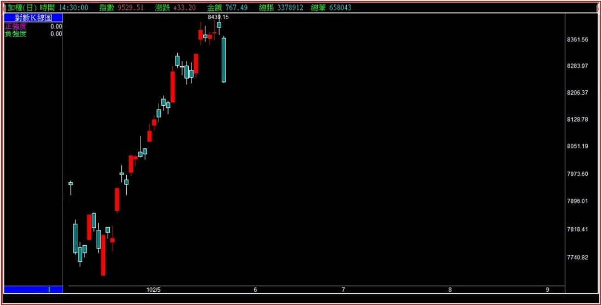
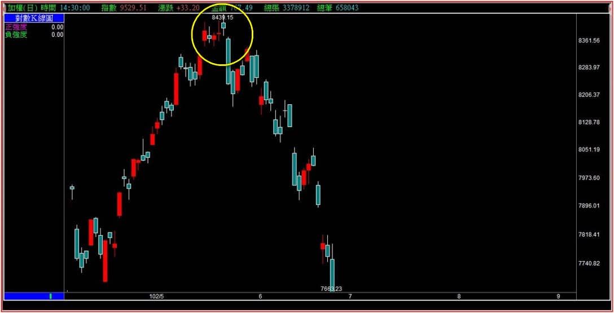
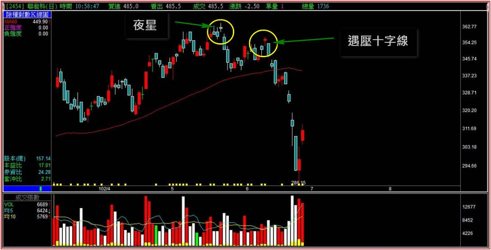
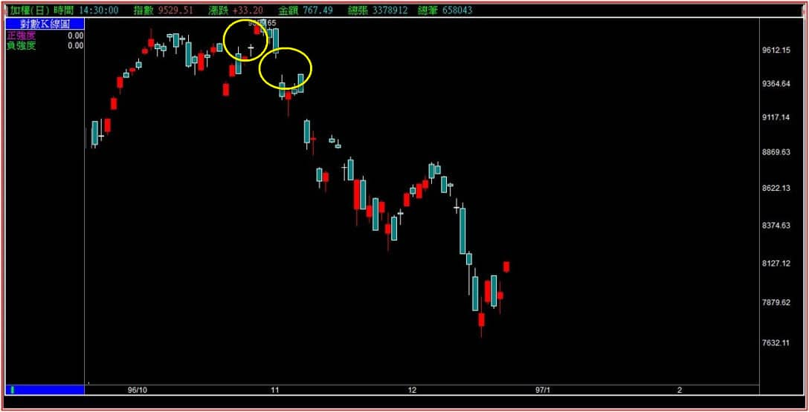

# 【多空轉折】三根K線連續判斷十字線之後：夜星與島狀反轉

十字線其實就是股價當日往上、又往下，最終收盤時與開盤價差不多的K線，單一K線的角度，短十字線屬於醞釀型K線。

沒有太大的特殊意義，定位上沒有比跳空或者上下影線來得重要多少，可是大部分人有著「十字變盤」的說法，這就跟元宵、端午、中秋變盤一樣都是穿鑿附會，當然也沒有看十字線隔天是開高還是開低來判斷的輔助。

的確十字線有著「中繼」的意義，在三根K線轉折組合中確實也有著夜星與晨星的判斷。不過一個是多方轉空、另一個是空方轉多的表示，都是需要接續下來的日落日出作為輔助標準。

以出現的頻率來說，夜星已經算是很低了，晨星更少出現，因此這一篇我們簡易的說明一下夜星的定義，更重要的是擴大說明島狀反轉，因為夜星如果不是視為島狀反轉的一種(左右都有跳空缺口)，那麼判別意義就低於單純只用股價高低點來看了。

---

**夜星定義****：出現於相對高檔區的十字線，隔日跳空向下，有長黑K線是強烈訊號。高檔當日K線實體短(十字線)，左方有時 會跳空缺口。右方缺口越大，訊號越強烈，不能只看到高檔十字線就視為夜星。**

**島狀反轉定義****：****先有跳空向上形成左方缺口，經過一根或者一根以上的走勢，之後再以跳空下跌出現右方缺口。中間形成孤島型態，不只一根K線稱為島狀反轉。**

從定義中已經可以看出，兩者之間有相似之處也有相異的地方，也可以說，島狀反轉也包括了夜星的型態，但是夜星型態中也因為實務面少見，所以定義不似島狀反轉那麼講究十字的兩邊都要有跳空。

其實轉折組合K線的基礎邏輯是「力竭」，因此重意不重形，這是我們混合起來解說的原因。

更精準一點的說法：在兩個跳空之間，如果只是一根十字線，就稱之為夜星(多方稱之為晨星)，如果是一根實體的K線，就稱為孤島，如果不只一根那就叫做島狀反轉。不管名稱是什麼，意義就是轉折，不必太拘泥於形狀。

**夜星型態分解圖一**

夜星型態在K線圖上並不多見，因為不是那麼剛好在新高位置就是十字線，往往有更多的態樣是有實體跟上下影線。另外，也不見得十字線的前一天就有跳空，反而是十字線的隔天有向下跳空比較容易出現，這是力竭意義的呈現。如果隔天開盤跳空向下，還出現長黑，反轉的意義就更大。

**夜星型態分解圖二**

現在讀者們經過這麼多轉折組合的教學文，可以發現「買拉回」的心態，風險有多大了。

**夜星型態說明圖三**

上圖左邊的十字線，雖然沒有對稱的跳空，但十字線右邊有跳空向下，已經符合夜星的定義；右邊黃圈的位置，定義上似乎頗像是夜星，因為十字線的左右都有缺口，但因為不是在股價新高的位置，所以意義上僅僅算是遇壓的十字線。

至此有沒有開始覺得，定義是什麼不重要，知道是力竭就好了呢？沒錯，重意不重形就是這個道理。

**島狀反轉的呈現範例**

實務上要真的找到剛剛好對稱缺口的島狀反轉就更少見了。所以島狀的左右都有跳空就算是符合定義，換個方式，如果不懂島狀反轉，光看跳空不就行了嗎？

沒錯，重意不重形又再一次的得到驗證，你只需要懂跳空代表什麼意義、向上跳空卻被回補，然後過一陣子還往下跳空，就已經知道答案了，是不是島狀反轉並不重要，能夠看得出來多方力量的竭盡就可以了。

所以兩個缺口的中間不只一根的稱為島狀，一根實體線稱為孤島，一根十字線稱為夜星。定義是如此，名稱雖然有差異，但就轉折組合來說，意義都是力竭，相同的判斷模式。

---

**空方島狀反轉的實務面說明**

空方的島狀反轉在個股中出現的頻率不高，頂多以夜星的狀態呈現，原因是當被拉抬過的股價主力如果要出貨，通常不會做到向下跳空這麼明顯，因為這樣顯然無法出貨給散戶，明確的弱勢散戶還是看得懂的，所以往往出現向下跳空成立島狀反轉時，中間已經經歷過太多天了。

**110-09-23十銓(4967)**

在這種狀態之下，還要去視為島狀反轉顯然有點為賦新辭強說愁了，中間太多根K線那就還不如指向右邊的向下跳空缺口代表的意義就行，這也是空方島狀反轉比較少見的原因，主力如果為了出貨，常常會慢慢來。

假如真的要強烈快速倒貨，那又很容易形成空頭吞噬，不需要刻意地做成島狀反轉，

比較常見的是另一種模式。

**111-04-29茂達(6128)**

定義上的確符合島狀反轉，不過表面上已經可以看出遇到了前壓區，任何對K線圖有認知的使用者，不必等到向下跳空成立了島狀，才發現結構上出了問題，所以這種遇壓型的島狀反轉，實務意義已經小了很多。

當然，單純看右邊的向下缺口也是可以判斷壓力，反向波動原理、前壓判斷都可以用來發現這檔股票套牢賣壓的問題，致使在這邊要確認型態成立島狀反轉，實務效用已經不大，也就是定義符合，但是太晚發現了不應該進場，也沒什麼用處。

---

**綜合說明島狀反轉**

實體課程教學的時候，島狀反轉講起來是最輕鬆的，把各種類型與範例介紹一下就可以，學員也都很快能理解，但是實務判斷重點應該要放在真的出現的時候，應該要注意的其他環節，例如遇到壓力、缺口有沒有被回補，這一段無關買賣點，也無關進出場，顯然是一種還沒有力竭的判斷。

多方有島狀反轉失敗的可能性出現，可是空方的島狀反轉往往不會有失敗的狀況，因為向上跳空出現可能會遇到賣盤壓力，向下跳空出現了之後，並不會遇到支撐又往上漲。

更正確的說法是，技術分析上沒有真正的支撐定義，只有形態上的解釋而已，因為支撐必須要確認到了每個位置一定有買盤進駐，可是除了十年線我們可以確定有國安基金會進場之外，其他的支撐都只是推測出來的。

多方島狀反轉會失敗的解說，下一篇來詳盡的說明。