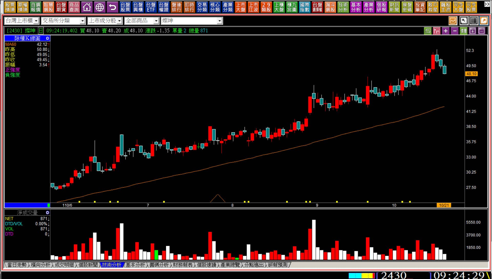
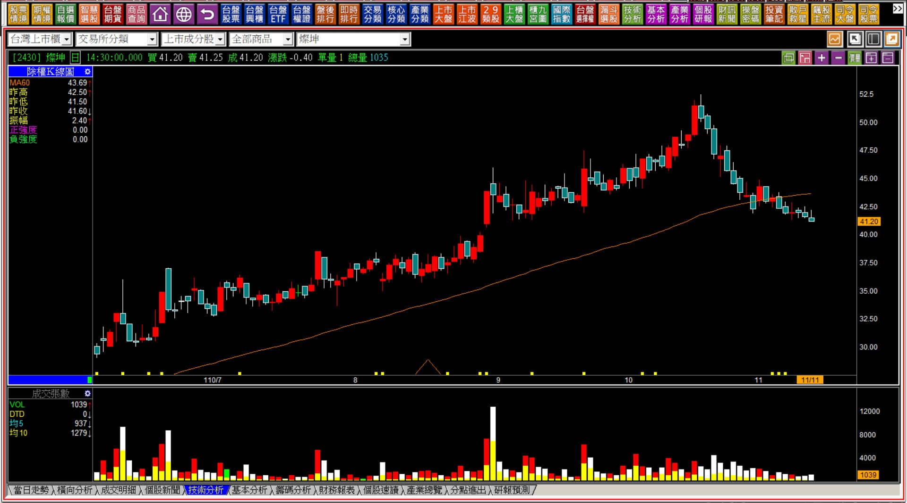
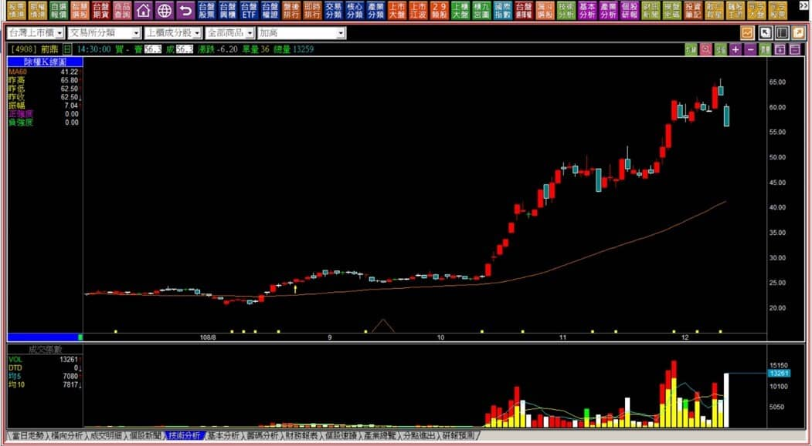
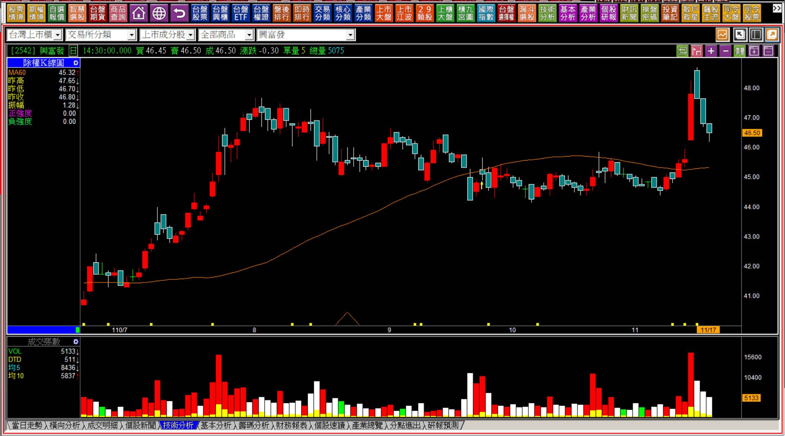

# 【多空轉折】黑三兵與外側三黑的組合判斷

經歷過了多空轉折組合的講解，從一根K線的意義，然後進入了連續走勢的教學之後，現在再進階一點，把表面上看起來的力量意義，放在不同的位置解說，這樣讀者就可以更加明白，為什麼某些位置就是需要考慮到力量的竭盡，但是有些位置股價單純就只是短期的弱勢而已。

需要經過說明的原因，是因為如果沒有從力量的角度來理解，就會只看到表面上是拉回，實際上對於股價未來的走勢，有著力竭意義的就會有不一樣的影響，三連黑就是如此，不同的位置意義不一樣，是不是在創新高的紅K之後出現，代表的功能就不同。

---

**外側三黑的定義**

外側三黑指的是「創新高的紅K之後，出現連續三根黑K線，且第一根與第二根黑K中間沒有出現跳空缺口。」

為什麼要強調第一根與第二根黑K中間沒有出現跳空缺口？因為如果這個位置出現向下的跳空缺口，就已經在定義上符合「跳空反轉」，那也就不需要再等到第三根黑K出現，已經符合了力竭的意義。

外側三黑實務上也很少見，因為大部分主力用力拉抬的股票，如果有好的高價位機會大量出脫，那就很容易形成**高檔長黑**或者是**空頭吞噬**，變化更細微的有暗夜雙星，所以要定義為外側三黑，就得是連續三根黑K出現在有一定漲幅的創新高紅K之後，往往是在長期緩漲的個股比較容易出現。

「外側三黑」發生的個股，通常成交量都不會像是熱門股這麼大，所以通常是高價股或者冷門股比較容易出現。

**110-10-21燦坤(2430)**

標準的外側三黑就是如這樣的圖示，我們先來看一下定義上外側三黑的教學示意圖。

之所以外側三黑意義上也同於空頭吞噬，都是因為創新高的這一根紅K，低點被跌破，所以意思就是這根紅K，看起來原意是為了拉抬，可是低點破了，代表的是主力根本沒有真的要拉抬的意圖，不然就是主力拉不動，又或者主力並不覺得這一檔一直往上拉抬以後出得掉。

不管是哪一種可能，有轉折出現，都不值得我們留戀，這也是持有股票的風險所在，轉折組合必須看得懂才行。

**110-11-11燦坤(2430)**

經過了一段時間之後，股價的表現就會讓所有打算拉回買進的人失望，也讓當時外側三黑出現卻沒有出場的人，感覺到了問題的所在，因為大多數股票雖然不是熱門股，一旦漲上去了就會有媒體討論，彷彿這家公司體質有所轉變一樣，事實上營運並沒有真的這麼大的改變。

---

**對比「跳空反轉」的範例**

**108-12-11前鼎(4908)跳空反轉**

這個例子雖然與外側三黑的定義中，創新高的紅K低點被跌破一樣，但是並不需要三根黑K，第二根就帶著跳空缺口，且也跌破創新高的紅K低點，是最簡易的轉折判斷類型，表示除了符合轉弱之外，還有一個向下的跳空。

向下跳空在股價攻擊的階段，是不符合攻擊原理的，所以表示多方力量的消失，也代表著力竭的意義，這樣的型態出現，已經不需要再判斷是不是外側三黑。

---

**三連黑(黑三兵)與外側三黑的差異**

傳統的K線教學，都採用「多空互換的模式」講解，例如紅三兵算是強勢、黑三兵就算是弱勢。但紅三兵也有力量方面的細節變化需要進一步判斷，例如拉不開行情的「大敵當前」，就是三連紅；或者長紅之後的兩紅股價總有低點讓人可買，就是「紅K陷阱」。

這些都是教科書沒有教的，也是初學者最容易犯下的錯誤。往往把K線用最簡單的方式先解讀，而這個簡單的說法可能帶著錯誤的判斷，所以行進組合K線不能直接把三連紅或者三連黑當做強弱來用。

三連黑是不是就是弱勢？表徵上來看好像是，但也得辨別所在的位階，還有連續三根黑K出現的原因與股價的跌幅有多大，力量上的意義都不相同，沒有經過股價的大幅拉抬，就不會有力竭的意義，不應該看圖形來決定多空趨勢。

**不算是轉折意義的外側三黑**

單純看K線圖，似乎符合外側三黑的樣子，但背景狀態不對，就沒有力竭的意義，也就是「非」力量的竭盡，就不能視為轉折的意義。

我們當然可以說，這樣的走勢表示股價偏弱，可是力竭的背景有嚴格的標準，必須是力量的竭盡，也就是有經過股價多方的拉抬，然後才可以說是力竭，否則不能視為轉折組合。

如果沒有多方的施力，卻以為是力竭，就會變成只重視形狀，沒有重視力量的結構變化，就會常常對於轉折出現誤判的狀況。

**黑三兵的錯誤認知**

傳統的K線教學很僵化，介紹了K線組合，又盲目地給予定義，例如黑三兵好像是不好的，紅三兵好像就是比較好，這些說法都太過於表面。

如果沒有轉折的意義，就回到型態與趨勢的角度判斷。

當你對於力竭的定義有一定的認識，就會發現高檔的長紅K往往帶著多方力竭的可能、低檔的長黑也同樣有著空方力竭的機率，何況是連續三根，所以不能有那種三連黑就是不好的直覺存在，需要搭配K線圖的背景環境，透過力量的呈現判斷。

這一篇教學目的就是要釐清這樣的觀念，外側三黑除了三根連續沒有跳空缺口的黑K之外，更重要的背景就是出現在創新高的長紅「之後」，尤其是那種平常冷門，卻又出現了中期緩步推升的走勢，因為長期低量如果是一根大長黑，主力很難出貨，只能透過時間，等待散戶願意低接才有辦法出脫，或者透過區間整理的模式來出貨。

外側三黑雖然不常見，因為通常發生在冷門股，可是基本原理與「最後一根紅K假設」常常有接近的邏輯。

技術分析的邏輯是固定的，不會因為使用位置、使用心態的不同而邏輯改變，這是我們在判斷K線圖的時候一定要注意的地方。