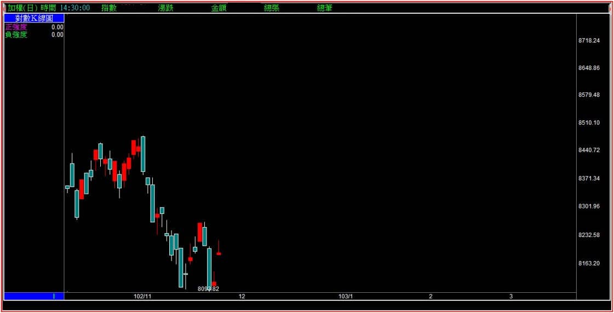
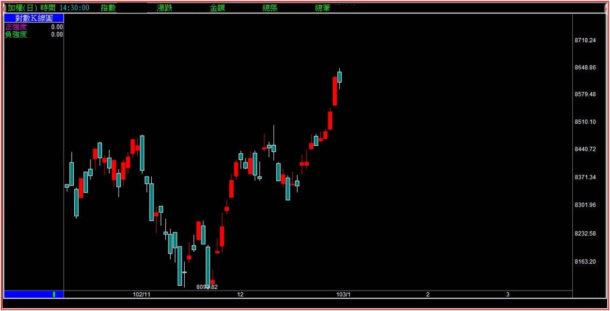
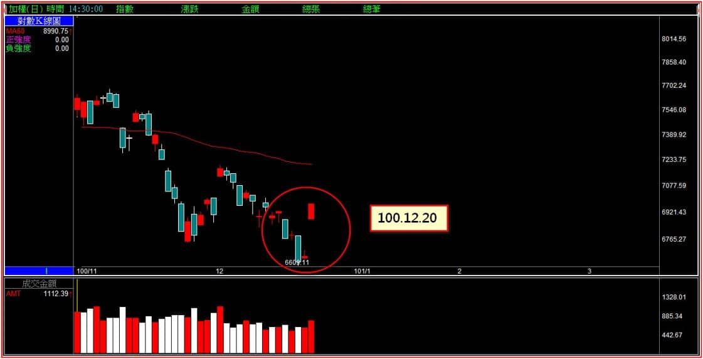
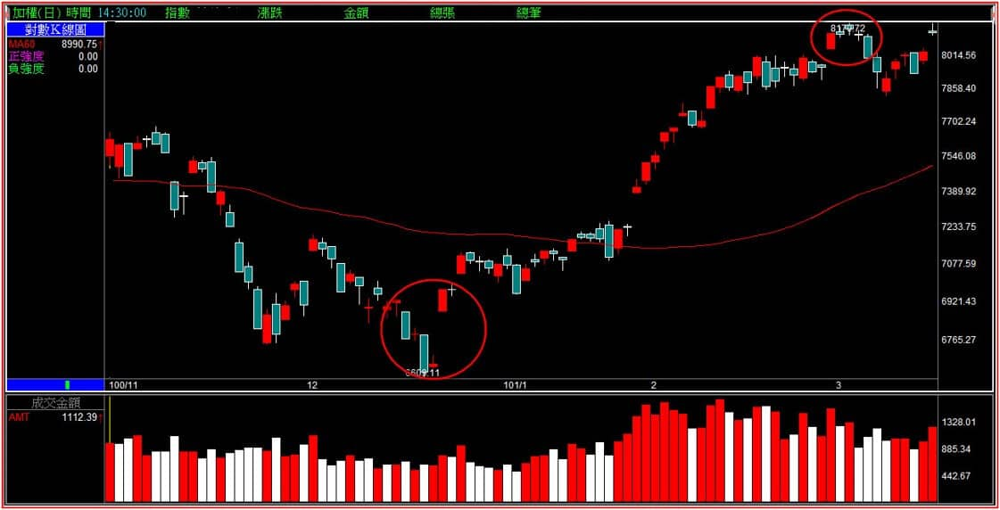
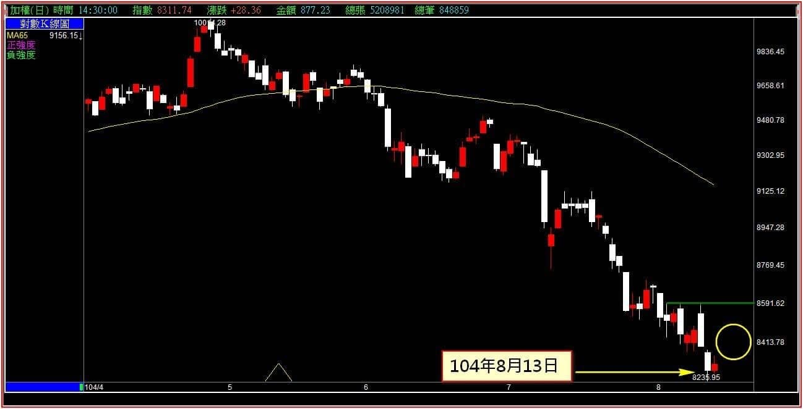
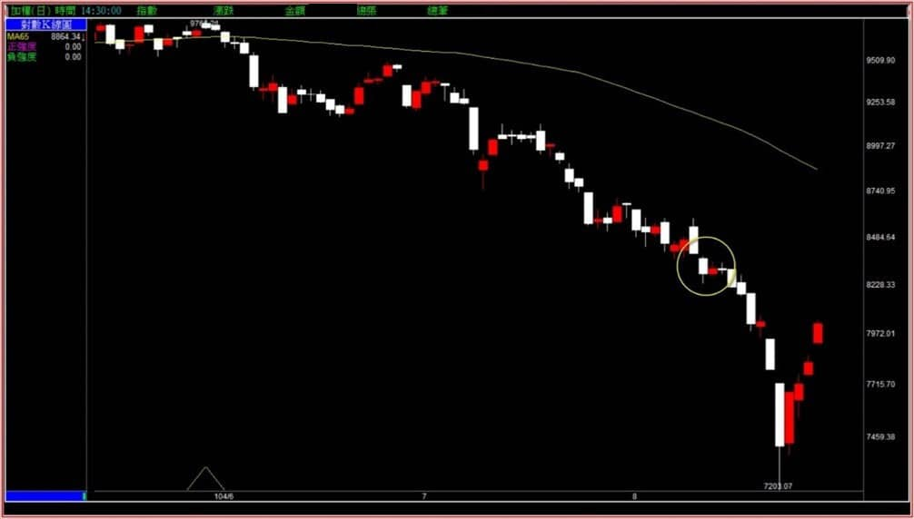

# 【多空轉折】三根K線連續判斷多方力量意義：母子雙星

如果要以「組合K線」的K線數量來作為判斷標準，那麼「母子雙星」這個轉折應該要放在與「跳空」有關的背景下說明，這一點看本文會有更清晰的認知。

可是這樣做卻又與母子晨星的連續判斷脫離太遠，因為母子晨星如果在第二個條件：「收盤站在黑K的中值之上」這一項沒達成，才會再進入有沒有母子雙星成立判斷的必要，少了這個背景就沒有這個轉折。

若第三根成立應該有站在中值之上，但卻又還有細節得一併判斷，所以只能單獨的把這個組合列出說明。

在進入本文講解之前，還是要藉此機會說一下轉折組合的判斷，必須建立在日K線圖才能使用，因為日K線是「連續交易狀態下最長時間的K線」；還有，只有日K線才能看出跳空缺口，跳空，是所有單一K線中最重要的力量判斷來源。

---

**源自於尚未符合定義的母子晨星**

**母子雙星的定義：在低檔區附近的長黑之後，隔日出現孕線走勢，但是收盤價並未站在黑K中值之上，不符合母子晨星。隔天才展開強勢，第三天收盤價站在黑K的中值之上。**

定義的說明文謅謅，簡單的說就是原本母子晨星要站在中值上的這個條件，隔天才完成。以下先透過母子晨星的範例來進一步說明條件的成立狀況。

****104-08-25大盤K線圖****

這張圖片是母子晨星的定義完成，紅K收盤有站在黑K中值之上。請試想如果當天收盤沒有站在黑K中值之上，隔天才勉強完成站上黑K中值這個條件的話，顯然力量上比一根就站上來得弱了。

轉折組合的意義是出場，既然是出場使用，又何須區分強或弱呢？這就是單獨講解母子雙星的原因，以下我們直接透過分解圖範例逐一說明。

**分解圖例一**

上圖的最後兩根紅K，第一根紅K對比前一天的黑K來說是孕線組合，但是並未站上黑K的中值，而第二天開盤就站上了，定義上不符合母子晨星，但是已經達到母子雙星的定義，也就是第二天幫忙完成中值的定義。

**分解圖例二**

完成了母子雙星的轉折意義之後，就等於見到了空方力量的力竭，這是空方出場的轉折意義。不過因為雙星的第二天帶著**跳空缺口**，並不是勉強完成而是帶著跳空上去的力量，所以往往反轉意味較強。

---

**分解圖例三**

上圖是在100年12月的大盤走勢，兩根紅K的第一根一樣是孕線也未越過黑K中值，但是隔日不僅僅超過黑K中值，還大幅的跳空上漲，這個缺口很大，顯示出力量上的意義，比上一個例子還要大。

**分解圖例四**

這兩個例子的狀況都類似，也就是母子雙星的第二天，不僅是超越黑K中值，還都出現向上跳空，也就是說力量呈現的角度來說，出現的跳空缺口越大，多方的力量就越強。

空方的結束不一定是多方的開始，所以轉折意義只是原本趨勢的結束。可是母子雙星因為是兩根紅K線組成，這兩根K線中最強勢的表現就是有著往上跳空，這也是要特別說明母子雙星的原因。

---

**條件的成立與否判斷**

以下是分解圖，方便讀者理解過程實務上K線的變動過程。

**分解圖例五104-08-14大盤K線圖**

上圖的破底黑K出現之後，隔天出現孕線且未達中值。

因為母子晨星的條件未達到，也基於已經對母子雙星的認識，在這一天的收盤就要先有一個認知：假如隔天有站上中值(因為最後一根黑K很短，)要站上並不難，表示轉折意義已經成立。但是由於母子雙星還有一個重要的特點就是如果出現跳空缺口的話，缺口越大，反轉的力道就會越強。

因此，有站上中值與用跳空缺口站上中值以上，這兩種狀況有很大的力量差異在。

**分解圖例六**

實務上當時不僅僅沒有跳空，連中值都沒有站上。

圈圈所示表示隔天並未出現轉折，不僅如此，連中值都沒有站上，也就表示空頭的力道持續的進行中，直到後來的母子晨星出現才力竭。

---

**綜合說明**

轉折組合的要點不是形狀的辨識，而是連續狀態下的判斷。

因此並不是形狀符合代表了某種意義的背誦，而是已知定義之後，對於接下來K線走勢的判斷能力，例如母子雙星的第三根有沒有出現？是否站上中值還是反向創新低？如果沒有出現就是失敗了，那麼K線上就看不出來任何徵兆，只不過是孕線之後又下跌。

再者如果有出現，那是以怎樣的狀態出現？是單純的接了一根紅K？還是有著向上的跳空缺口出現？這裡的跳空當然不是攻擊跳空，而是一般跳空，但是帶著轉折意義的跳空背景是力竭原理，表示股價已經低到市場上的資金沒有要再賣出的意願了，這才是空方力量的竭盡。此時如果出現了向上跳空，就有著不想再讓人有低檔可以買進的意味存在，力量上也因為有著這個跳空的可能，所以單獨一篇來說明。

個股來說比較少見母子雙星，因為往往機不可失，如果市場資金對於股價有著已經超跌的預期，就連紅K吞噬都已經不多見了，何況是母子雙星。經過整理才突破底部區的型態，常常會以「突破盤整格局的突破雙星」的方式來顯現，那是未來我們會談到多根組合時的判斷要點。