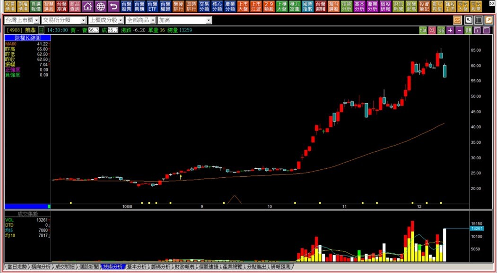
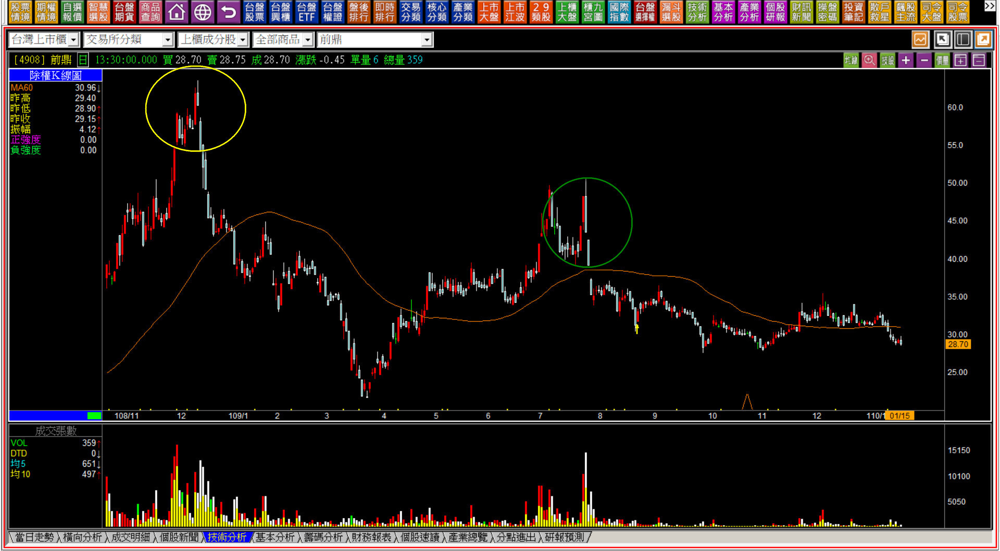
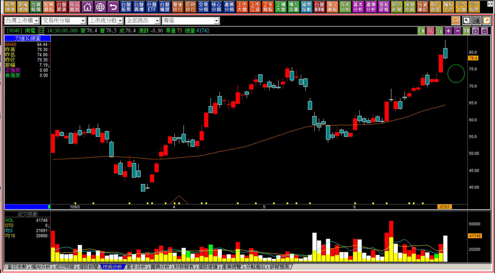
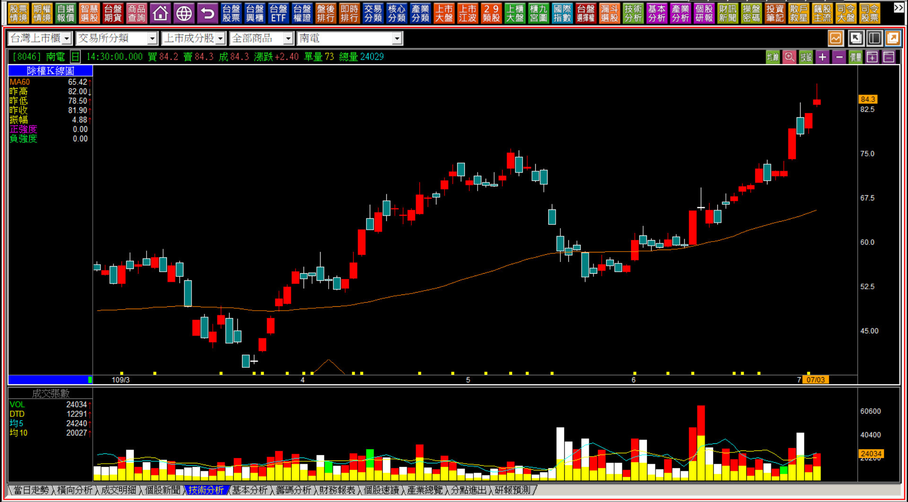
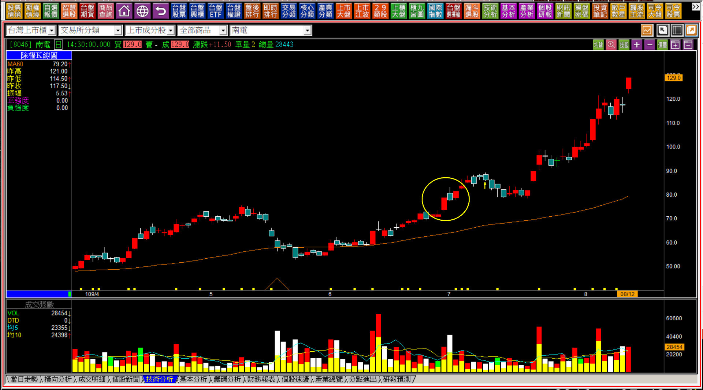

# 【多空轉折】向下跳空出現的影響：跳空反轉與延伸解說

這一篇延續過去談到低檔母子晨星的孕線時，帶到的講解，當時有略為提到跳空反轉，因為市場上往往有把多方反過來當做空方使用的想法，所以有初步的說明。本文將單獨詳細解說跳空反轉，因為這個轉折K線組合，發生的頻率非常高，且容易被誤解。

多方走勢遇到壓力的狀態，K線上有很多種呈現遇壓的方式，為什麼空方結束，轉為多方就沒有這麼多變化種類可以探討？

因為主力也好，法人也罷，真的遇到了千載難逢的超低價機會，不會搞東搞西做姿態，會一次就把要買的部位好好的買完，往往就是長紅K或者隔天往上跳空開高；可是出脫持股狀況就不太相同了，需要做很多假動作，才有辦法順利的在相對高價，盡量賣出手上短期操作的持股，這也就是轉折組合中我們遇到壓力的時候，研判需要有很多類型技巧的原因。

但轉折的角度，我們需要確認原始判斷遇壓的反應，最常見的就是「往下跳空」。

---

**跳空反轉定義：型態像是反向、有著跳空的母子雙星。在相對的高檔區域，前一天仍是長紅K或者創新高格局，但隔日後先出現黑K，再隔日出現跳空向下的缺口，同樣是缺口越大，空方力道越強烈。**

除了黑K吞噬、高檔長黑之外，跳空反轉是個股中最常見的組合型態，原因在於「力量」上的轉變。

**108-12-11前鼎(4908)**

跳空反轉的分解說明是，本來好像有一根長紅或者突破新高的紅K，隔天雖然是日出(也有可能是孕線的黑K)，再隔一天卻開盤往下跳空。

**110-01-15前鼎(4908)**

跳空反轉不一定只出現在創新高的位置，往往有著「表面上看起來強勢」的非創新高時期，也很常出現。K線的意義上就是漲了可是隔天卻出量但是已是黑K，要確認是否短線主力的力量已經利用這一根出場，就看隔天有沒有往下開盤跳空就會有答案。

**跳空反轉示意圖**

可以牢記上圖中兩根黑K的呈現。

這個跳空缺口證實了股價短期已經沒有買盤的力量，否則不會在紅K需要拉抬的力量出現之後，連支撐買盤的力道都沒有的開盤就向下跳，且收盤也無力回補。

跳空反轉的常見程度，幾乎是僅次於黑K吞噬與高檔長黑了；遇壓跳空也可以說是跳空反轉的衍生變化，實務判斷上可以合併使用，只不過跳空反轉比遇壓跳空多了一個股價在創新高時期也會出現。

必須謹記，缺口越大表示反轉的力道越強，這一點與母子雙星的意義相同、方向相反，對於持有者來說，向下跳空越大越難下手處理，但實務K線判斷卻是缺口越小才會越讓人猶豫應該怎樣判斷，因為缺口小較容易回補，缺口大就是更加確認弱勢。

---

**不宜提前動作反應的組合型態**

剛剛學習多空轉折組合的投資人，因為是記憶K線的形狀，往往會有一種看到黑影就開槍的習性。這一文講到的跳空反轉、下一篇要講到的雙鴉躍空，都是很容易因為K線圖可能將會發生轉折，就打算**「提前在定義未完成時」**就趁高賣出的類型，因此延伸的說明有必要分解來細說。

**109-07-01南電(8046)**

學習技術分析的初期，被圖形框住，看到了紅K之後隔天卻是一根日出的單日反轉型態，於是就不想再等隔天有跳空，打算先賣一趟，這是一種預設心理，卻忽略了突破前高要以最後一根紅K假設原理來設定出場點，只擔心股價隔天會跳空，那萬一沒有跳空出現呢？

**109-07-03南電(8046)**

結果隔天不但沒有往下跳空，兩天後還又創新高，這時候就能明白為什麼要等跳空出現再做判斷的原因，不宜提前反應。

**109-08-12南電(8046)**

事後看，當初的猜測現在K線卻是平淡無奇的日出而已，那麼為什麼當時會有這樣的預判？是因為學了轉折誤導的嗎？

並不是，而是右上角是K線圖的百慕達三角洲，很多人都會迷失在K線圖的右上角，因為對於價格漲多了心生恐懼怕跌下來，殊不知股價是沒有辦法預測高點的，可是股價在右上角時，全市場都得要花一樣高的成本才能買進，當有一股力量用力地買在右上角時，持有者卻擔心受怕，明明是獲利中，卻比虧損還要恐懼，是解讀K線圖時最大的障礙。

---

**延伸解說的目的**

轉折組合K線在我的教學範圍中，僅次於比單一根K線略深的組合判斷能力，但這依然只是K線上的基礎，並不深，也不是坊間採用的「進階技巧」形容難度。

市場上的教學所謂的基礎或者進階，那是針對一個教學老師所會的項目設定的，不是因為學生設定。如果這個老師會的最深就是多空轉折，那這個課就變成他的高階課程了。

對於K線的領域來說，判斷「力竭」是入門的學習項目之一，攻擊K線才是變化複雜又多樣的。

所以轉折組合需要延伸解說的原因，是為了避免在股價攻擊的階段，錯誤的判斷造成後面整段行情都錯過，而不是把這個轉折再舉更多例子而已。

讀者需要反覆閱讀一下本篇我要說明的，不僅僅是再講一次跳空反轉的圖型，更重要的容易讓人「想高賣卻錯誤」的盲點之處。

**111-04-01大盤K線的壓力判斷運用**

K線重意不重形，跳空反轉的組合如果不是力竭的背景，而是遇壓的背景，那麼就回到一根K線的角度判斷力量變化，形狀與跳空反轉的組合一樣，唯一的差別是依照力竭原理或者是遇壓的結構，但是答案是相同的。

當遇到了前高的壓力，上一次就是回檔，再往前都是遇壓下跌反應，所以這雖然不被列入多空轉折組合的定義中，可是卻是遇阻的呈現。

這也是我們學習到多空轉折的時候一定要留意的變化，連結其他K線的原理一併判斷使用，並非單一技巧只能在單一位置判斷，畢竟K線圖上最明確的就是壓力。