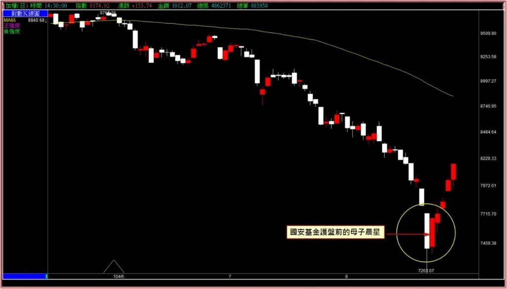
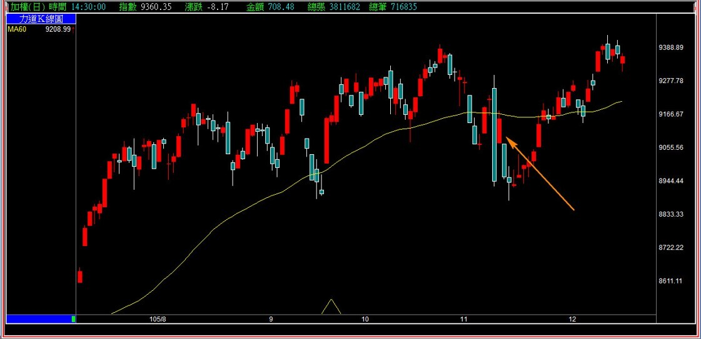
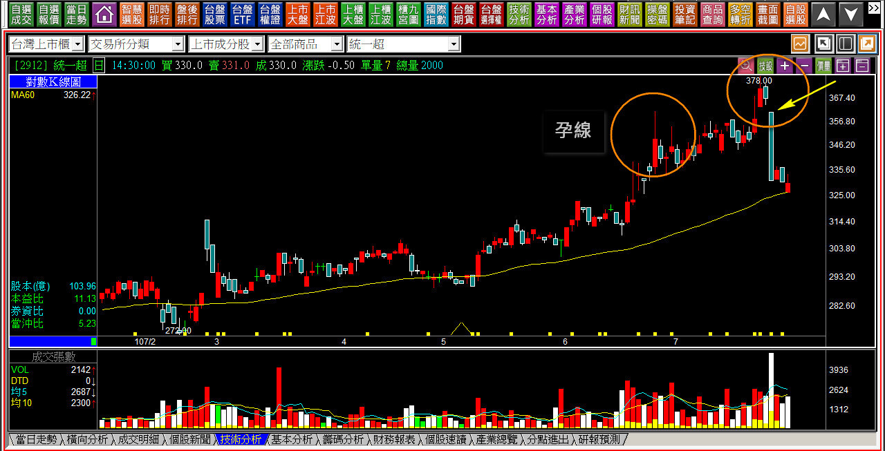

# 孕線在轉折組合中的運用：母子晨星

上一篇談到了包覆線之後，這一篇要來談包覆線的相反狀況，「孕線」在「轉折位置」的運用。孕線的意思是，今日股價的上下震盪範圍都在前一天的高低點之間。

為什麼要強調是在「轉折位置」？因為如果不是出現在新高或者新低附近，那麼孕線的意義就只是「延伸前一天的價格波動，幅度縮小而已」，對於抵抗力量的角度可以稱之為醞釀型態，但並沒有其他特殊方向改變的意義存在。

有很多投資人在學技術分析的時候，會直覺的以為多空相反過來就可以運用。的確，在包覆線的定義中，孕線看起來是定義相反的，可是其中力量的意義並不是相反，一個是買盤沒力了，另外一個卻只是一種物極必反又落到投資價值以下的地板醞釀反彈，所以看起來相反好像可以反向使用，卻只是表面現象如此而已。

但如果總是習慣要反過來看待也以為能使用，往往就會產生判斷上的誤解，孕線因為本身有著醞釀的意義，就常常有這樣誤用的狀況出現。

---

**母子晨星的孕線意義**

在多方轉折的組合中，孕線主要有兩種轉折的型態，一種是母子晨星、另一種是母子雙星。說是兩種，其實是連續性的變化，但有細節不同之處，我們先從母子晨星開始。

**母子晨星定義：在低檔區長黑之後，隔天出現收紅走勢。最高最低點都在前一天黑K的範圍，紅K收盤必須站在前日黑K中值以上，黑K中值以實心黑K計算。**

**104-08-25大盤K線圖**

母子晨星主要是一種醞釀的呈現，因為站上黑K中值代表的是前一天的大跌恐慌殺盤，已經沒有更低價可以買回了，既然是醞釀，又打算呈現轉折，那麼力竭的背景就是必要的條件。

也就是說如果不是先有空方明顯的下跌，就不具備力竭的條件。

**105年11月川普當選後**

如果沒有力竭意義的轉折概念，也就是說，不是在股價空頭、且創新低的狀態下，就算是黑K後面有著孕線走勢，也就不代表轉折意義。

會有這個例子，是因為川普當選後首日，台股下跌長黑，市場正是把三隻黑天鵝的氣氛炒到最熱的時候，不懂轉折源自於力竭意義的教學者，就用單純圖形來解盤。像是先說：母子晨星出現股價要上漲了。結果又跌了兩天破了黑K低點；於是再說：這個轉折跌破了黑K低點所以是母子晨星失敗了，然後指數又繼續往上走，自己混亂也把別人搞混了。

正確的解讀是：當這樣的孕線並沒有出現在空頭低檔，就表示「沒有任何力竭轉折的意義」，也就是說這並不是母子晨星，而是單純的孕線組合而已，而孕線就是延續前一天的走勢震盪，但是區間縮小，沒有其他意思。

---

**錯誤的反過來使用**

**107-07-30統一超(2912)的孕線說明**

市場上有一種說法，就是把母子晨星反過來，放在多頭上漲時期，變成長紅之後黑K孕線，打算要這樣就反過來用當作是高檔的轉折，這是錯誤的認知。

因為當資金往上攻擊的時候，大部分的散戶是不會去追逐漲多了的股票，因此就算是出現了孕線的醞釀，這樣也沒有反轉的意義。因為根本就沒有散戶會想要立刻接手，大資金也沒有必要自己往下殺還要先做個假動作的理由，真要如此那就直接高檔長黑，或者來進入震盪區間，給別人箱底買進箱頂賣出的假象就好。

上圖的第一個圈，就是孕線出現的位置，然而這個組合並沒有轉折向下的意義。

有人會說，那第二個圈不也一樣嗎？可是這次就向下了啊？

其實真正讓股價當時產生反轉的，並不是那兩根組合起來的孕線，而是黑K隔天的跳空，這在轉折組合裡是「跳空反轉」的定義，同時也符合內困翻黑，這些組合都會在未來的篇章中解說。

---

**要點補充說明**

這個組合系列的講解，是透過K線的數量來分類，從兩根到三根再到三根以上，這裡是為了加強說明轉折的意義不是反過來就可以用的，所以才提到跳空反轉(三根K線)，未來在三根的時候才會細解跳空反轉的運用時機與判斷。

另外，母子晨星的定義中，孕線的紅K收盤價要站在黑K中值以上，如果沒有站上，且還是孕線的狀態，那麼就進入了「有沒有母子雙星？」的判斷，但這也是三根K線組合的範圍，未來會在母子雙星的單元解說。

往往我們看到舉例的K線圖，轉折意義出現之後彷彿股價就會反轉向上，其實沒這麼單純，因為這是我們透過K線來判斷方向變化，實務上很可能受到了大盤環境的影響，資金力量薄弱，雖然力竭符合，可是股價一時之間沒有拉抬力道出現，所以依然呈現弱勢。

**111-04-08欣銓(3264)**

定義上符合母子晨星反轉型態，股價也已經低於本益比十倍以下，且公司並非景氣循環股，理論上力竭現象已經開始出現，但是如果市場上就是沒有資金要往上拉抬股價，那麼股價也就不會動。

**111-04-15欣銓(3264)**

實務的走勢，股價三天後又再一次地走出母子晨星的型態。這一次真的見底了嗎？也不是，但是基於轉折組合的是出場的角度，這裡屬於空方的回補出場，沒有翻為多方的意義，是我們在使用轉折K線的時候需要多加留意之處。

技術分析的判別，並不是非多即空、非空即多的。
