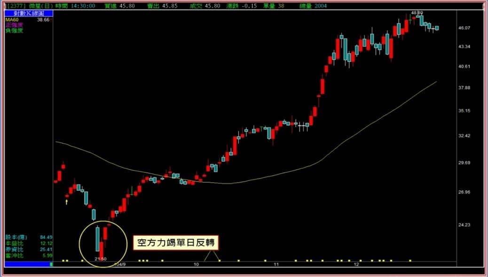
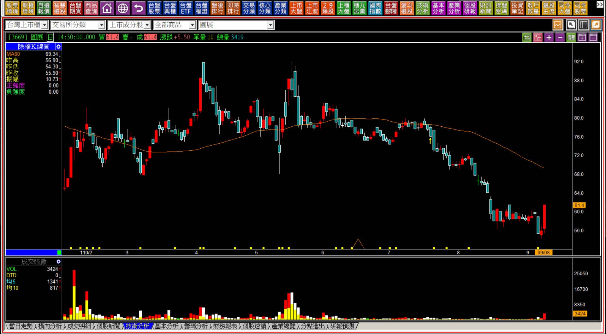
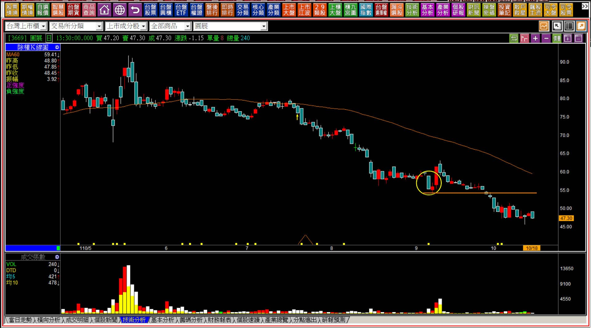
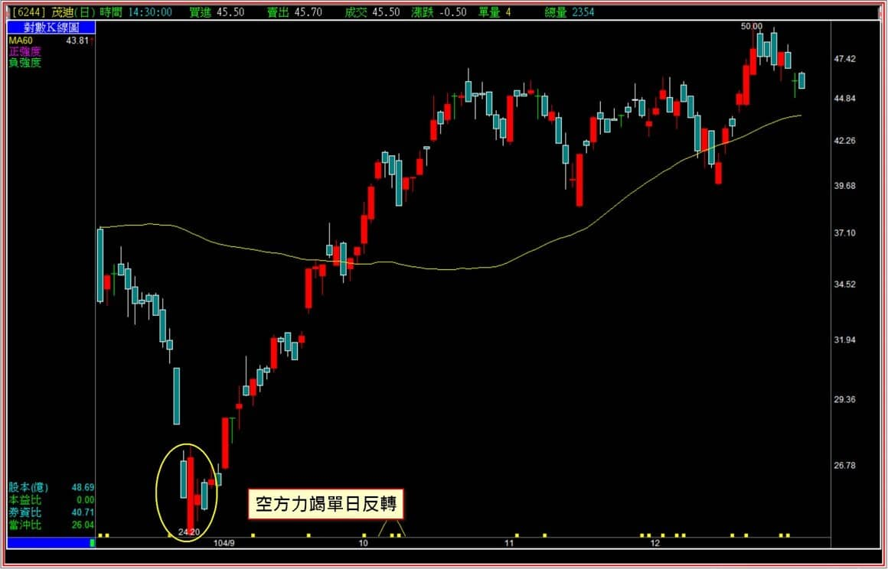

# 【多空轉折】多方單日反轉的實務意義

這一篇作為多空轉折組合的末篇，其實比較是對應上一篇的空方單日反轉而已，因為有著空方的組合，似乎也應該要來談多方的單日反轉。

這一篇內容雖然很單純，但也蘊含著一些判斷的注意事項，所以還是有教學的必要。

**多方單日反轉的定義：在一段持續下跌的空方趨勢背景，長黑K或跳空下跌的黑K之後，股價創新低之後，當日就在盤中強勢回升，收盤價比前一天最低點高。須以隔日轉為日出作為簡易確認，若當日有利空視為強烈訊號 。**

**104年八月份微星的空方跌勢結束位置**

多方單日反轉很單純，就是一個力量不如多頭吞噬的轉折型態，且與空方單日反轉相似之處，就是隔天起股價不能再回到原本的態勢，因此隔天需要的至少是日出。

**多方單日反轉的示意圖**

上圖的重點在於原本的趨勢是空方趨勢，意思是如果沒有這樣的空方趨勢，光是一根黑K後面接著日落的紅K，還沒有任何意義。

談到隔天日出，這只是一個普遍的說法，甚至不可以說隔日確認，因為沒有隔日確認這樣的理論存在，主因就是空方趨勢的表徵，就是無力，多方因為拉抬不動了、轉為賣方了，所以可以呈現力竭；可是空方不一定是賣壓殺盤，也可能是買盤無心無力，既然無力就是沒有，「沒有」是很難判斷確認的。

這是為什麼在多方單日反轉的說明中，無法講到確認的原因。

---

**必要的判斷是不再創新低**

多方單日反轉發生之後，唯一可以判斷的方式，就是股價不再創新低。無關基本面，只要股價再創新低，就表示依然照著多空波動原理的空方前進，那麼，雖然看起來空方已經持續很久了，可是**無力**照樣可以讓股價再繼續往空方前進。

**110-09-08圓展(3669)**

前一天的定義就是多方單日反轉的型態，不僅如此，隔日繼續日出還長紅。

但是這樣就沒有問題當作是確認了嗎？當然不是。以現在的角度來說，只要眼前的「低點不要再跌破」，暫時都可以先視之為反轉的可能，可是股價如果接下來又無力，沒人要買，照樣可以繼續往空方前進。

**110-10-18圓展(3669)**

經過這張圖，相信讀者已經明白為什麼多方單日反轉的組合，不可以單純只用隔日日出來做為確認的原因，這也是技術分析上很獨特的地方：K線技巧不會是把空方的顛倒過來就可以當作多方使用的原因，因為力量的組成不同，上漲需要買盤願意追高的力量才會發生，下跌卻不一定要賣壓沈重，買盤不繼，依然可以繼續下跌。

同時這個例子很具代表性，因為圓展前三季每股盈餘是6.2元，看起來今年頗有8元以上的實力，股價卻在60元附近照樣破底繼續跌。甚至可以跌到50元以下都沒看到止跌點。

這樣就可以讓讀者體會到為什麼沒有辦法用個隔日確認的方式來講解多方單日反轉。

---

**多方單日反轉的注意事項**

當然，也有部分的關鍵是可以運用的，這也是多方單日反轉依然可以存在的原因。

**多方單日反轉通常是因為空方的力竭，也就是賣壓的竭盡，可須搭配季線一併觀察趨勢的變化。但是轉折的意義在於出場，並非進場，因此雖然有判斷力量上的差異，但不是買進股票的意義。**

有兩個角度可以增加反轉的辨識度：

一、單日反轉出現的時候，剛好有利空發生。  
二、接近多頭吞噬的單日反轉，可以視為較強烈的轉折意義，本質是接近貫穿。

利空的發生很常見，不過股市裡這些年都在多頭趨勢之中，即便是今年以來轉空，也還沒有結束，就少有近期的實務案例。前年的疫情大部分的反轉也都沒有遇到個股上的利空，大盤影響的個股空頭，後來都在跌停板的隔天直接開高，因此暫時只用文字說明第一點。

第二點就簡單多了，意思是K線上很像是多頭吞噬，因為實體有出現過包覆，可是定義上還是不完全算，因為沒有整個高低點都包覆，這種狀態的就比單純的收盤價比前一天低點高來得強烈。

**104年八月份茂迪的單日反轉**

與微星同樣的時間，茂迪表現的紅K就包覆了前一天的實體黑K，不過高點沒有比前一天的黑K高。要說這是多頭吞噬，在定義上也可以成立，不過結構上偏多方單日反轉。

不過這也不用深究，因為多方轉折的定義就在於「原本態勢的改變，是作為空方出場使用」，下跌態勢的結束當然就是空方出場位置。我知道有很多人看圖就會覺得這也可以當作多方買進，不過這樣就算是事後論了，對於操作來說不宜。

---

**補充說明**

這篇教學文章的重點在於講解多方單日反轉的**「實務意義」**，比較不像是轉折的教學，實在是因為定義很單純，需要注意的卻不是確認，而是低點有沒有再跌破？所以很像是提醒讀者不可以把這個轉折當作是買進意義使用。

實務上技術分析本來也就沒有「非多即空、非空即多」的這種觀念存在才對。