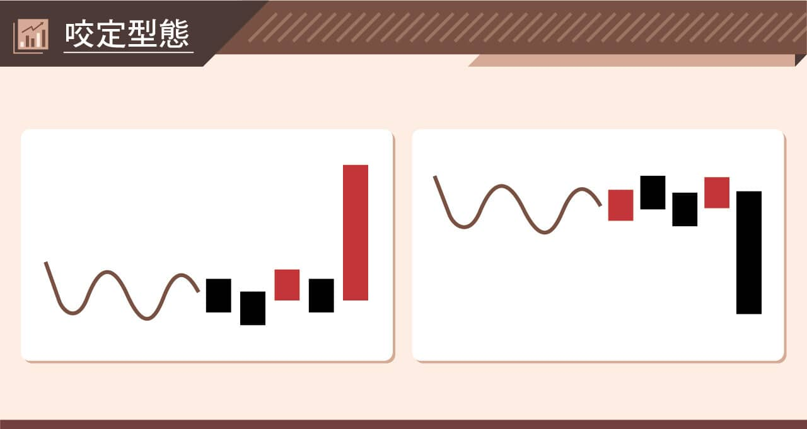
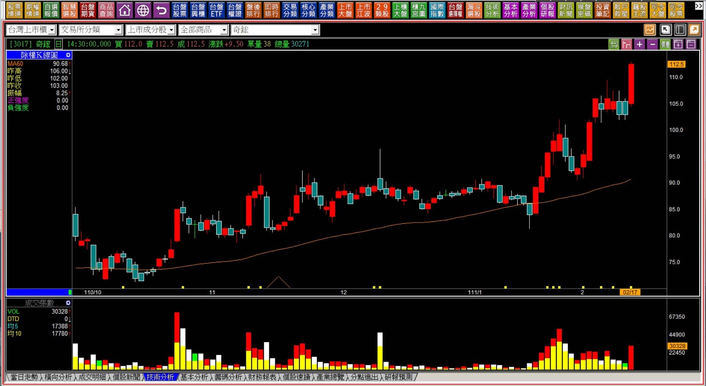
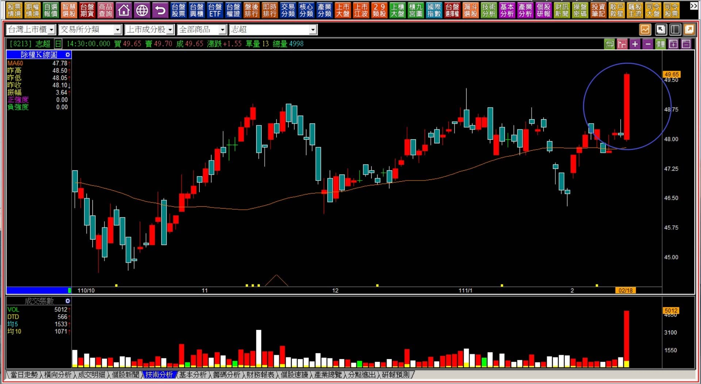
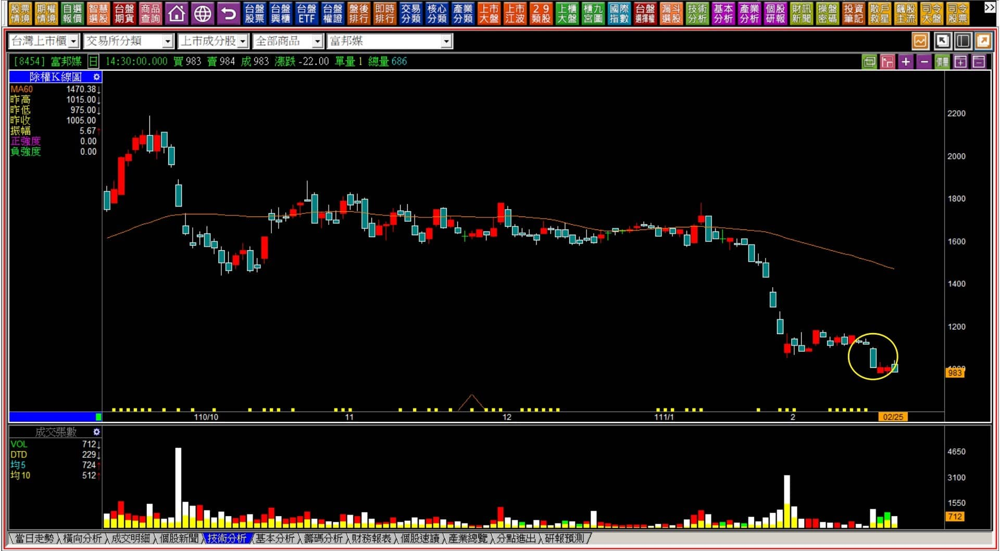
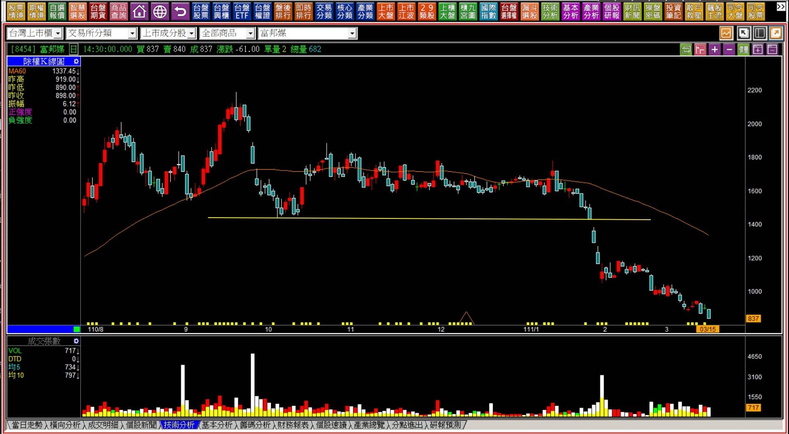

# 【組合K線補充】非轉折組合：咬定型態組合的波動

定義：在短時間內的狹幅整理，突然出現了一個方向性的力量型K線，不一定與原本的趨勢逆向，而是突破或者是跌破盤整區間的意義。

時機：不論原本的趨勢如何，眼前的這一根必須是力量型K線，且之前必須要經過一週以上的狹幅整理，因為這代表著至少週均線會往上。這是原本短期整理趨勢的結束意義，若要考量股價是否進入拉抬，得評估過往的股價壓力位置與狀態，以及有沒有往上出現攻擊型態的K線；若要評估股價是否進入空方趨勢，還是要評估頸線、波動狀態下的前低是否被跌破。

---

---

**範例與說明**

咬定型態的名稱來自於一口咬定，意思是一根K線決定了近期的盤整狀況，到底市場資金是打算怎樣反應。以多方的角度來說，型態很接近突破雙星的轉折組合，但不同之處是背景定義沒有那麼嚴謹，只需要過去是處在相對狹幅的整理區間即可，意義也不一定是空轉多，也同樣有可能在多方進行一段時間之後，變成橫向的壓縮整理之後，再拉出紅K，這樣的話就很貼近攻擊K線中的高檔狹幅整理型態。

黑K跌破的角度就沒有這麼複雜，因為黑K的本身帶來的就是套牢意義，也就是這根黑K讓過去這段時間的進場者股價都被套了，形成明顯的短期套牢區。轉折組合中的暗夜雙星型態，是在多頭趨勢明顯出現高點之後，長黑摜破併排，但沒有討論到週線有沒有馬上下彎。

這裡談的咬定型態黑K，指的是眼前的趨勢不一定是在多頭狀態，也可能是空頭之後整理一段時間再殺出長黑K，這樣的意義就貼近於下降三法。

**111-02-17奇鋐(3017)**

原本的趨勢是在多頭之中，定義上是橫向的走勢之後，再出現一根紅K突破了小段區間。這根K線出現之前，在攻擊的研判中屬於高檔狹幅整理型態，是醞釀階段的一種呈現，短線買攻擊而已經持有的人，等待的就是這根咬定長紅。

咬定的名稱來自於形狀上的意義，也就這段時間內因為獲利了結而出場的人，也已經沒有機會再看到低檔能買回。

多方的咬定型態組合，結合了攻擊整理型態、上升三法中的醞釀意義，所以可以自成一個強勢走勢的型態，對於多方操作者來說，能夠判斷得出來會對股市的操作更加具備信心。

**111-02-18志超(8213)**

倘若遇到了中期區間的整理並不是狹幅，而是有比較大幅度的波動，邏輯判斷與突破、攻擊相同，雖然組合上比較接近型態學的突破頸線，單純用趨勢轉為多方就可以看得出來，不過因為拉長時間會發現這些整理的幅度也只算是小的區間，只不過放大了近期的走勢，K線圖會感覺震盪很大而已。

咬定型態主要的意義，就在於未來的短期方向被一根力量型K線所決定。

**補充說明：往往我們選擇個股交易，具備力量意義的，相對於大盤背景風險較小，也就是萬一遇到大盤走勢疲弱，有著咬定力量的個股抗跌力也相對較強。因為買低檔的就等於是買沒有力量的，那麼無力的往往遇到盤面不佳只會更無力。**

**也就是說，咬定型態是用來判斷力量，不是用來當作買賣進出點，對於力量辨識有需求的人，對於風險狀態有體認的人，這是重要的型態。**

---

**111-02-25富邦媒(8454)**

原本就已經轉為空頭的走勢，進入了一週以上的橫向之後，又再次被黑K咬定，雖然K線圖上並未畫上五日線，但懂得原理的人都看得出來五日線已經被這根咬定型態帶著彎下去。

定義上並非頸線跌破，因為頸線早就破了，而是黑K摜破橫盤小幅的區間，力量上屬於極弱的走勢。人們往往先入為主的認為股價跌深了總會有反彈，這話沒有錯誤，唯一的缺點就是不知道反彈會出現在哪一天，持有者撐不撐得到那天的來臨，這是看待K線要從力量的角度去判斷的主因，不能用賭的心態來面對空頭趨勢的現在進行式。

**111-03-15富邦媒(8454)**

****

對於套牢者來說，一切噩夢都還沒有結束，趨勢已經事先證明了方向，咬定型態再確認力量上的證據，然後股價理所當然的不斷創新低。

咬定型態沒有買點與賣點的意義，而是繼續持有與否、繼續空手觀望與否的依據，重點在於力量的發現與體會，實務運用上會更加明白功用。