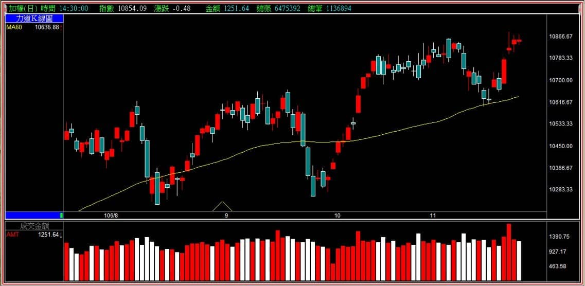
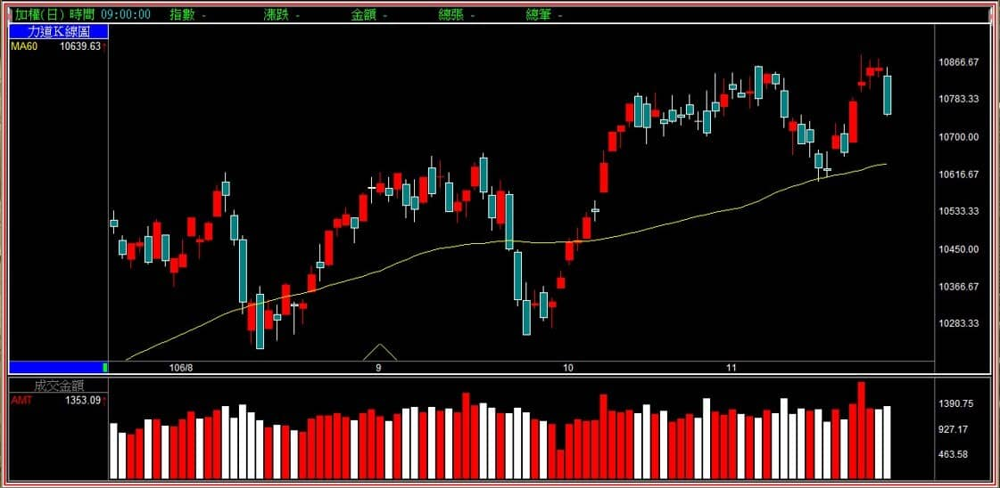
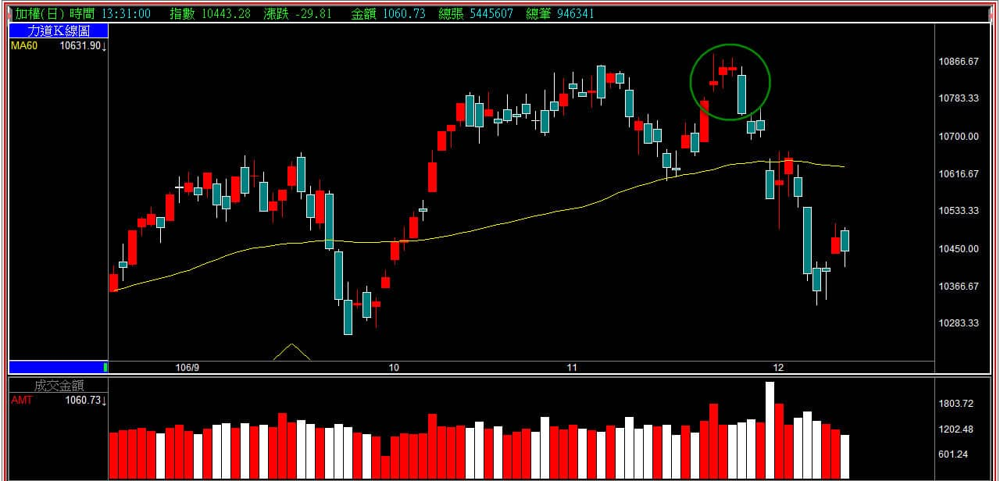
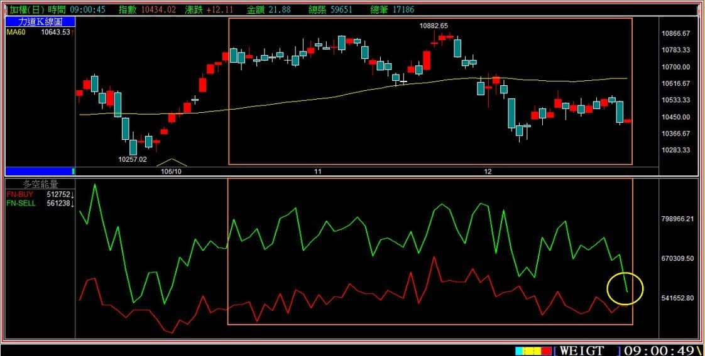
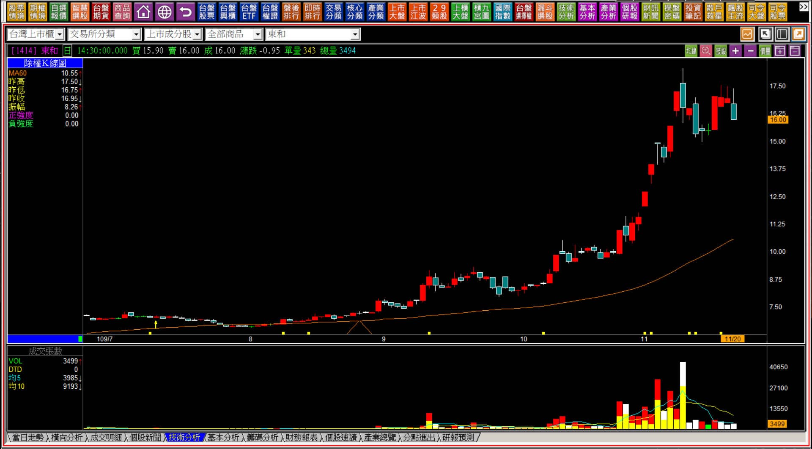
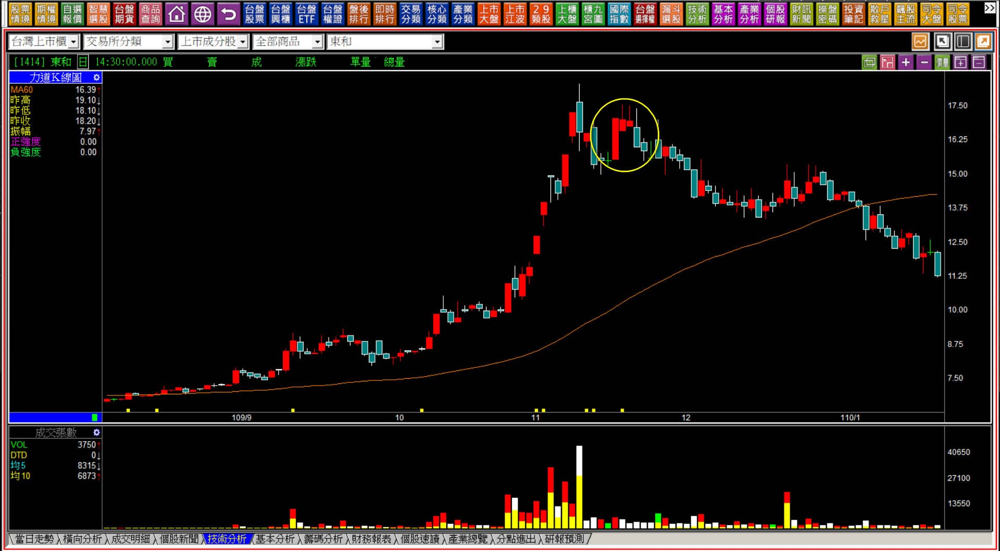

# 【多空轉折】三根K線連續判斷阻礙力量出現：大敵當前

「組合K線」的K線數量來到三根合併研判之後，變得解說複雜且多樣化，特別是多方力竭的狀態，一般投資人因為學習技術分析的目的是想找買賣點，所以對於組合K線並沒有太大的耐心了解「力量的竭盡與否」，只想盡快地找到「是不是要買、該不該賣、可不可以放空」的這些結論，這個心態也會導致於只想找簡易的標準說法，忽略了力量變化的研判。

大敵當前的部分範例源自於上一篇的說明，可以先參考一下前文，或者本篇解說閱讀之後，再複習前文可以達到更加完整的概念。

---

**大敵當前的力量定義**

名稱上就可以看出，「大敵當前」的意思就是有著阻礙擋住多方的背景之下，我們需要判斷有沒有意願往上拉，如果沒有就表示阻礙成功，也等於多方力量的竭盡。

**大敵當前的定義：長紅之後，再出現連續兩根紅K，依然無法將行情拉開，且之後盤中就跌破第一根紅K中值。由於已有三根紅K，表示多方屢攻不過，因此跌破中值已算第三天無力，通常這樣的組合出現在多頭漲勢遇到了高檔壓力區，屬於遇壓的走勢。**

上述的定義中，長紅出現之後，再往上就遇到了過往的壓力區。

因此大敵當前雖然出現在多方趨勢中，但通常是先回檔之後才又反彈往上會出現的組合，並不是在空方趨勢的反彈後判斷，因為空方趨勢的反彈如果遇到了壓力區往往會直接跌下來，並不需要多空轉折組合作判斷。

另外，「遇壓跳空」指的一樣是上漲之後，短期看來強勢，卻在紅K出現不久之後有著往下跳空的呈現，或者符合跳空反轉的定義。

**106-11-24大盤K線圖**

這一個例子是大敵當前的變形走勢。

會說是變形的原因在於紅K之後遇到了前高的壓力，接續出現沒有拉開幅度的並不是兩根紅K，而是三根，這也是「K線重意不重形」的最佳範例，必須先了解為什麼大敵當前有著轉折的意義？是因為長紅K遇到了前壓，接下來要判斷會不會繼續往上越過壓力？然而連續的紅K都沒有越過。

所以是不是兩根，不需要被定義制約，而是體會力量遇到的阻礙。

**106-11-27大盤K線圖**

依據大敵當前的定義上，大敵當前是跌破長紅K的中值，不過重意不重形也在此再發揮判斷的效果，因為這根黑K雖然還沒有跌破紅K中值，卻把眼前最近的一次向上跳空缺口跌破，一樣顯示力量的退卻，當然，如要等到隔天中值跌破再視為確認也是可以。

**106-12-12大盤K線圖**

這張圖就能讓大家看得懂為什麼大敵當前代表轉折的意義，力量的變化不一定是當天就會顯現。

這個例子發生的時間點，就在我為先探撰寫教學專欄的第一篇，相信有很多讀者都還印象深刻，這才發現原來K線能夠呈現的力量意義比我們以為的還要清楚。

📌推薦訂閱連結：[**K線可以做到的事(1965期)**](https://www.pressplay.cc/project/vippPage/K%E7%B7%9A%E5%8F%AF%E4%BB%A5%E5%81%9A%E5%88%B0%E7%9A%84%E4%BA%8B1965~/736BAB6190821052BECD77C5CD4B12E4)

**106-12-27大盤K線圖與多空能量**

大盤不會像是個股一樣的靈敏，且下跌這支個股可以用別支個股漲上去帶動指數。而股價下跌只能等待到什麼地方才停止，所以大盤的角度與個股的結構依然有不同之處。

這張圖是結合了「開盤多空能量」賣壓極端值低的判斷。

我們的文章教學中並未對多空能量著墨太多，因為多空能量需要實體課程才有辦法講解完整。這裡要說的只不過是讓讀者知道依然有辦法判斷大盤的轉折位置，重點要先理解轉折組合，這是基礎功。

不諱言的，早期教學的時候，一開始我看著市場上的教學者把轉折組合講得好像很進階很深，但其實對於K線的判斷，轉折組合只算是頗基本的能力，比單一根K線的深度再大一點點而已，並不算是進階課程。

很多人以為組合K線是很深的學問，其實不然，只不過是大多數人忽略了透過力量的變化、力竭的原理來看待股價而已，這樣就會進入形狀記憶，會在更多細節變化之處感覺到困惑。

---

**再次複習前文範例**

重新回到上一篇談到的東和，個股對於壓力區呈現的反應，靈敏度會比大盤還要高，但是在多頭階段的變化，往往也是一樣，連續的紅K之後卻沒有辦法把行情拉開，加上遇到前壓，在東和的例子是高點壓力在大敵當前出現時，一週以前的高點。

**109-11-20東和(1414)**

所以當股價跌破了長紅中值，就表示大敵當前的定義已經成立，意思是股價的上揚遇到了阻礙，這個阻礙，跟成交量無關，是力量的變化。

主要是因為一週前已經開始有了獲利了結賣壓，長紅遇到了主力當初是有高出一些的心態，這裡就更明確的遇到了賣盤的壓力，尤其是前高黑K帶著大量，表示那個位置已經被出脫不少，套著的人往往是拉回又承接的短線客。

**110-01-20東和(1414)**

回顧大敵當前的位置，也需要更加留意轉折組合的使用意義是用在多單的出場，不因為事後看股價下跌了，就覺得當初也是可以放空。

隔年五月初，東和一度拉高才又出現高檔長黑，不過兩根K線的單純組合，不在本篇探討的範圍。

大敵當前的關鍵成立位置，就是紅K中值，跌破就代表紅K的上漲力量已經消失，尤其是在股價多頭的狀態，高價本來就不會是散戶用力追逐的位置(散戶往往等拉回當天才會接)，卻自己跌破，所以這是確認條件時，不需要等待收盤的原因。

---

**綜合說明**

以大敵當前的組合型態來看，的確轉折組合很容易讓投資人學習的時候記憶圖型，不過更重要的是力量上的判斷，架構在真心要攻擊不至於又先拉回讓散戶有低可買，這一點在每個組合的判斷原理來說都是一樣的。

大敵當前往往與紅K陷阱一併討論，但是紅K陷阱不一定出現在多頭格局之後，常常是中低價股因為市場的氛圍，走勢被帶動的強勢，卻又拉不開股價的距離，或者明顯的紅K之後，隔日又開低長成紅K，邏輯與原理和大敵當前相近。