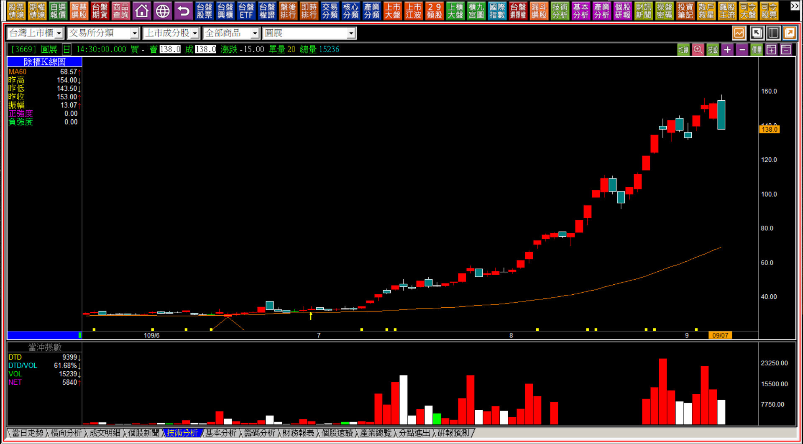
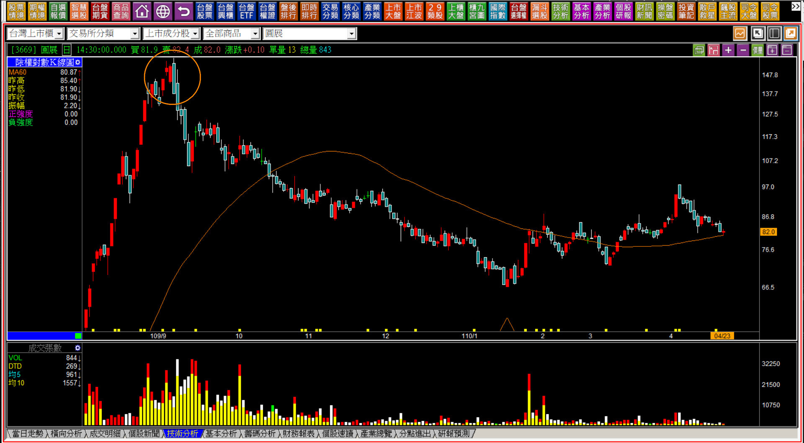

# 多空轉折組合的觀念與關鍵K線前言篇

學習轉折組合之前，一定要知道的名詞定義就是【日出】與【日落】。

所謂的日出指的是一根K線高點與低點都比前一天高，日落指的是高點低點都各自比前一天的高點低點還要低，連續的日出稱為日出型態、連續的日落稱為日落型態。

這是名詞的定義，無關趨勢，也無關進出買賣點的判斷。

---

**【前言】**

對於多空轉折，市場上教學的人不少，但往往因為配合投資人的想要，所以逐漸形成從多轉空或者空轉多的關鍵位置，進一步加入買賣放空回補點的想法，誤以為多方出場之後還能順便放空，或者空單回補之後還順便翻多的誤解。

實務上的使用，多空轉折組合K線，因為基於「力竭」的原理，也就是力量的竭盡，因此做為出場判斷使用，這個出場在多方組合中，是空單的出場，並沒有可以直接翻多的意思；在空方組合中，是多單的出場，當然不代表還可以放空。

有些教學期貨交易的講師，很單純的把這些轉折組合當作是反向的進場標準，這是沒有邏輯依據的作法，往往力量的竭盡與反向的抵抗，還是有明顯的界線，這是做為轉折組合的講解之外，我們還另外搭配非轉折組合篇章的原因，因為「力竭」與「抵抗」，還是需要辨別清楚不同時機的使用方法。

---

**【K線沒有預測的功能】**

很多人因為缺少了對力量的基本觀念，所以往往學了K線與技術分析之後，從此就糾結在形狀與顏色的記憶中，還是忘不了對「預測未來」的期望，因此在判斷上頻頻遇到問題。

因為K線圖本來就沒有預測的功能，因此盯著文字定義的說明，鑽研在文字裡然後對照圖片來思索。這個思考模式進行時間久了，就會帶來一個必然的結果，越想越細越吹毛求疵，反而忽略了「多空力量變化」上的體會。

技術分析兩大原理：「成本原理」、「多空力量變化原理」。

型態學中的頸線，就是透過成本原理建立，因為先有賣壓化解階段需要經過，而賣壓化解需要資金的力量克服賣壓，所以成本原理意義指的是「拉抬者的成本」，並不是投資人自己買進的成本。

另外，「多空力量變化原理」指的是多方的資金拉抬股價到了某一個階段後，不但沒有繼續往上拉，還把持股倒出來，這裡就是多空力量變化出現的位置，也是多空轉折組合的原理依據力竭的所在。

此處要先知道，買進股票屬於進場、放空股票也屬於進場；當有獲利空間後，多方部位的賣出股票屬於出場、空方部位的回補空單也屬於出場，這就是進出場的觀念。「不同方向之間，沒有需要連結的必要」。

K線多空轉折組合是判斷出場的角度為主，因此進場除了攻擊K線之外，就是型態學中的「化解賣壓」的方式，這是型態學單元的學習主題。

---

人們在學習新觀念新領域，都會非常想要把所有的內容做出分類，然後完全理解才覺得組織架構就完善了，這是一般人的學習邏輯，從架構開始。所以常常我們會聽到「五大買進股票的要點」、「三招化解短線交易的障礙」、「輕鬆五招戰勝當沖交易」，這些名詞往往會讓文章變得更吸引人，就是這個原因。所以講到了多空轉折組合，人們通常就會想要一網打盡，想把所有的轉折都要納入再來慢慢分類，彷彿這樣可以提高勝率，其實對於K線學習來說這並非正確的思維。

正確的思維應該是先建立在「不宜進場的股票走勢」判斷做為起點，然後每遇到一種能讓你理解的轉折變化，就體會為什麼這會是轉折的判斷點，慢慢累積實戰才會日起有功。

舉例來說「暗夜雙星」，這個名字的關鍵在**「雙」**字，也就是兩根並排的K線代表的意義是什麼？在多方趨勢的階段，為什麼會出現並排狀況？例如兩根紅K的出現，第一根已經是再創新高了，那麼為什麼第二天會再度開低變成並排？雖然結果又是一根紅K，卻沒有把價格拉上去。

然後，一根長黑卻直接摜破了這兩根紅K的低點。

**109-09-07圓展(3669)的暗夜雙星**

形狀記憶的方法，對於力量的判斷是沒有用的，學習的時候的確是可以用這個記憶方式來跨入轉折領域沒有錯，但是如果要懂力量的判斷，就得要透過力量變化來理解，不會是使用K線的顏色記憶。

當初轉折出現的時候，最重要的重點就是一眼能辨別「不宜進場的股票走勢」，當然也就是多單持有者應該要出場的意思。

**110-04-23圓展(3669)**

散戶的思維往往想要低買，會參考以前的高價，心理學稱之為「比較效應」，好像現在的低價就是撿便宜的機會，這是完全錯誤的觀念。有這樣的觀念一定要盡快的調整，不要把資金放在現在「根本沒有拉抬意圖」的股票中。

---

**【操作與投資應該展現耐心之處】**

網路上有些新聞報導關於投資人應對行情的心態，往往散戶買進了股票被套之後，說出「先擺著一個月之後再看看」的想法，這種當然是純散戶的思維。

人們往往賺錢的時候抱不住。套牢虧損狀態中，心情卻異常穩定，這是操作投資的大盲點。真正影響操作績效的，是獲利狀態中因為想要盡快實現，所以抱不住，耐心應該要展現在這個地方；是先有攻擊力量的判斷，然後攻擊力量尚未確認結束之前，應該要保持耐心直到攻擊結束。

並不是「沒有攻擊力量的股票，在那邊等待股價的浮沉直到解套為止。」

這一篇作為多空轉折K線的觀念與前言，我認為是很重要的觀念與思維，這一點若真的能夠理解與克服，往往已經解決交易上的疏失問題超過一半，值得大家反覆思索。
