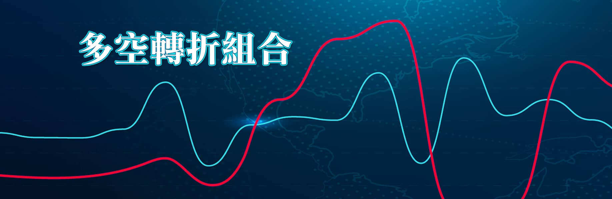

# 【多空轉折】組合K線進階教學目錄

---

⭕️（本方案已經暫停公開販售，如有意購買，請私訊給我提供您購買連結，謝謝）

在進入多空轉折的學習之前，建議要先學習【K線力量判斷入門】方案

這是從實體課程演化而來的教學文章，主題鎖定在多空轉折組合，輔以補充篇非轉折組合，用來協助交易判斷時，多空力量變化的關鍵位置。

K線的組合判斷源自於酒田戰法。

K線又稱之為陰陽線，源自日本，創造者叫做本間宗久，在十七世紀時創作者為本間宗久，三個多世紀以來，透過後人的研究與推演，逐漸演變成今天網路或者書籍中所說的酒田戰法。有很多人誤以為酒田指的是人名，事實上酒田這個名字只是用來紀念本間宗久的出生地：山形縣酒田市。

酒田戰法原本是為了記錄米市的價格變化，這個價格紀錄對於行情的波動、天候、戰爭、大戶心理等等因素都可以藉此研判交易狀況，後人進一步在他的著作阪田戰法衍生出現在的酒田戰法。在當初沒有電腦的時代，酒田戰法並沒有圖形，是一百多條條文式的紀載，這就表示所有的圖形，都是後人自己加上去的。

昭和年間日本人將這些紀錄出版成為圖形版本濃縮為78條，再逐漸演變成今日K線戰法，名稱也沿用。

---

## 自序

教學是我的工作，也是興趣，站在講台上如果可以透過實體課程的形式，把所學所會的呈現，特別是細節上的解說，用講解對比的方式來做，是很開心且愉快的方式，也由於實體課程的獨特性依然存在，這是我從不打算把課程變為線上教學的主因。

不過自從加入了Pressplay的閱讀學習模式之後，這幾年也漸漸的練就了用文字來教學的實力，因此經過了長時間的累積之後，便轉念透過文章的教學方式，把基礎的K線技巧一一的撰寫出來。

是的，對於我的教學來說，多空轉折組合只是很基礎的K線技巧，雖然有不少教學者把轉折當作是進階甚至是高階的內容，但是實務上的判斷，我認為攻擊K線才是最困難、當沖交易才是最複雜的學問，而多空轉折組合只是基本一定要會的型態判斷，對於投資者的角度來說，多空轉折是用來趨吉避凶的能力，例如**一眼辨別不能進場的K線型態**，這是最基本的操作認知。

師承券商自營部操盤人，當初師傅的教學並不是系統化的順序教授，只是看到什麼教我什麼的方式，反而讓我練就不被框架拘束的思考與判斷邏輯。往往投資人進入K線的領域或者學習技術分析，是因為操作股票不順心才打算開始，而一般人開始的方式就是買書自學，所以進入了一根、兩根、三根；基礎、進階、高階的思維邏輯在面對K線判斷。但是實務的股市交易沒有順序可言，股價的波動並不是依照簡單到困難，而是全面性的混合出現力量的變化，需要各種角度都得運用，就像是轉折的過程不能捨棄均線，趨勢的判斷不能忘記攻擊要素，型態不能一廂情願，都是面臨市場交易時的重要觀念。

技術分析中K線的判斷，與中國文學的境界相同，常常需要見山是山，變成見山不是山，然後又轉化回見山又是山的境界，有深度卻最後又反璞歸真，加上電腦軟體呈現的缺陷，使得許多說法不能成為技術分析的線索，例如仰角45度攻擊，軟體根本就無法做到，因為區間放大與縮小都可以讓角度改變；許多見解必須要有，例如創新高的當日股價會在K線圖的右上角；重要觀念得知道，股價沒有低點，空方趨勢可以讓股價低還有更低，10元的股價依然可以跌幅再出現八成。

股市投資已經是所有金融商品中，僅次於債券，風險最低的投資工具了，要進入股市就不能只管自己想要的模式，總想買低才能賣高，價值投資又期望買進之後股價馬上漲，人心的盲點往往是投資中最大的阻礙，必須具備判斷的實力，不論是基本分析或者技術分析皆如此。

K線是技術分析的最根本，這也是我們一定要學習的方向，只有具備足以相信自己的實力，交易與投資才有可能更順心，這是透過教學的角度可以讓人體會到的境界。

---

## 多空轉折組合K線目錄

### 【多空轉折篇】

1. [多空轉折組合的觀念與關鍵K線前言篇](B2E7A4597B7D1B50CF88163C892204D1_duokong-zhuanzhé-qiányán.md)
2. [包覆線在轉折組合中的運用：空頭吞噬與多頭吞噬](E79401532D60CC63B302926C2C33FB50_baofuxian-kongtonshi-duotonshi.md)
3. [孕線在轉折組合中的運用：母子晨星](978854A6B0757492FB6A99F8E92A41EC_yunxian-mùzi-chénxīng.md)
4. [高檔下影線與低檔上影線：高檔吊首](666C90D7BC58F0E0E9629CAD711FD56F_gaodang-diaoshow.md)
5. [三根K線連續判斷多方力量意義：母子雙星](8303539A2CA4AC0E8FEB24E68BABF933_sangen-mùzi-shuāngxīng.md)
6. [三根K線連續判斷阻礙力量出現：大敵當前](AF12D42CF0CF4600F29D9C4ACA41C5B7_sangen-dadi-dangqian.md)
7. [三根K線連續判斷阻礙力量的行動：暗夜雙星](426EAB98127A5370FC83CB5983BDA385_sangen-ànye-shuāngxīng.md)
8. [向下跳空出現的影響：跳空反轉與延伸解說](92E64EAB9982ADE91CB903046E5FA04F_xiàxia-tiàokōng-fǎnzhuǎn.md)
9. [向下跳空形成的壓力：雙鴉躍空與延伸解說](13041D9897DBD12852724CAD0D994486_shuāngyā-yuèkōng.md)
10. [三根K線連續判斷突破整理區間的力量：突破雙星](EDFE0FB85503F88DFB6696C9EACA00D4_sangen-tupò-shuāngxīng.md)
11. [三根K線連續判斷在十字線之後：夜星棄嬰](3F9C5C8C7B81C89FBCA2970EF1855997_sangen-yèxīng-qìyīng.md)
12. [三根K線連續判斷十字線之後：夜星與島狀反轉](6C03240289991A8B7F5D99C5DC2409D5_sangen-yèxīng-dǎozhuàng.md)
13. [三根K線連續判斷十字線之後：晨星與島狀反轉](29F3734E9FE458A7138B770EB29C29F8_sangen-chénxīng-dǎozhuàng.md)
14. [黑三兵與外側三黑的組合判斷](71B4F99819BB5207A78994BEC40FC79D_hēi-sānbīng-wàicè.md)
15. [空方單日反轉的定義與日出日落](5FCAA3846B5C453F95D59CBFE7ECEE20_kōngfāng-dānarì-fǎnzhuǎn.md)
16. [多方單日反轉的實務意義](9D8B76607439F24FB8AD2026044D988B_duōfāng-dānarì-fǎnzhuǎn.md)

### 【非轉折組合補充篇】

17. [前言與K線的類別](24890BBD457BF5A2E1B0A8E33390DDA6_fei-zhuanzhé-qiányán.md)
18. [包覆型態組合的意義](2BA211D9CB1514E34D087249F9D627B7_bāofù-xíngtài.md)
19. [貫穿型態組合的力量](53E0BA326CBB753118E3F8C6232F7F0F_guànchuān-xíngtài.md)
20. [懷抱型態組合的分類](161D653D96BB64939DE424B8B5162815_huáibào-xíngtài.md)
21. [遭遇型態組合的變化](4A2519730555027A6612FC9C77BE51FB_zāoyù-xíngtài.md)
22. [反撲型態組合的辨別](207FAB90A1222E9DCD7CCE2A26AB19B7_fǎnpū-xíngtài.md)
23. [內困型態組合的要點](EBD01861796168390992499149DFE0EE_nèikùn-xíngtài.md)
24. [咬定型態組合的波動](A5C5E3F242DCE38F0E9061E3FBC85B81_yǎodìng-xíngtài.md)
25. [升降組合型態的應用](0B1DD310D7685EE74123E5147BB7CFB2_shēngjiàng-xíngtài.md)
26. [上下缺回補型態組合的輔助](5CB9CD820B2BEF0AC861FFEDB89CD6B0_shàngxia-quē-huíbǔ.md)

---

出刊時間早上7：00，11/1起隔一日出刊。
