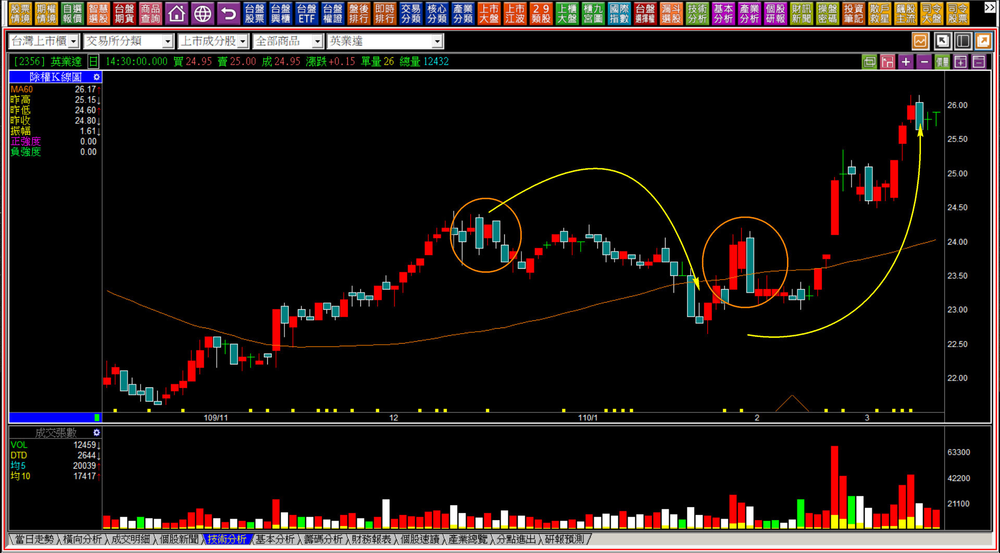
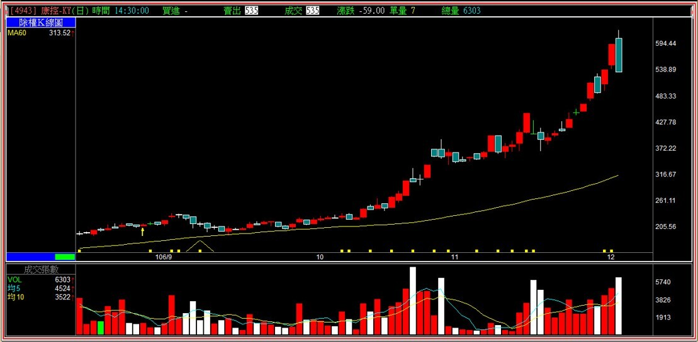
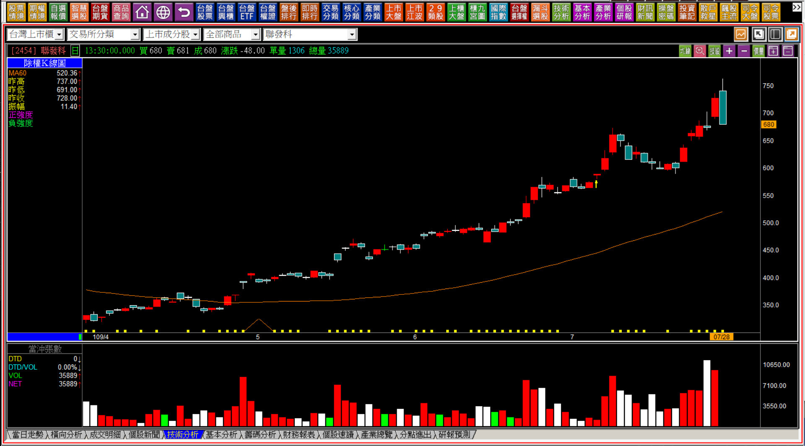
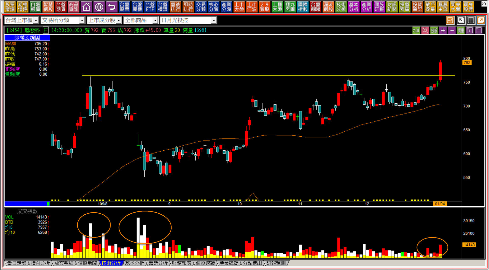
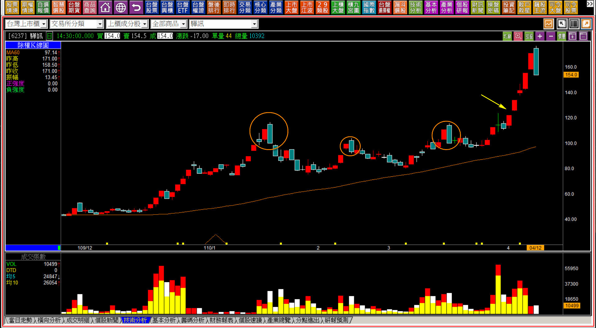
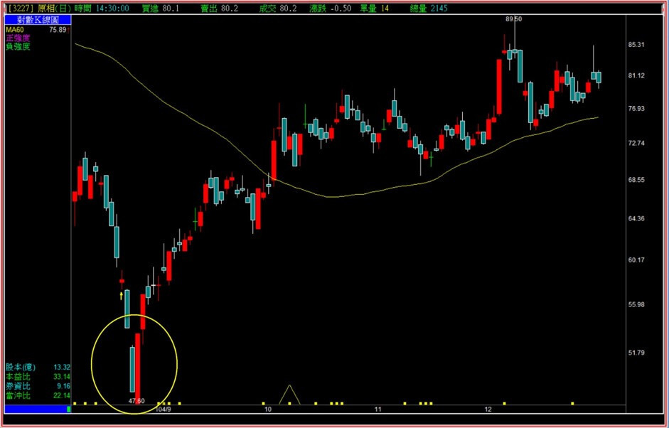
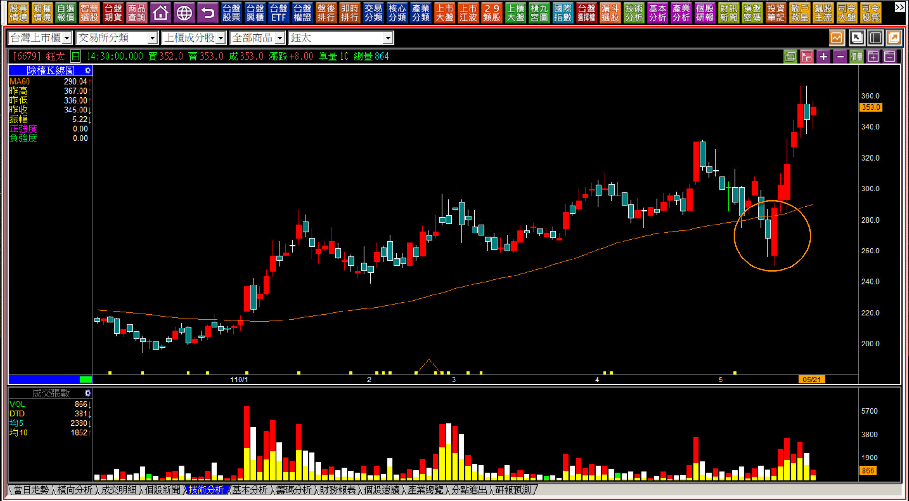

# 包覆線在轉折組合中的運用：空頭吞噬與多頭吞噬

接下來要正式進入**「多空轉折組合K線」**的教學範圍，不過編排的順序並不會依照多空先後順序個別一一講解，而是依照組合K線的數量、多空變化理解順序的難易度一併說明。會先從兩根K線的關係開始，然後再慢慢進入三根、四根以上的合併K線。數量較多的組合K線轉折判斷就會比較少，因為當K線數量多的時候，往往是併入K線的短中期型態一起判斷。

**多空轉折的三大重要觀念：**

**一、轉折組合採用的是力竭原理，也就是力量的竭盡，並不是隨便找個位置，再用兩根K線的形狀就當作判斷。**

**二、紅K的形成需要買盤在當日不計代價的追高才能成型，可是黑K並不一定是賣壓沉重的殺盤，股價低檔沒有買盤意願也可以形成黑K。**

**三、組合要產生某種力量上的意義，出現的位置往往是在一段時期明確方向走勢的高低點，例如在「創新高或者破底」的位置。相對的如果股價又再次突破、或者再跌破，那麼原有的多空轉折力量意義也隨之消失。**

---

**對於轉折位置的正確認識**

當股價來到了某一個位置，出現了力竭現象，視之為轉折處。

所謂的力竭指的是「明顯的多頭走勢時期」多方無力無意再往上拉抬；或者是「空頭走勢狀態」空方已經無心再殺股票的力量意義。會發生這些狀況的可能性有很多，例如多方已經拉抬很長一段時間了，或者空方認為股價已經遠遠跌到了基本價值之下了，這些都只是可能性的舉例，也因為可能性實在太多，我們現在先不用一一深入研究，只把焦點放在組合K線的形狀與背景說明即可。

必須理解多空轉折出現的真正意義，就是**「原始趨勢的結束」**，但不一定是反向的開始，往往也有可能只是進入盤整走勢。

---

**黑K包覆線的組合意義**

所謂的包覆線，指的就是一根K線的長度包覆了前一天的K線，主要的特徵是「實體包覆」，如果沒有實體包覆，但有高低點都比昨天範圍來得大，在某些狀態下也算包覆的意義，畢竟那是盤中依然有出現過實體包覆的特徵。

如果是「黑包紅」，表示當日的股價開高然後下殺，把前一天的多方氣勢完全蓋過。

所以黑包紅的包覆線，力量意義有多大？那就要看這根「被包覆」的紅K代表的力量意義有多強？而這根黑K更強，自然是轉折意義更大；但如果被包覆的紅K本身沒有任何力量上的意義，那這個包覆就沒有力竭意義。

被包覆的紅K，如果本身不代表力量上的特別意義，那這個包覆就沒有任何以後股價漲跌的必然性，不能事後結果論。

上圖的第一個橘圈中，紅K被黑K包覆，但紅K的本身如果不具被拉抬或者攻擊的特徵，那就單純只是個包覆，沒有轉折力竭的意義存在，不能事後看圖形說這樣就是轉折，結果論往往會使行進判斷出現錯誤，就像是第二個橘圈也是實體包覆，但並不是攻擊狀態中，所以出現後股價沒有因此下跌，還往上漲，所以光看圖形不考慮力量是不行的。

**106-12-04康控(4943)的黑K包覆**

被包覆的紅K除了創新高之外，過去兩個月股價足足漲了超過一倍，也就是攻擊最氣盛的時候，那這根紅K當然也代表著「攻擊力量發揮」的意義，出現被黑K包覆，這個包覆的意義就是轉折的力量出現的位置。

這就是空頭吞噬，轉折的力量基於力竭的原理。

**111-04-13康控(4943)**

康控的走勢是一個特例，股價從黑K吞噬的收盤535元，就這樣一路跌了將近五年來到僅剩25元。雖然跌成零頭算是特例，但其實真正理解空頭吞噬的轉折意義，完全不會遇到這檔股票的跌勢表現，當然也是康控基本面這幾年越來越差所致。

如果股價再次突破呢？那就要有基本面更加亮眼的財報才有機會。

---

**新的拉抬力量再次出現**

**109-07-28聯發科(2454)**

上圖同樣是空頭吞噬出現轉折的狀況，股價上創新高的紅K且出現有幅度的拉抬，被一根黑K包覆代表空頭吞噬的轉折意義。

**109-12-22聯發科(2454)**

就在五個月後，紅K型態再次突破，除了越過五個多月前的黑K包覆之外，還有著型態學突破頸線的意義，股價後來自此漲到超過千元以上，這表示不要受限於單純的形狀意義，若是個股有著非常亮眼的基本面表現，回歸到基本的型態學依然找到再次突破的進場機會。

題外話再提醒一次，「價量背離」是一種錯誤的觀念，不要被市場的俗語誤導，人們往往想要利用有獲利的機會賣出股票，就會找很多似是而非的理由當作藉口，卻忘記了型態學的重要性。

---

**股價越高力竭意義越大**

**110-04-12驊訊(6237)**

上圖在一月份出現的包覆當然就是黑K吞噬的轉折意義，但後來二月三月各有一次相近的價位也是黑K包覆，但因為前一天的紅K並沒有力量上的攻擊意義，也沒有突破新高，所以這兩處就都不算是轉折的組合，同一個價位附近屢屢出現紅K的隔天就是黑K，有著實質賣壓的意義存在。

與聯發科相同，後來四月初股價又往上突破了，當然判斷上一樣是「型態的突破」，然後到四月十二日才又再次出現吞噬的黑K包覆。

這次的包覆轉折意義更強，因為股價又貴了五成。

**111-01-05驊訊(6237)**

從111年一月份回顧當時的黑K吞噬位置，就能明白轉折組合中，力竭原理的重要性。然而股價並不是跌到90元就停了，四月份驊訊的股價已經跌到58元以下。

---

**紅K在低檔包覆創新低的黑K說明**

與黑K在高檔包覆創新高紅K相同的判斷方式，如果紅K包覆黑K，並不是出現在低檔的位置，那也就單純只是兩根K線而已，因為前一天的黑K如果不是破底、創新低的狀況，就沒有力量竭盡的可能意義，也就是空方力竭時，多方收回失土的轉折組合，這就是多頭吞噬。

**104-08-26佳必琪(6197)**

這些條件要共同都發生不容易，上一次出現的時候是104年，所以這個例子比較久遠。

當破底(再創新低)的黑K出現時，市場都會去評估股價是否已經跌破應有的價值，但同時環境的背景也是在空方氣盛的狀況，就會造成股價短期內沒有承接力道的長黑現象，這就是一開始說到的，黑K不一定要殺盤力量很大，下方沒有買盤也可以形成黑K，往往下檔沒有買盤就是因為環境的悲觀所致。

然後一根包覆的長紅出現之後轉折的意義就顯現了，但當時的市場環境氛圍，是大跌都不敢低接股票的，買了隔天就重挫的氣氛，因此一開始上漲的一段籌碼不會凌亂。

假如這樣的狀況出現的大盤背景並不是空頭氣盛，那麼低接意願還是存在的，就沒有這麼籌碼穩定，這是背景定義上需要符合同時是大盤環境悲觀、股價也破底，這是讓紅K吞噬很少出現的原因。

---

**要點補充說明**

很多人在學習轉折組合會遇到撞牆期，是因為心中很難忘記「非多及空、非空即多」的想法，有時候看到組合出現之後就是反向的想法與作為，例如看到黑K吞噬想放空、紅K包覆想做多。

必須要切記的是如果黑K吞噬後股價再創新高，那麼原本的轉折意義就消失；如果低檔有紅K吞噬，後來股價卻再創新低，那就表示還是沒有存在力竭的意義。

**110-05-21鈺太(6679)**

橘圈並非多頭吞噬，我把這個例子擺在最後，是要強調提醒，就算形狀一樣是包覆，不具備力竭意義的就不視為轉折，。

市場上有很多投資人都以形狀、再加上結果論來看待組合K線，甚至連教學的人也有些會這樣做，其實這是完全錯誤的方式。所謂的力竭指的是力量的竭盡，這樣的K線圖走勢，哪來的空方力量竭盡意義呢？

紅K的包覆如果是在空頭時期的低檔，才表示空方的力竭，不能因為長的樣子就是包覆線，以為就可以代表轉折，這都只是事後論，對於K線的判斷一定要避免用結果推導過去的判斷模式，這樣實務交易時誤判會越來越多。
