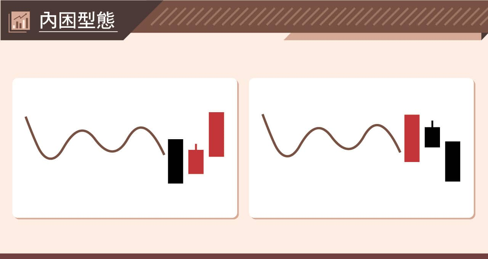
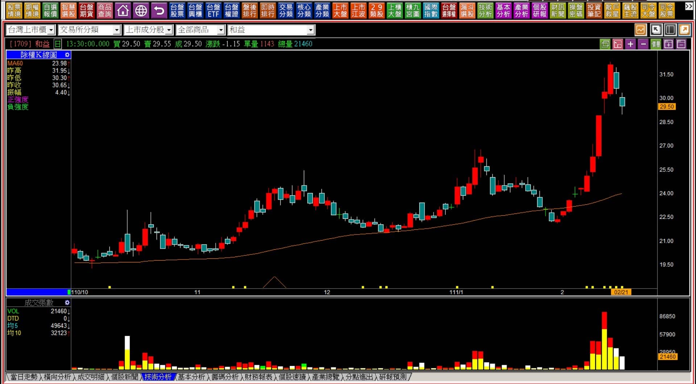
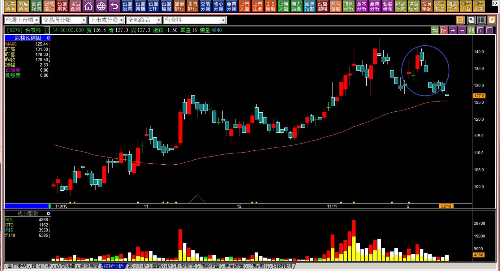
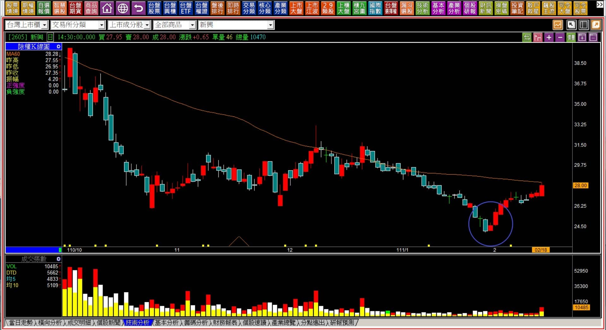

# 【組合K線補充】非轉折組合：內困型態組合的要點

定義：原本是懷抱型態，孕線的前一根原本是「力量型K線」，隔日開始反向醞釀的意義，如同力量的發揮者，隔日卻被困其中，但在很快的時間內就走出反方向的走勢。

時機：內困指的是等到反方向走勢出現的時候，才回頭辨識這一段是屬於內困的型態。市場上的說法像是內困三日翻紅或者翻黑，其實不一定是剛好三日，定義上懷抱型態之後出現的反向確立，整個組合就被稱為內困型態。

---

---

**範例與說明**

內困型態是反向走勢的一種明顯的型態，但非一定要與過去的趨勢反向，而是與一根力量型K線反向的意思，所以沒有被列為轉折組合，更明顯的效果是短期的轉向力量。

既然沒有因為「力竭原理」成為轉折的意義，也就等於代表短期的走勢力量上出現了變化，並不是內困翻黑股價就會走出空頭，或者內困翻紅就會轉向多頭，單純就是短期變化，用來搭配其他K線力量一併研判。

例如原本已經轉折向下，然後出現紅K又內困翻黑，這樣的型態就輔助了原本的轉折組合確立。

**111-02-21和益(1709)**

內困出現在創新高的紅K之後，比較貼近多方開始對拉抬「有所遲疑」的狀態，然後隔日轉向。力量的角度看，多方已經受困於紅K之後且翻黑，顯示短期拉抬的力量已經消失。

內困型態出現於遇壓或者創新高的漲勢之後，有著力量明顯縮減的表徵。在這樣的狀態表示至少得經過一定程度的時間整理。往往此時需要回頭留意基本面，因為股價以往冷門又是中低價股，但基本面又不算太差的，也不至於大跌，就是得經過一定程度的盤整區段才會有方向出現。

**111-02-18台表科(6278)**

定義上圈示位置是內困且開始翻黑的狀態，雖然形狀不完整符合實體包覆，但卻是與前次一月份同一個位置相似的狀況，先顯示了力量的退卻之後，又往下跳空，然後接續四天的黑K。

學習組合的目的，並非為了用於記憶形狀，而是為了理解力量「變化」，特別是遇到壓力區時多方的應對心態，是打算「賣壓化解」、還是「遇壓反應下跌」？可以從K線上辨別出來。

上圖除內困又翻黑之外，最後又走出近下降三法的回檔，顯示短期無力。這也是很多人會比較感覺衝突之處，因為基本面看起來是成長股，K線圖卻是呈現弱勢，往往讓人有不知道要不要進場投資的矛盾。

不過這個弱勢明顯的量縮，至少這一段未來如果有反彈，還不至於遇到太大的套牢壓力阻礙，這是內困狀態下可以輔助的細節判斷。

**111-02-18新興(2605)**

內困在翻紅的角度，與轉折組合中的母子晨星或者母子雙星有很大程度的相似，也就是型態相符，不過意義上不太一樣。

母子晨星或者母子雙星的定義在股價越過黑K中值之後，任何表現都無妨，只要不再破底，轉折意義都是存在的。

而內困翻紅的狀態，是站上黑K高點之後，短期有逢低搶進的多方力量，因為只是短期力量變化，所以未來要考慮的是下一個套牢賣壓的位置，而不是這檔股價的空頭趨勢是否已經結束，力量上有細節的不同之處。