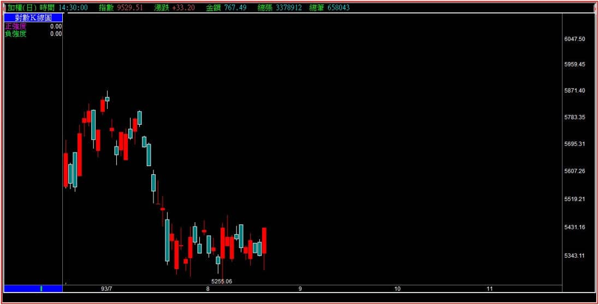
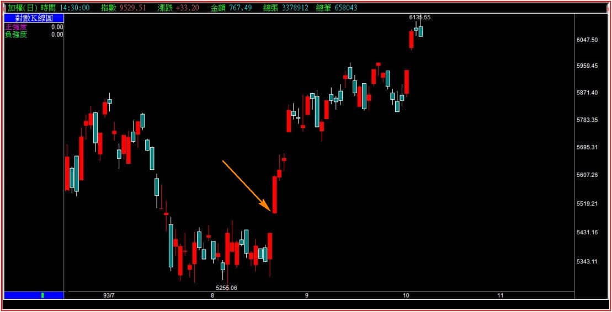
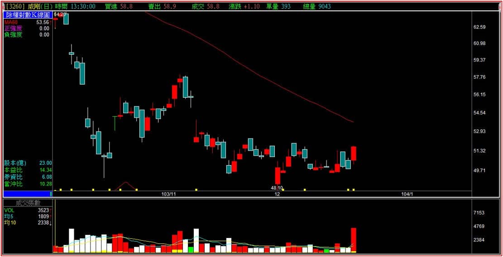
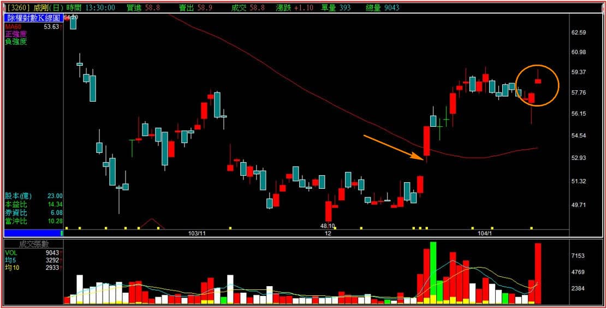
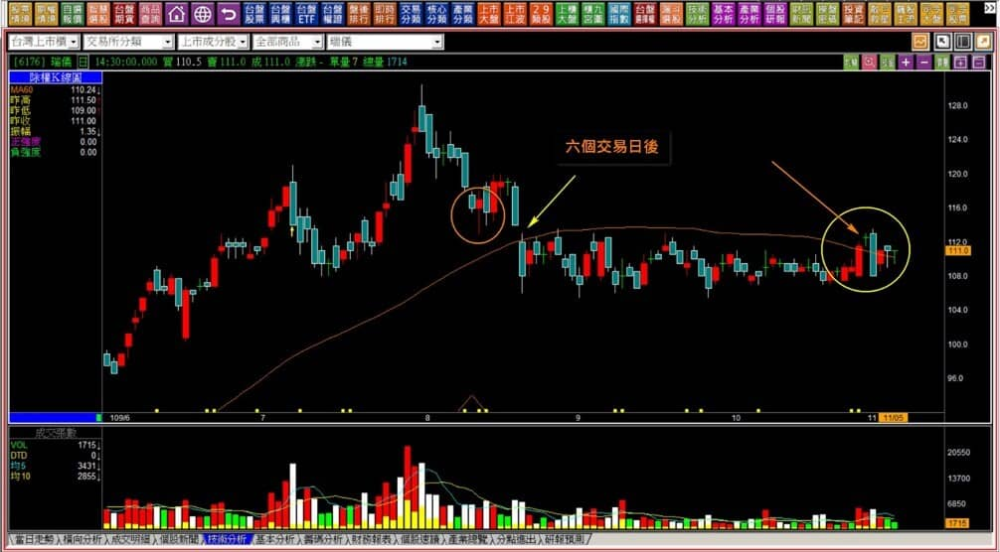
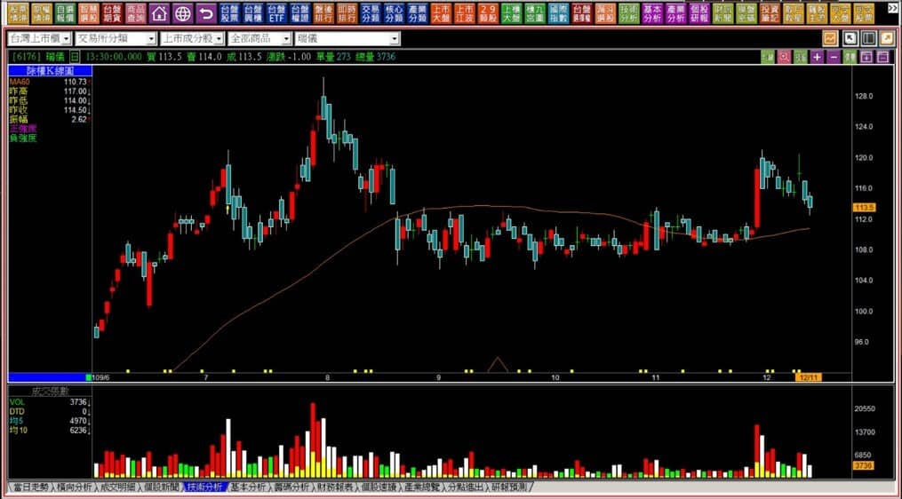

# 【多空轉折】三根K線連續判斷突破整理區間的力量：突破雙星

這一篇要來講到突破雙星，在主控K線的教學中稱之為「離黑」，因為主控K線很習慣把圖型多空直接反過來看待，例如高檔區域有著整理型態卻被一根黑K跌破，稱之為「離白」，意義是相近的。

這個主控說的內容大約知道即可，而我們在轉折組合中並不是這樣使用，只有在短期型態才這樣看細微變化，因為還得要搭配攻擊K線中的「上肩缺口」，不過，突破意義上更為貼近升降型態當中的上升型態。

雖然「突破雙星」的定義很普通，但實務判斷時又得多加很多其他條件，適用時機是在低檔區域K線「並沒有」出現明顯的轉折訊號，而是出現類似築底型態的時候使用。

同時如果要經過確認，又必須以最強勢的長紅呈現，沒有長紅，那就得用更強的「跳空」來表達「資金已經不給人有機會再低檔買進」的意義。

**突破雙星定義：在低檔出現連續並排的K線組合型態，先有盤整格局。表面弱勢下，以紅K突破盤整區間，最後的紅K突破併排的兩根K線。突破雙星與型態突破最大的差異點在於，突破雙星的功用是原始空方趨勢的結束，型態突破是整理轉為多方趨勢。**

---

**突破雙星很難運用的原因**

突破雙星定義上談到了並排，且是在低檔，但是低檔的定義很難只看短期來判斷，因此要理解力竭意義的轉變，除了紅K突破並排之外，還要經過隔日不再回到低檔的紅K或者跳空來確認，所以剛好形狀符合突破雙星的機率很低，不常出現，也因為單純用上升型態就已經能夠辨別，跳空缺口更是力量上可以直接辨識，所以這個轉折組合可遇不可求，效果做為空方的出場，是比較晚期的判斷，鮮少有空方回補這麼有耐心的情境。

**突破雙星示意圖**

突破雙星從定義上來看，很像是一般投資大眾以為的築底完成。在市場裡操作久一點的人都明白，底部整理完成不代表股價會上漲，真正會強攻的股票是「突破頸線創新高」，所以突破雙星有時候也具備了低檔型態突破的定義，但有更多的狀態是因為先有過整理，然後空頭趨勢改變，也就是突破下降壓力線。

**大盤的型態分解說明一**

短時間內指數在一定的區間沒有方向，通常是冷門的時期。一根紅K讓前兩根並排的K線被突破，問題的重點不在這三根是不是長得很像突破雙星？而是如果股價真的打算往上走，必須要在突破之後，有著類似攻擊意義的K線出現，例如跳空。

**大盤的型態分解說明二**

隔天跳空之後就開始往上走，這是多方的最重要特徵：不再讓人有低檔可以拉回買進。因此這個隔日的「向上跳空」是關鍵意義，讓這個突破雙星有著代表性的功能，少了這個跳空，依然處在整理區段的紅K，並沒有意義。

---

**個股型態分解說明一**

公司的營運有一定的本質，所以空頭趨勢也不會讓股價跌到剩下連殘餘價值都沒有。空頭會讓長期投資者等到股價「再跌也是嚴重超跌」的位置開始買，並非為了短線交易的資金才會進場，形成看起來很像是底部的型態。

上圖的紅K突破前兩天併排黑K，不過這還沒有代表轉折的意義。

**型態分解說明二**

隔天的跳空才確認了這個突破是不再延續空頭的意義，也才符合了轉折K線的力竭。

上圖的最後一個跳空就不一樣了，這只是一般單純的普通跳空，沒有攻擊意義，因為沒有創新高，連過去一個月整理段都沒有越過，與突破雙星之後的跳空意義差別太大。

依照這兩個例子，讀者就會明白突破雙星這個轉折組合三根K線本身是不夠的，得要加入隔天的表態才有辦法回頭確認，而這個轉折在酒田戰法裡並沒有加諸「跳空的判斷」，我認為就是少了力量的進一步確認。

---

**綜合實務運用**

如果考量到整理的趨勢、突破整理區間，並不單純只用「空方的結束」來做為標準，實務上的判斷還要考慮很多細節，就會比轉折K線的角度更貼近操作，例如用反向築底完成的角度，像是看起來是築底，卻又拉回來讓人有低檔可以接，表示不符合突破雙星型態，是負面表列的一種用法。

以下的例子我們採用109年績優股的瑞儀(6176)作為實際範例討論，對於操作我們應該要注意哪些面向？

這些面向包括：賣壓化解、頸線突破、季線扣抵、突破整理區間紅K以及隔天，遇壓問題。

**109-11-05瑞儀(6176)**

先看成交量，顯然八月份那一段高檔是有套牢存在的，假設股價未來會突破的時候，自然就是型態突破；從整理型態的角度，季線扣抵六個交易日之後就會扣到這一段整理區間，因此只要屆時股價往上走，會自動帶動季線上彎。

實務上這裡只不過不能放空而已，因為右邊箭頭所指，突破雙星的隔天雖有跳空但是很小，關鍵變化是隔天竟然又是黑K跌回併排的位置，這就證明了一件事：這一檔股票目前沒有任何資金想要拉抬，還是處在隨機漫步的過程中而已。

**109-12-11瑞儀(6176)**

上圖的紅K之後十個交易日卻都沒有紅K出現過。

這樣沒力量理會的股票其實在績優股裡真的比較少見，卻又真實的存在。對於操作來說，我們當然也可以用「型態突破了再說」來一言以蔽之，可是畢竟我們談到了轉折，不是買賣點的問題，而是出場的判斷角度，就得要辨識這些力量上的變化，或者是「力量存不存在」的問題。

突破雙星的理論不難，難的是實務判斷上，不能因為股價有個底部型態就可以買進了，這也是很多投資人對於型態判斷上的誤解，需要等待有力量的進駐才有意義，因此，應該發生卻沒有發生，也是轉折型態可以延伸運用的範圍。