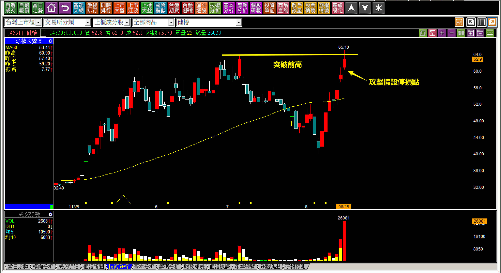
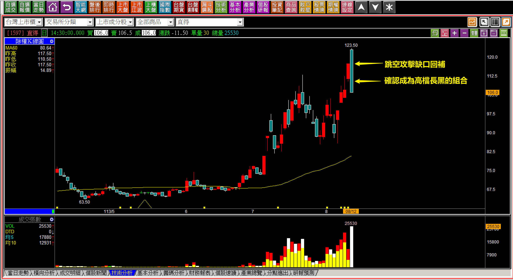
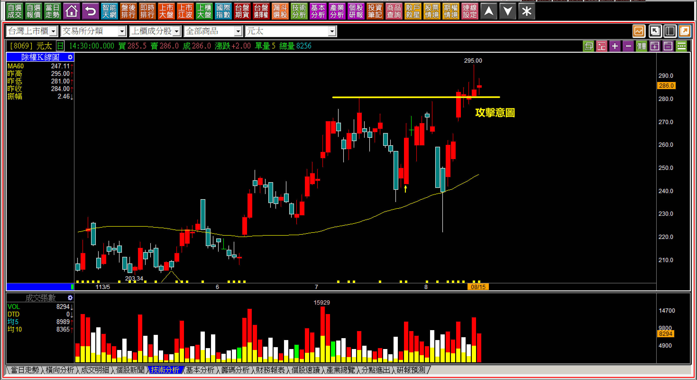
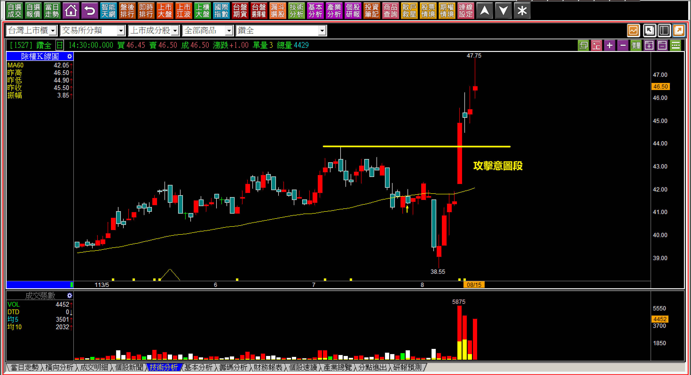
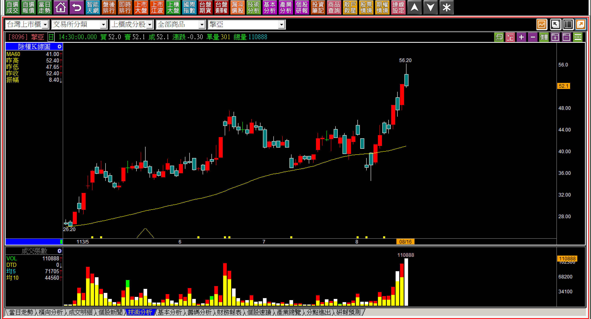
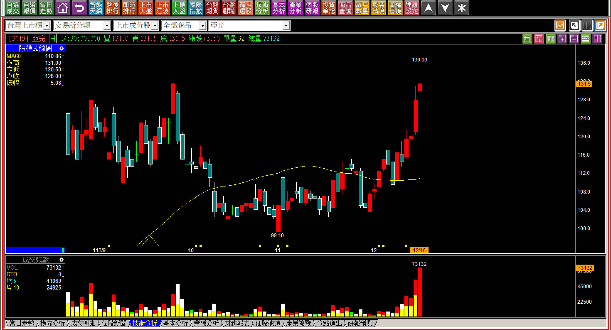

# 【明日K線】「攻擊企圖」篇

攻擊的態勢中，股價分為兩個區段：**攻擊意圖、攻擊企圖**。

所謂的「攻擊意圖」指的是賣壓化解的意願程度，當股價從低檔往上靠近創新高價位的這一段，就是賣壓化解的態度，因此這是賣壓化解被形容為「攻擊意圖」的原因，稱之為意圖，是取其有這個意思的表示。至於企圖，意思就是開始有動作，所以等到股價突破之後，開始出現攻擊的姿態，就稱為「攻擊企圖」。

對於明日K線來說，攻擊意圖的出現，隔天就得要有攻擊企圖，當然明天的走勢就分為有企圖或者沒有企圖，這一段在攻擊K線的攻擊模式中，分為跳空攻擊、推升攻擊，或者又跌回來表示沒有要攻擊。所以確認意圖出現之後，也就是賣壓段已經都被越過，可以很單純判斷要不要攻擊，但是複雜且影響拉抬幅度的，需要進入明日K線的攻擊企圖判斷。

假設某一檔股票的K線是股價創下新高的紅K，或者帶著上影線、十字線都符合攻擊假設，這一根就是攻擊意圖，可是隔日開始，基於攻擊假設停損點未破的狀態下，明日會有哪些種類的攻擊呢？這就是明日K線需要的判斷。

**說明：攻擊意圖已經符合標準**

並不是股價剛剛好對齊前次最高點，才叫做攻擊意圖，而是只要越過，套牢者都可以解套就是，至於套牢者賣還是不賣？我們不用理會。所以必須先突破了才算是攻擊意圖的確認。

面對攻擊假設的停損點已經可以確認之後，且在隔日開始沒有跌破的狀態下，這一天收盤就開始需要為隔日先做推演攻擊方式，除了跳空攻擊、推升攻擊之外，明天開始會有哪些可能性？

**一、有跳空攻擊但是失敗。**

一開盤跳空攻擊但是缺口回補，表示跳空攻擊出現了卻是失敗，這是一種主力根本就沒有要拉抬的意願，如果前一天是漲停板鎖住，可以加上攻擊成本的考量。如果缺口回補，此時就要考慮不但沒有攻擊，可能還會形成高檔長黑的可能，這些是隔日盤中一定要有的心態準備，不是單純的跳空就好。

**113-08-12直得(1597)**

長黑K既然是開盤就是高價，表示股價在盤中根本就沒有越過早盤第一個高點，也就是盤中走勢是朝空方波動的方式進行，跳空攻擊回補缺口，又不打算走出多方波動，對於短線交易者來說等於是一開盤就警報大響，一路響到跌停，紅K低點跌破表示攻擊假設失敗，可是在此之前就得心裡先有數。

不因為前一天紅K還收漲停板，就以為股價是最強的走勢，不先入為主，是明日K線的要點。

**二、攻擊出現但是非強勢日出。**

股價如果創下新高，又不打算攻擊，通常會出現在一開始，比較少有那種攻擊兩天之後才放棄的，因為主力拉越多天介入越深，如果沒有拉抬意願，不需要賣壓化解花大錢之後，還又再拉兩天才跌，這是通常攻擊失敗的走勢都是在創新高價位附近搞來搞去的原因。

假如股價「並沒有」強勢日出攻擊，大多數都是這類型，這也是日出攻擊難能可貴，一出現一定要把握等攻擊結束才出場的原因。但如果不是有強烈意願的拉抬，要不就攻擊失敗，要不股價就混在新高價附近。

**113-08-15元太(8069)**

高價股不一樣的地方是散戶介入相對比較少，或者散戶買進了是為了短線做點價差的目的而已。所以股價混了幾天之後，接下來的走勢重點就是：漲才是攻擊企圖、跌下去是沒有打算要攻擊的意思。

這個道理好像跟沒說一樣，可是人心就是高賣低買，會不自覺得買低，所以才要把這個觀念再說一次。

**三、弱勢的日出攻擊。**

不攻擊的就賣掉，攻擊的就留著，聽起來簡單，但是對於價差交易者來說，最討厭的就是符合攻擊的定義，股價卻沒有拉開行情，但是其中簡單的就是符合日出攻擊定義，卻不強烈的那一種。

**113-08-15鑽全(1527)**

有時候我們不見得每一檔股票都剛剛好買在創新高的第一天，或者隔天，因為人的能力有限，注意力也常常在盤中被自己的持股分散掉，等到發現某檔股票的時候股價已經上去了。

人性往往在強勢連漲三天的下不了手，是漲了三天又覺得不夠強勁的嫌棄，這是矛盾的心理，但是自此已經等同符合日出攻擊的定義，那就很簡單的用前一天的低點當作停損點來處理，可以接受才進場，不能接受就換一檔操作。

**四、醜陋的日出**

看起來創新高好像要開始，可是攻擊企圖非常弱勢，有可能形成醜陋的日出攻擊，也就是定義符合日出，股價卻拉不開幅度的日出型態。

**113-08-16擎亞(8096)**

成交量在此成為明顯的戲法，明明創新高之後可以一路拉上去，卻持續的爆量，表示主力在其中玩著上沖下洗的遊戲，型態上是醜陋的日出，表示攻擊企圖幾乎可以確定只是為了玩短線價差，並不是為了拉抬股價。

**明日K線角度檢視攻擊的「初始」**

對於攻擊K線擅長判斷的人，對於價差交易情有獨鍾的交易者來說，只要創新高的開始要辨別攻擊企圖，日出攻擊是最佳期望的結果，但是不可能每一檔股票突破之後就開始展開強烈的連續日出走勢，所以判斷上從攻擊的開始，也就是攻擊的企圖上，得要每日為明日做沙盤推演。

如果股價沒有表現得很強勢，卻又沒有跌破停損點，那就可以對比當下的大盤帶來的氣氛來掌握節奏，尤其是大盤給人的感覺是需要謹慎、顯得悲觀、利多氣氛佳，都要反過來看待，該攻擊就得要攻擊，盤不好至少要防守，這就是「價格判斷」的重點，少了這個重點就會流於「感覺判斷」，就像是散戶在感到壓力時，認為自己得要減碼，卻減的是賺錢的部位一樣，最後就是賣掉了具備攻擊企圖只是晚了幾天的個股，留下的是弱勢沒人要的股票。

有了前一天對明日K線的判斷，就不至於盤中失心瘋，總是做下錯誤的決策。

**113-12-16亞光(3019)**

對攻擊企圖的判斷來說，創新高的上影線，就是隔天往上漲就是繼續攻擊企圖了，往下跌回「攻擊意圖區」，就是沒有要攻擊的意思，明天就是關鍵判斷點，但是依然要先持有，不攻擊再出場就好了。