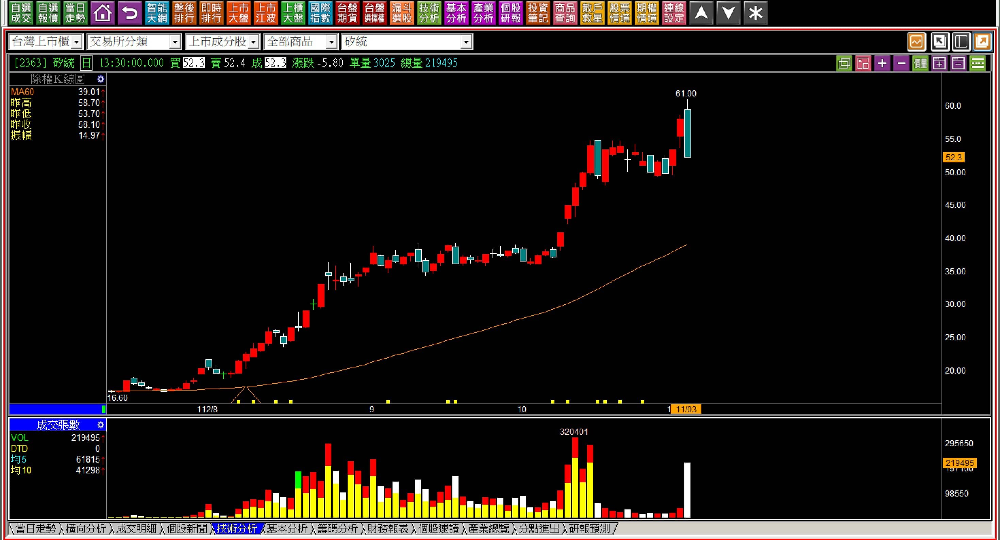
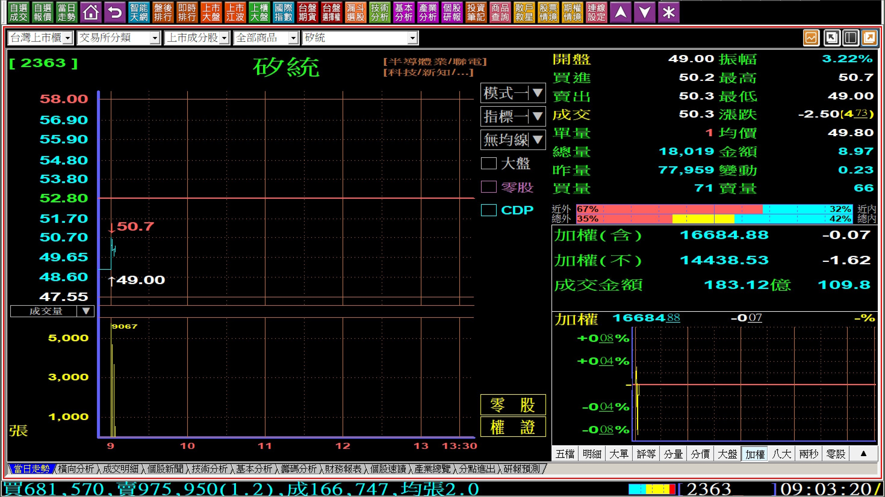
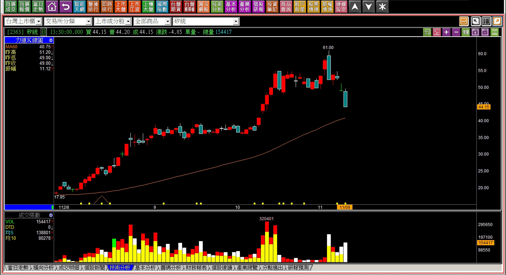
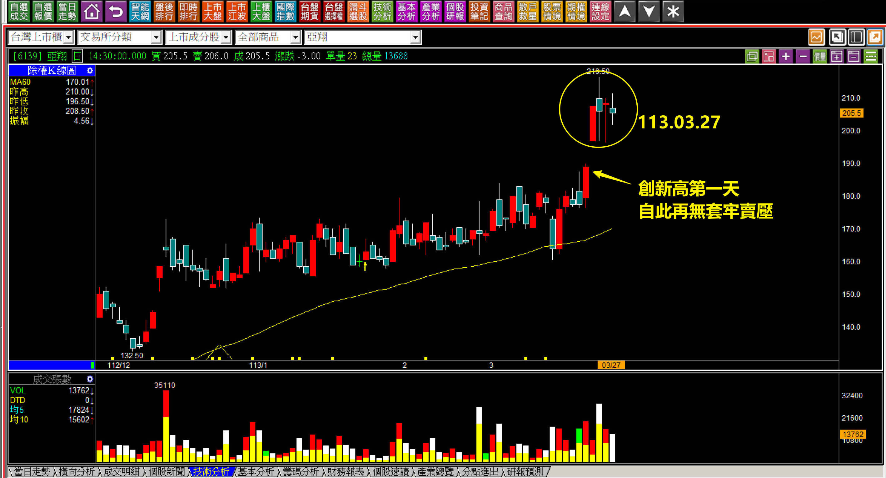
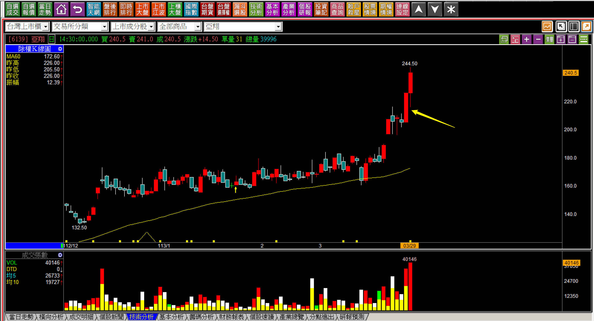
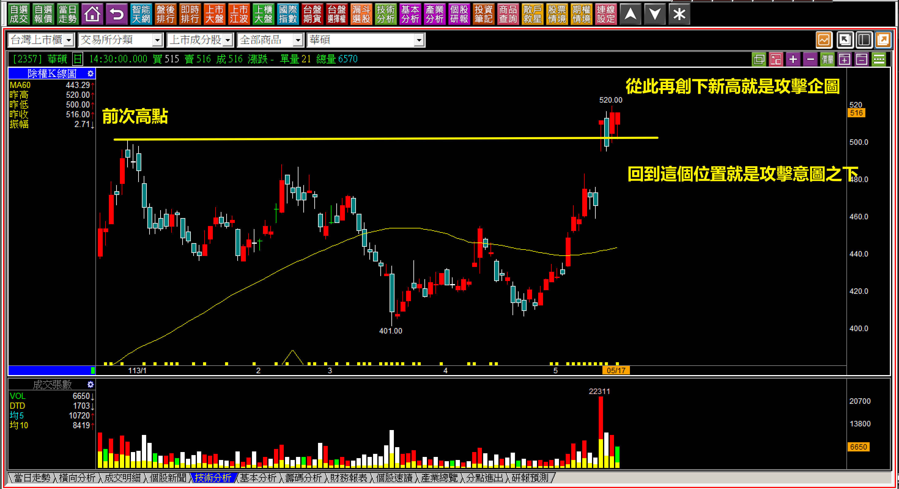

# 【明日K線】「明日K線的意義與簡易說明」篇

這一篇是「明日K線」主題的開場白，撰寫的時間點正逢台股的大跌時期，不過我想說的是，技術分析是自我能力的實踐強度，要把握每一次行情翻揚的機會，而不是把握低點，這個觀念頗為重要，反覆熟練K線的判斷，是最佳提升自我能力的方式。

當初要來規劃這個「明日K線」單元，我其實也思考很久，因為光看名稱可能容易會被誤會，以為這是一種預測明天走勢的模式，實際上並非是如此的功能，而是理解力量變化的關鍵點。

要對「明日K線」做比較簡易的理解，就是把所有的K線理論中包括型態、轉折、攻擊......等等定義，分為兩區段，當前段出現之後，就可以研判出隔日開始「最有可能進行」的走勢變化，這其中也包括「不太可能發生、出現機率很低」的判斷，等到變化的第一步出現，馬上就了然於胸，知道如何應對，這些都算是明日K線的範圍。

**換一個比較簡潔的說法，從今日收盤K線，推演明天起走勢的力量意義，甚至從明天的開盤價，就能發現變化，以及走勢是否符合預期。**

明日K線的判斷，需要的是對於「技巧的熟練程度高」，因此這個單元的教學採用的就是先提供範例，再複習一次理論定義，然後提供走勢方向的解答。大家只要常態都保持這樣的練習，對於交易的關鍵時刻判斷，應該會有幫助。

**定義「明日K線」的標準**

雖然剛剛解釋過，這裡還是要再明確定義一次明日K線範圍：「股價收盤之後，對於K線的判斷，推測出隔日開始會有的各種可能性，區分出可能性的高低，有的是今天就已經知道未來走勢的答案，有的是明天一開盤就確認了，都是『明日K線』的實務意義。」

先進行簡單與困難各一個範例，接下來的「明日K線」篇幅都會採取這個模式教學。

**簡易範例112-11-03矽統(2363)**

以這檔股票走勢來說，是很簡易的「高檔長黑」。

對於K線型態的熟練者來說，馬上會想到的定義就是股價突破前高，隔天就用一根超過10%幅度的黑K包覆，那麼明天開始的股價走勢又會是如何？就是明日K線判斷的範圍。

倘若大家已經很熟悉軋空與結束，那就會對於這根高檔長黑就更無疑慮，明日開始股價已經很難再創新高價。有了K線的認知，並且持續這樣的訓練，對於交易判斷會更有心得。

以上圖為例，既然先出現空頭吞噬，再出現高檔長黑，轉折出現就是肯定的，那麼接下來的「明日」走勢，往下或者跳空下去近期就會出現。

**112-11-08矽統(2362) 09:03**

為什麼可以確認這是對明日K線判斷的弱勢？因為高檔長黑的前一天股價創新高，幾乎沒有什麼成交量就有新高價，顯然這是籌碼集中、正在軋空的走勢，已經沒有什麼散戶，大家都可以理解，既然集中在主力的手上，卻輕易的出現高檔長黑，表示一旦多方收手，根本沒人會承接，那跳空向下的出現就是正常的。

軋空是一種態度，軋了就不會輕易放手，放手了就是沒有打算再軋空單的意思。

雖然我們沒辦法預期出現跳空的幅度會有多大，但無妨，往下已經在預期中了。

**112-11-09 矽統(2362)**

通常學習K線的人，到了高檔長黑的判斷已經看懂了之後，出場之後(或者空手者不進場)往往就對後來的走勢忽略掉了，不過放空者卻對此感覺到有意義，這就像是突破頸線之後，每天的股價多方都很在乎細節變化一樣。

明日K線就是補足這一塊，讀者會理解什麼是「沒人想買就可以跌成長黑」的意義，向下跳空也是股價沒人要的意思表示。

**進階範例113-03-27亞翔(6139)**

基於對上升三法的理解，中間兩到三天的整理，其實就是對於高檔狹幅狀態的壓縮，只要還持有股票的人想要賣，都有高價可以賣，就算當天賣得價位不理想，也算得上是出在高檔區域了。既然如此，我們應該要思考，承接股票者為什麼願意高價買入呢？

看到這個例子，會讓人想到的就是K線「重意不重形」，這個例子可以說是上升三法多了一天的變形，因此接下來如果往上拉抬，就是明日K線可以看出來的攻擊態度了。這個位置就是俗語所說的：能漲不能跌。

**113-03-29亞翔(6139)**

一般散戶打算拉回才要買股票，所以站在攻擊的角度，往上就是確認，而這種漲勢還空手的散戶就不會追逐，每一個「明日」只要股價都是往上漲。就是維持在攻擊狀態中，若往下跌反而代表沒有要攻擊的意思，也就是站在三月二十七日的角度，明天開始往上、往下各有不同的答案。

看懂了這個比較複雜的例子，就可以理解明日K線對於我們在判斷上的意思。

**113-05-17華碩(2357)**

接下來，雖說是「明日K線」的教學，其實意義指的是接下來的走勢，不一定要是剛好在明天。假如再往上創新高，就是攻擊企圖的出現，但若回檔往賣壓化解區域下去，就是代表沒有攻擊企圖。

題外話，散戶想要做個短線價差，竟然是去買「沒有拉抬意願」的拉回，對於真的要攻擊往上創新高的，反而不買了只用看的，這就是做價差屢屢不順心的原因。

**明日K線的教學意義**

這個單元的意義，可以算是對K線判斷的複習，也可以說是對K線定義的延伸、細說。過去我們的教學談的是某個K線的組合，沒有針對這個組合出現後的「隔天開始」股價會怎樣表現直接立刻做出說明。

有的時候空方轉折出現，不見得隔天開始就馬上崩跌，就像是矽統(2363)先有十月中的「空頭吞噬」，後來還又創了高一次，才有了大家看到的「高檔長黑」，所以難免會讓對K線不熟悉的初學者以為轉折組合出現了例外。

並非如此，實務比理論複雜之處，我們就都在明日K線來進一步教學。