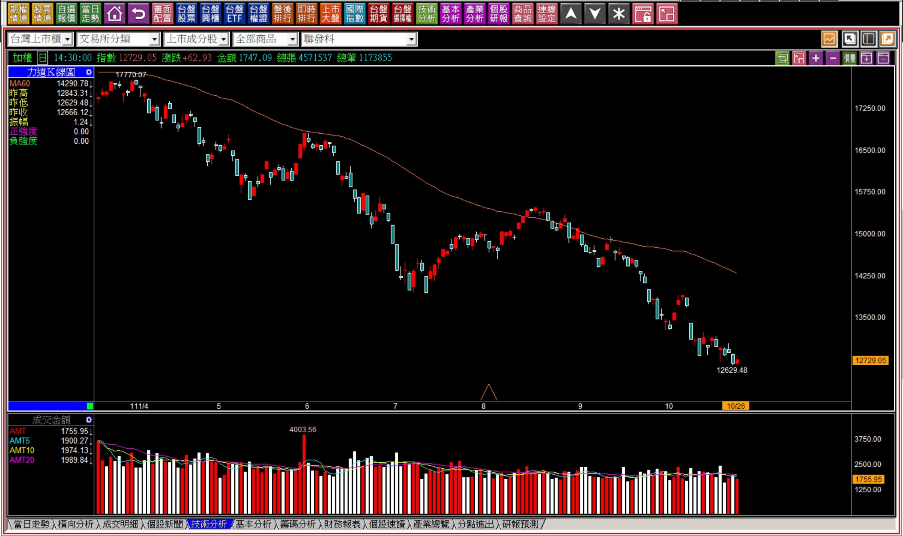
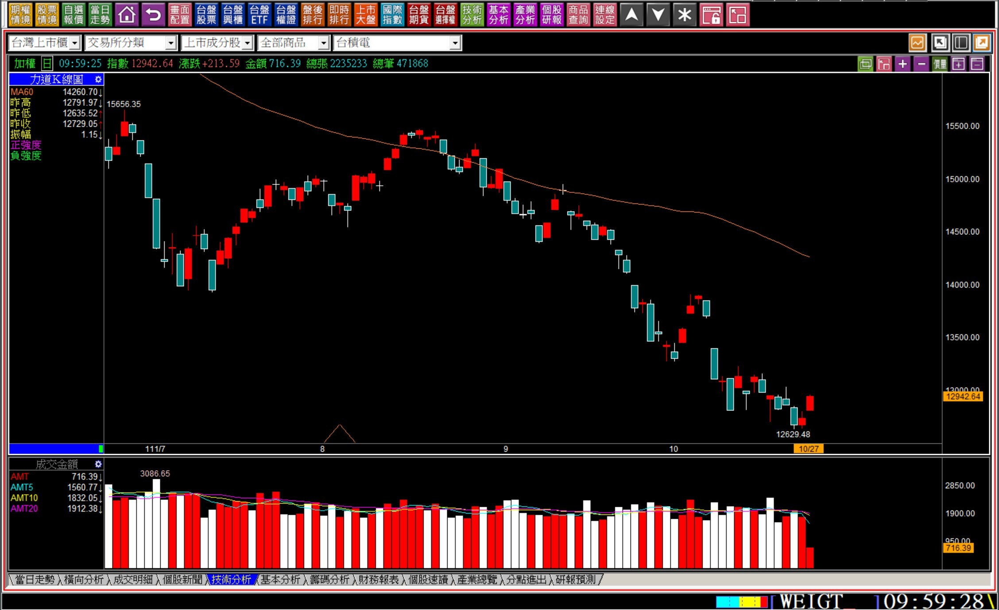
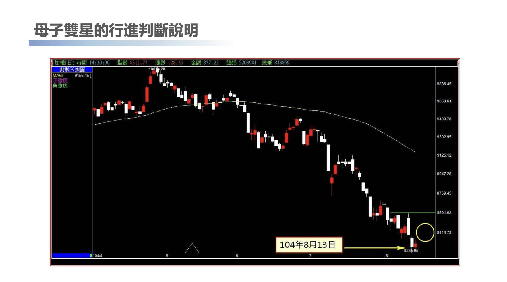
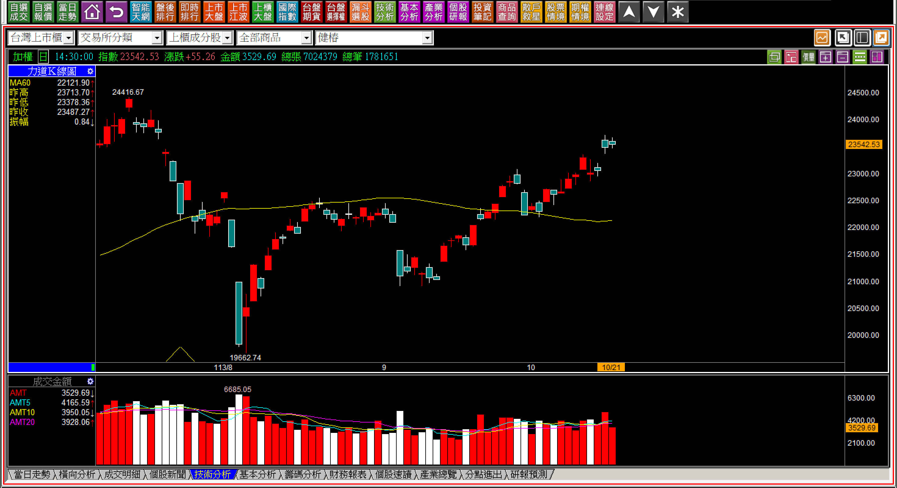
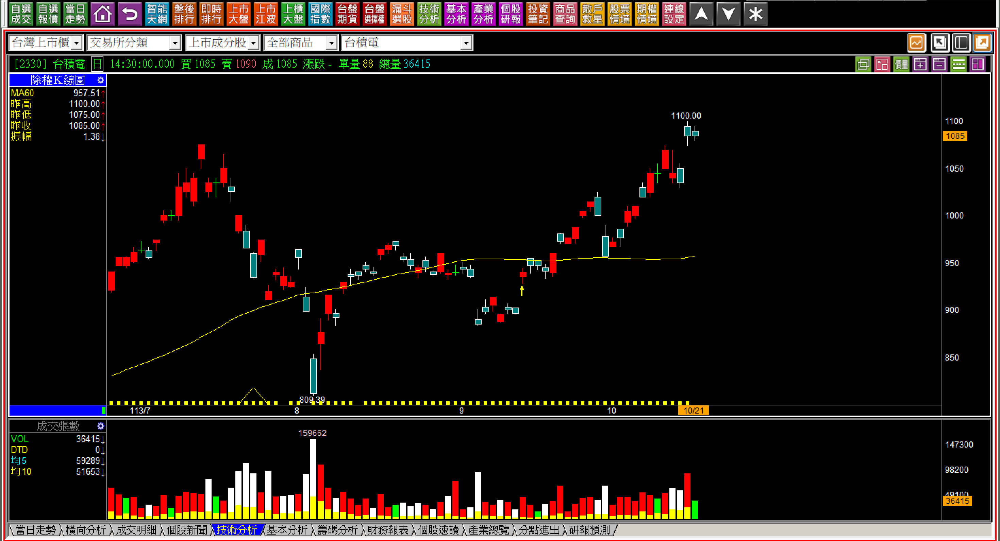
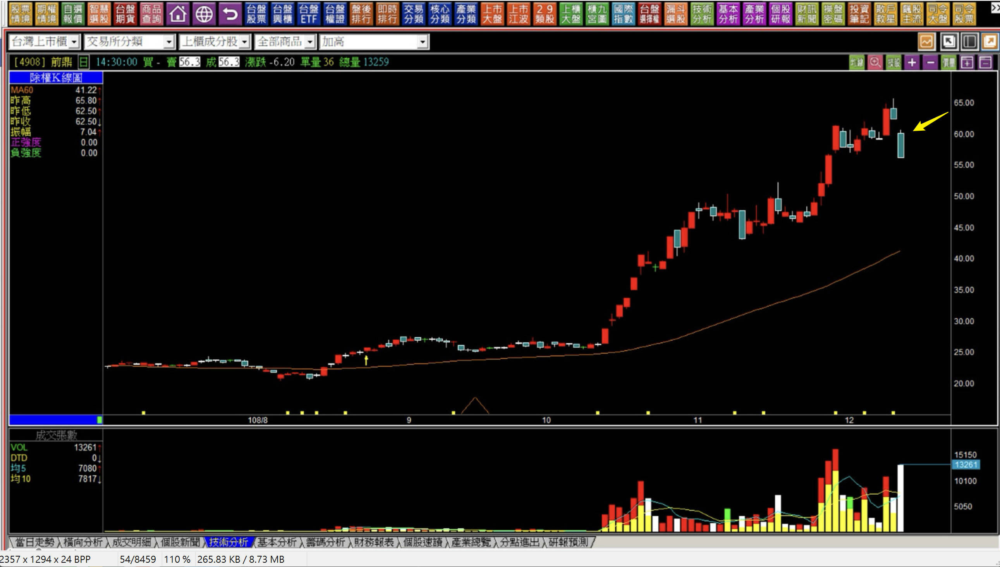
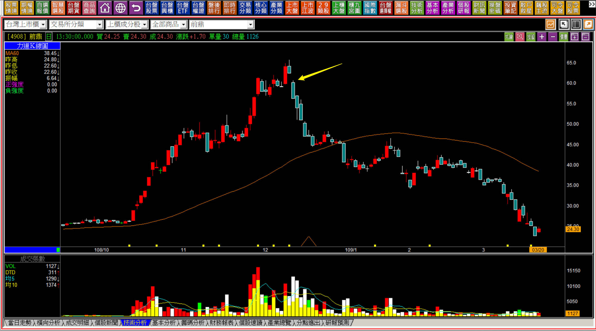
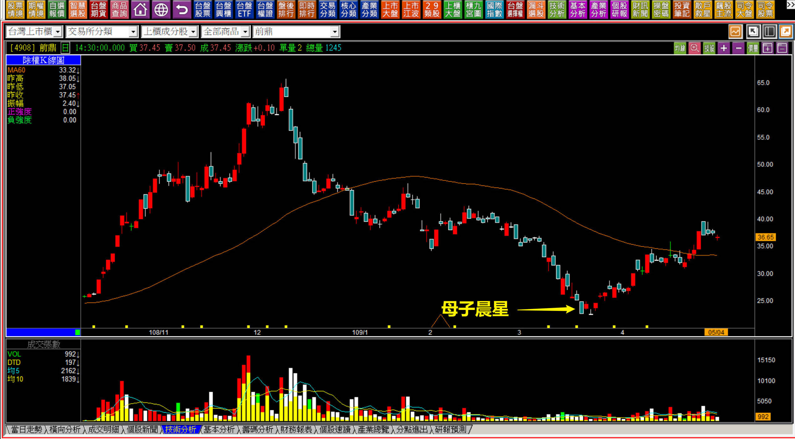

# 【明日K線】跳空反轉、雙鴉躍空、母子雙星的微妙之處篇

「反轉轉折組合」是一種根據力竭意義所衍生出來的組合K線形狀連續判斷，既然叫做組合就是不只一根K線，既然不只一根K線，兩根K線之間就存在著最特殊的單一K線狀態，也就是「跳空缺口」。

在明日K線的判斷立場，就回推定義，把就「只差一個缺口」的轉折組合都當成是判斷的重點項目，只要隔天一開盤跳空與否就會有答案，一跳空就等於是轉折定義的確定。所有的基礎型態以跳空反轉、雙鴉躍空、母子雙星為主，進階變化型態就是突破雙星、島狀反轉。

轉折就是一種事後確認才能給予回應的技術分析，沒辦法再提前一天，但是跳空卻是一開盤就看得出來，所以可以再提前到當天的開盤，已經算是很極限的往前確定了，這就表示前一天就應該要做好準備，當然就是明日K線的確認出現與否。

**定義解決明日之前的條件成立**

用定義來理解「跳空反轉、雙鴉躍空、母子雙星」，這三種都是三根K線組合起來的轉折，而上述三種，都是在第三根的位置跳空缺口越大，反轉意義越強烈。以下三種並非分別不一樣的特徵，只不過是為了解說不要太複雜，分成三部分說明。

**範例：母子雙星**

母子雙星是因為母子晨星的定義未完成，第二天幫忙完成條件的轉折組合，所以兩根K線之間存在著跳空缺口的可能，跳空最大的意義就在於不讓市場有更低點可以買進的力量在其中，所以才會跳空缺口越大，代表的反轉力量越強。

**111-10-26大盤K線**

在看到創新低的黑K出現之後，隔日孕線紅K，這是一種內困的呈現，顯示今天與昨天沒有什麼不同，都在這個低檔的區間中價格移動，這是不考慮有沒有越過黑K中值，單純僅用組合型態中的內困，接下來有沒有翻紅來看待。但假如隔日開始出現了跳空，就符合母子雙星定義中，強勢的表現。

**111-10-27大盤開盤一小時**

所謂的缺口越大，代表反轉的意義越強，是很容易理解的。

問題是多大叫做大？沒有標準，只要跳空出現之後，當日的走勢符合多方波動，就等同於空方力竭的出現，接下來就看多方的力量，是孕線當日，開始判斷明日的認知。上圖已經出現跳空，此處要判斷明日，就得留意是否具備「賣壓中空區段」的特質一併探討。

**看懂明日怎樣變動代表符合有跳空的母子雙星**

這是十年前的走勢說明圖，用在我的簡報中。

同樣也是孕線出現在創下低點的黑K中，明天的判斷一樣是有沒有向上跳空，如果有，跳空越大反轉的意義力量越強。實務上結果沒有出現跳空，所以人們如果只看事後的K線圖，就不知道原來曾經在這一天出現過這樣的明日K線判斷。

**跳空的出現直接行動**

**範例：雙鴉躍空**

雙鴉躍空在轉折組合課程中就已經是明日K線的概念在解說，也就是當第二根黑K線出現後，關注的焦點就在於第三天是否開盤跳空向下，假如出現，且是在兩根黑K當時就是遇壓狀態，這個向下跳空等於是對上方壓力的承認，這是明日K線的重點判斷，尤其是個股的K線。

大盤則因為賣壓不見得要用原本套牢的股票來越過、受台積電影響權重最大的因素，反轉意義不如個股明顯。

**113-10-21大盤K線圖**

這裡還是舉大盤當作範例，在這樣的K線型態中已經符合雙鴉的定義，隔日不宜有太大的跳空向下出現，當然在這個階段裡台積電占的權值最重，影響指數最大，是台積電有這個型態，大盤也有這個型態的最佳可能，所以不要有過大的跳空出現都還不成立雙鴉躍空的標準。

**參考同一天台積電K線**

台積電在這一天是兩根黑K，可以看出對大盤的影響性在此時是很大的，不過台積電並沒有雙鴉躍空的問題，這是因為雙鴉躍空源自於「遇壓」之後的反應，而台積電股價並沒有遇壓，是在創新高的狀態之下，所以不符合這個轉折，那就不需要考慮到用跳空來代表反轉的意義。

**微妙之處在於缺口的大小**

**範例：跳空反轉**

跳空反轉的形狀是多數投資人進入轉折組合學習與實務運用的障礙，因為紅K之後出現一根黑K，非常的常見，幾乎可以說多頭市場裡每天都有這樣的股價走勢出現，不一樣的地方在於這根黑K的隔天是採取向下跳空開出的方式，跳空代表不計代價的買進或者賣出，顯示出力竭意義非常明確。

這個跳空缺口越大，反轉意義越強，剛好也是投資人的矛盾點，因為前一天還在創新高價的喜悅，隔天卻變成了反轉向下的判斷，價格上已經差距很多，讓人無所適從，就算看懂心裡也希望可以反彈有一點高再賣。

**108-12-11前鼎(4908)**

之所以要用明日K線來判斷轉折，就是希望可以在定義確認的第一時間有所作為。上圖的跳空出現之時，如果有著攻擊假設的認知，當然會知道創新高突破前高的紅K就是一種攻擊假設，這個點也跌破，沒有任何理由觸發移動停利不處理的。

不懂轉折、不懂攻擊假設的投資人自然就完全不明白跳空反轉在這樣的情境之下，這個判斷能力有多重要。

**109-03-20前鼎(4908)母子晨星出現**

這一次的下跌就直接跌到有母子晨星的組合出現為止。

**109-05-04前鼎(4908)**

母子晨星此處與本文主題無關，只是說明轉折組合代表的力竭意義。

對於K線組合型態來說、單一K線的力量意義來說，跳空無疑是所有K線中最值得花時間深入研究反覆練習的狀態，尤其是三種轉折組合都牽涉跳空代表力量的意義。