# 【明日K線】缺乏力量的判斷：賣壓中空結束與缺乏攻擊企圖

預測是一種虛幻，就像是進入了2025年，網路上到處都是談「預言」的文章或報導，引發過不少人的恐慌，像是被新聞媒體宣稱最「最強通靈者」金城保，預言四月二十六下午兩點五十八分東京大地震，結果並沒有發生，馬上被媒體改成形容為神棍。或者早在2020三級警戒大家出不了門，一本預知夢漫畫「我所看到的未來」，預測2025年七月五日會有超級大地震，預言的情緒感染力，在網路的傳播之下，總是極快速的傳遞開來。

明日K線並不是預測，而是利用已經學會的判斷，看出股價未來可能的演變而已。

股市裡當然也有很多人喜歡預測，因為有更多人喜歡「看」預測分析，做為自己已經有在努力的假象。不過對於K線理論來說，有些狀況表面上看起來好像是預測，其實只是做結構上的分辨而已，今天談的明日K線項目，就是這一種類型，不是預測未來，分析結構讓自己理解未來股價的方向變化而已。

**賣壓中空結束**

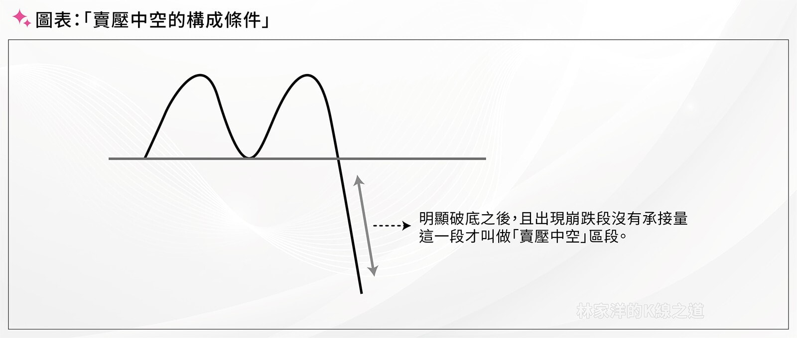

最近貼盤的K線談賣壓中空的機會很多，不過判斷上賣壓中空的「結束」，是最簡單的明日K線運用，也是阻礙力量判斷的一個環節。

**114-04-30日本**

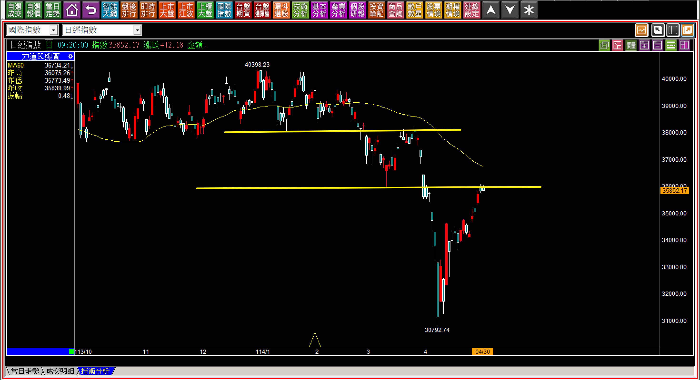

假如說四月二日之後關稅戰影響了股市的趨勢，那日本股市在三月三十一日就已經破底創新低，二月二十六日時跌破頸線就已經轉向空方趨勢，這就跟關稅戰一點關係都沒有了。

從三月三十一日起剛好遇到關稅戰產生出來的短期急跌，後來V型反轉至今已經結束，也就是賣壓中空的區段結束，這種反彈能夠來到賣壓中空段都有上漲，已經算是比較強勢，我的看法還是因為目前處在通膨時代的緣故。

**114-04-29奇鋐(3017)**

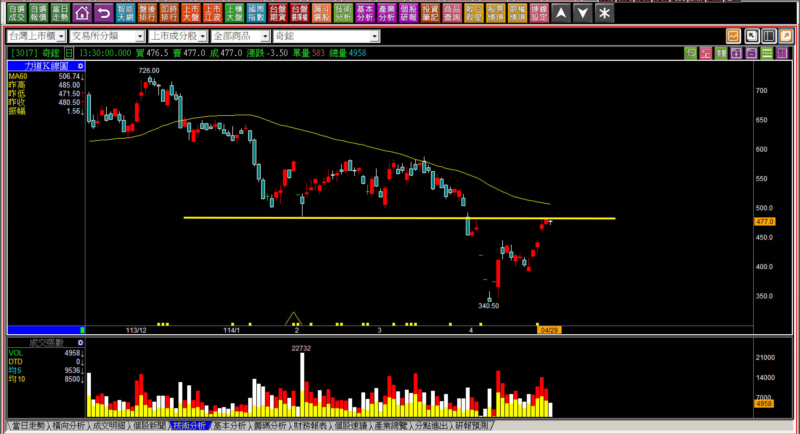

我們這個單元就是明日K線的判斷，因此當股價已經反彈到賣壓中空段都結束了，相信接下來的走勢是可以輕鬆辨別出來的，要越過套牢區並不容易，但不見得就會立刻大跌，通常也就是放空者習慣性的放空標準：遇到明顯的壓力。

**114-04-30長榮航(2618)與114-04-30華航(2610)**

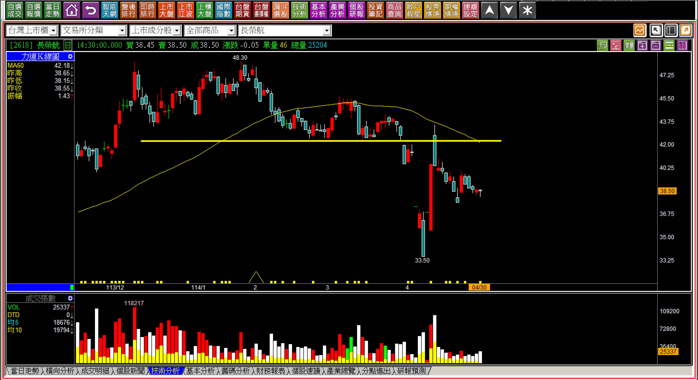

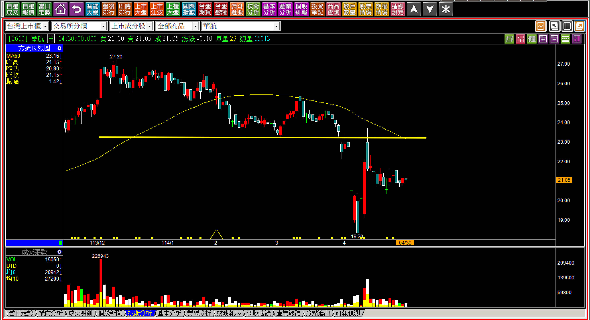

這兩檔股票的K線都是一樣的，這邊就不分段貼圖，就在四月十四日當天把賣壓中空段漲完之後，股價就再也沒有拉抬意願，為什麼？因為市場資金喊喊的而已，並沒有要解決頸線以上的套牢賣壓，這也是在當時我在盤勢解析的說明，同樣屬於明日K線大家都能判斷的點。

**114-04-28虎山(7736)**

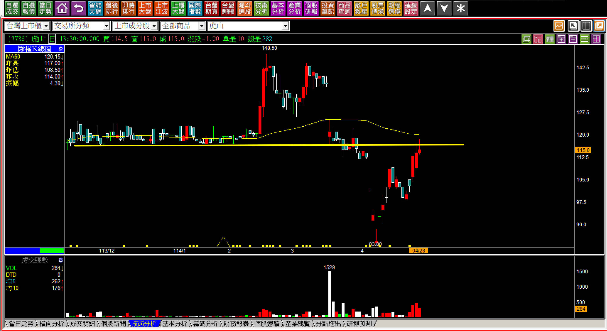

同樣的狀況，雖然AM市場也被形容為第二個台灣之光，可是股價並沒有轉變成主流的態度，也就是賣壓中空段的反彈結束之後，就遇到了頭部壓力，沒有資金願意幫別人解套。

**114-04-30虎山(7736)**

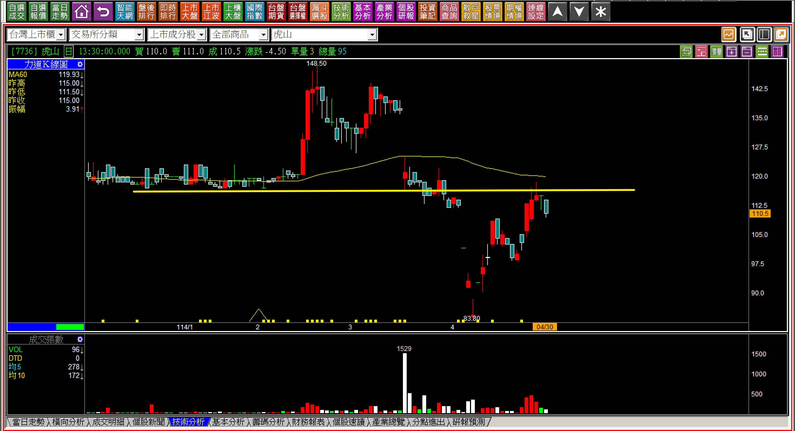

對於賣壓中空有一定概念的人，對於後來的下跌就一點也不會感到意外。

上述範例都是在大盤空方狀態之下的走勢，股價的攻擊意圖，依然是賣壓化解是否出現。

**單純缺乏攻擊態度與力量的型態**

通常不管盤面怎樣震盪，都還是有少數願意拉抬的個股，有的是真心，有的只是假意。對於明日K線角度的判斷採用攻擊K線中的型態原則辨別，就會有答案，其他還沒創新高的，就採用壓力位置判別即可。

**114-04-30訊達(6140) 10:54**

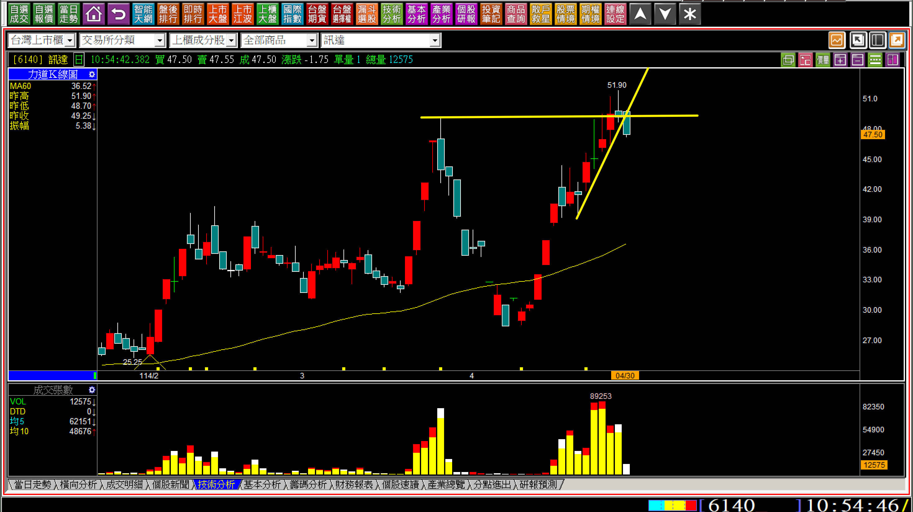

不只是攻擊前推升型態被跌破，連股價越過前高的攻擊意圖區，很快又一根黑K跌回來，因此盤中就已經可以看得出來缺乏攻擊企圖的力量。

**114-04-22金益鼎(8390)**

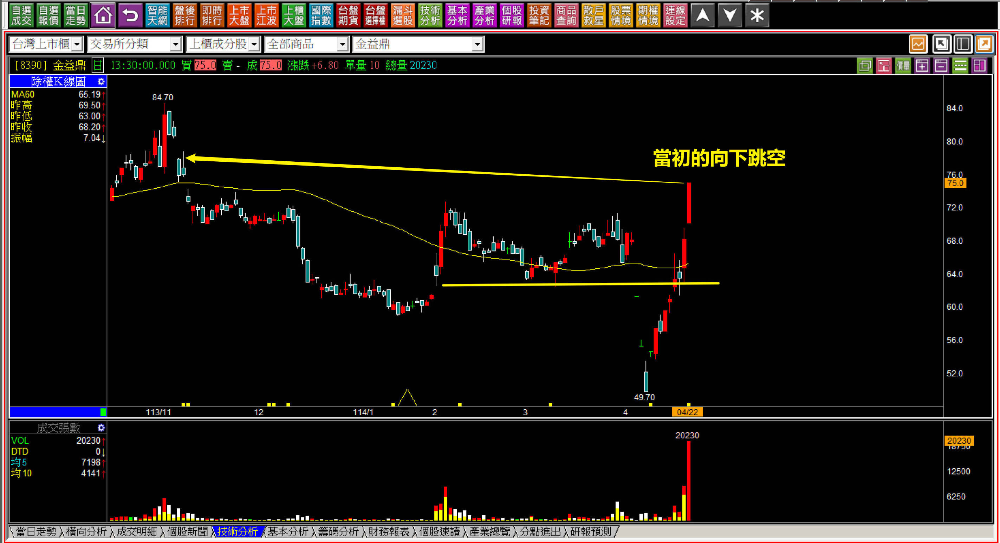

這一天股價之所以可以反彈完賣壓中空段，還又再往上走了一段，就是因為當時的黃金價格暴漲。我在個股評析中已經談過金益鼎的股價通常會跟黃金價格正相關，所以這一段不令人意外。

接下來就要面對當初「向下跳空轉變為下降三法」可能性的第一次跳空，當然這是個壓力位置，要越過就直接越過，回檔反而是會呈現出根本沒有要再拉的態度。

**114-04-30金益鼎(8390)**

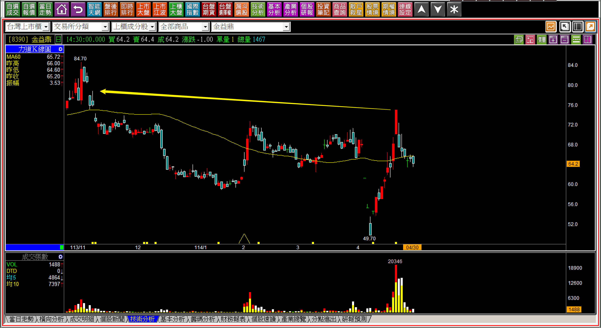

判斷明日K線的角度，缺乏力量就無法再往上，雖然沒辦法推測會回檔多少，但是可以看出來力量方面的問題，也已經符合明日K線的判斷用途。

**114-04-28大綜(3147)日出攻擊結束**

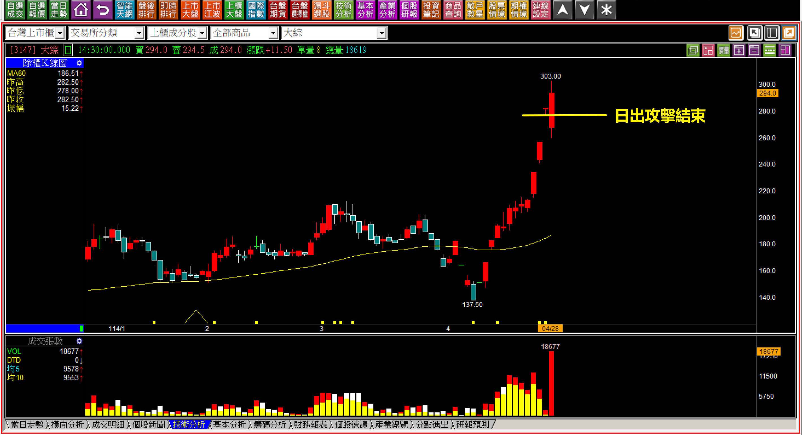

這一天一開始股價先「跌破日出攻擊」，但是後來又再往上拉，對於攻擊K線不熟悉的人往往會感覺這樣好像損失了點什麼。其實不然，價差交易要有交易準則化的執行，本來就是等攻擊結束點出場，至於出場之後主力要不要再假裝一下？這是主力的自由，我們需要的就是有準則並且執行而已。

既然日出攻擊結束，對於價差交易者來說，就不需要留戀，這才是對力量判斷的正確態度。

**剩下一小段中空會怎樣的效果未定**

**114-04-30生達(1720)**

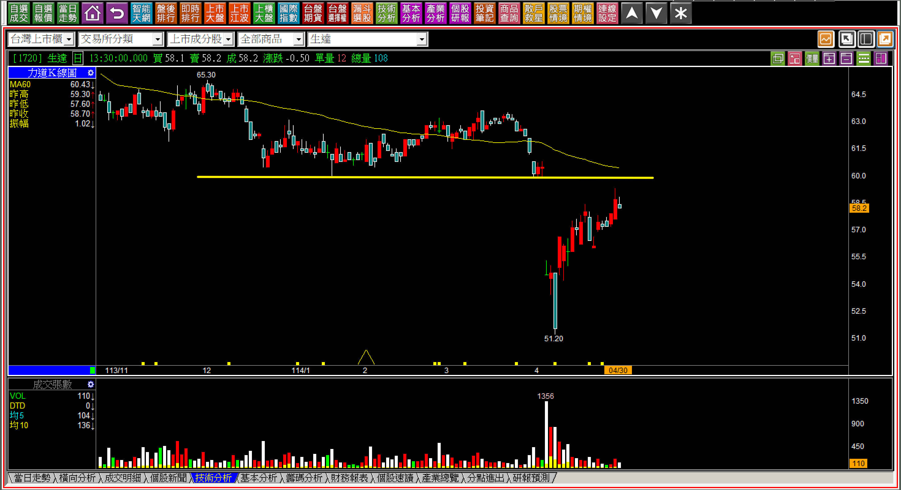

**114-04-30帝寶(6605)**

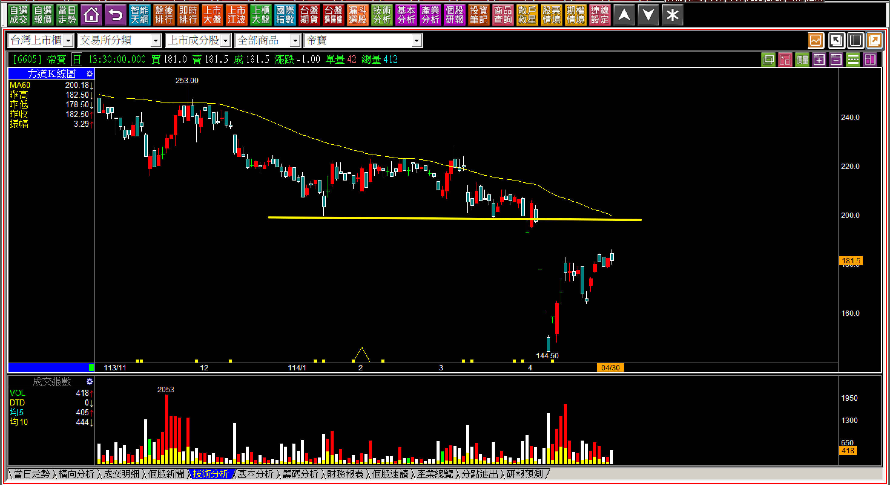

假如股價乾脆的反彈完賣壓中空段，那也就出場獲利了結就算了，麻煩的就是那種還沒漲到壓力位置，股價就早早停著不動，留下一小段空間還未定，也不知道到底會不會補上去這個空間，又應該怎麼辦？

我的做法傾向於看每股盈餘對比本益比，如果本益比還低，那就等著回補再來決定，但是本益比如果偏高時，就不如另尋更佳的投資機會，畢竟這個環境是空方趨勢，不需要對非攻擊股有太多的期待，投資考量的話，值得投資的個股倒是可以再等。