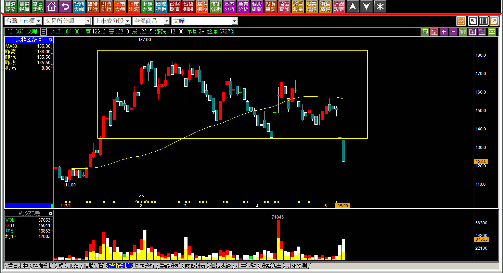
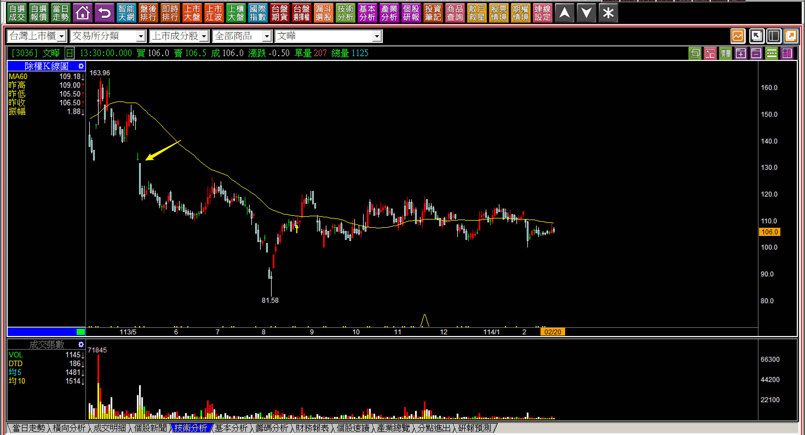
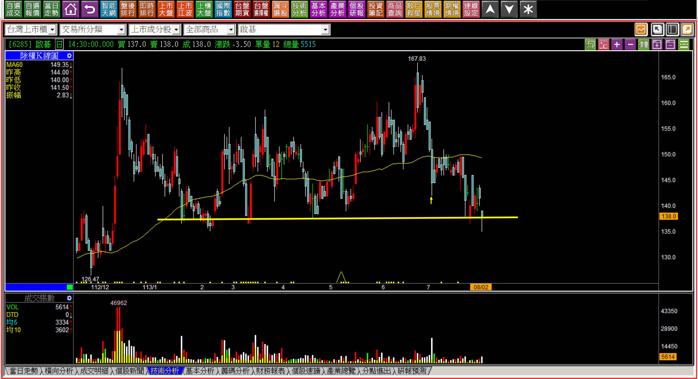
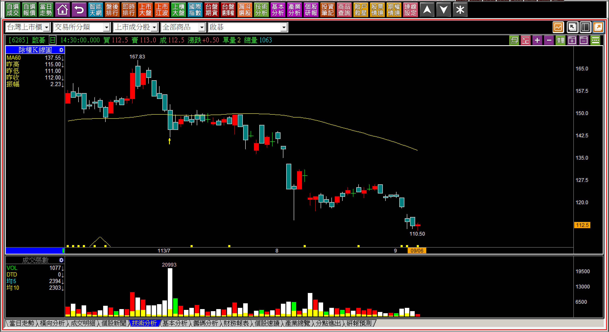
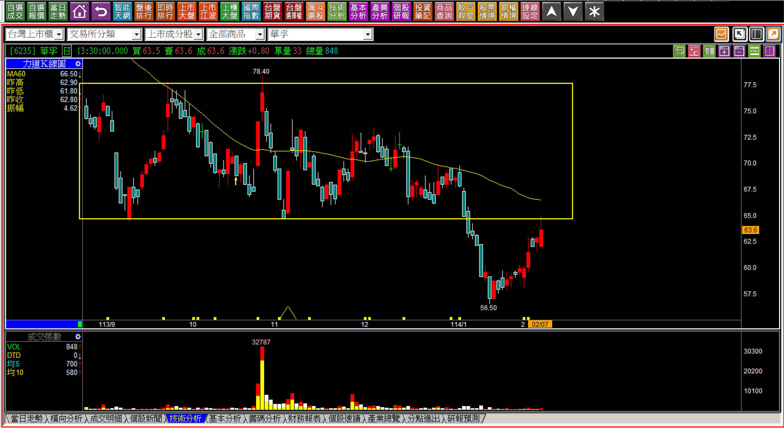
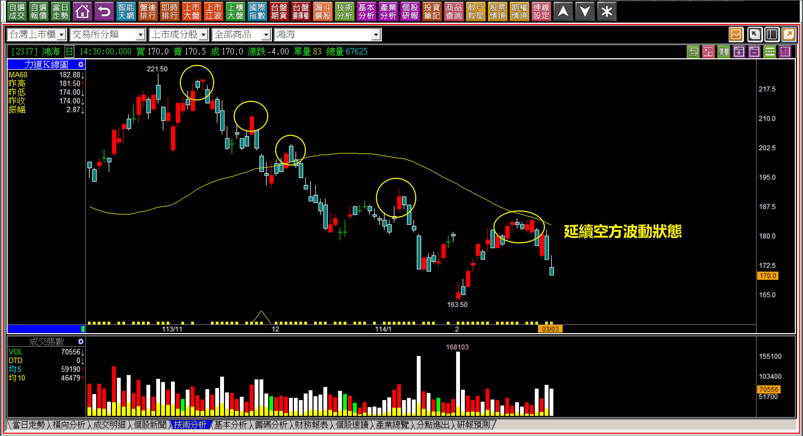
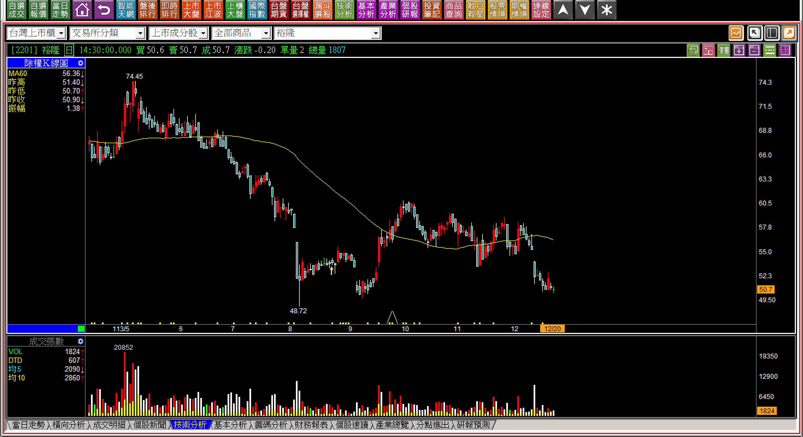
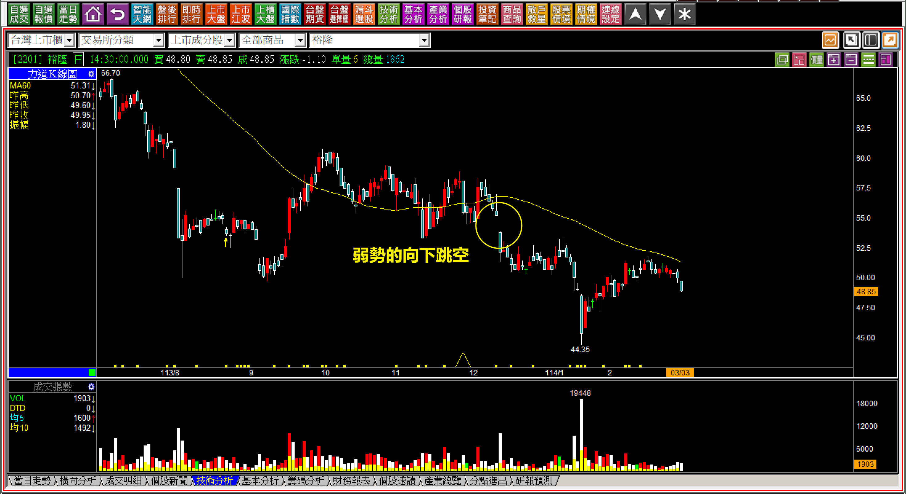
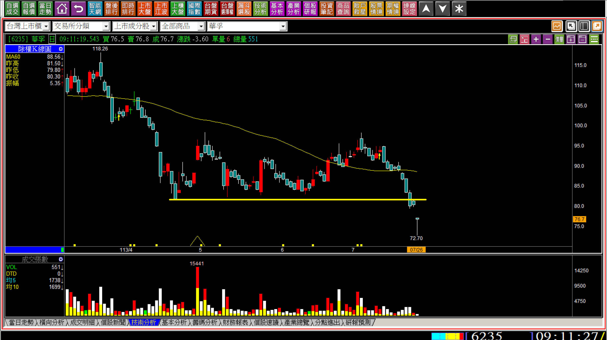
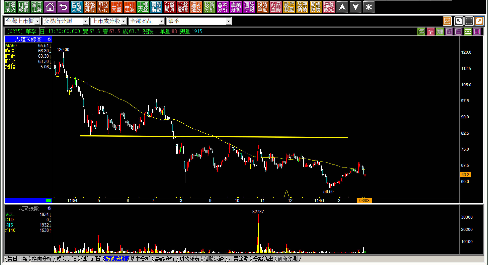

# 【明日K線】「型態壓力」篇

人性在股市裡有一個顯著的麻煩，就是不自覺的期待「運氣」，例如股價明明看起來已經知道會「易跌難漲」，但是因為正在虧損套牢中，就改成期待會不會有機會再往上走一下，讓自己可以賣得更高一點，往往也因為這樣，結果損失得更大。

這無關判斷能力，因為本來就已經可以判斷出來了，只不過行為上並沒有機械化的執行該有的交易準則，所以平白無故的多損失了更多，就變成了一種賭徒心態。

要改變人性的問題其實也沒這麼簡單說改就改，了解自己的障礙之後，下一步就需要輔助，用「絕對的認知」解決知道卻沒有做到的問題，而其中，「型態壓力」算是最簡單的，就是面對K線一段時間的型態，看出股價的天花板阻礙。獲利有限、風險無窮，再笨的人都不想冒險，偏偏股市裡人性卻會如此，想說能賺一點點也好的心態。

這一點改變之後可以化解很多不必要的損失。

**型態是一種市場的資金態度**

跟趨勢相同，型態是透過資金的態度形成，例如某個價位市場資金覺得過高了，就會在還沒有到達這個價位前就紛紛賣出持股，時間久了，頭部的型態就漸漸成形。

**這也就是型態壓力的第一種：頭部壓力**

**113-05-09文曄(3036)**

季線下彎後前低跌破就是頸線破了，破了頸線就會形成頭部的壓力。判斷起來很簡單，但是真的持有的人，遇到這根黑K，往往就變成不理會型態壓力了。

此時應該想著明日之後，K線會變成怎樣呢？標準答案是會不會大跌不一定，但是這個壓力的存在讓持有股票的風險遠遠大於機會。

**114-02-20文曄(3036)**

從頸線的跌破開始就需要對「明日」起，有正確的認知，心態上不宜賭賭看有沒有例外，不過事實是大多數投資人只要被套了，就會呆掉了，繼續持有等待解套。

**113-08-02啟碁(6285)**

比較多人慣有的毛病是再三確認。

明明有沒有頭部？有沒有套牢？一眼就已經看得很清楚，但是就想問確認看看到底哪一個低點才是頸線？或者跌破又拉上來一下算不算跌破？這一類的問題都顯示心態上是想再賭一下運氣，說不定只不過是被大盤帶下來的。

只需要想一件事，如果真的有主力在意，股價會被大盤帶下來嗎？此時很多人又會開始想到很多例外，這就是人性。明日K線不細談人性問題，而是對於明日起走勢的判斷。

**113-09-06啟碁(6285)**

短短一個月就跌掉28元，不是跌完才開始感嘆，而是在頭部出現時，這就是可以判斷且避免的。

**第二種：反彈阻礙**

第一種是頸線跌破後直接下跌，第二種接續著頭部壓力的出現確認，等到股價跌破頸線之後一段時間，出現了反彈，卻遇到頸線不會越過。

反彈阻礙其實是頭部壓力的明日K線角度，也就是說跌破頸線之後，就算股價出現了反彈，也可以理解頭部的壓力就是股價的天花板。只不過這裡還要再加上一個要點：股價已經遠遠高於公司基本面價值。

假如基本面並不算差，只不過是沒有主力拉抬的，不在此限，這就表示，以前飆漲過有主力拉抬過的，這個反彈阻礙就會更加明確，這是股價在跌破頸線的時候，就已經可以梳理出來的未來走勢。

**114-02-07華孚(6235)**

這是比較典型的反彈遇到了頭部，是有碰到頸線的範例。

**114-03-03鴻海(2317)**

除了頸線的型態壓力之外，空方波動也是很常見的反彈阻礙，不過反彈阻礙指的是上一次的高點都沒有再過去，下一次的判斷就是上一次的高點，那個位置代表的是買反彈者的意圖頂多就到那裡而已，過不去是很正常的，越過去了才是波動狀態的改變。

**第三種：弱勢下的跳空**

向下跳空往往給人一種「突然來的」感受。在沒有發生前都還沒有意識到假如出現會是怎樣？所以明日K線談到弱勢下的跳空指的是先有「弱勢」，然後跳空。

**113-12-20裕隆(2201)**

股價來到前低，「幾乎」就要再創新低，當然是弱勢。弱勢之後如果再往下跳空，就是一種腳深陷流沙的感受，很難掙脫，交易或者投資都不應該讓自己陷入這個窘境：「明日」就有可能困在這裡。

**114-03-03裕隆(2201)**

網路上有很多類似「名人」推薦股票的文章影音，我個人並不討厭那些人，只是不喜歡這種方式，害得投資人買低、買拉回，長期套牢。所以我會有很多評論看起來就是對這些東西有意見，其實不是，而是人們如果相信了那些東西，就會失去了判斷能力，基本的避開風險都忘記。

**113-07-26華孚(6235)**

這一條不是頸線，只不過標示前低又跌破的位置，然後出現的一個跳空，一定有人又要談下影線代表支撐了。

事實是，弱勢的向下跳空出現之後，明天開始，上方的套牢區短期內就很難越過了，這些都是型態的壓力。

**114-03-03華孚(6235)**

下影線沒有支撐意義，是題外話，是單一K線的重要認知，型態壓力加上向下跳空，等於雪上加霜，是一眼能夠判斷出來的明確問題所在。

**「型態壓力」是單純的明日K線判斷**

請試想著如果股價跌到了明顯有著大量賣壓的型態「之下」，主力假如持有那麼多股票，他們受得了嗎？假如這家公司股價已經遠遠低於應有價值，法人都視而不見嗎？其實有沒有這個價值，每個人都知道，但市場裡只有散戶會把拉回當作是進場、再次買回的機會。

型態壓力，是很簡單的判斷，明日有哪些可能的變化，都可以輕易地理解，既然有壓力，往往明天開始就是弱勢表現，弱勢包括黑K、向下跳空，都是最有可能出現的K線。