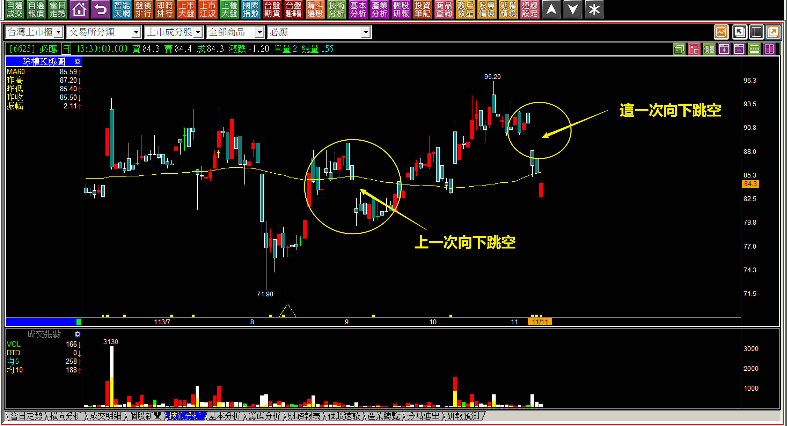
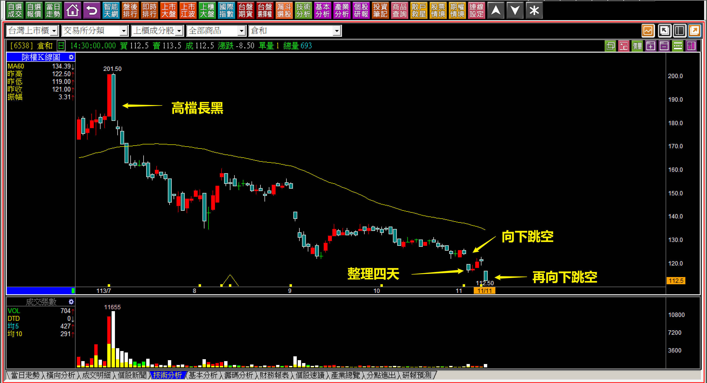
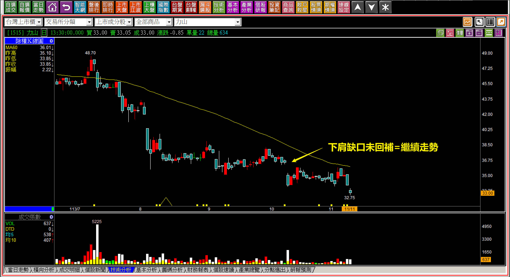
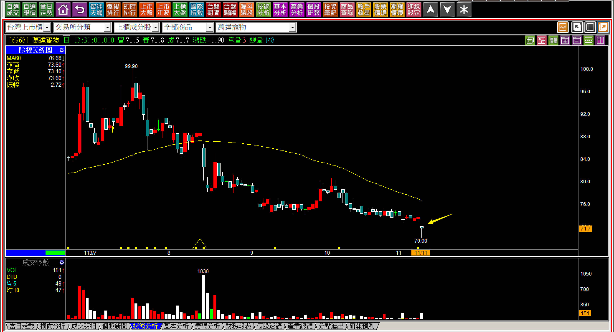

# 【明日K線】出現向下跳空的「下降三法」篇

K線組合的原理中，有「上升三法」當然也就有「下降三法」，但是使用時機下降三法並不如上升三法廣泛，例如上升三法與雙鴉躍空只差距一根，下降三法就沒有這方面的定義。

另外，在日出攻擊時如果遇到了上升三法，中間的兩根整理如果是日落，很有可能會被視之為日出攻擊結束。

定義是固定的，只能作為交易準則來遵守，所以上升三法用途廣泛，可是下降三法呢？沒有，就只不過是用來警覺股價根本就「還沒跌完」。

當然，買進股票就怕跌價風險，所以「風險警覺性」對於交易者來說相當重要。假如堅持不買拉回當然沒有問題，問題可能會出在投資的持有卻遇到了下跌黑K，或者向下跳空，這時就得要留意各種面向，不僅僅不能加碼，有時還要進入危機處理，抵抗人性不自覺的「攤平」，這就是明日K線講解「先有向下跳空，再進入下降三法」篇幅重要的原因。

**下降三法的文字定義：先有下跌黑K，然後整理兩到三天，再往下出現一根黑K。**

本文要解說的是，如果第一根不是下跌黑K，而是跳空下跌，往往會被人忽略了同樣已經符合下降三法的前半段。

**範例說明一：113-11-11必應(6625)**

昨天雖然是紅K，卻是跳空下跌，依然符合下降三法。

先看這一次的連續K線，先有向下跳空，然後整理兩天，昨天又向下跳空，形成下降三法。可是每一次如果都要這樣擔憂，不就等於每一次的向下跳空都要謹慎嗎？

是的，就是這樣，除非缺口被回補，否則這個疑慮都是存在的，這就是為什麼成為明日K線的研判要點了。

**範例說明二：113-11-11倉和(6538)**

先有一根破底的跳空黑K，再整理三天(一共四天)，再往下跳空破底。這些都是還沒有發生之前，或者是五天前往下跳空時就應該要警覺的明日K線推演。

這檔股票真的很慘，從七月初「高檔長黑」開始至今就是一路破底，投資人若是習慣拉回買進，就很可能進入跌價循環，甚至習慣攤平的人，投資績效很慘。

K線是一種市場交易價格的紀錄，熟悉各種組合就是為了不要觸雷，跌價風險往往很大。既然股價已經創新低，還要再學明日K線的研判，就是因為人性有著不甘心的態度，就會想要「逢低攤平」，我們必須反覆學習很多技巧，才能幫助自己至少不要有這種攤平的作為。

**明日K線的推演判斷**

既然說到只要是往下跳空都會有這樣的問題，除非向下跳空缺口回補，這是組合定義上的「下肩缺口」，只是我的教學中不會有這一項，因為不代表任何買進意義，還是一樣得要重視套牢賣壓，這樣就沒必要讓學員或者讀者多學一條完全無關判斷的組合，知道有這個名詞就行。

但是假如缺口沒有回補，就沒有下肩缺口，那就要注意本文再談的向下跳空之後，又來下降三法。

**113-11-11力山(1515)**

因為沒有打算單獨為下肩缺口寫一篇教學，所以這裡就順便說明。

向下跳空出現之後，經過數日走勢依然沒有回補缺口，表示下肩是存在的，意義就是維持弱勢。要知道，空方趨勢出現之後，要繼續弱勢太簡單了，所以下肩缺口知道定義就好。

但是最後又出現了一個向下跳空的破底，這是散戶很容易崩潰的K線，因為已經虧很多了，在大盤還沒轉空之前，如果自己的持股一再的破底，散戶一定是關掉即時盤APP假裝沒這回事，不要看盤的心理，就是我說的散戶很容易崩潰的K線。

在此就有可能經過兩天橫向，沒有回補跳下跳空，然後又再跌一根。

這是明日K線的推演，不是股價一定會這樣走，而是這就是交易的風險。

**113-11-11萬達寵物(6968)**

如果一開始的說明讀者都懂了，那麼這張圖就會清晰，尤其是剛剛才又創下一次新低，是有向下跳空的。

上一次是九月初，不過那一次後來還是有回補缺口，那次是上櫃後第一次往下跳空，顯然這家公司基本面根本就抵不上這種股價，不過就是承銷商很厲害的順利承銷上櫃而已。

不要以為有下影線就是有支撐，這是錯誤的觀念。

如果已經理解了下降三法，這裡的定義是相似的，向下跳空之後如果整理兩三天再往下，依然符合下降三法的組合，投資判斷一定要謹慎，不能有買低當作佈局而承擔跌價風險的態度。

**事後補充：113-12-20萬達寵物(6968)**

這就是採用明日K線判斷股價的原因，需要對股價有可能走勢的見解。