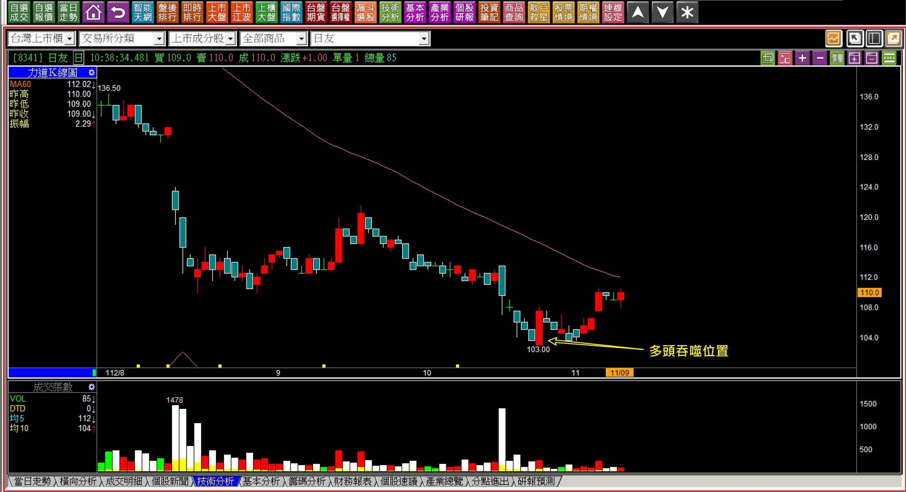
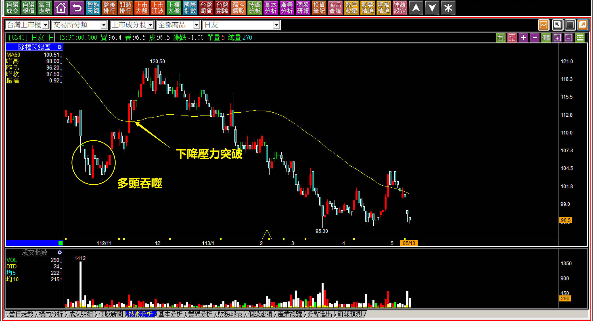
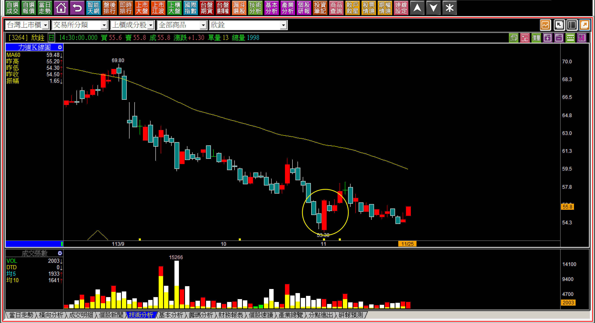
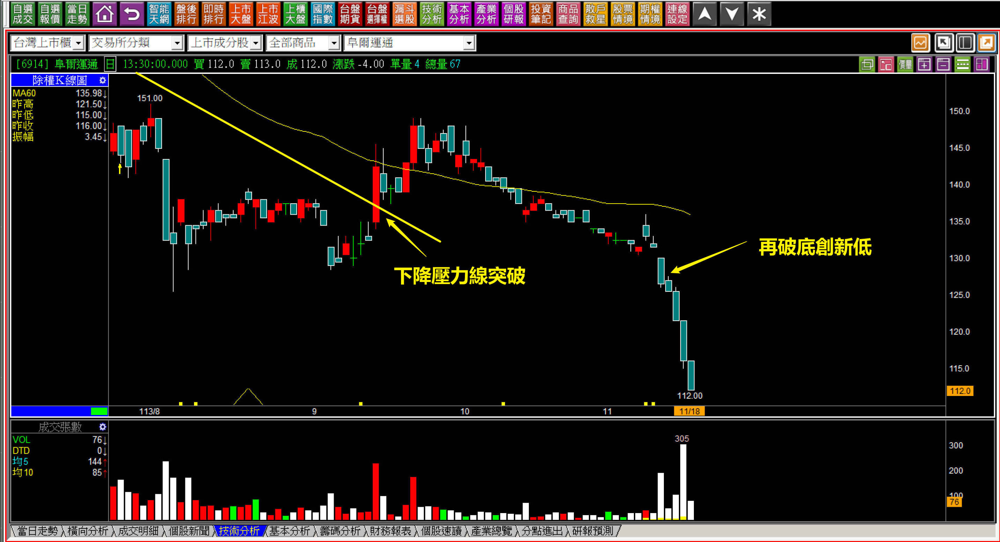
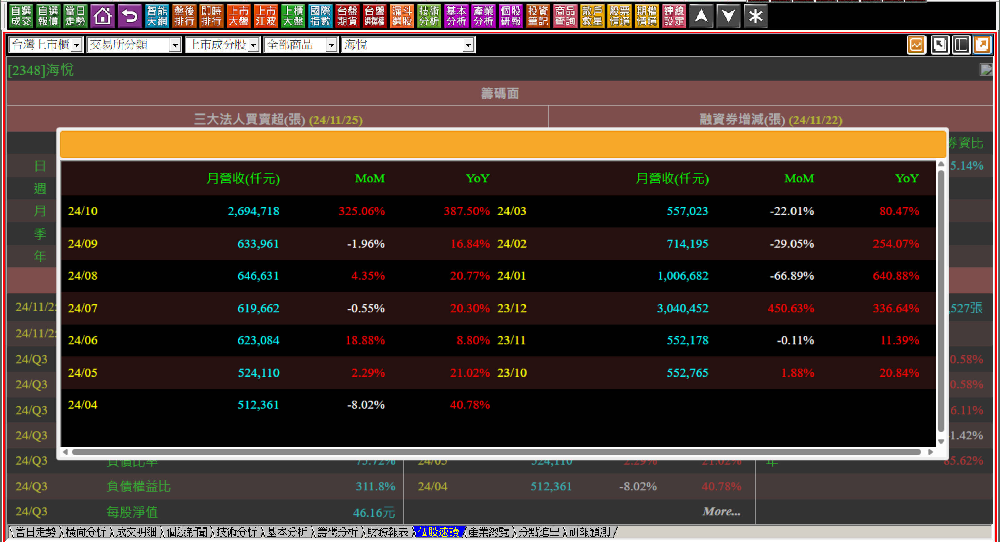

# 【明日K線】「空頭買在趨勢改變」篇

單純討論定義，買點有三大定義：

**一、空頭買在趨勢改變。
二、盤整買在突破。
三、多頭買在攻擊。**

這三個定義中，「多頭買在攻擊」是攻擊K線的起始原理，通常也是股價最強勢的一段。而停損點是「攻擊假設失敗」或是「不打算攻擊」，停利點是攻擊結束位置，這一段在與攻擊K線內容有關的篇章中以往至少寫了33篇，算是K線教學的收官單元，也是交易者用來取得最終價差利潤的重要技巧。

第二項的「盤整買在突破」，採用的是型態學的頸線突破原理，股價經歷了賣壓化解之後，突破頸線、突破買進，結束了盤整的格局股價轉向多頭。假如突破頸線之後，股價的上方還有更高價的套牢區，就得要重視套牢賣壓，賣壓越重，股價上漲的阻礙就越大，假如頸線突破之後，距離大量套牢賣壓還有很大的距離，就稱之為「賣壓中空區段」。

唯獨第一項：「空頭買在趨勢改變」，很多人都會有誤解，以為股價的空方趨勢「結束」就可以買進。並非如此，而是**假如遇到了我們投資的評估，股價已經低於應有價值，打算進場做中長期投資，那就必須要有的基本認知：至少得要等到空方趨勢結束才可以進場。**

或者說，買股票不應該在股價的空方趨勢進場，當然，這個買進方法採用者是因為投資目的，不是因為價差交易。

「假如在這樣的空方趨勢被突破，卻拿來作為短線價差行不行？」被問到這種問題，我都很無言以對。如果要用行不行來回答，那就沒有不行的，你愛怎樣買當然都是自由，買在空方趨勢結束之後，當然沒有不行，只不過要立刻看到股價就上漲，並不容易。假如持有股票等待了一兩個月，就為了賺點價差，心態上就會變成不停損，不停損當然不妥，因為股價很低，但如果基本面變得更差，股價就會再破底。

**經典「股價低、基本面變更差」範例**

在112年有一檔經典例子，股價出現了多方轉折的多頭吞噬，結果基本面差到股價根本就撐不住這個低價，就是日友(8341)。

**112-11-09日友(8341)**

出現了多頭吞噬之後，剩下一個問題，就是再差一根紅K，股價就要突破下降壓力線，這一檔曾經281元高價的個股，已經跌掉三分之二之後，終於迎來趨勢的改變，且低點還有多頭吞噬出現過。

**113-05-13日友(8341)**

最終股價依然撐不住，再次破底，原因就是只有3.4元的年度每股盈餘，基本面撐不住百元的股票價格。

所以我們必須先有認知：既然空頭買在趨勢改變的原理，是基於投資，就得要檢視每股盈餘，看看股價是否有投資的價值？假如沒有，不能只背誦這個定義，就一廂情願的買進。

**多方轉折之後的「明日」K線**

多方轉折同樣基於力竭原理，表示原本空方趨勢的結束，所以也可以被視為投資位置，基於投資目的，這就考驗了每個人對於基本面的判斷能力，假如這個價位已經低於應有價值，那可以進行投資，卻不能期待股價買了就會漲。

**113-11-01欣詮(3264)**

多頭吞噬的範例很少見，不過還是會有，當多頭吞噬出現之後，明日起的判斷要點就是：『股價不能再破底』。因為破底，表示基本面還有我們不知道的壞狀況。同時也不能期待股價會馬上就開始漲，這不是攻擊，只不過低檔夠低有資金願意進來投資而已。

**113-11-25欣詮(3264)**

事隔將近一個月，股價依然低檔震盪，投資目的的人還是存在著股價再破底的停損風險。

**113-11-18阜爾運通(6914)**

曾經突破下降壓力線的阜爾運通，在跌破創新低的原因，當然就是因為財報表現不佳，呈現盈餘衰退的狀況，這就是空頭買在趨勢改變出現之後，明日起的判斷要點。

當然後來盈餘又上升，股價又回頭上漲，這個是後來的財報改變引起的。

**標準的空頭趨勢改變判斷**

**113-11-11海悅(2348)**

為什麼會說這是標準的空頭趨勢改變？

原因只有一個，雖然一樣是破底就是停損的原則，但是海悅當時的前三季每股盈餘超過13元，相當於112年全年獲利，同時十月份月營收YOY暴增325%。

基於這樣的對比，相信應該可以更加明白，空頭買在趨勢改變是原理，股價跌到應有的基本價值之下是輔助判斷，而股價再跌破創新低是停損，就是明日K線的判斷重點所在。

K線技巧的運用，最重要的就是這些重點，並非選取自己愛用的原理就當作買買依據。

附帶一提，後來央行第七波信用管制，讓新建案銷售遠遠不若去年，所以海悅(2348)的每股盈餘下滑，股價又再次破底。

相信講到這，大家會更加理解「空頭買在趨勢改變」只是邏輯上的定義，是投資目的至少要等到空方趨勢結束再說的意思，『再說』，指的就是還要考慮其他面向，例如看起來基本面很好，但環境如果正在改變，有可能基本面還是會又受到影響變壞一次。