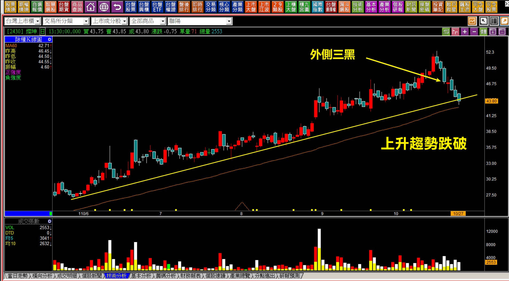
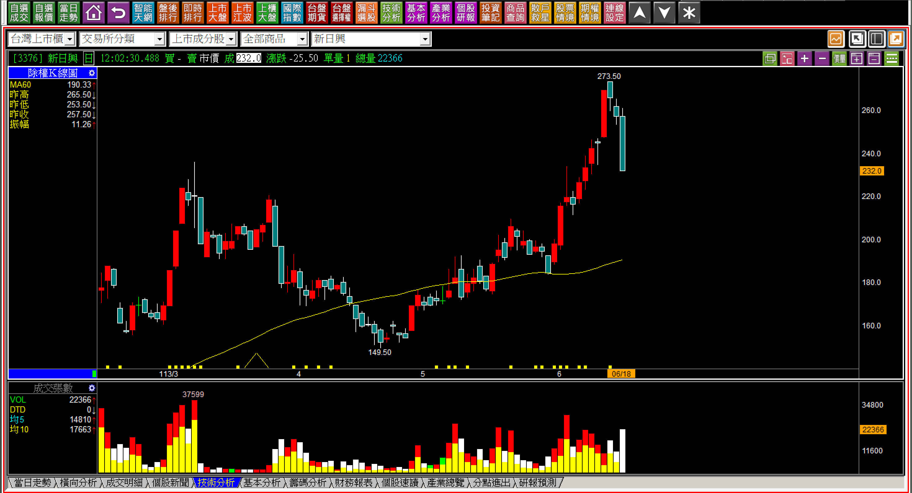
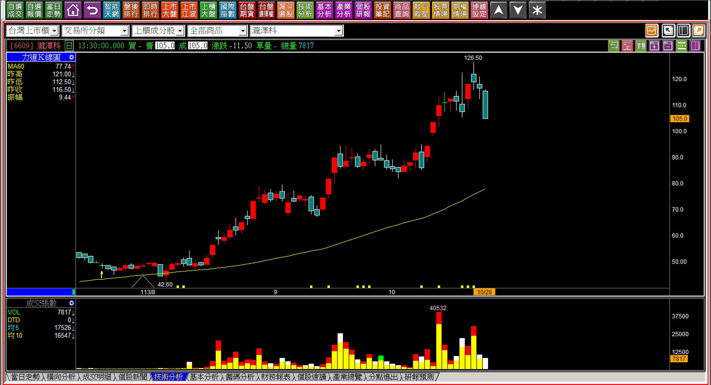
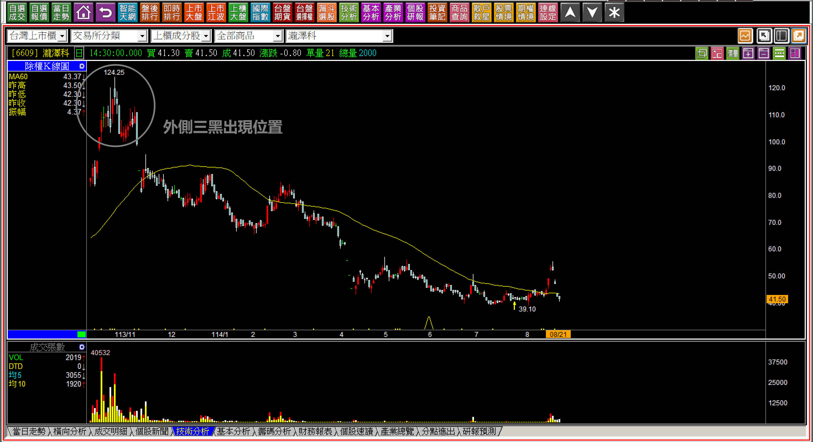
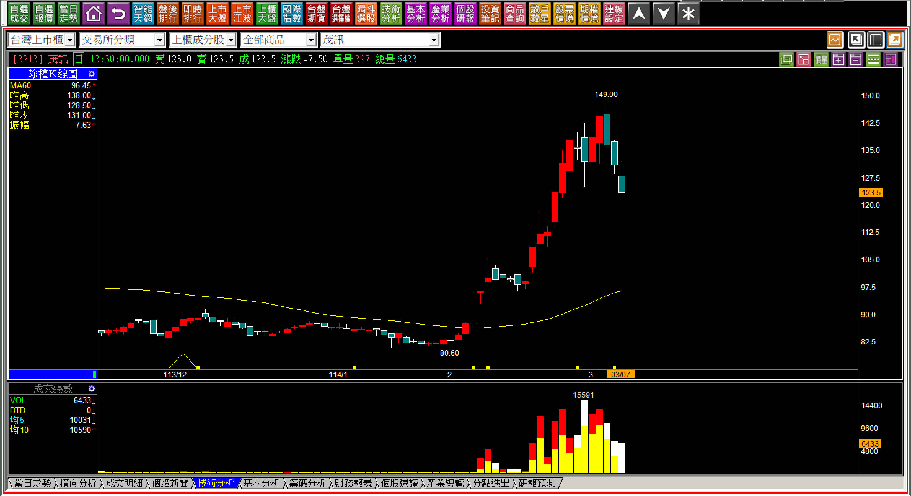
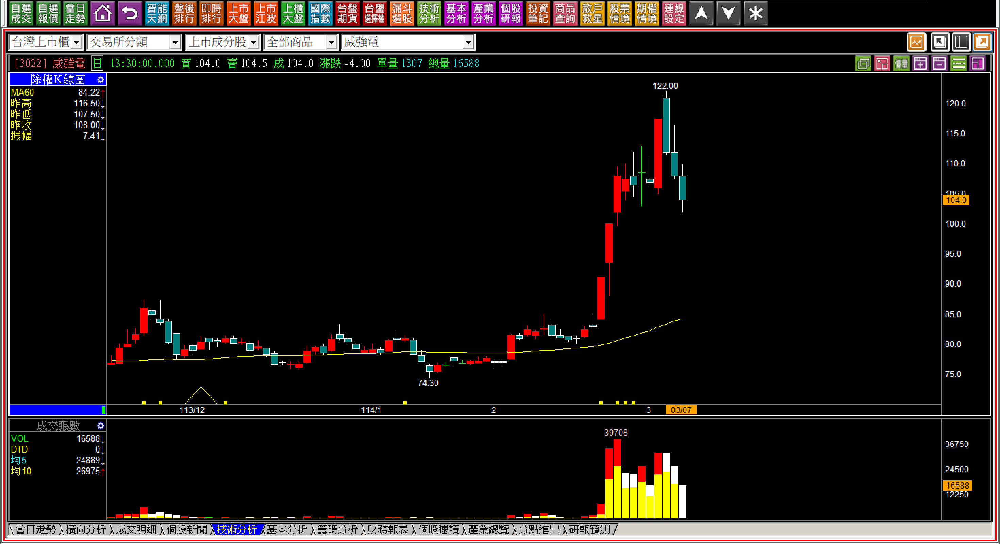
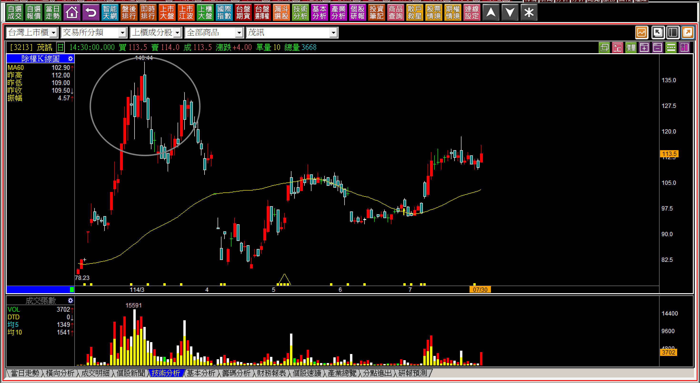
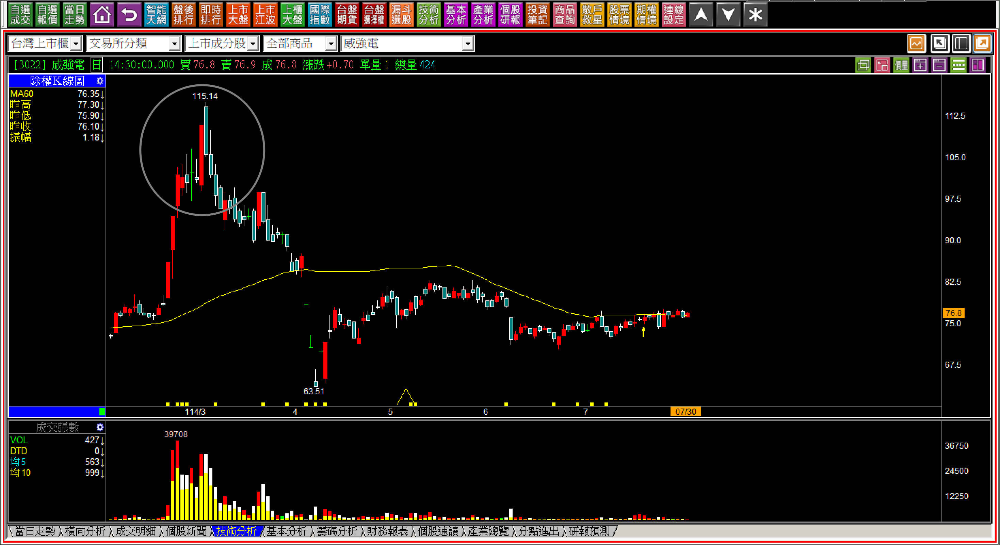
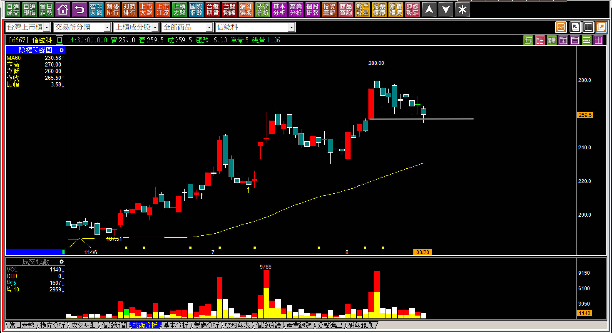

# 【明日K線】「外側三黑出現」篇

通常在股價的高點，如果一個投資人順利的高檔賣出之後，會不會想要等股價有低檔再買回來？

這是很普遍的投資心理，通常回檔幾天後這個高價賣出過的人，會進場把當初賣掉的部位買回來，因為人們會自我安慰，以為高賣出後低買回，這樣就是在「做價差」。

「外側三黑」之所以在空方轉折中有地位，主要的原因是「回檔過深，連最後一根高檔紅K低點」都跌破。力量方面的檢視，三黑才跌破最後一根紅K的低點，當然沒有單純的一根黑K吞噬來得大，但是因為是沒有跳空缺口的三連黑，表示有一定的籌碼連續賣了三天，是怎樣的結構狀態會導致於手上有股票的人連賣三天呢？

當然是手上有很大部位的人賣的，所以如果之前已經有明確的多方拉抬走勢，這時候手上有大部位的，顯然就是過去拉抬這檔股票股價的人，你也可以簡稱之為主力，但是是誰並不重要，重點是本來是多方力量的人，現在轉變為空方力量了。

這就是外側三黑的意義，不是單純講講「黑三兵」就能理解的。題外話，坊間教科書愛說的紅三兵、黑三兵完全不具備任何意義，但是幾乎每一本教K線的書都會談一下這個，是很奇怪的事，說不是彼此抄來抄去，那就純粹是一直發生的巧合了。

**對外側三黑「明日起」的判斷**

既然散戶的心理是拉回買進，所以如果外側三黑出現，當然就在這三根等同於實質賣壓，所以接下來的走勢判斷，就得以此作為第一個套牢區段看待。

**110-10-27燦坤(2430)**

K線上，外側三黑出現過後，這裡就是第一個套牢區，接下來股價都不再回到高檔，是正常的大單慢慢出脫走勢。

背景呢？股價走出中期多方，是因為疫情的遠距教學需求，民眾不得已得為子女添購電腦設備，又只想便宜考量，對於這些電腦通路來說，剛好清出庫存，把本來只能當成庫存的商品變成了現金，每股盈餘上升，股價就來一波多頭了。

外側三黑出現代表的籌碼開始出場的意義，也就是多方力竭，加上了這個背景就會變得很容易理解，其實股價變化本來就不難明白原因。

**外側三黑出現的時候**

**113-06-18新日興(3376)**

發生外側三黑的時候，計算一下最高點以來的價差已經有40元，這通常是高賣出低買回的人已經可以滿意的幅度。缺乏轉折組合力竭觀念的人，就會誤以為是個高賣低買回的價差機會，實務上的判斷，這裡已經開始出現賣壓區段，同時再檢視過去，股價有過明顯大幅度的拉抬。

站在多方拉股價的主力角度，總有一天要出貨，這裡已經是力竭意義，明日起已經很難再創新高。

**113-10-28瀧澤科(6609)**

這張圖四天前的創新高上影線很令人玩味，因為在沒有量增的狀態之下，股價既然創新高，又為什麽有這個必要來一根散戶會警覺的上影線呢？原來當天台股是開盤向下跳空下跌的。

隔日再往上攻，表示主力需要繼續耗費力氣，這也讓後來的連續三黑達到外側三黑的力竭條件：「先有多方的用力拉抬，然後三連黑跌破最後一根紅K的低點。」

若從高點看這個價位已經有20元的幅度，表示要短線做價差的人，又想要高賣低檔買回了。

**114-08-21瀧澤科(6609)**

不論怎樣低買，最終股價結束在高檔長黑的位置，接下來一路下滑，拉回買進操作的會非常辛苦，這就表示外側三黑出現之後，明天起怎樣都不能忘記多方力竭。

**外側三黑開始的明日K線**

單純的把外側三黑視為空方轉折，學習起來很快，大約一分鐘加上範例走勢就讓人理解了，多數人也就止步於此，鮮少有人會再繼續研究接下來K線的判斷，外側三黑出現之後既然主力已經缺乏拉抬力量了，多方力量竭盡之後，股價回檔的出現極為正常，因為已經力竭反轉。

以下列出兩檔外側三黑的走勢，相信對於明日的判斷應該可以瞭然於胸。

**114-03-07兩檔個股同日出現**

外側三黑是一種連續多日獲利了結賣壓出籠、多方拉抬的力竭意義，通常連續三根黑K後，還沒賣的散戶是不會賣的，還在找機會想要加碼，剛好就是一種不符合攻擊原理的態度，所以外側三黑出現之後，明日起，最重要的認知就是「未來暫時一段時間」都沒有再買進的意義。

以下我把上述範例後來的走勢，統一彙整貼出，方便讀者檢視記憶這個反轉意義的重要性。

當資金離開，股價就回到無人聞問狀態，屬於多頭市場下的副作用產品。

另外補充說明：為什麼外側三黑沒有跌破紅K低點時，如果第四根才跌破，我統一定名為「類外側三黑」，是因為組合K線重意不重型，可能會有人問：「為什麼不單純叫做外側四黑？」

下圖就是答案。

假如最後一根收盤跌破紅K低點，應該要叫做外側幾黑？難道要說是外側九黑嗎？當然不是，所以我們要來理解的不是形狀，而是力量的變化，這不屬於轉折，屬於沒有出現攻擊企圖的型態，明日K線的判斷答案相似，但理論基礎不太一樣。