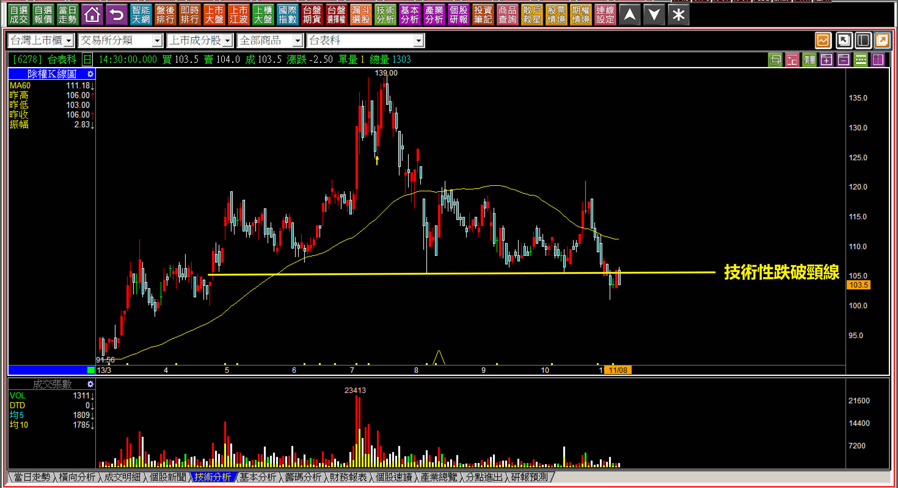
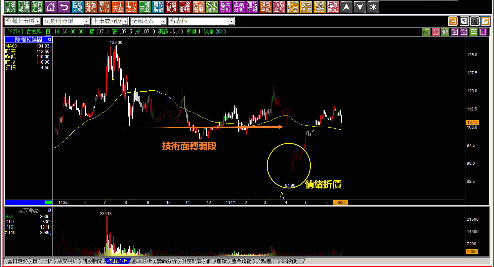
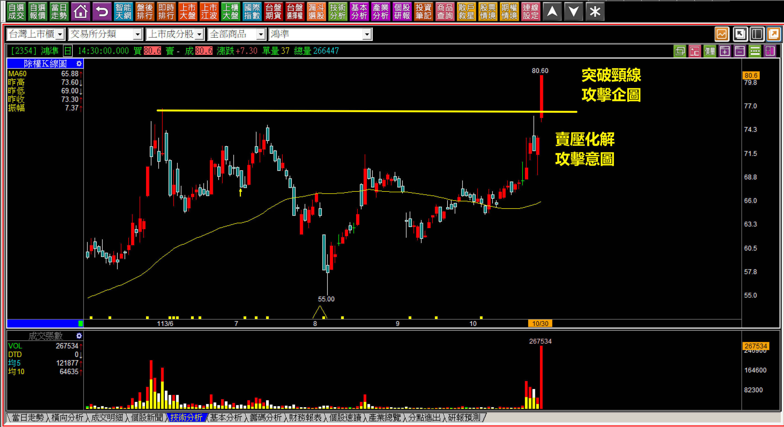
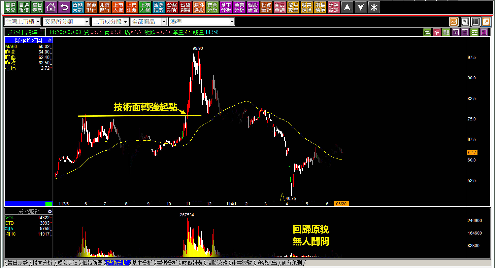
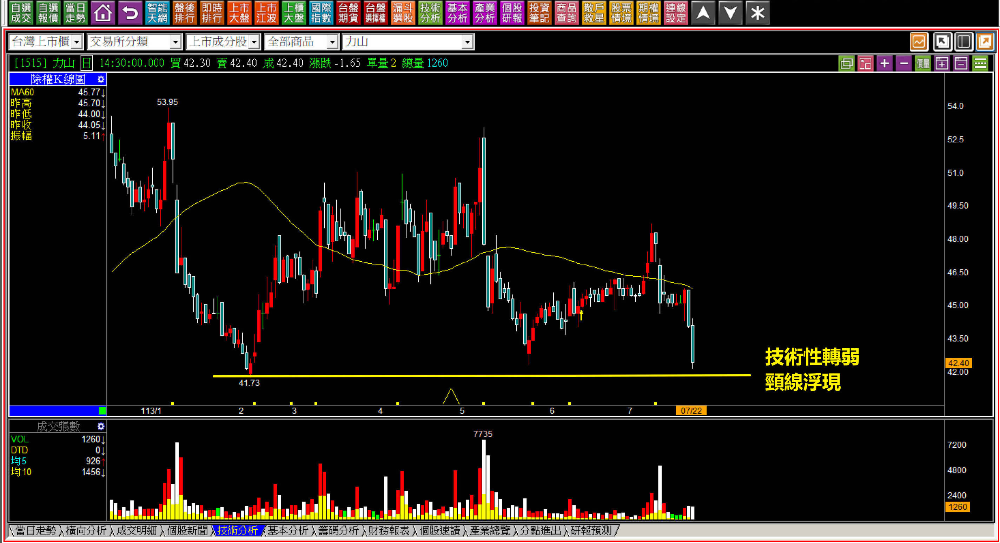
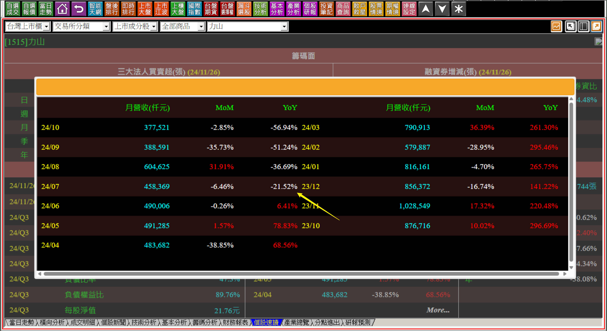
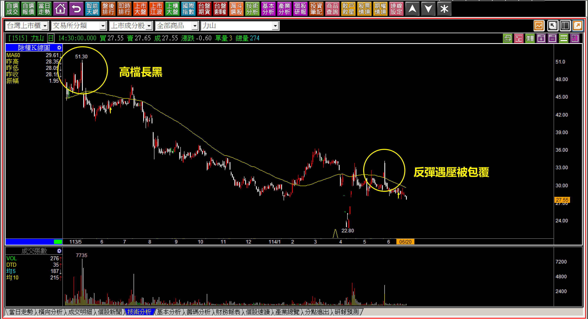
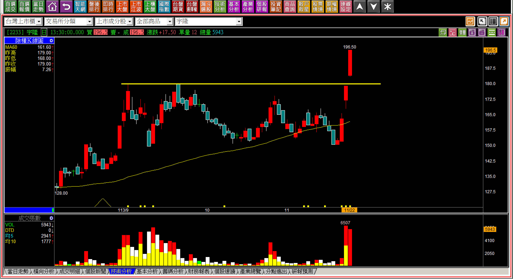

# 【明日K線】技術性轉弱與技術性轉強

這篇教學內容是多頭市場很常見的技術型態，要放在明日K線的篇章有點勉強，因為明日K線在某種程度有點判斷上的急迫性，對與錯、上與下的分歧性很明顯，可是本文主題的「技術性」轉強或者轉弱，決策的急迫程度並不大，更重要之處的是理解出現之後的變化。

所謂的『技術性』，指的就是原因並不是因為基本面。

**先定義再談明日K線**

談一下技術性轉弱，定義是「基本面沒有什麼問題，但是股價走出空頭趨勢」。通常會有技術性轉弱，而不是盤整格局，是因為「資金因素」，表示目前市場上的資金並未對這家公司的未來看好，但是股價也沒有來回上下的必要，意思就是基本面不差但是回檔也沒讓資金有動力想要低檔買進，於是就慢慢往下，甚至跌破了頸線。

跌破頸線之後頭部明顯，就更沒有資金想買了，大盤也沒有帶來任何急迫投資的必要性，個股沒有成長性，月營收也就平平甚至小幅度衰退，說不定哪一天還來個比較明顯的月減，股價就再創中期新低。

看起還好像很慘...但其實也還好，就不慍不火，無人想聞問，就是單純技術性的轉弱。

對比來說就是技術性轉強，定義是「看不出原因的股價創新高」。要說基本面好，沒好到可以用力拉抬，要說不好倒也沒有不好，可是股價經歷了賣壓化解，主力或者法人並不需要太用力，因為長期都沒有太多人注意，套牢也就不重，然後突破長紅，自此爆量創下新高，這就是單純的技術性轉強，當然是因為資金拉抬的因素。

**技術性轉弱的範例：113-11-08台表科(6278)**

研究技術性轉弱的原因，是為了理解公司是不是有什麼我們還不知道的問題，可能會有，可能不會。也可以轉弱的時候沒有問題，但是後來營運變差股價就更沒有理由漲。

技術性跌破，就是技術面轉為空頭，但沒有明確的原因，所以歸咎於市場的資金對股價沒有任何意圖。

**114-06-20台表科(6278)**

情緒折價並不是技術面轉弱的必然，而是系統性風險出現的時候最常遇到的狀況而已。

技術性轉弱，就是與基本面無關，不是因為營運變差了，而是股價上完全沒有任何資金的力量，是一種隨波逐流的弱勢。

**技術性轉強的範例：113-10-30鴻準(2354)**

技術性轉強，就是攻擊，在多頭趨勢的環境中非常常見。

這一天鴻準這家公司發生了什麼事？其實沒有任何事，單純就是股價突破頸線轉強了，明日起就進入攻擊研判，但是繼續面轉強「之後」，股價依然會回歸基本面原貌。

**114-06-20鴻準(2354)**

技術面轉強，就是一種資金匯集的過程，若無基本面成長股的表徵，股價最終會回到無人聞問。

上述要點就是我把這個主題放在明日K線的原因，因為如果不放在這裡，就得一個單元一篇，可是技術面轉強就等於是攻擊的起始，好像又沒有必要單獨成為一篇。

**技術性轉弱的明日起**

技術面轉弱之後，判斷股價變動的重點就會回到賣壓結構，因為理論上大量的賣壓區段就會是股價短期內的天花板，市場的資金在沒有必要的狀態，不會去幫套牢的散戶解套，這種情況尤其是在基本面穩定的股票，散戶拉回承接，卻跌出了空頭時。

**因此常出現：****反彈遇壓，然後下跌。**

假如接下來的月營收開始明顯有幅度衰退，股價就會更弱。

**113-07-22力山(1515)**

台股的歷史新高是在七月份創下，力山是在112年就見高開始轉弱。尤其是五月份的高檔長黑出現之後，股價等於一波比一波低，已經確認這是技術性轉弱的走勢。

七月份的營收是八月份才公告，也就是當時還看不出來基本面有變化，就已經技術性轉弱，所以面對這種結構的線型，就要留意當營運轉差的時候，股價會更弱，當初的技術性轉弱，要注意的重點就是型態壓力、營收狀況改變。

**114-06-20力山(1515)**

高檔長黑是在這個畫面，其實這兩個位置都是反彈遇壓包覆，都是股價轉弱的現象，也就是技術面轉弱的起點。

**技術性轉強的明天開始**

技術性轉強就是攻擊，所以先有停損點的確認，然後檢視股價的攻擊態度，是唯一的應對方式，需要完整的學習攻擊K線，很簡單。

**113-11-22宇隆(2233)**

技術分析沒有機率高低的分別，只有市場資金要拉或者不要拉的確認。

所以明日起如果不攻擊，就要非常謹慎的應對，等到攻擊失敗就出場，攻擊態度強烈就要等到攻擊結束再離場，現在回頭看股價當初是漲一段然後停止，但是在突破遇到技術性轉強的時候，並不知道以後會怎樣，這才是交易判斷的關鍵。