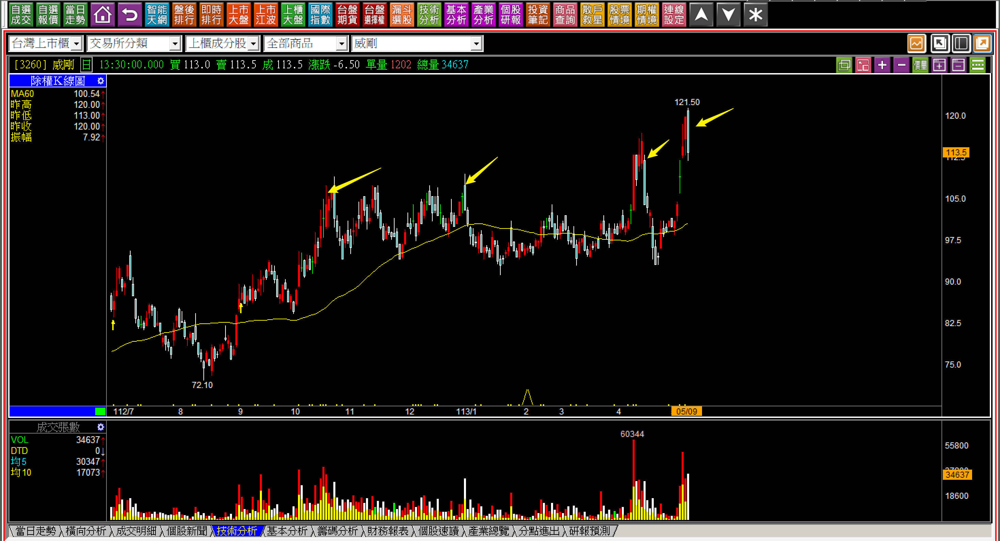
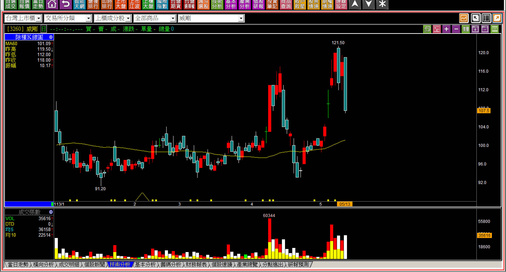
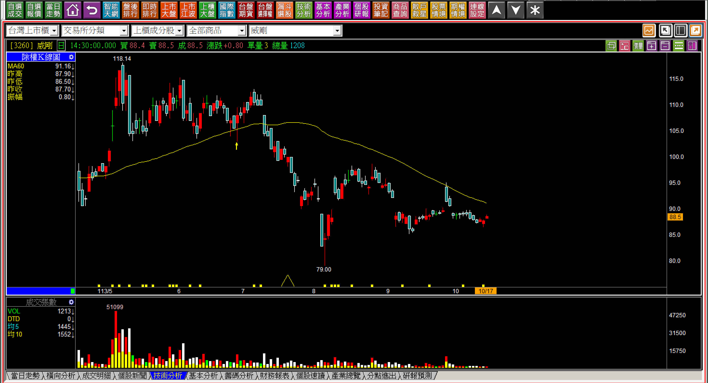
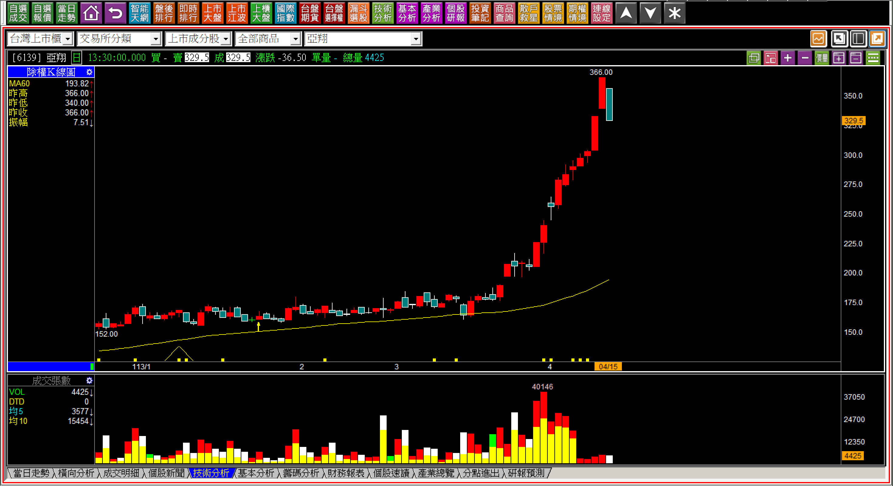
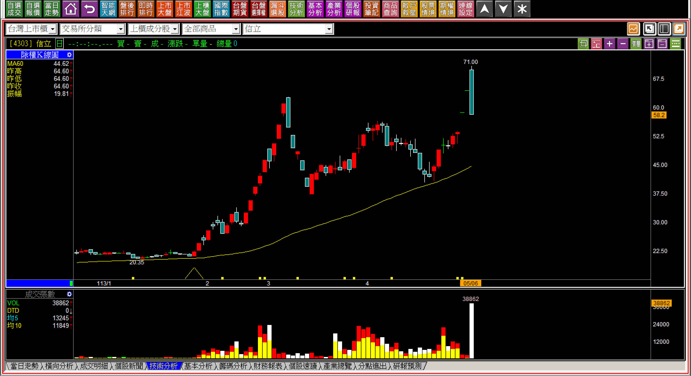
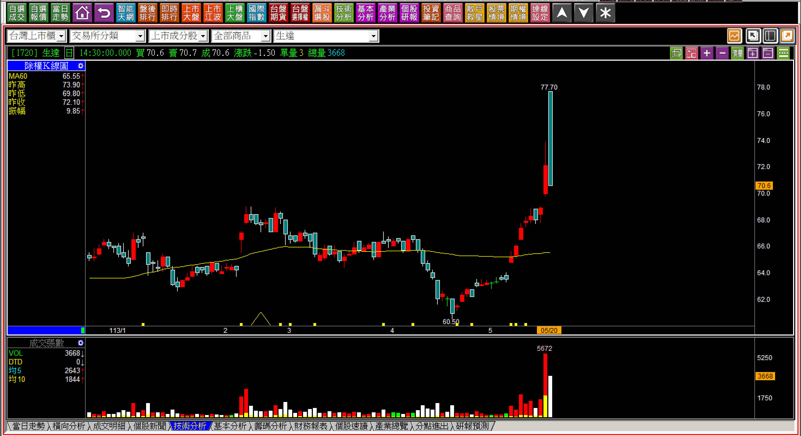
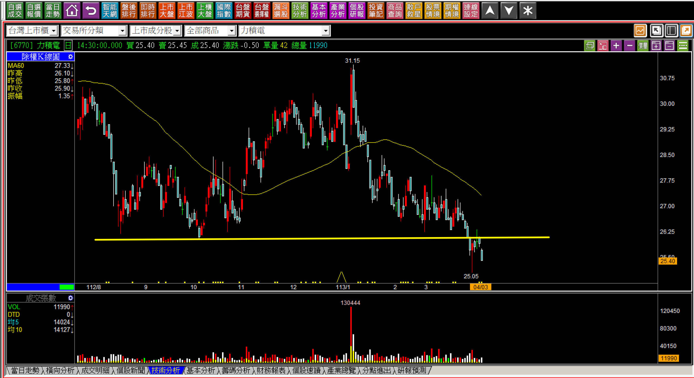

# 【明日K線】「當黑K出現的時候」篇

作為單一K線中最基本的項目之一，黑K與紅K相似，都是極具判斷「力量變化」的一種K線，此處力量上的意義雖然不如「跳空缺口」來得大，但是長紅與長黑，往往是反轉或者力量持續進行的表現，卻也是力竭的可能。

如果今天發生了一根黑K(或者一根紅K)，對於明日開始的判斷，今日的位置與變化越關鍵、明日越容易理解。因此一定要先知道的是紅K的組成與黑K的組成要件，再透過不同的位階來做進一步的判斷，這樣明天的變化就可以了然於胸。

**短期內持續出現黑K的節奏**

第一根創新高價的黑K出現的時候，我們當然不知道以後還會出現幾根，或者股價會怎樣的變動，只能依照目前看到的股價表現來解釋其變動，對於高檔位置出現時，不能視而不見。最佳方式就是回顧過往，股價創新高之後，有怎樣的慣性表現。

**113-05-09威剛(3260)**

依照股價「不攻擊的慣性」，加上市場上出現該公司營收成長的利多，假設大家還不理解「HBM的外溢效應才導致於記憶體廠商有短期的營收成長」這件事，這根黑K的出現也已經有標準答案，高檔長黑、包覆、實質有賣壓出現，自此已經可以確認的是，利多之下反而出現長黑，就是一種「股價沒有打算再往上走」的型態。

明天開始，不能期望股價還有高點，即使是大盤在這種狀態屢創新高，那也只是台積電帶來的指數榮景，個股不會一定跟著大盤一起上揚。

**113-05-13威剛(3260)**

兩日後，加上這根黑K是經典的吞嚥型態，不僅證明了兩天前的對於未來的觀點正確，眼前這一根黑K等於是再加了一層套牢，因為月營收、好消息，股價卻拉回讓市場散戶接籌碼，就完全跟攻擊原理不相符。不過基本面沒有很糟糕，短時間內很難直接大跌，反而讓人失去戒心，這根黑K雖然同樣代表著易跌難漲，漲少跌多，加起來看，就會是價格重疊度高的K線連續走勢。

**113-06-04威剛(3260)**

除非是打算每天在幾元的漲跌中衝來跑去，不然這種上下振盪沒有任何意義，直到這一根黑K，就能感受到實質賣壓到底是怎樣在處理股票的，也感受得到黑K的力量，算是明日K線的最基本研判。

已知就是117元附近的賣壓真的很重，接下來(明日起的K線)就會繼續一樣的震盪，能夠判斷出答案還是一樣，也是對這根黑K的理解。

**113-06-12威剛(3260)**

這一天，台股突破22000點再創歷史新高，會採用這樣連續的走勢來做講解，是要說明黑K對於交易者的效果，就是判斷出在某一個價位實際上是存在著籌碼出脫者的態度，也是明日K線需要單獨慎重的列出主題的原因，以下再補上近期的走勢，用來回顧當初對「明日起」的判斷有多重要。

**113-10-17威剛(3260)**

如圖，趨勢已經轉入空方。

**簡易的高檔黑K明日起判斷**

高檔出現黑K時，對於一般人來說，直覺就是可惜，只感受到「要是前一天有賣掉就好了」，價格差距已經出現，心態就很快轉變為「期望可以再漲一下來讓自己有高可賣」。

**113-04-15亞翔(6139)**

日出攻擊結束的黑K，是單純且容易理解的力量結束，不論接下來有沒有立刻下跌(那是主力出貨方式的問題)，這一根黑K結束了這檔股票最後一段強勢，因為最後這一段日出攻擊把股價推漲八成，當然是不合理的表現，基本面沒可能一個月內有這麼大的質變，那就是主力來炒作這一段而已。

明天開始，這一檔股價將會是「風險遠遠大於機會」，因為未來會再拉抬一次的機會，幾乎已經完全消失。

**113-05-06信立(4303)**

這是一種很獨特的做法，第一次強烈的日出攻擊，用空頭吞噬的方式來結束，再因為某些消息再拉一次，看似越過上一波高點，隔日就用長黑來呈現。這一根黑K如果前一天是紅K，本來可以定義為高檔長黑，因為上下震幅也超過10%。

不過還好，任何人都不至於笨到前面都沒買，等再次新高兩根一條線之後開盤才衝進去，所以需要理解的是股價來到了高檔攻擊過後，主力做樣子、演演戲，都是很常見的手法，投資人會去看很多形狀故事，沒想過這些都是演出來的。

**113-05-20生達(1720)**

當創新高價的黑K線幅度可以超過10%，就會有人在其中受傷重，因為當日拉回買進者，往往有兩種人：被盤面樂觀氣氛影響，感覺做個短線風險不大；早盤高檔有先賣一趟，盤中看已經有6%以上的回檔，以為可以來做價差，誰知還跌到當日最低，一天之內就又損失超過5%。

股價當然不會隔日馬上就連續崩跌，因為短線被套者，往往看到又有幅度大跌，就會再攤平，反彈就都解套賣掉，因此這種黑K出現之後，接下來就是有反彈但是幅度小，有回檔但是跌不深，把所有套牢者繼續卡在那邊。

**可以作為明日走勢推估的黑K**

黑K到處都有，隨時可能出現，但是要研判黑K之後的走勢，得從兩大方面著手：

**一、遇壓反應。
二、反轉意義。
三、跌破頸線。**

前兩種就是我們談到的兩大範圍，黑K出現之後都可以依照當時出現的價位來作為未來的壓力判斷，即使是反轉意義的包覆長黑，股價再來一次又出現長黑，也是賣壓的意義，次數越多，表示未來的障礙就越大。

跌破頸線則很單純，不用太多的判斷，就是趨勢改變，頂多再加上一個反彈到頸線就回檔了的遇壓變化而已。

**113-04-03 力積電(6770)**

**型態學的空方反彈說明圖**

如上圖右，頸線的意義當然是跌破代表進入空方趨勢，上圖右就是跌深反彈卻越不過頸線的標準走勢。自此，股價就會進入中期空頭，且破底容易，因為遇頸線壓力下跌，一眼就能懂，就會失去了低接買盤，如果此時大盤還是多頭，那就會更慘。

資金有太多選擇可以操作交易，誰來理會這種獨自翻空的個股？因此容易不斷的破底創新低價。所以，黑K出現的時候，是重要的判斷時機，偏偏一般投資人都想買低買拉回，當時正是黑K。