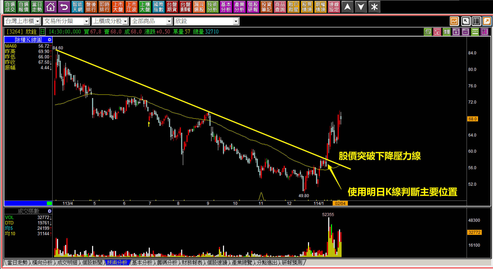
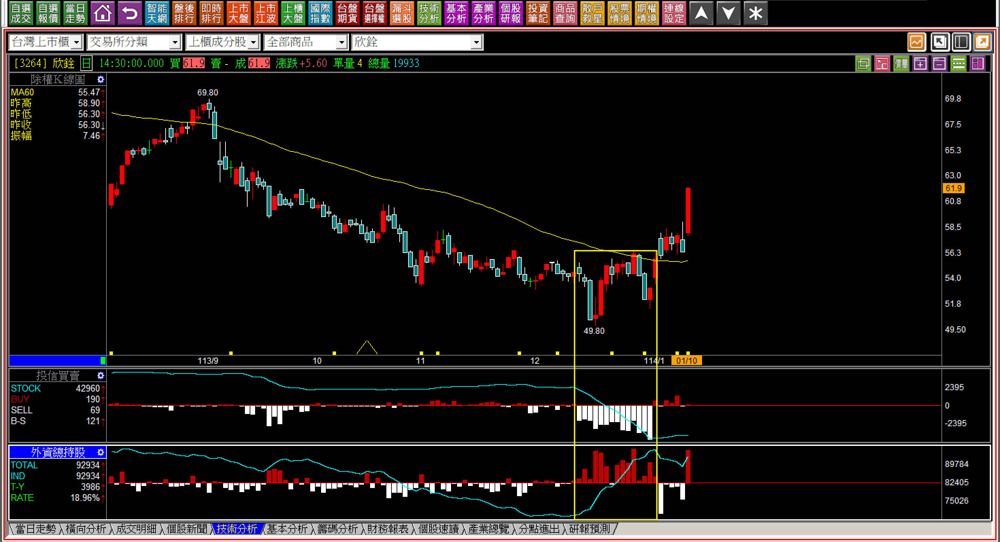
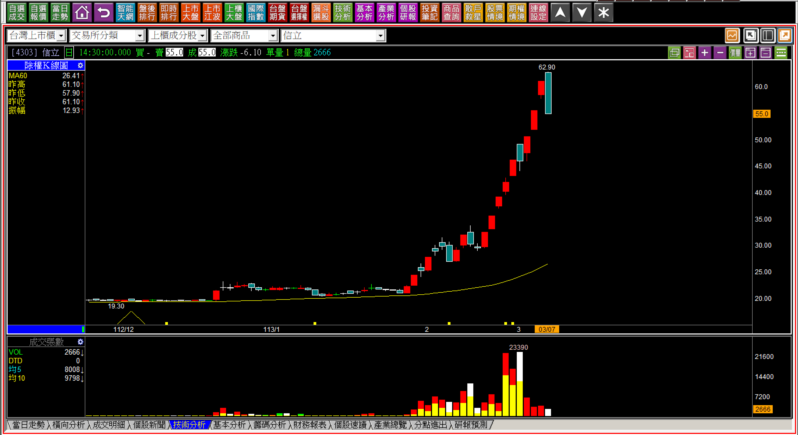
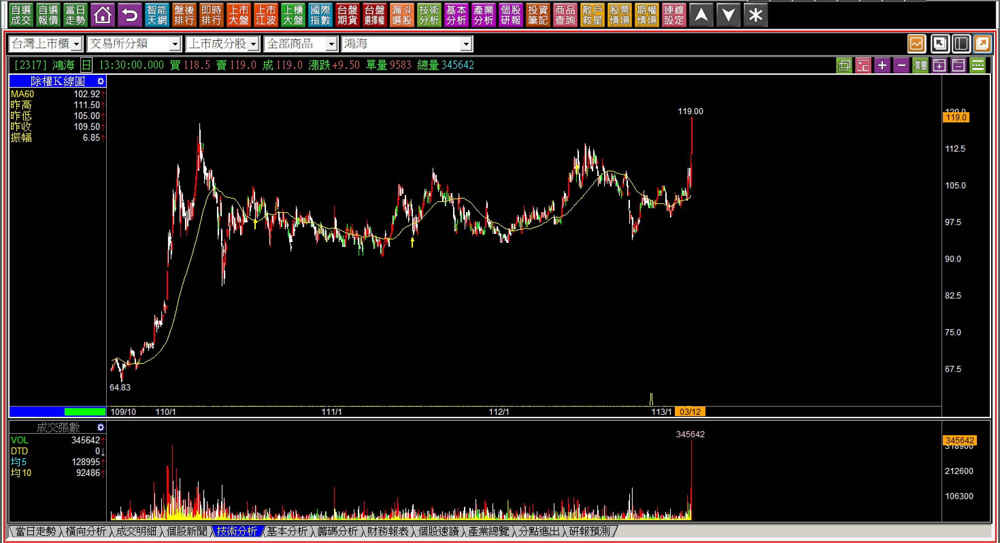
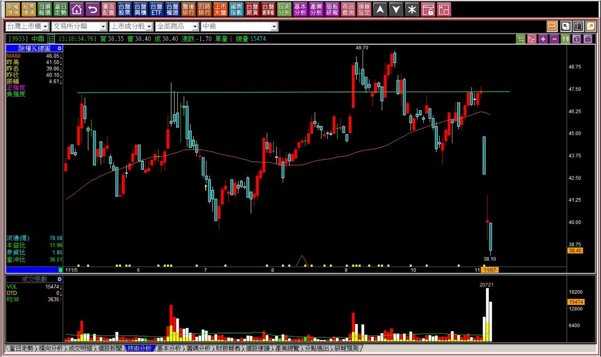
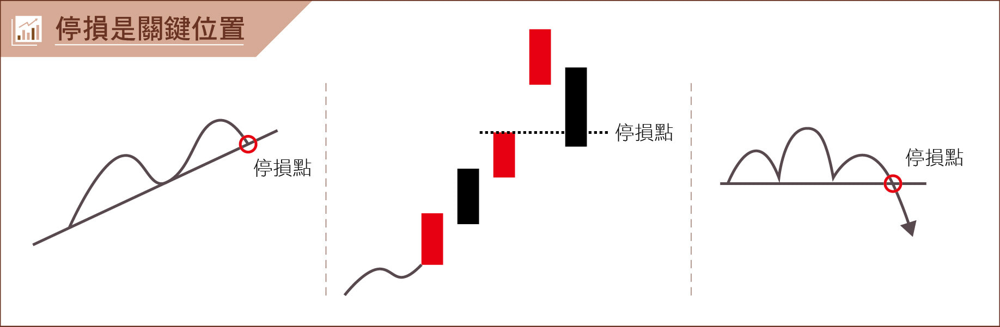

# 【明日K線】「關鍵K線」篇

關鍵K線算是非常基礎的K線理論，源自於「趨勢型態」與「趨勢改變」，最簡單的定義就是「趨勢被改變那一天」的K線，白話的說，就是這一根K線的前與後，趨勢已經是不一樣的狀態，這一根就可以稱之為關鍵K線。

定義雖然簡單，執行好像也不難，只不過人們的交易判斷並不重視這一天的重要性，以明日K線來說，這是不得已的動作點，只要發生了關鍵K線，隔天照樣依照改變之後的方向前進，就不能沒有作為，例如突破下降壓力線，就是原本的下跌走勢結束了，只要隔天不再往下，就已經不能再看空。

**下降壓力線突破就是關鍵K線位置**

**113-09-24上海A股**

無法預測未來，但是下降壓力線突破之後，代表的就是趨勢已經不再是空方。

市場有許多人說，要掌握到這次大陸股市的上漲是不可能的。這是一種站在想要買在最低的說法，當然不可能，世界上沒人可以預測最低點，如果有，就不需要工作了。對於交易市場來說，最重要的就是看得懂且確認改變位置，不是找低點。所以從這個位置開始，明日起就等於是被嚴重壓縮的皮球往上彈，初期的力道一定會非常大。

這是明日K線可以預期到的範圍。

**114-02-04欣詮(3264)**

事後看與當時看，感受截然不同，所以才需要在關鍵K線發生的時候，已經知道「明日」之後的走法代表什麼意義。

**114-01-10欣詮(3264)**

回顧關鍵K線出現的日子。

在欣詮的例子中也牽涉到複合式判斷，這是過往教學過的ETF的荒謬與外資的佔盡便宜，加上關鍵K線的出現，成為明日K線的重點項目。

**空方轉折出現是關鍵K線**

**113-03-07信立(4303)**

原本的多方拉抬，因為轉折K線的力竭意義，使得原本的趨勢改變，可能是轉為空方，也有可能轉為整理，意義上就是趨勢的改變，就稱之為關鍵K線。

值得補充說明的是，多空轉折組合這個課程的原名是「多空轉折關鍵K線」，但是因為很多人以為，轉折高低點才叫做關鍵，這樣會使得學員對於關鍵K線產生狹隘的誤解，並不是多轉空或者空轉多才叫做「關鍵」，而是只要趨勢變了的那一根，都叫做關鍵K線。

所以明日起，股價就會不在呈現原本的趨勢。

**頸線突破當然是關鍵K線**

**113-03-12鴻海(2317)**

為什麼總要花時間研究型態學？因為在當下，持有股票的人可能會因為過去三個月的上上下下走勢，養成了一種低買、高賣的心態，以為這樣叫做價差，時間久了忘記了頸線突破的定義。

型態學中的頸線，突破位置當然叫做關鍵K線，因為趨勢已經從整理轉變為多方趨勢。

同樣的道理，假如又跌破頸線，交易準則上設定為停損點，同樣也是關鍵K線。

**突破後馬上跌破也是關鍵K線**

**111-11-07中鼎(9933)**

上圖的綠色線，就是頸線，股價突破頸線之後，很短的時間之內又跌破，表示關鍵K線跌破就是回到整理趨勢。

可能有人會想，那跌破之後如果再突破呢？這一點在型態學中沒有答案，因為整理區間擴大、增加了突破之後的套牢，所以就算再突破也必需要考慮新的套牢，只得再等到創新高賣壓化解，這個位置往上的關鍵K線意義已經不大，反而是在跌破的意義，回到整理態勢更加明確。

自此頸線變成了實質壓力，反彈變得很難越過，是當初又跌破頸線時就得要留意的地方。

關鍵K線的用途，通常是作為停損、停利點的判斷使用，關鍵K線的定義是這個標準的原理，如果股價的趨勢改變了，明天開始會依照『改變後』的方向前進。