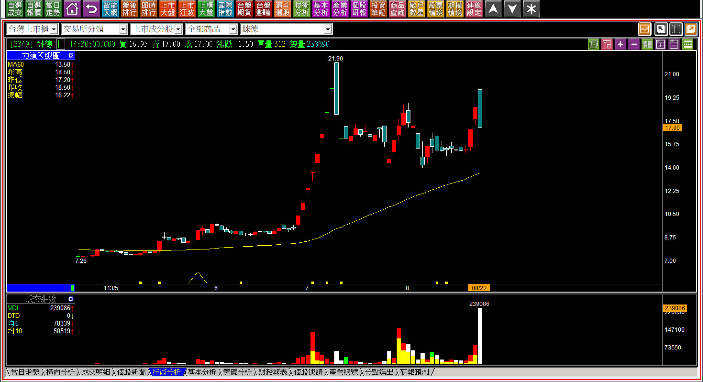
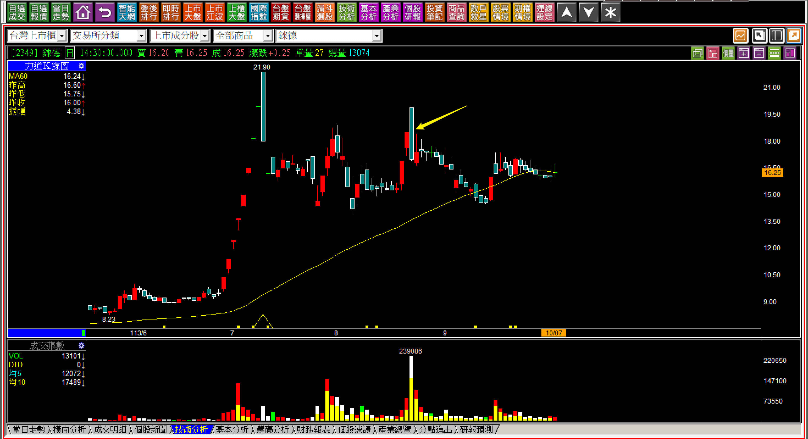
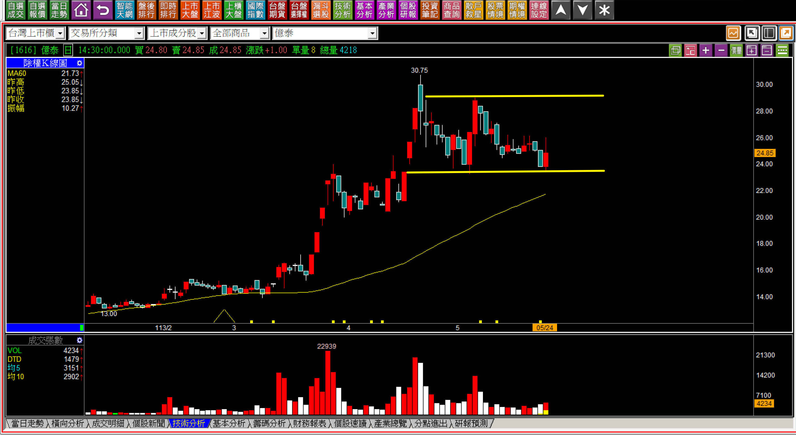
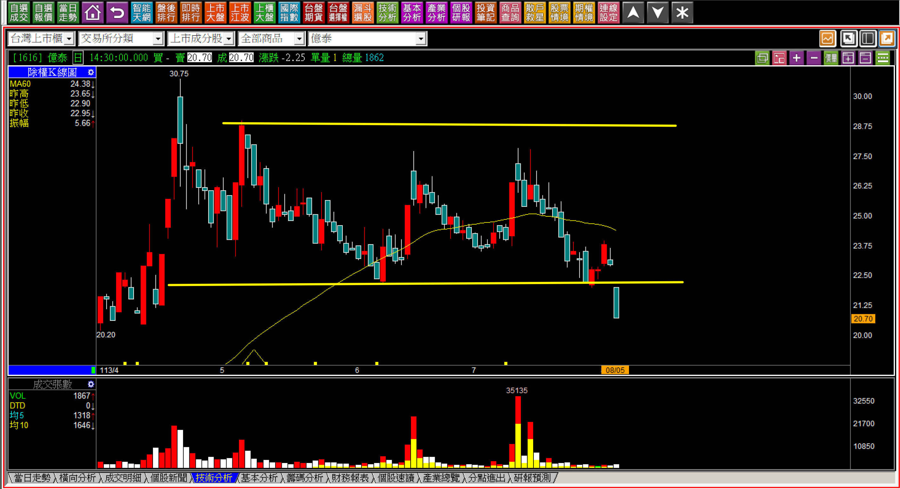
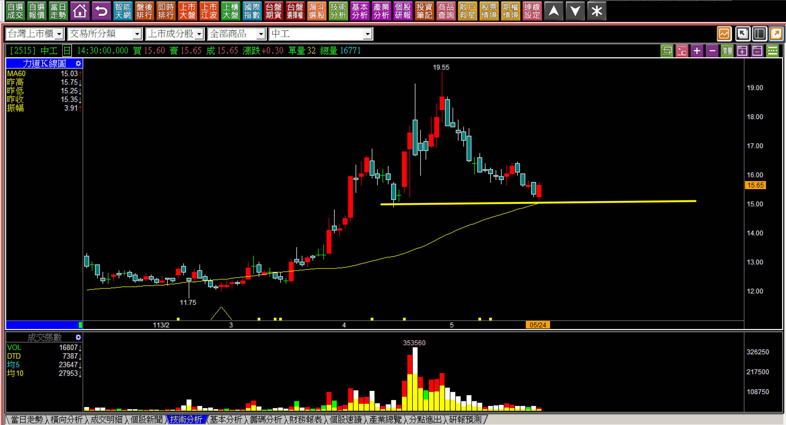
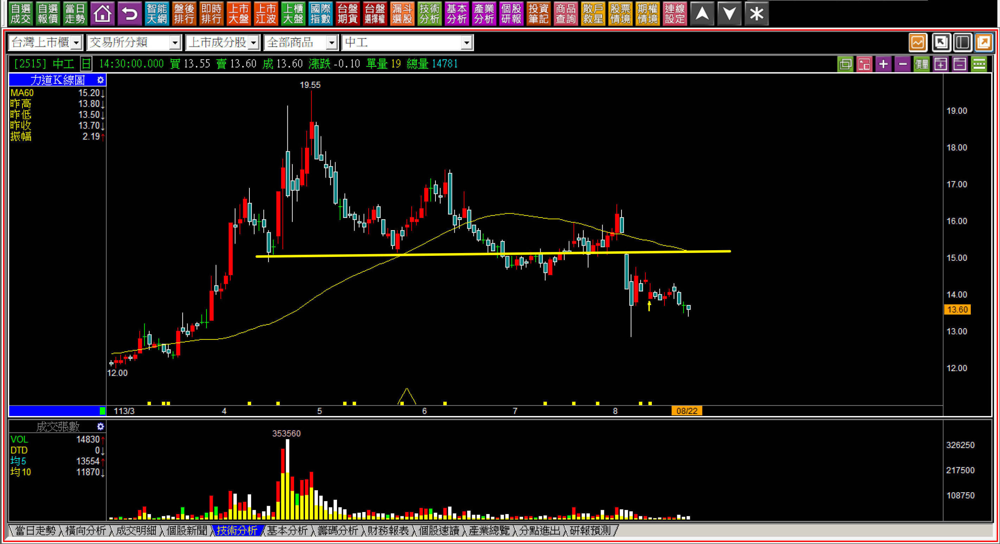
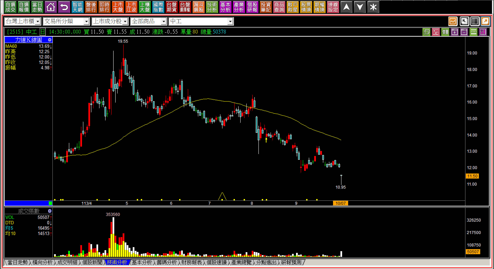

# 【明日K線】「低價股的處理節奏」篇

低價股之所以是低價股，是有原因的。

當然，每股盈餘低落是主因，會有每股盈餘低落的問題，當然就是營運不佳，有可能是產業屬性，也有可能是公司經營問題。例如中環、錸德的光碟片，科技進步之後儲存裝置已經進步到了外接SSD硬碟，多媒體光碟片也逐漸式微，網路付費可看影片劇集，租看的DVD不再受到重視，出租店、販售店都經營不下去，那麼光碟產業當然就沒有未來，連光華商場要找到賣光碟片的商家都困難了，可是公司股票還在市場交易。

電視越做越大，價格卻越來越便宜，十五年前32吋電視大約三萬元，如今三萬元可以買到55吋的聯網電視，先不討論我們是不是被三星算計在美國提到、是不是被京東用低價競爭，既然沒有利潤，面板產業當然很難賺錢，可是電視卻沒有消失，所以這個產業變成景氣循環，股價當然長期會是中低價股。

這些就是產業、公司營運的個別原因。

**明日K線的角度就是今天開始看明天**

以低價股的未來研判，就需要知道，如果沒有營運的質變，股價要漲成中價股有難度，也就表示不會變成高價股，頂多就只有一段漲勢而已。因此判斷上與話題產業，主流個股都不同，也就是如果低價股出現拉抬的狀態，就要有一個認知：**強勢之後，****股價不拉抬就得離開。**

股票市場往往存在著「賽局理論」，意思就是競賽本來是有一個制式的獲勝邏輯，但是某些情境之下，對手的反應才是擬定策略的重點，股市中，低價股就需要採用賽局理論來思考，也就是散戶介入容易，有點利多就進來玩一下，當然跌價往往會加碼攤平，等於是：**越跌籌碼往往越亂，除非主力尚未出貨完畢。**

倘若如此，主力也不會讓回檔過深的股票再飆一次，而是呈現高檔上下來回震盪，逐步下跌，不會幫散戶解套，也不會讓短線客低買高賣賺價差。

所以對於低價股的正確操作邏輯是，「第一次的拉抬結束」就可以離場了。後面的區間整理不需要再摸，不需要想佔主力的便宜，因為不見得每一檔個股都一定還會有一次高檔區間整理。

**範例說明：錸德(2349)**

相不相信，以上圖的股價，頭痛的就是主力，因為錸德不會有夢，只不過是主力在市場熱絡時期玩過頭，連個位數的爛公司也敢拉一倍，現在麻煩大了，主力自己出不掉，就期待散戶會來玩個短線參與，這樣他們才能出貨。

依照我們在實戰K線中教學過的「回檔、反彈、包覆黑K」，應該可以看出這天超過23萬張的成交量，就是主力引誘市場散戶的一種假動作，其實這個價位存在著很大量的賣壓，不能量縮，投機股量縮散戶看得懂不會去玩。

低價股如果遇到這種狀態，明日起，處理的節奏就是離場而已。會用在明日K線的單元說明，是因為有時候低價股不見得都向錸德這樣連年虧損，有的還會有話題、題材、產業景氣輪到了，人們就此失去了戒心。

**113-10-07錸德(2349)**

對於明日開始的判斷，就是股價依然會波動，但會越來越低，這也是對低價股該有的處理節奏。雖然事後對股價的評論看起來簡單，但是在當時的黑K出現之後要當機立斷，對於一般人持有來說，總會還是希望可以漲一下再來賣。

**銅價是原物料很愛的題材**

對於原物料的個股，常常是報價上揚，股價就來跟著漲一段，散戶被訓練得會這樣看，卻因為低價而逐漸失去了風險意識。所以低價股只要有主力進去玩，對於K線的判斷就更吃重判斷的實力。

**113-05-24億泰(1616)**

拉抬過一段時間之後，主力如果出貨不順，除了在市場上放利多消息，不然就是假裝內線，像是什麼公司派要做到多少、誰認識公司高層，說要拉到多少錢這種。最常見的，就是高檔開始做出區間的假象。

以這張K線來說，很顯然就是這樣的目的，讓人們在上一次的低點看到了支撐的假象。需要提醒的是，技術分析只有壓力判斷，沒有支撐的邏輯。

明日K線指的關鍵，就是這個區間下緣，跌破就等於宣告主力已經出貨完畢了，只不過公司並未營運虧損，既然已經是低價股，操作會有風險，但是不至於崩跌到面額。

**113-08-05億泰(1616)**

「箱底買進、箱頂賣出」可以算是網路上最可怕的誤謬了，因為人們不敢追高，所以自然地以為主力有一種拉高出貨的方式，事實上散戶不想追高，主力怎麼有辦法拉高出貨？正常的出貨是讓散戶買在失去警覺的地方：拉回、箱底、支撐。

所以判斷的要點是靠近了箱底時，**明日開始就不可以跌破**。

**假意的題材充當低價股的話題**

這是在多頭市場裡，會讓不完美的利多看起來完美的範例。中工就是個營造公司，因為做了土城AI智慧園區的工程，就被市場當作「AI概念」，這不是笑話嗎？理智的人都懂這樣哪算AI？但是散戶看了新聞卻信了。

要知道，低價股往往套的散戶更多，因為股價便宜，失去了戒心，拉回買進，更低再攤平是最可怕的地方，因為不管價格，跌幅都一樣是10%，你買了30張跟中價股買3張是一樣的成本。

**113-05-24中工(2515)**

說拉抬其實沒有拉很兇，但是只要是拉抬，主力總會想著未來如何出貨，但往往因為是低價股，散戶就失去了戒心。所以當碰到前低，股價就反彈的話，表示主力已經在準備出貨的狀態，也就是說，對於未來的走勢，只要跌破這一條線，就是主力已經出得差不多了。

這就是「低價股的冒險」，也是「明日K線」的判斷重點。

**113-08-22中工(2515)**

雖說處理的節奏是，還沒跌破之前，有高就出一出，可是會有多高？根本就預測不了，只能說盡可能地不要去留著風險，當然，多頭市場盡量減少低價股的交易，應該就可以避開許多不必要的麻煩。但真正做了，K線上的判斷，主力在出貨低價股時，有時候會比中高價股好出，因為散戶以為低價股風險比較低，有低散戶就會選擇攤平，其實買低不會比較安全。

有時候只是讓自己套更多而已，直到最後又變成了長期套牢，相信低價股不攻擊時，明日K線的判斷簡單且容易避開風險。

**113-10-07中工(2515)**

有的人會想，或許有一天股價有可能因為實質成長再攻一次，這樣就不屬於明日K線，屬於夢想了，那萬一沒有發生的話，應該怎麼辦？這可能是「期望解套」的人應該要思考的問題。