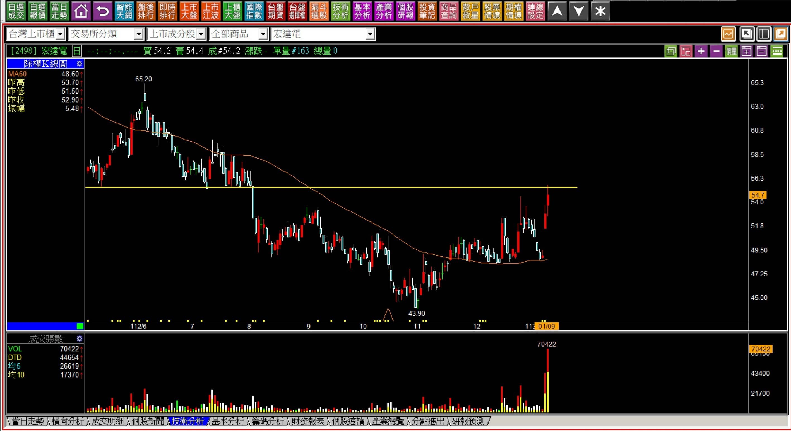
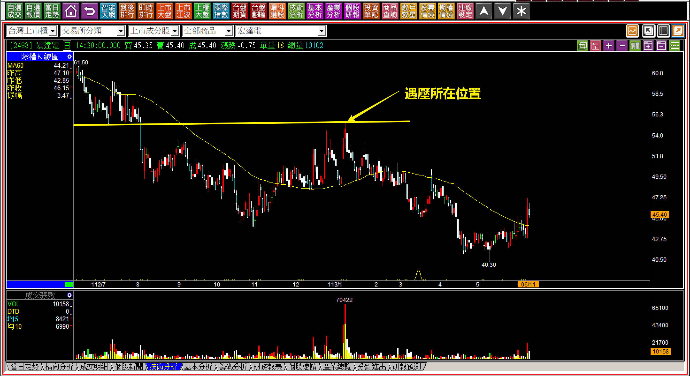
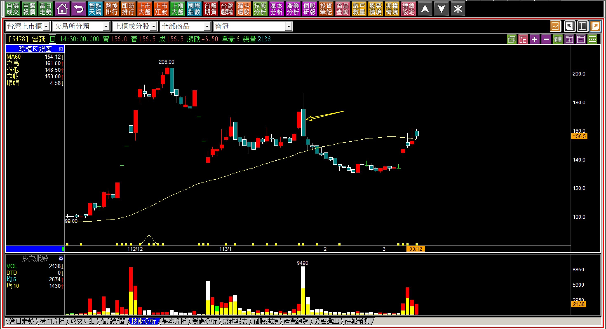
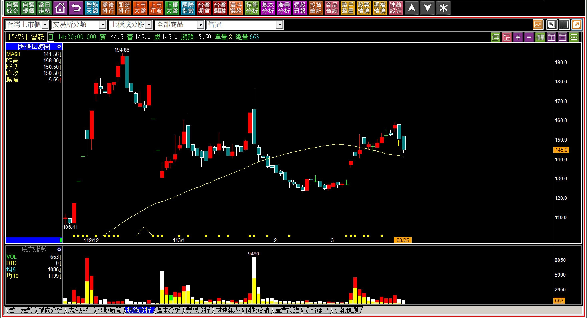
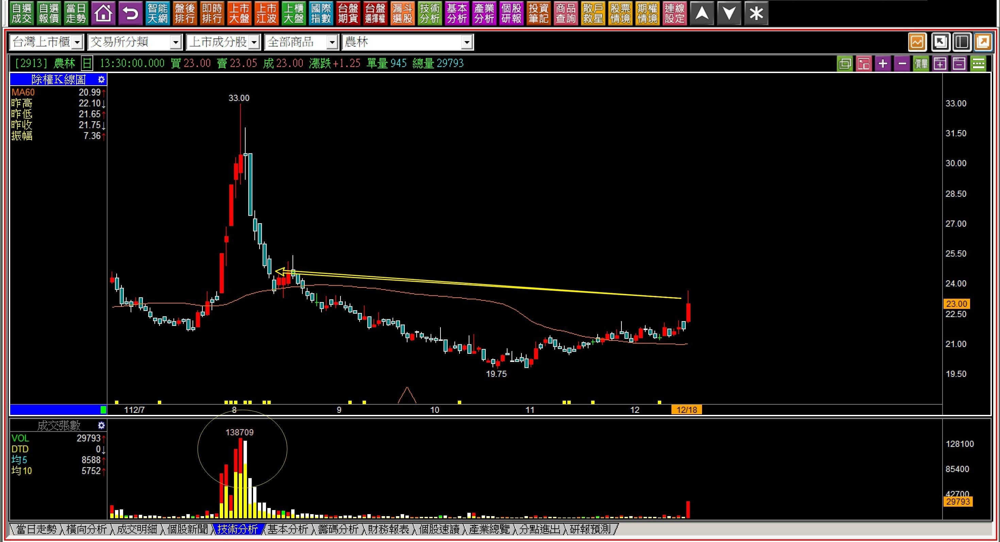
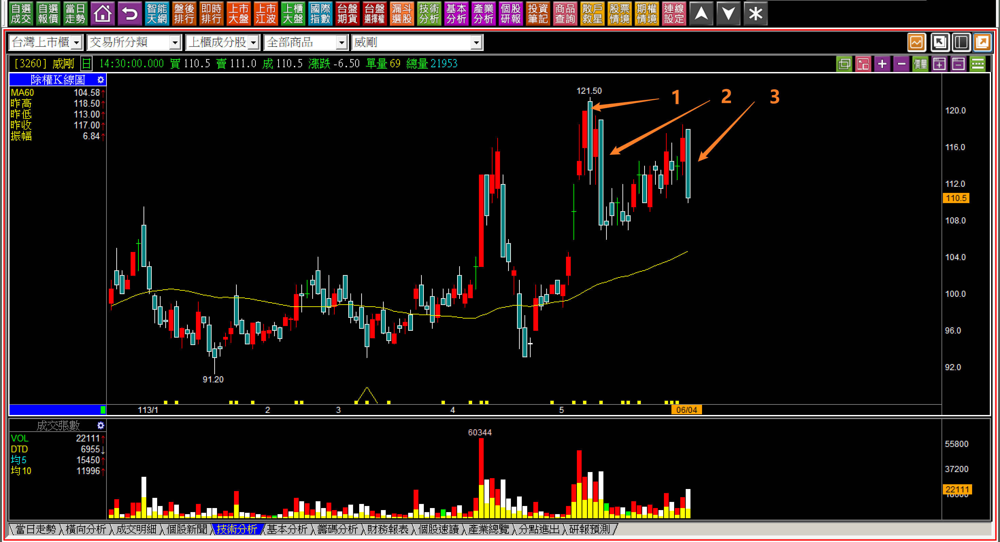
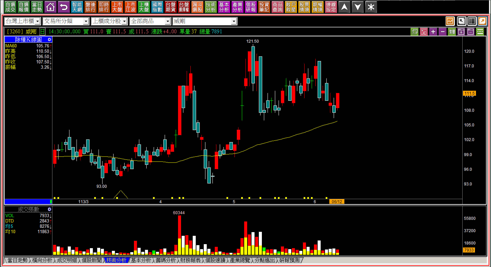
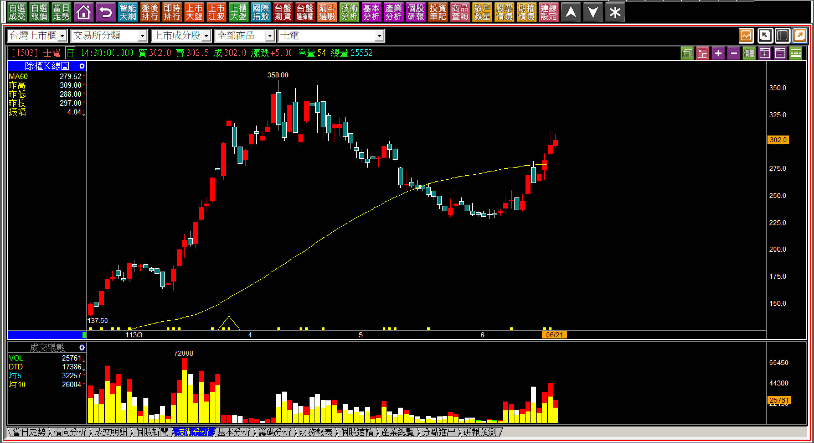
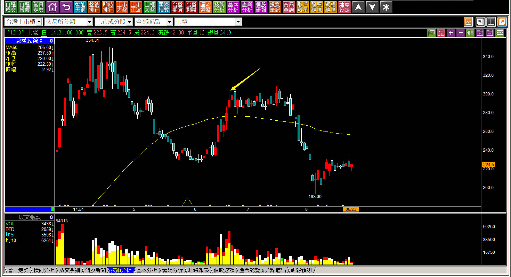

# 【明日K線】「遇壓狀態」篇

在攻擊K線的輔助研判中，「遇壓反應」是很普通的K線圖判斷點，因為K線圖的第一大要點就是檢視過往套牢壓力的存在，所以如果反彈股價會面臨到過往的套牢壓力，持有時就應該要保持警覺。往往股價出現了「遇壓時就下跌」，就是一種「遇壓反應」

所以用明日K線來解讀遇壓，簡單到像是喝水般的容易理解，指的就是股價真的碰到了過往的壓力了，接下來股價就會立即有向下的反應。交易者不能等到股價有下跌反應再說，必須先有認知，依然持股者需要考慮出場，空手者不宜進場。

可能遇到當下市場會有熱門討論的話題時，往往會讓散戶失去戒心，以為可以再等看看能不能再多漲一點才賣出，通常這個位置往往也是層層套牢的其中一個再套的環節。

也就是遇壓、結合市場話題一起看，只不過就是兩者要反過來看而已。

**搭配市場利多股價卻反彈遇壓**

以下範例雖然時間過得較久，大家可能不太記得當時市場上再討論什麼事，不過對於交易來說，隨時比對市場資訊，是明日K線的研判關鍵，因為要看到的隔日可能會有的變化，所以利多，不一定就是好事，但是遇壓卻是真實存在。

**十二月營收創高的說法**

這是新聞公布宏達電十二月月營收達到6.35億元的那一天，新聞標題用『營收報喜、YOY成長22%』的說法來誤導投資大眾。因為過去兩年內也曾經出現過單月營收比6.35億還高的狀況，結果整年度還是大幅虧損。

YOY對比的是去年同期，也就是2022年的12月5.2億，這樣的YOY成長有什麼用呢？九月也有過6億的營收，第三季依然是虧損1.1元，所以這種營收跟本算不上是利多，卻被新聞報導包裝成利多消息。

**113-01-09宏達電(2498)**

股價馬上反彈遇壓，且還爆出大量，這個量的出現表示籌碼大量利用利多倒出籌碼，在此又多出一層新的套牢區。對於明日K線判斷的角度，就是接下來股價慘了，壓力不可能過去，又再來一層次的新套牢區。

尤其是散戶本來就持有的，長期大幅度套牢，一攤平問題就又更嚴重了。

**113-06-11宏達電(2498)**

如果只呈現遇壓的隔天，這樣的感受就不夠強烈，但是遇壓如果沒有開始化解賣壓，意義就是多了一層套牢，累積越久就越是「層層套牢」的意義。

在一開始遇壓的時候，對於明日起的K線，應該了然於胸。

**話題過後呈現反彈包覆黑K的壓力狀態**

理解了壓力判斷還不夠，明確的一層套牢出現，是遇壓之後對於明天K線走勢的清晰認知。

**113-03-12 智冠(5478)**

看到在遇到壓力的紅K，隔天被包覆，就表示未來回頭看，這裡又多了一層套牢。所以當股價又反彈到這個位置，應該要知道接下來明天就會有「遇壓下跌」反應。

**113-03-25 智冠(5478)**

實務走勢雖然不是隔天馬上下跌，遇壓判斷意義卻是相同，這是對於資金力量、套牢區段的理解，且自此股價如果反覆越多次，代表套牢越多層。

對於股價的波動了然於胸，在還沒發生的時候就有答案，是明日K線的意義。

**碳權概念股福華飆漲影響**

因為福華新聞報導，外傳明年113年開始可以認列印尼的碳權，福華股價飆漲，帶動原本被人認為的碳權概念股反彈。但是仔細看一下，這根反彈遇到的是當時八月大量拉抬又帶大量下跌的小山，這個遇壓簡直是遇到鐵的天花板。

**112-12-18農林(2913)**

從這一根K線開始就要想想，這家公司有沒有這種基本面？當然沒有，都只是概念題材，且上面套了一堆人，加上又是中低價股、每股盈餘還是負數。明日K線的角度來說，這種基本面與結構，都沒有什麼明日可言。

**多次相近位置遇壓**

**113-06-04 威剛(3260)**

從空頭吞噬這種明顯的轉折出現之後，在相近的位置出現長黑，就是一種明確有賣壓存在的K線反應。

自此開始，這就會是套牢的短期天花板，股價接下來暫時很難再來到這個區域，明日起幾乎就是漲少跌多，除非快速再站上黑K高點，可是五月初又有著包覆的吞噬，這條路幾乎無法實現，也就只剩下回檔。

**113-06-12威剛(3260)**

當然，不一定就剛好是明日下跌，只是對於明日起的走勢，經過這三根長黑，就已經知道答案。

明日K線的意義可以說是對股價節奏的掌握，也可以說是對K線力量是否在其中的判斷，還可以是對研判技巧的確認點再往前推，不用等到真的出現才感覺意外。

對於遇壓來說，明日起股價就下跌的話，表示根本沒有資金化解賣壓的意願，如果是因為大盤熱絡，但是壓力沒有越過，就算沒有下跌，壓力依然存在，更重要的是，如果遇壓，就應該對明日起的走勢要有心理準備。

**113-06-21士電(1503)**

有心拉抬就不會「遇壓下跌」，這是隔日推演的重點所在。

**113-08-23士電(1503)**

有些人不理解為什麼已經懂了原理，卻還需要明日K線判斷的原因？

因為你需要在行情尚未發生的時候，就已經對未來的可能變化心理有數，雖然會跌不知道會跌多少、會漲不知道會漲多少，可是交易需要的是對自己判斷能力的信仰，以明日之後來推演走勢，不是預測，而是基於理論之下的推斷，會對自己的判斷能力更具信心。