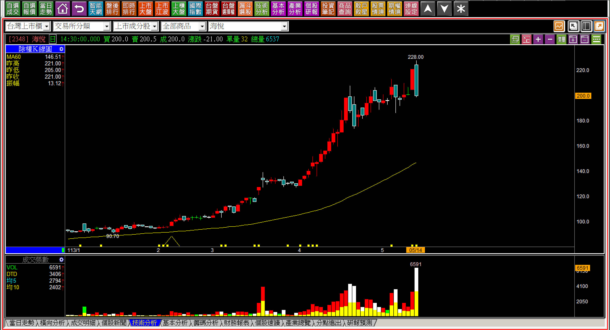
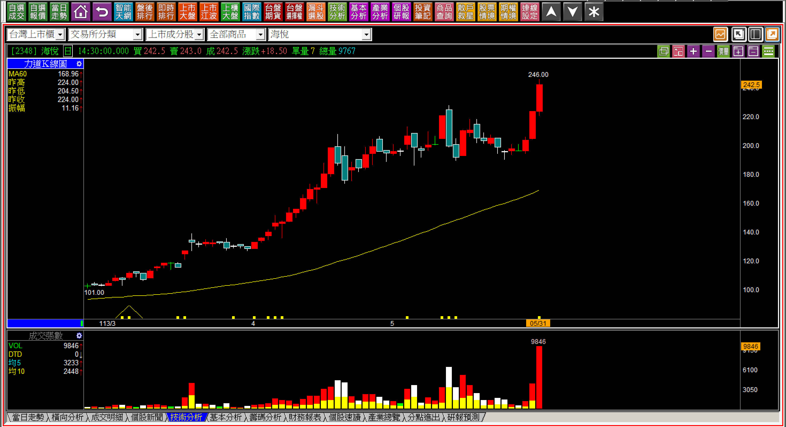
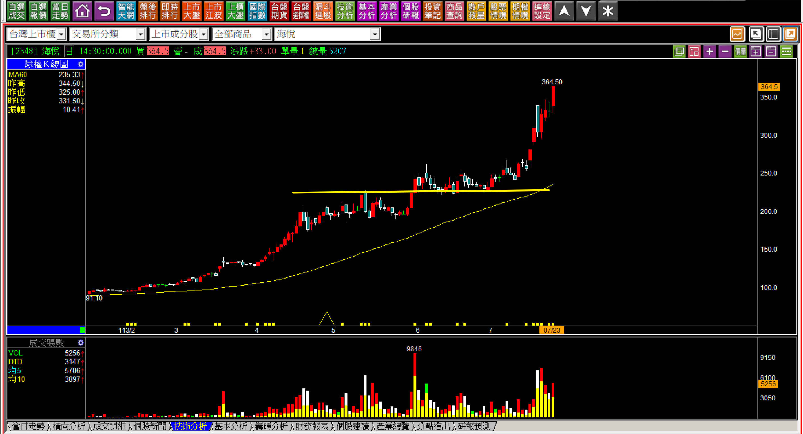
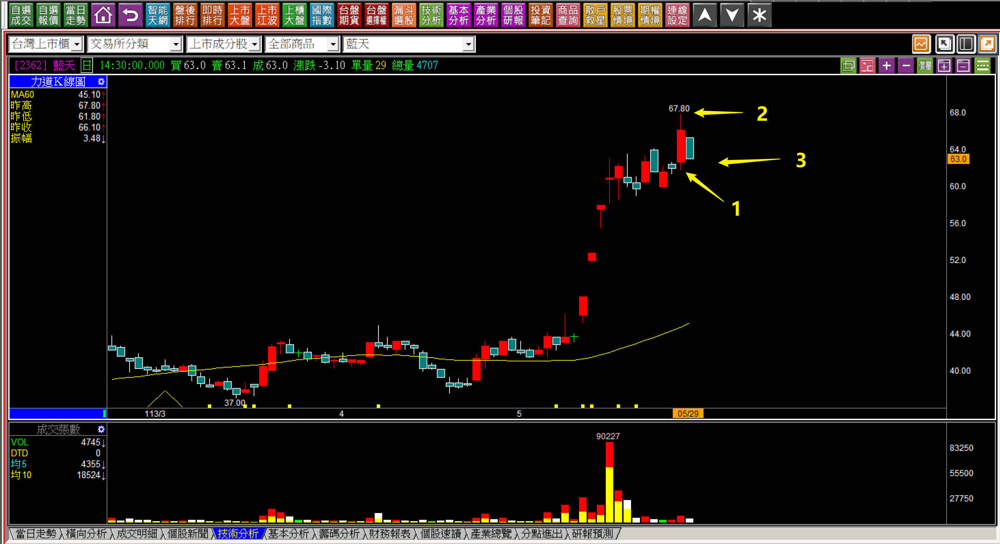

# 【明日K線】「從內困與翻黑變成跳空反轉」篇

組合型態的學習很單純，用兩根或者三根連續K線，定義為某一種意義，就可以讓人趨吉避凶，不至於落入陷阱，例如空頭吞噬就是這樣的狀況，我們交易者本來就要等到那一根包覆的長黑出現之後，才能夠確認這是反轉型態，多單應該要出場。

至於要不要當作是放空的標準？在K線的教學上，空方轉折的原理是「力竭」意義，所以是出場使用，放空則是進場，不能因為股價有跌就認為這樣可以當作放空標準。一旦股價再創新高一次，就會進退失去依據。

**113-05-14海悅(2348)**

學過轉折的人都可以一眼就看出這是空頭吞噬的走勢，只不過投資人的心態總是遇到了某種狀況，彷彿就是反向的意義出現，以為這樣就是要下跌了，假如沒有下跌，就以為這項技巧失效，然而實務並非如此判斷。

又或者以為這樣就可以反向放空。

**113-05-31海悅(2348)**

三連紅股價又突破創新高時，僵化的思維就會認為空頭吞噬不一定是必然轉折，心態更加積極者看到吞噬認為非多即空，如今放空卻產生虧損。問題是，誰說空頭吞噬就是放空的意義呢？

這是兩根K線就來判斷出轉折的優點也是缺點，簡單，但是讓人誤以為可以反向進場使用。

**再次突破後又是另外一段攻勢**

此處並不是要討論『再突破』的定義，只不過是說明技術分析並不是「非多即空」的態度面對，並不是多單賣出之後還可以順便反向放空，進場與出場的原理是不相同的。

「再突破」是攻擊K線的範圍，必須要有基本面成長股表徵的支持，這一點請讀者再複習一下攻擊K線的型態篇。

**明日K線就在三根以上的組合第二根**

這是『明日K線』最簡單的判斷用法，就是三根K線才構成的轉折，在第二根出現的時候，就需要對隔天先有定義上的答案，不像是中樞型態或者上升三法，到底中間要等幾天不知道。三根成為一個組合，在第二天的收盤就對明天會有了然於胸的答案。

**113-05-29藍天(2362)的懷抱型態判斷**

一張很單純股價創新高、隔天黑K形成孕線的K線圖，裡面蘊涵著三個要點：

**一、創新高的攻擊假設。**藍天在八個交易日的橫向走勢之後，來了一根創新高的紅K，因此勉強還是可以用攻擊假設來定義，說勉強是因為波動幅度與時間不夠明確，但是定義還是可以使用。(如上圖一的位置)

**二、以高點如有再次越過才視為攻擊持續。**創新高的紅K理論上是由主力拉抬所致的，這一檔本來就已經有明顯的拉升，橫向狹幅進入攻擊整理狀態，再往上本來就是正常，往下才是不攻擊的意義，所以只要明天再創新高，就是繼續攻擊的意思。(如上圖二位置)

**三、不能跌出長黑，或者往下跳空。**這是基於對K線原理的認知熟悉，假如股價往下出現長黑，就是組合型態中的「內困翻黑」，是一種短期轉弱的型態，這裡剛好是要展現攻擊企圖的位置，短期轉弱就等於不攻擊了，當然長黑出現就有問題。還有一種，會是更麻煩的是出現跳空向下的「跳空反轉」。

答案很明確，一旦往下跳空，就是最明確且力量轉變的那一種，因為跳空反轉是空方轉折型態。

**113-05-30藍天(2362)開盤跳空**

一開盤不僅僅跳空向下，還低於紅K低點，這下子攻擊態度消失、假設不成，同時還形成跳空反轉的型態，事後雖然可以看出組合型態的意義，但其實開盤價一出現就應該要知道答案。

這就是明日K線之所以要成為一個教學主題的原因，使用者早在前一天就已經對明天可能的演變都有答案，散戶沒有這樣認知與技巧判斷的人，就會看著股價的弱勢，等待看有沒有反彈，最後就是眼睜睜看到收盤。

缺乏前一天對明日的判斷，處理是否應該出場的問題，就會不及時。

**113-06-11藍天(2362)**

決策，有時候只在那短短幾分鐘，當下沒處理反應能力不足，就會變成巨大的損失，這不會是一句：「善設停損就好」可以改變的。

以藍天來說，當初的跳空在開盤判斷如此重要，是因為當時的股價是61.7元向下跳空開出，不知道應該要處理，或者打算等收盤再看看的人，此時的股價只剩下54.1元，7.6元的損失能夠避免，就是一種能力。

這是明日K線交易者需要花時間反覆練習判斷的原因，尤其是內困型態還不算是轉折，只不過是遇到抵抗的組合，但是隔日如果往下跳空，就變成的轉折的跳空反轉，表示此處已經具備力竭意義。