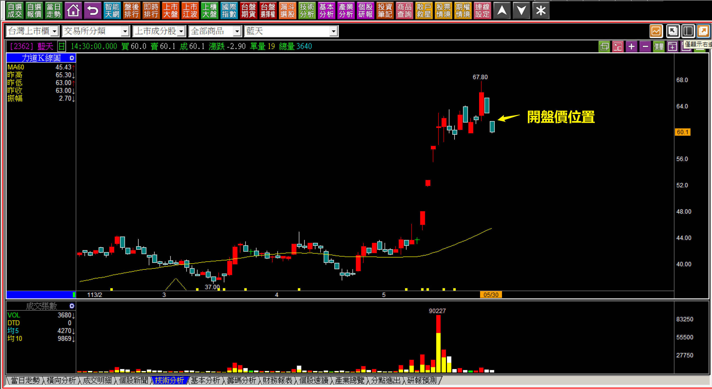
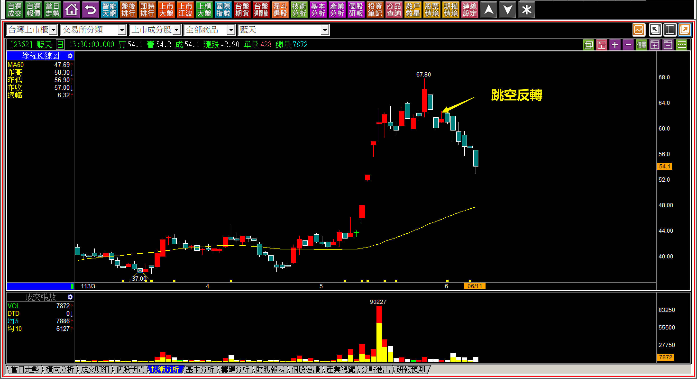
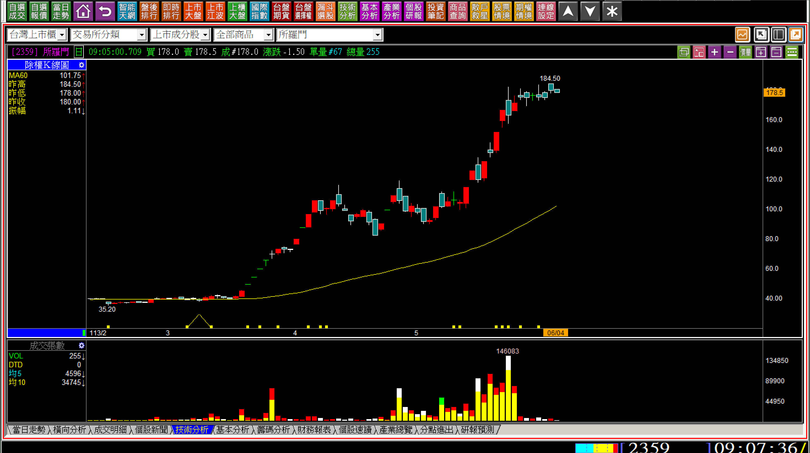

# 「明日K線」『增修版』的教學主旨與目錄

⭕️（這個單次系列方案，將從一月二日起每天出刊一篇）

來定義一下這個名詞：**明日K線並不是預測未來走勢，而是基於所有的K線理論與組合判斷，今天就已經知道明天起K線若有怎樣出現，就代表怎樣的變化。**

**舉例說明：需要先會「轉折組合」的明日K線**

這是明日K線最簡單的判斷用法，就是三根K線才構成的轉折組合，在第二根出現的時候，就已經可以對隔天的走勢有答案，當然往細的說至少還是要看第三天的開盤，不過三種可能的走法，都是明日K線的判斷範圍。

**113-05-29藍天(2362)的「懷抱型態」判斷**

一張很單純股價創新高、隔天黑K形成孕線的K線圖，這屬於內困型態的一種，這兩根的組合裡面蘊涵著三個要點：

**一、創新高的攻擊假設。
二、以高點如有再次越過視為攻擊持續。
三、不能跌出長黑，或者往下跳空。**

答案很明確，一旦往下跳空，就是最明確且力量轉變的那一種，因為「跳空反轉」是空方轉折型態。

**113-05-30藍天(2362)開盤跳空**

一開盤不僅僅跳空向下，還低於紅K低點，這下子攻擊態度完全消失、攻擊假設不成立，同時還形成跳空反轉的型態，事後雖然還是可以看出組合型態的意義，但其實開盤價一出現就應該要知道答案。

這就是明日K線之所以要成為一個教學主題的原因，使用者早在前一天就已經對明天可能的演變都有答案，沒有這樣認知與技巧判斷的人，就會看著股價的弱勢，只好等待看股價有沒有反彈，最後就是眼睜睜看到收盤。

**113-06-11藍天(2362)**

決策，有時候只在那短短幾分鐘，當下沒處理反應能力不足，就會變成巨大的損失，這不會是一句：「善設停損就好」就可以改變的。

以藍天(2362)這個例子來說，當初的跳空在開盤判斷如此重要，是因為當時的股價是從61.7元向下跳空開出，不知道應該要處理，或者打算等「收盤或有反彈再看看」的人，此時的股價只剩下54.1元，這段7.6元的損失能夠避免，就是一種因明日K線而來的判斷能力。

**需要先看懂「攻擊」的明日K線**

再一個例子，要確認股價還會不會繼續往上攻擊？就得懂攻擊K線的各種型態，其中「高檔整理的推升型態」，當然是其中很特別的一種，意義就是都已經推升這麼多天，有心就得要直接往上攻，如果往下，就會跌破這個推升(高檔狹幅)型態，那就「與攻擊原理不相符」。

**113-06-04所羅門(2359)對於接下來的變化已有認知**

在新高價當天雖然是黑K，股價依然還在攻擊的高檔推升型態中。隔日開盤還是沒有下跌，但是「明日K線」的意義就是理解接下來的變化，走出一個方向上的確認，來判斷股價到底有沒有繼續攻擊的打算。

**113-06-04所羅門(2359)**

這是明日K現在攻擊判斷上的使用，不是研究K線的形狀當作標準，而是價格變化的檢視，在發生之前就已經知道會有這樣的結果，這才是看盤技巧，股價跌破短期的高檔推升型態，前一天就已經心中有數，發生的時候馬上就知道應該出場停利。

所謂的「看盤」就是看股價變動中，在哪些有意義的位置產生方向，並不是看著自選股、庫存股價格的跳動就以為自己是在看盤。

以下是「明日K線」教學文修訂過後的篇章目錄，每日出刊一篇，提醒您要等到出刊日期1/2之後，點閱才會看得到內容。

⏰ **【明日K線】「明日K線的意義與簡易說明」篇**

⏰ **【明日K線】「中樞型態」篇**

⏰ **【明日K線】「再創新高的隔天」篇**

⏰ **【明日K線】「遇壓狀態」篇**

⏰ **【明日K線】「微弱的多方趨勢」篇**

⏰ **【明日K線】「季線扣抵」篇**

⏰ **【明日K線】「賣壓化解」篇**

⏰ **【明日K線】「壓力的分類」篇**

⏰ **【明日K線】「低價股的處理節奏」篇**

⏰ **【明日K線】「剛創新高上影線的高點」篇**

⏰ **【明日K線】「當黑K出現的時候」篇**

⏰ **【明日K線】「漲停板出現後再繼續上漲的機率」篇**

⏰ **【明日K線】「從內困與翻黑變成跳空反轉」篇**

⏰ **【明日K線】出現向下跳空的「下降三法」篇**

⏰ **【明日K線】「面對高檔推升型態的下一步」篇**

⏰ **【明日K線】日出攻擊結束與上升三法的判斷矛盾**

⏰ **【明日K線】「頭部成型」篇**

⏰ ****【明日K線】「多方波動的確認點」篇****

⏰ **【明日K線】「下山」篇**

⏰ **【明日K線】「攻擊成本顯現日」篇**

⏰ **【明日K線】從下降三法的可能進展到「下降中樞型態」**

⏰ **【明日K線】從「破底股」的糾結談接下來的走勢**

⏰ **【明日K線】「攻擊企圖」篇**

⏰ **【明日K線】「合併十字線」篇**

⏰ **【明日K線】「區間整理」篇**

⏰ **【明日K線】「防守姿態」篇**

⏰ **【明日K線】明日股價不樂觀的個股K線**

⏰ **【明日K線】「不攻擊」篇**

⏰ **【明日K線】「型態壓力」篇**

⏰ **【明日K線】「創紀錄的跌點之後」篇**

⏰ **【明日K線】「主力出貨的秘密」篇**

⏰ **【明日K線】「休息一天的攻擊」篇**

⏰ **【明日K線】「關鍵K線」篇**

⏰ **【明日K線】跳空反轉、雙鴉躍空、母子雙星的微妙之處篇**

⏰ **【明日K線】領先環境出現趨勢反向的意義**

⏰ **【明日K線】抵抗意義出現的明天**

⏰ **【明日K線】缺乏力量的判斷：賣壓中空結束與缺乏攻擊企圖**

⏰ **【明日K線】攻擊結束之後**

⏰ **【明日K線】技術性轉弱與技術性轉強**

⏰ **【明日K線】「明顯放量創新高後」篇**

⏰ **【明日K線】下降中樞型態發生「之前」**

⏰ **【明日K線】人性的弱點與K線判斷**

⏰ **【明日K線】「外側三黑出現」篇**

⏰ **【明日K線】「進場」與「出場」對明日K線的判斷不一樣**

⏰ **【明日K線】「多方轉折出現」的下一步**

⏰ **【明日K線】「空頭買在趨勢改變」篇**

______________END_______________