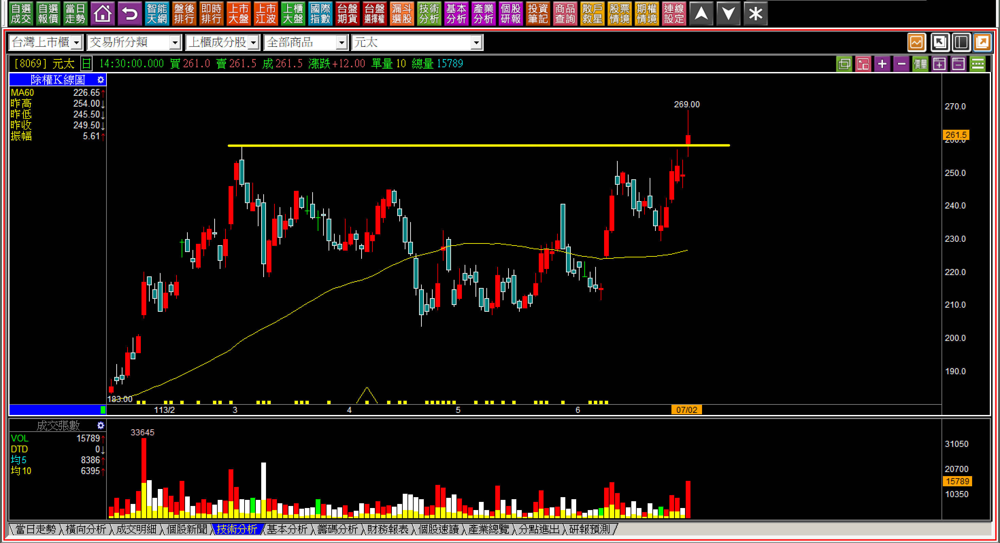
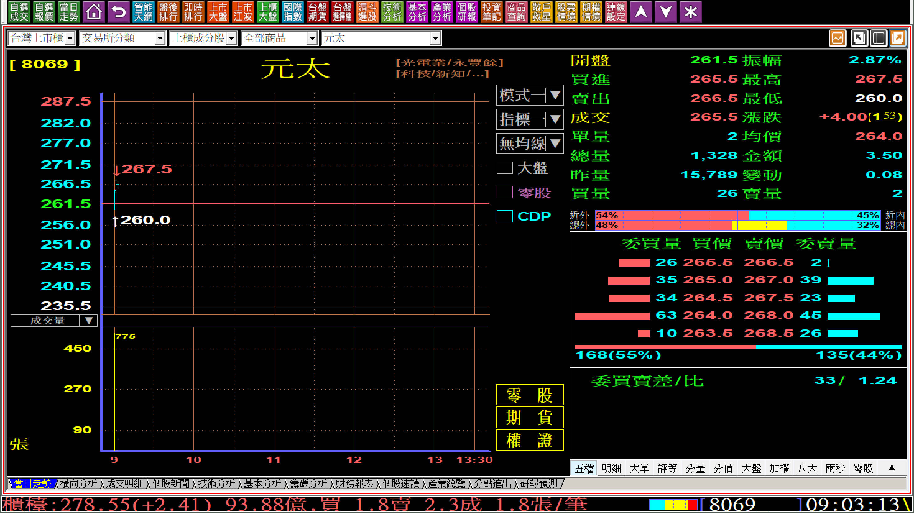
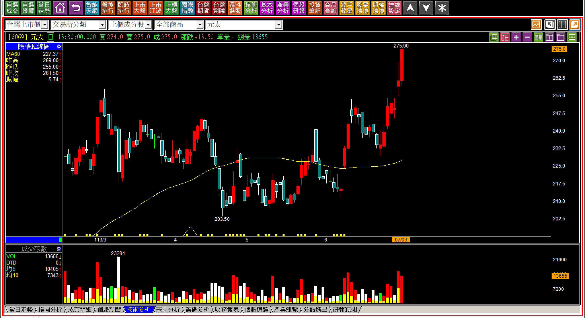
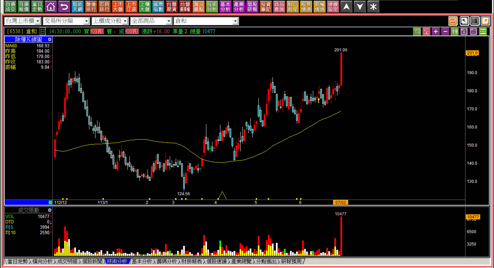
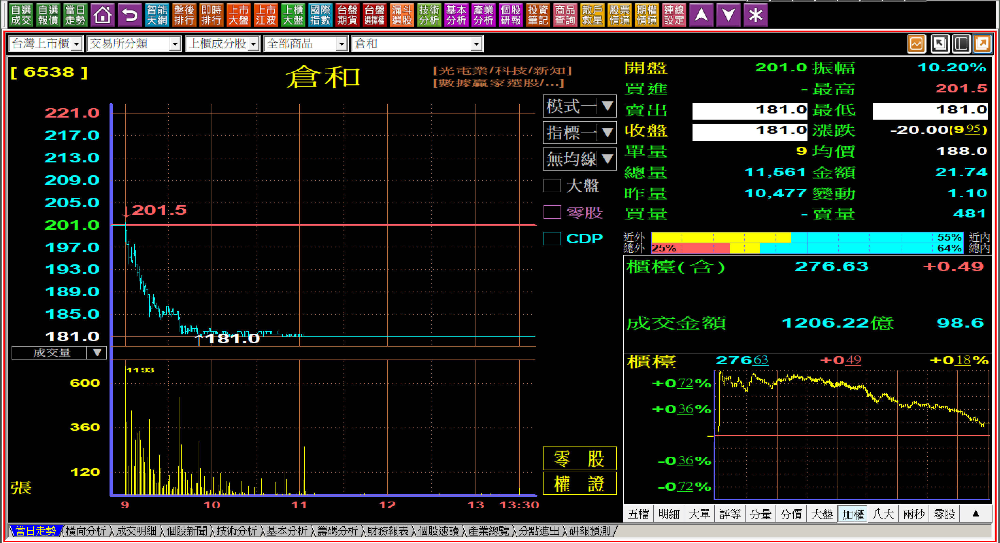
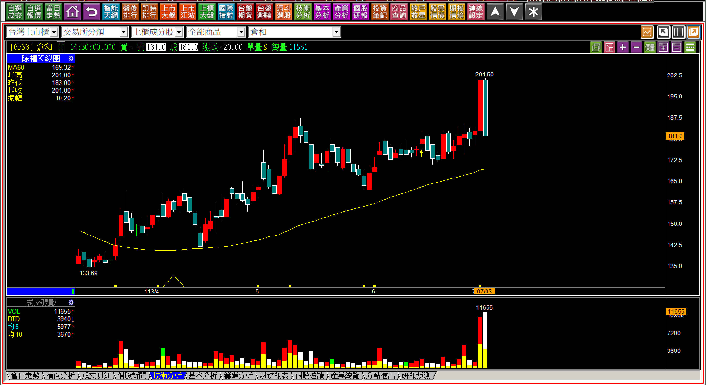
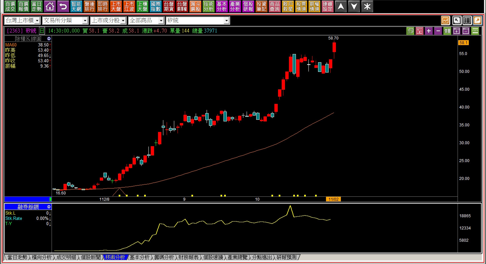
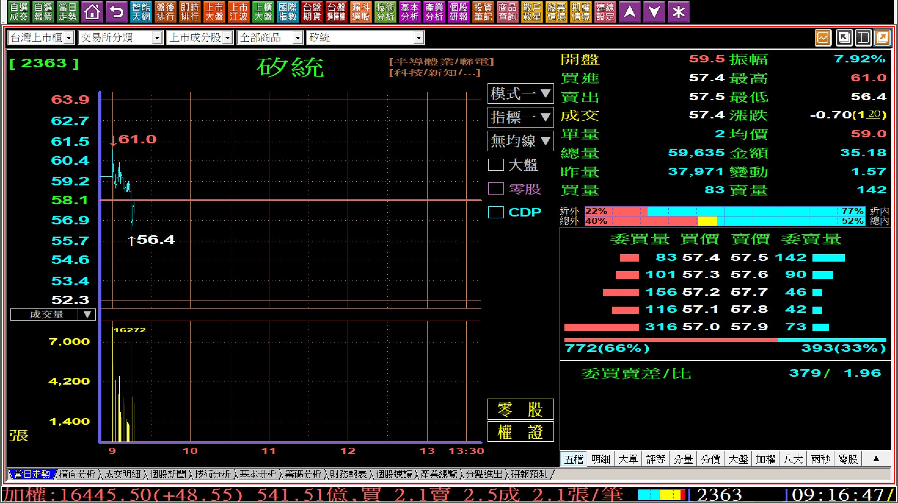
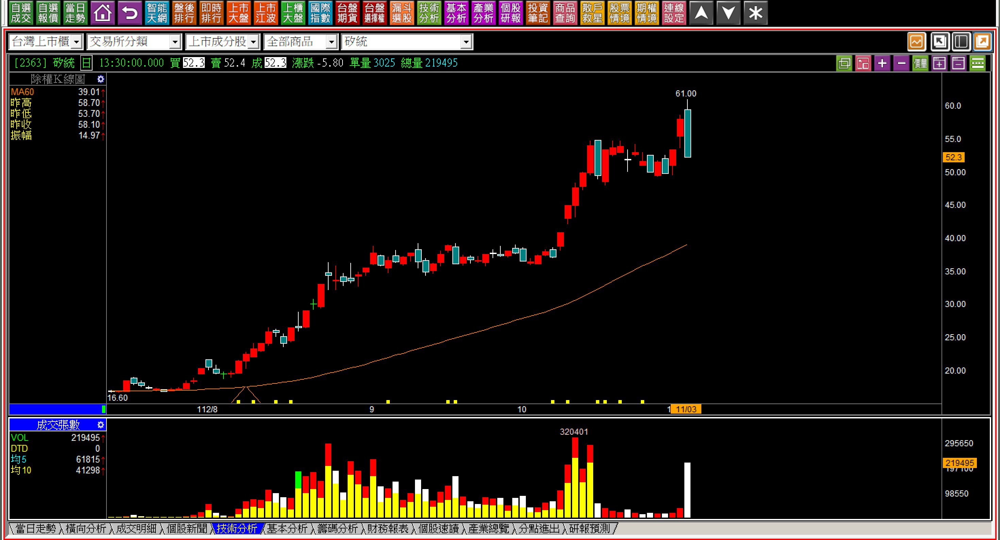
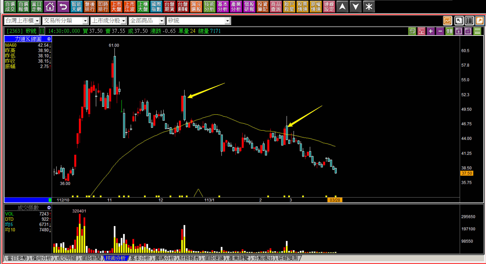

# 【明日K線】「再創新高的隔天」篇

股價突破前高，指的是波動狀態之下，再創新高的第一天。

但是往往因為已經不是第一次突破頸線，也沒有經過中期整理再突破，很單純就是依照「多方波動狀態」又突破前次高點，人們基於獲利了結的心理，很容易就在創新高的震盪過程中賣掉股票。

這就表示創新高的「隔天」，判斷起來很重要。

不見得每一次的突破前高後，都會進入攻擊狀態強勢拉抬，但是我們至少需要知道，市場資金對於這檔股票的態度是什麼，假如對於這一根突破前高的K線，在沒有任何理由之下就又被跌破，就表示資金並「沒有」強烈拉抬的意圖。

當然，如果這個創新高的呈現是突破頸線，表示轉向多方趨勢，未來雖然還是有可能又回到整理或者繼續多方，至少不會是往空方的趨勢走，比起空頭時期來說，進場的安全性高出很多，所以隔天不能馬上又跌回去，變成了明日K線的判斷重點。

**113-07-02元太(8069)**

股價創新高的第一天，表示過去一段時間曾經買過的人都已經沒有套牢者，這本來是攻擊K線中的起始點辨別，但是對於一直以來的空手者來說，還是忘不掉應該在過去兩個月低檔買進的想法，這種想法無可厚非，每個人都有，可是一旦這樣想，就會失去了價差交易的機會。

明天應該要怎樣呈現攻擊呢？兩種答案：『跳空攻擊』、『推升攻擊」。

在上述兩種狀態下，跳空攻擊顯然是比較強勢的，理論上跳空更應該要進場，但是人們的心態又在這裡擔憂了，會不會自己買高了？萬一又跌下來怎麼辦？推升攻擊要等「早盤的第一個高點」越過，辨識容易，不過買起來還是覺得困難，下不了手，因為人性又想要買低了。

不過至少，一開盤就知道有沒有機會走出跳空攻擊，也就是開盤價在創新高第一天的隔天，是看盤要點。

**113-07-03元太(8069) 09:03**

一開盤就「沒有」跳空，顯然已經可以確認不是跳空攻擊，對於多方操作來說，就只能等待推升攻擊，也就是上述267.5元越過就確認了推升攻擊走勢。判斷沒有很困難，難的是下單，要跨越人性障礙。

**113-07-03元太(8069) **

明日K線判斷攻擊的底氣，依然是「停損點的確立」，這也是為什麼我們要學習「攻擊假設」的原因，只要停損點清晰，表示風險固定，然而風險固定理性上好像很明確，大多數人還是有避開風險的反射動作，就是一般人口語中的：「好可怕、不敢買。」

定義雖然如此，但有一種再創新高，還沒突破之前是高檔的狹幅或者區間整理，一根紅K突破過去之後，明日K線的角度研判，就怕出現高檔長黑，有太多的例子可以作為研判模式。

**113-07-02倉和(6538)**

股價雖然不是歷史新高，但我們還是可以用來作為解說範例。

在這一天創下近期新高，且有帶量，那麼明天開始有沒有要繼續往上的意圖？當然還是可以看跳空或者推升。

**113-07-03倉和(6538)江波走勢**

一開盤就一路往下，別說跳空了，就連第一個高點都沒有越過，沒有跳空攻擊，更沒有推升攻擊。

這就表示一開盤就可以確認這一檔股票根本就沒有買進的必要，這也是明日K線判斷的重大功能之一：『避開根本就不用買進的股票走勢』，而事後看才會發現，原來這一根屬於高檔長黑。

**113-07-03倉和(6538)**

不管最後怎樣看待K線圖，以這根來說高檔長黑代表的是股價完全沒有攻擊意願，明天開始不需要期待。

可是對於技術分析的學習者來說，這一根黑K能否避開，是重要的判斷點，所以必須要學習創新高的當日判斷明天的走勢會有哪些變化，才能實戰中因應。

**113-08-12直得(1597)**

這檔狀況是一樣的，就是創新高的隔天，一開盤就是當天的最高點，雖然是跳空開高符合跳空攻擊，但是馬上回補缺口，等於攻擊失敗，變成了一根高檔長黑。

**創新高的第一天出現，隔天走勢就是明日K線**

要使用明日K線來思考的原因，是因為對於交易者來說，收盤日就必須要先有對明天的規劃，才能確認自己要不要進場，或者持有狀態下要不要出場，只要沒有這樣的態度，很快的就會變成「既然跌下來了，那就再看一下」的那種散戶心理。

經過本文的說明，相信讀者已經清楚創新高的第一天出現後，並不全然代表股價就會往上攻擊，必須明天開始展現「攻擊企圖」，才是進場操作的最重要要件，也就是如果沒有出現，躲都來不及了，還談什麼買進。

**112-11-02矽統(2363)**

在波動狀態下突破前高，本來是多方波動的確認，但是在創新高的第一天，明日K線的關鍵就是不可以走出空方波動，這裡有沒有跳空攻擊、是不是推升攻擊，都不重要了，假如隔天走出空方波動，那就有著高檔長黑的疑慮。

**112-11-03矽統(2363) 09:16**

開盤還不到半小時，股價就呈現空方波動，早盤的高點沒有越過、早盤的低點跌破，這對於前一天是創新高的第一天來說有著很大的威脅，一旦前一天的紅K低點也被跌破，就是高檔長黑的定義完成。

這是很常見的問題，人們都想盡可能的低買，卻沒想到「上去才是攻擊，下來是不攻擊」，這是創新高的隔天，最重要的原則。

**112-11-03矽統(2363) 高檔長黑**

此處之後，確認出現高檔長黑。

對於組合K線有學習經驗的人都已經知道高檔長黑代表的就是沒有攻擊意願的呈現，明日之後也已經很清晰不用再判斷。但是技術分析的使用者，就想知道能否更早一點看出來？這就是創新高第一天，明日K線推演的要點。

**113-03-28矽統(2363)**

四個月後過程中的反彈遇壓判斷已經慢了，當初創新高的第一天，明日K線的判斷就可以看出價值，也表示創新高第一天的明日K線，必看的重點就是看盤中的江波走勢了。

**最重要的是：創新高時代表的是攻擊意圖，創新高的隔天就是要看到攻擊的企圖。**