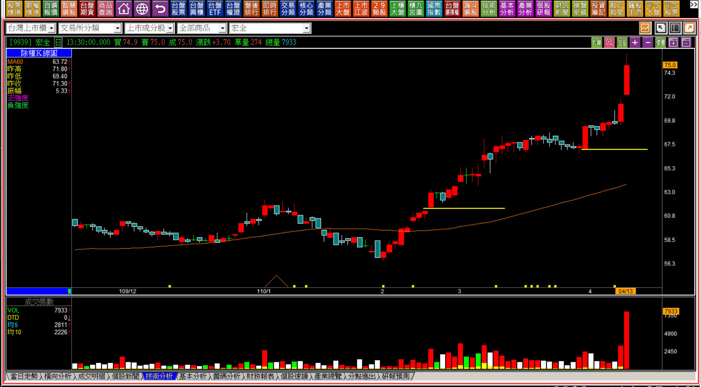
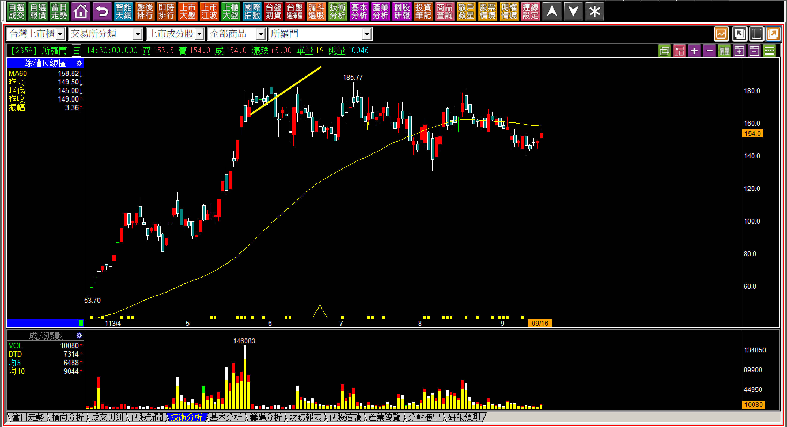
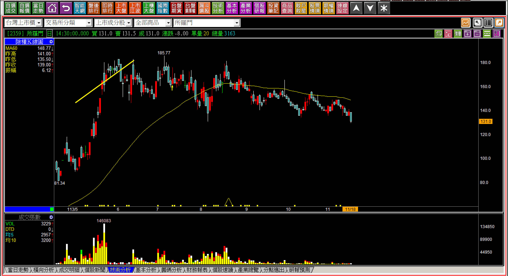
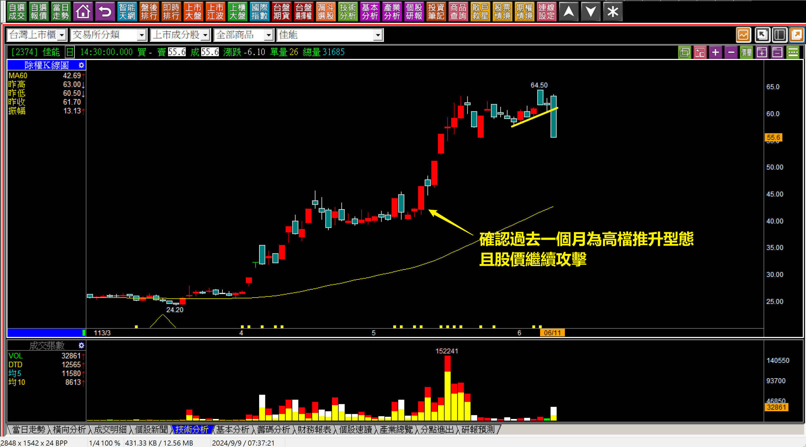
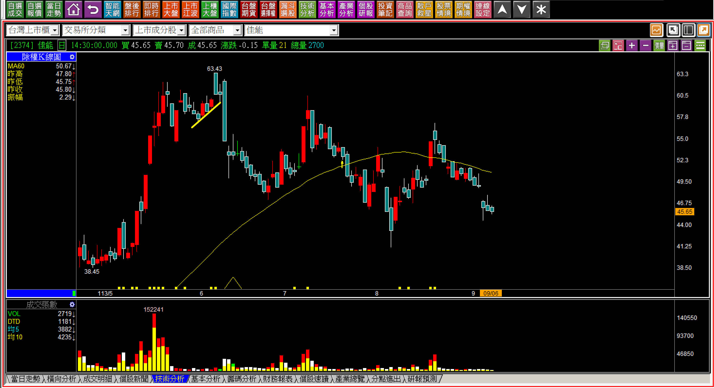
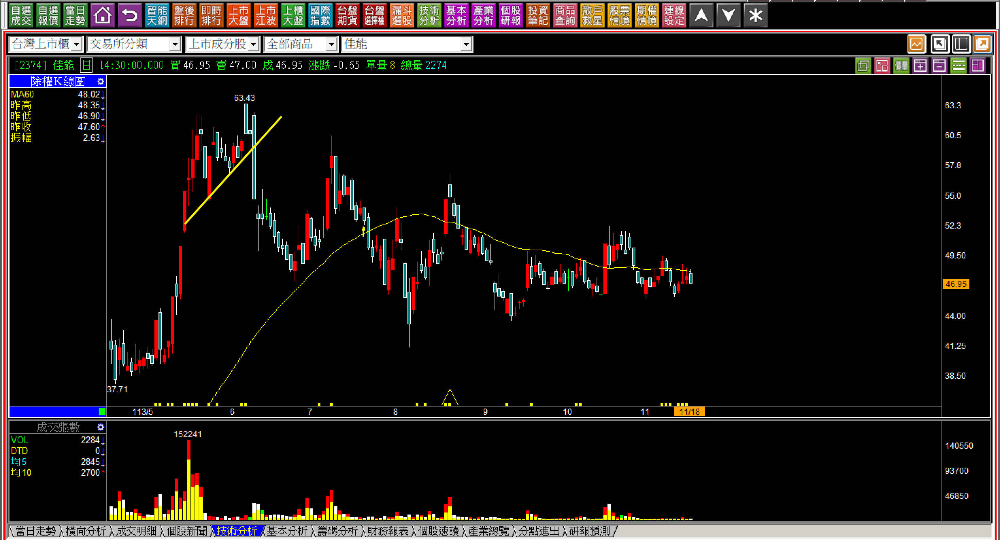

# 【明日K線】「面對高檔推升型態的下一步」篇

下一步，就是「可能繼續」或者「改變」的意思，多數只有短期在推升走勢，對股價表現沒有太大影響，但是「正在攻擊中的」下一步不一樣，答案就完全不同了。

「高檔推升」型態，是攻擊K線中「型態篇」的其中一項判斷，是攻擊狀態中的休息過程，卻有著明顯的特徵。定義上，必須先有過一段攻擊的走勢之後，連續數日股價暫時都沒有持續大幅拉抬，也沒有回檔，而是呈現出短期內股價看似橫向，實際上連續K線的低點還有些許推高的一種型態模式。

確認繼續攻擊的點，就是一段時間之後，股價再次進入攻擊。

在攻擊K線的講解篇章中，採用的範例都是以接下來確實有持續攻擊股價的例子為主，解說很容易，因為真心還要再往上攻擊的股價，不會先拉回讓高檔賣過一趟的散戶，又有一次拉回買進的機會，然後再賺一小段價差，散戶賺到的短線，都是主力要承擔的成本代價，所以如果真心要攻擊，就沒有必要先回檔才拉抬。

這就是攻擊原理，也因為如此，假如隔日開始，改變了這個高檔推升的模式，就表示股價並沒有真心要攻上去的企圖，這一點對於交易者來說尤為重要。

**一般攻擊持續的範例說明**

這是攻擊K線在談「高檔推升型態」使用的範例，上圖黃線指的是攻擊假設的停損位置，股價在沒有強攻的整理階段，都沒有跌破停損停利點，表示依照交易準則也不至於被洗掉。重點在於辨別沒有明顯上漲的整理段，股價是緩慢推升上去的，就是高檔的攻擊推升整理型態。

**假如從連續走勢中看起來有緩慢的推升，卻出現一根回檔的黑K，打破了這個高檔推升的型態範圍呢？那就是本文要解說的重點了：『****明日K線』的判斷。**

**一檔軋空過現股當沖放空者的飆股**

所羅門(2359)是一度讓散戶用現股當沖放空，卻遇到鎖住漲停板回補不了，得借券虧很重的個股。

**113-06-04所羅門(2359) 09:07**

直到這一刻的K線圖，股價還是呈現出「高檔推升型態」的走勢，成交量大幅度萎縮主要是因為進入了分盤交易，但這無礙於我們對於型態的判斷，連續七個交易日都是狹幅，且想要低買賺價差的人，根本就等不到拉回，股價沿著新高價位置漫步。

在這樣的時刻，不管是什麼時間，只要股價改變了這個型態的結構，就表示「攻擊的意願消失了」。也因為這是歷史新高價，沒有特別的原因散戶根本就不會買，掉下來讓散戶買進，然後才拉，就是主力的損失，所以主力真的有心要拉，不需要回檔跌破這個攻擊推升的型態。

**113-06-04所羅門(2359)**

收盤時可以明確地看到股價已經跌破了這個型態，對此開始，有兩個要點可以判斷：

一、因為是分盤交易，股價還不會連續大跌，一來短時間內這種漲法，主力根本就出不掉，不會有散戶要承接多單；二來分盤交易，要一天之內做出大幅度來回震盪也太有難度。往往這種類型主力要出貨，就得要慢慢地拖延時間，做出高檔的區間整理假象才有機會慢慢倒貨給市場。

二、跌破了高檔推升的型態，代表的意義就是這一波的攻擊結束，並不是說股價將會像一座山一樣的滑落跌回原點，通常越沒有基本面的公司，股價要拉很容易，要出貨就沒這麼簡單。這是主力自己要面對的問題，我們只需要了解有這個特性就行。

**113-09-16所羅門(2359)**

三個月過去，股價根本就沒有再出現過攻擊。

也就是說對於交易者的判斷，只要高檔區域已經先經過推升，卻又跌破型態，就表示攻擊已經結束，而這個判斷亦可作為移動停利點的設定。

**113-11-18所羅門(2359)**

高檔推升型態「改變」的明日K線，效果一開始是看不出來的，經歷過比較長一段時間就會知道，當初的改變，短線交易者就應該要捨棄這檔股票的操作了。

**113-06-11佳能(2374)**

可能一般人學習K線會認為，看懂當作是訊號就好，應該買賣學起來就可以了。實際上沒有這麼單純，要以明日K線的方式講解，這是因為交易者不一定在當初突破應該進場就已經買了，或者股價上漲的過程中，一直有著想要獲利了結的心態，這才需要更清晰的明日K線判斷。

回顧四月底，佳能也一度有過高檔推升型態的出現，直到創新高，才確認還打算要繼續攻擊，如果錯判，就想沒再漲的那天獲利了結，每一張至少少賺了10元。

**113-09-06佳能(2374)**

一般投資大眾的散戶屬性，就是會把虧損狀態中的股票，當作投資繼續抱著等待解套，如果錯過了判斷「不打算攻擊了」的K線，就是多了一大筆資金套在股市而已。

另外還有一種屬性，就是持有的股價回檔了，卻捨不得以前曾經有過的「未實現獲利」，就想再等看看還會不會拉上去，留來留去留成仇，這個高檔推升型態出現後的明日判斷，可以幫助交易者設定移動停利點。

**113-11-18佳能(2374)**

不攻擊的股票，在高檔推升的「改變」出現之後，股價會立刻跌嗎？會跌多少？這就要看當時主力是否順利出脫了，如果是，就會跌很快，如果不是，就會搞很久。答案一樣，對於我們交易者來說，明日起只要跌破這個型態，就不用再操作這一檔個股的價差了。

**個股現狀的小結語**

面對「高檔推升」，明日如果跌破，表示股價已經不再有攻擊意願。至於股價會不會大跌，要看主力出貨狀態，主力很難再股票沒有丟出去之前隨意的崩跌，這就表示股價很難再創新高對我們來說已經是最大的看懂，並不是還要能夠兼放空才是技術分析。

**請留意成交量**

成交量在回檔開始就急速萎縮，就是因為主力已經不想再花什麼錢搞假的成交量給人看，有人說價可以騙人、量不會騙人，這話說得不對，量才是最好騙人的東西。

但是散戶中毒太深，會記憶網路上說的「價跌量縮多頭現象」，其實沒有這種東西，價格才是最真實的判斷，也沒有價量背離，這同時表示市場以為的價量關係，那些成語其實是不存在邏輯的。