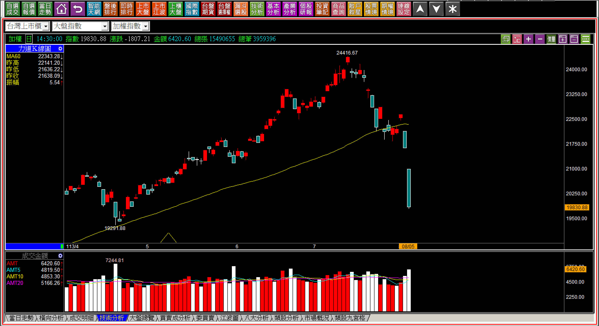
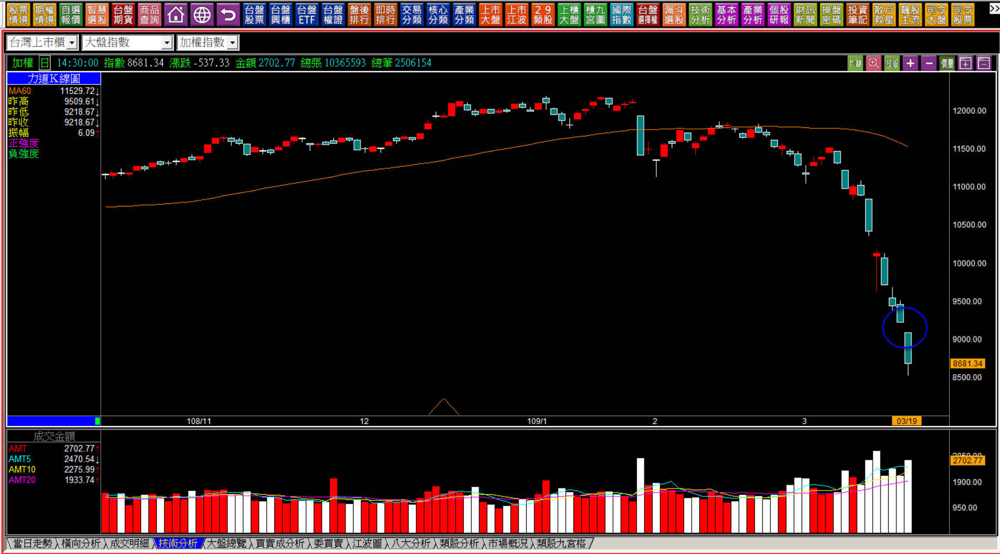
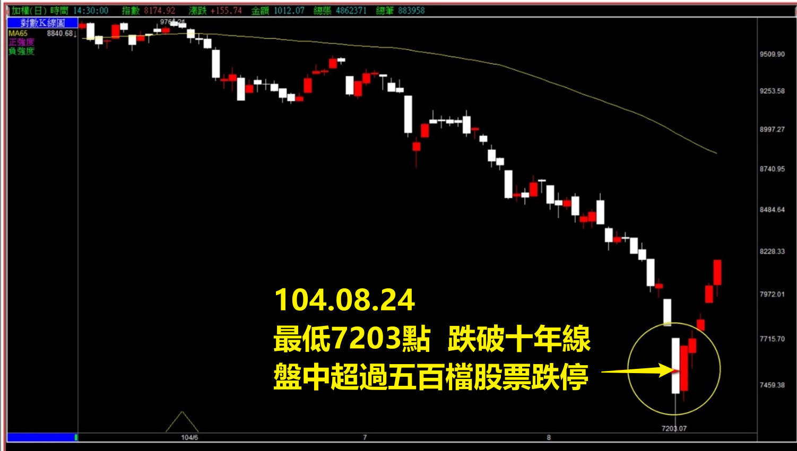
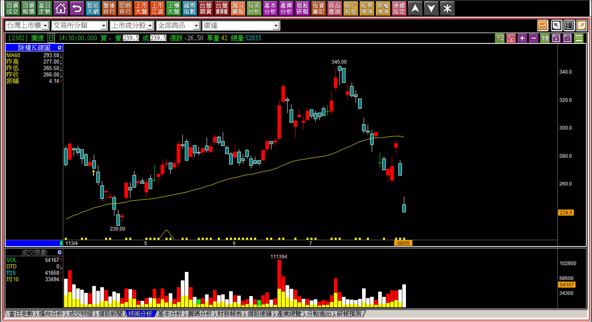

# 【明日K線】「創紀錄的跌點之後」篇

這一篇是「機會」的教學，不算是K線的教學。

創下歷史新高之後股價一定會拉回，為什麼說一定？因為今天創新高、明天再漲又是創新高，總有一天會事後回頭看，拉回出現在創下歷史新高之後。但是具體是哪一次的歷史新高之後呢？沒有辦法預測，所以創紀錄的漲點，沒有太多明日K線方面的判斷。

但是創紀錄的歷史跌點、跌幅、跌停家數呢？只要有其中一項，就是這一篇要討論的範圍。

從邏輯的角度，有原理的層面來看，未來使用的頻率雖然不高，但是出現的時候就是對抗人性脆弱的關鍵，所以創紀錄的跌點，明日K線的研判也有一定的地位。

**113年的歷史跌點紀錄**

八月二日週五台股先跌1004點，八月五日週一再跌出歷史最高跌點1807點，這也是台股將漲跌幅放寬成10%後，最大的歷史紀錄跌幅跌點。

**109年疫情來臨的歷史紀錄**

⭕️當時美股新聞報導：**美股史上第四次出現熔斷**

武漢肺炎出現，美股與台股差不多慘重，都出現過歷史紀錄。美股二月份就已經大跌，台股撐到了三月之後補跌，很短的時間之內就跌破萬點，甚至低於9000點。

**104年的歷史紀錄**

九年前的K線圖保存的已經不多，這是當時股市從10014，四個月內快速跌到7203點，十年線跌破，且盤中有超過500檔以上的股票跌停板。雖然說這並不算是真正創下紀錄的跌點，但是跌幅之深，快速急轉直下很罕見。

隔日八月二十五日，K線出現母子晨星，這張圖同時也是轉折組合中用來做為教學範例的說明圖，只不過時間已經過了九年，大多數人都忘記了當時盤中的恐慌感受。

**當出現了罕見、創紀錄下跌的時候**

研究明日K線的觀點，就像是運動的練習、肌肉記憶一般，目的是為了做出正確的反應，而非屈服於環境的悲觀氣氛。

每一次多頭之後，市場就會有人開始任性地喊大跌要歐印這類豪語，但是沒有例外，人性面對下跌的恐懼、進場可能明天又要再跌停一根的狀態，根本就不敢進場。

所以明日K線的功用，就是要理解創下紀錄的跌勢出現後，往往會有「總賣出」現象。

所謂的總賣出，就是環境方面因為下跌帶來的悲觀，不會是轉A急跌向下，往往是一層一層慢慢的先跌，過一段時間後，被利空事件影響大幅度崩跌，也就是再創紀錄之前，其實已經有一定幅度的弱勢了。

關於創新紀錄的跌點，隔日只剩下一個重點：「不再創新低」時，因為都已經大幅度的短期下跌，會產生出賣壓中空的區段，所以假如隔日又再破創紀錄K線的低點，就表示跌勢尚未結束。

在「隔日不再創新低」的狀態下，是價值投資的好機會，或者短線進場的機會，風險就是隔天沒創新低，但是很快的又再創新低。

上述三個例子都沒有發生，因為多空能量的賣盤張數往往會在創新紀錄跌點出現的時候出現賣方力竭現象，理解這一點，自然知道該如何應對。

不過這種狀態卻是選擇「投資」標的的最佳時機，重點在於「隔日起就不在創新低了。」

單日歷史跌點、單日歷史跌幅、單日跌停家數創歷史，常常都是一個絕無僅有的機會，當下都很可怕，令人害怕，但是除了本質非常爛的公司之外，買進的差別只不過是後來漲多、漲少的問題而已。

當創下歷史新紀錄的下跌時，往往都是最佳的機會，當然，每個人想要投資的標的，每個人選擇的方向與目標都不一樣，所以我們就不舉例台積電了，只以大家都知道的鴻海、廣達來回顧113年八月五日即可。

現在才覺得當時可以是買點，是因為已經知道後來股價漲了，但是當下股價跌停，卻還是受到手機、網路、新聞報導的影響而裹足不前，這是本文的撰寫原因，當歷史跌點出現的時候，往往是千載難逢的短線機會，不是技術分析，而是「交易的藝術。」