# 【明日K線】「頭部成型」篇

頭部成型，這是一種單一教學的說法，如果在實務盤面要判斷時，還要加上幾個要件：

**一、大盤是多頭還是空頭弱勢？
二、個股有沒有基本面支持？還是只是沒人要拉股價？
三、個股以前有沒有被主力拉抬過？**

這些要件的判斷當然重要，因為不一樣的答案，會衍生出不同的走勢可能，對於投資的下一步判斷，有很大的影響性，當然，價差交易不選擇弱勢股，當然也不會選空方趨勢，所以這個判斷是針對投資目的使用。

一般人買進股票，都是希望進場之後就看到股價上漲，只有在套牢打算攤平的時候，才會希望股價跌，且矛盾的希望跌深一點買便宜，卻又怕跌太深心理壓力會很大。

**跌破頸線促成頭部成型，大盤狀況呢？**

假如有一檔股票的股價走勢，是在大盤熱絡的時候，獨自反向下跌還轉空，就得先知道頸線跌破的原因是什麼？多數都是因為公司自己有營運績效很差的這個原因，財報很醜，這個類型往往破底之後還會再破底。

**113-04-03力積電(6770)**

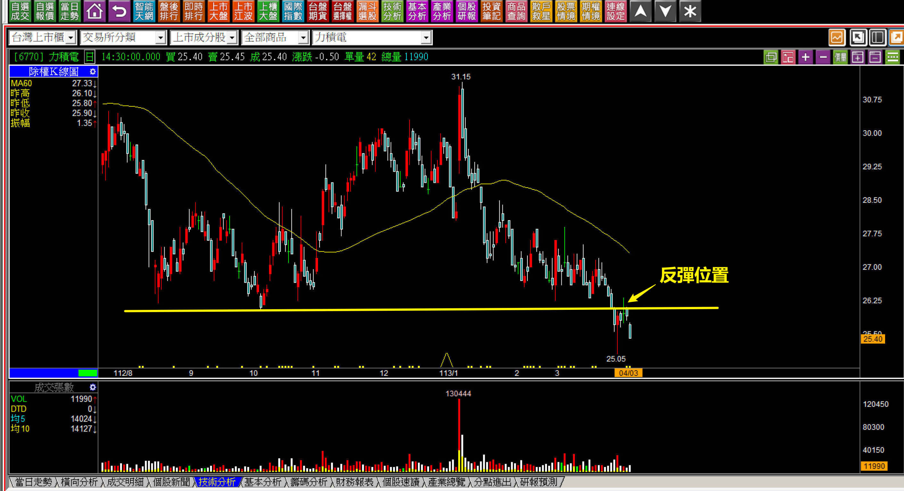

跌破頸線之後應該怎樣判斷接下來的股價？假如是因為轉盈為虧，那麼在這種大盤多頭氣盛時期，就沒有什麼人願意來買了，往往股價還會再有更低，沒有買盤，股價也能在繼續下跌，所以跌破頸線，反彈又不過頸線，答案就只剩下一個了。

**113-04-23力積電(6770)
**

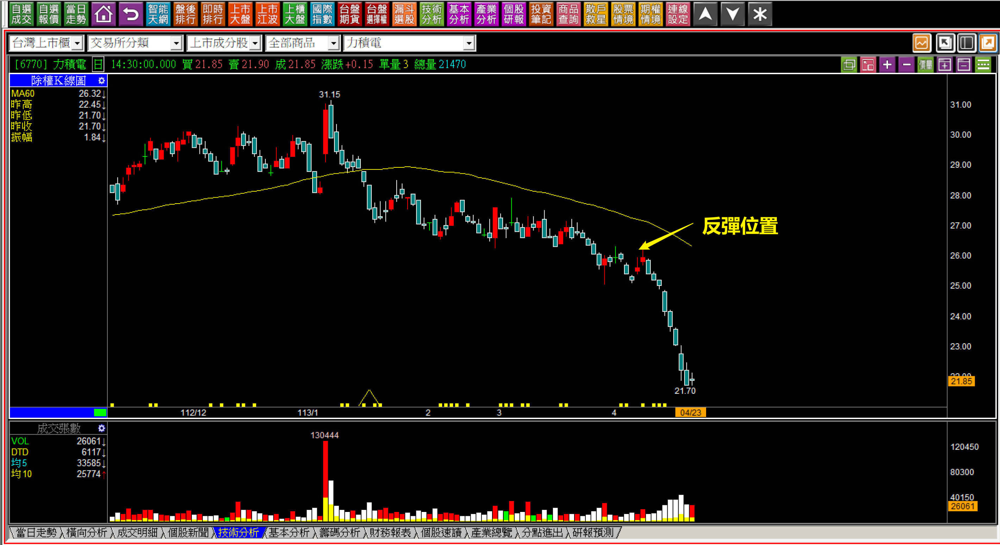

對於明日K線的判斷來說，可以判斷到的點就是股價會一直有新低，至於會低到多低？這就沒有辦法預測，也推論不到。

**沒有基本面的弱勢、有基本面的不拉抬**

沒有基本面的弱勢、有基本面的不拉抬，是完全不一樣的狀態。基本面糟糕當然吸引不了人氣，主力不玩是因為要搞股價上去容易，以後想出貨困難。當然也有那種不信邪的主力，結果把股價搞上去之後遇到了大盤轉弱、題材變了、財報變更爛，連主力都困在其中的情形也不少見。

**113-03-08車王電(1533)**

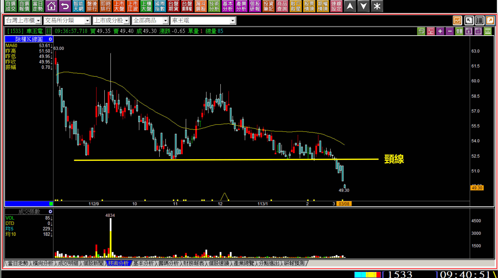

必須留意的是，如果是短線急跌以至於跌破頸線，就會出現那種「假性跌破」的走勢，意思是反彈又站上頸線，但是這個在頸線上方橫向走了許久的，跌破的時候不會有那種反彈又站上，所以跌破時的判斷就是這是真正的轉入空方趨勢了。

**110-10-13車王電(1533)**

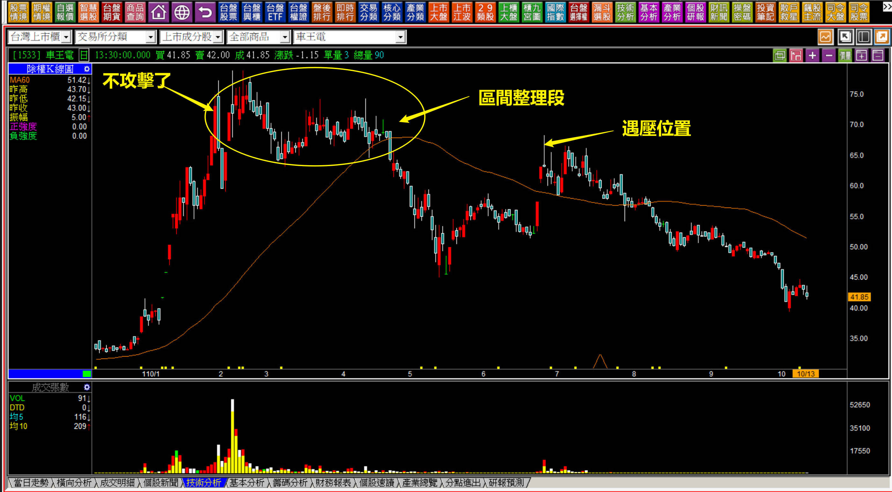

把時間回推到兩年前，這一檔曾經是主力有過明顯拉抬，然後先經過整理，下跌、反彈遇壓，再轉入空方，當然看一下財報會發現本來就沒賺什麼錢的公司，還轉盈為虧。

這是先前的狀態，現在也需要一併考慮進去。為什麼說這是主力沒出貨完畢的個股？

因為以去年每股盈餘虧損1.31元，今年還是一樣虧損的公司來說，股價竟然還有45元，就只有這個理由而已，何況主力又笨了一次，去年七月又玩了一次把股價拉到70元，這種財報只有主力自己玩而已，當時的散戶如果要買弱勢，早就買了鴻海了。

沒有基本面支持，還在大盤多頭格局中跌破頸線，接下來的判斷就不需要太細了，因為股價的空頭很難翻轉。

**112-09-10長園科(8038)**

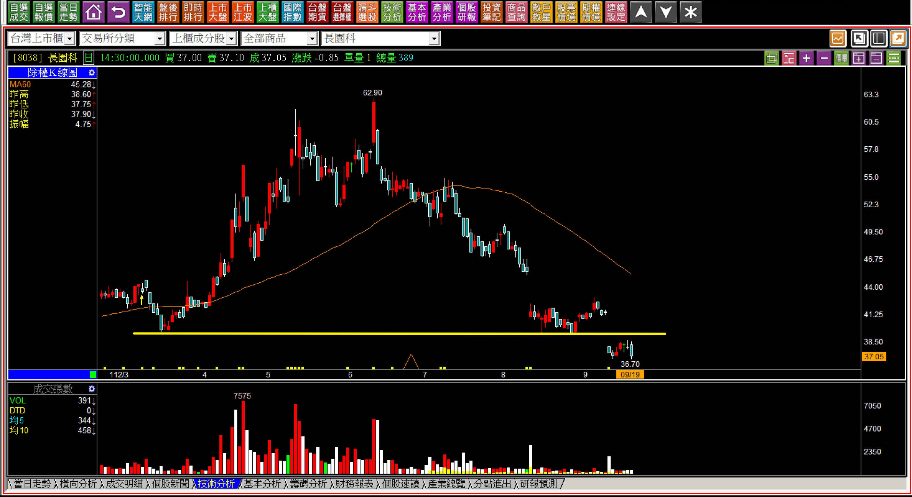

沒有基本面的跌破，當然沒救了，股價進入空方趨勢，可能連反彈要碰一下頸線，都沒有這樣的意義，因為持有的人套到頭都痛了。

用這樣的例子，時間已經是八個月以前的K線圖，就是讓讀者體會一下，試著思考明日之後股價會怎樣表現？當然，空手者不會笨到破頸線去買，問題是，如果你的投資持有部位，股價走出這樣的走勢，是否有辦法因為看懂未來而當機立斷呢？

沒錯，你會想的是，這兩家公司基本面都太糟糕了，那有基本面的，跌破頸線應該如何看待？

**111-12-21三陽(2206)**

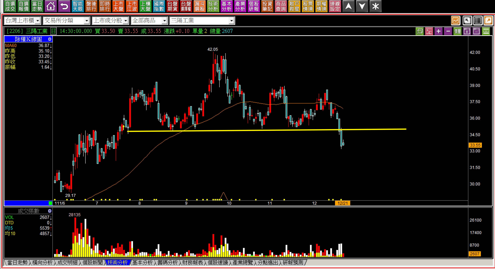

股價跌入頸線，定義上的確是進入空方趨勢，但是本益比已經偏低的個股，只不過是趨勢問題，主因就是沒人拉抬。如果沒人拉抬股價，就算突破頸線，假如環境不配合、資金沒有心，也走不出多亮眼的多方趨勢。

未來有一天「只要有人願意拉」，目前這些成交量、套牢區段的量，都是小問題。也因為沒有被主力拉抬過，所以還是有機會，因此這種類型的跌破頸線，接下來的判斷就與營運很差的公司完全不一樣。

**112-04-11三陽(2206)**

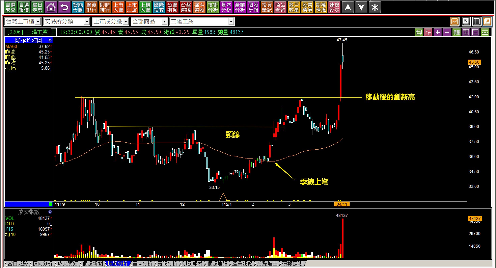

這是教學上我們談過很多次的K線圖，以前有沒有被主力拉過？對於一檔股票改變趨勢的問題，解方都單純多了，跟著關鍵K線走就是判斷的答案。

**有沒有被主力拉過，答案不同**

剛剛說到的三陽，就是跌破頸線回頭看，以往都沒有被拉抬過。沒有被炒作過，未來要化解賣壓就沒有障礙，可是假如此後跌破頸線，答案就完全不同。

**113-06-14三陽(2206)**

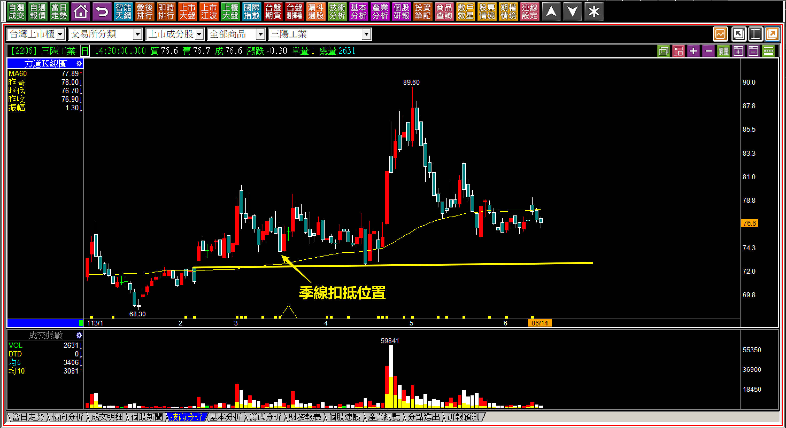

至於這裡，已經跟上次截然不同了，因為主力拉過了，股價一度漲到99.3元，又來過一次89.6元。現在還沒有發生跌破頸線，可是頭部成型中，只要跌破，對比季線扣抵位置，季線就會下彎，等於是買進的風險比機會大的型態。

**型態學確認之後的明日起研判**

其實型態學很基礎，也沒有這麼複雜，突破確認、跌破確認，在多頭的角度要判斷的就是突破頸線之後上方還有沒有賣壓；空方就比較複雜一點點，還得要分成三類，都很重要卻不脫離基本面數字，假如被主力玩過的股價，那就更不用說了。

所以往往在多頭市場出現，以被主力玩過的居多，考慮到主力自己都有被套牢或者離開時已經把籌碼都丟給散戶，怎樣看都沒有再去解救套牢者的可能，基本面沒改善，就更不用說。

**112-09-19康舒(6282)**

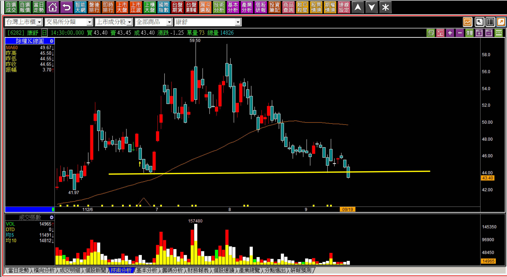

這一根就是型態轉變的確立了。

以前有過拉抬、高檔有過吞噬，基本面根本就沒什麼東西，市場繪聲繪影，當然往下跌，從這一天開始，趨勢已經可以判斷一切。

明日K線的判斷意義不是單純只明天，而是從明天之後股價會怎樣表現？答案已經了然於胸了，弱勢，但是有可能反彈，可是這條線以上的這麼大一座山，沒有任何主力會去解決套牢者的問題，因此未來的走勢就是漲少跌多了。

**補充康舒的走勢思考**

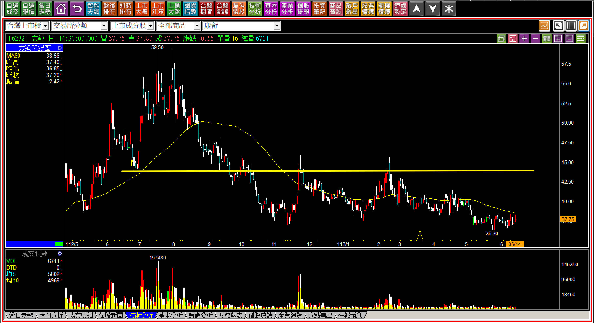

這裡我還是補上後來康舒的走勢，很多人難以忘懷自己的買進成本，套牢之後就只剩下「解套」這個單一標準在看K線，但是股價永遠與持有人的想要無關，而是資金力量與套牢結構。加上了這層判斷就會更知道自己應該怎樣解讀股價的未來。

以下不算是測驗題，而是現實的比對。

**空頭已經確立之下的頭部擴大**

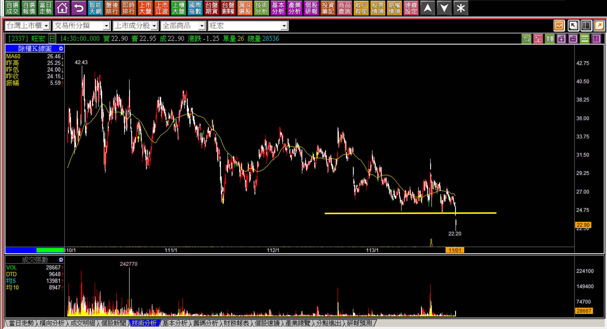

**首次頭部成型**

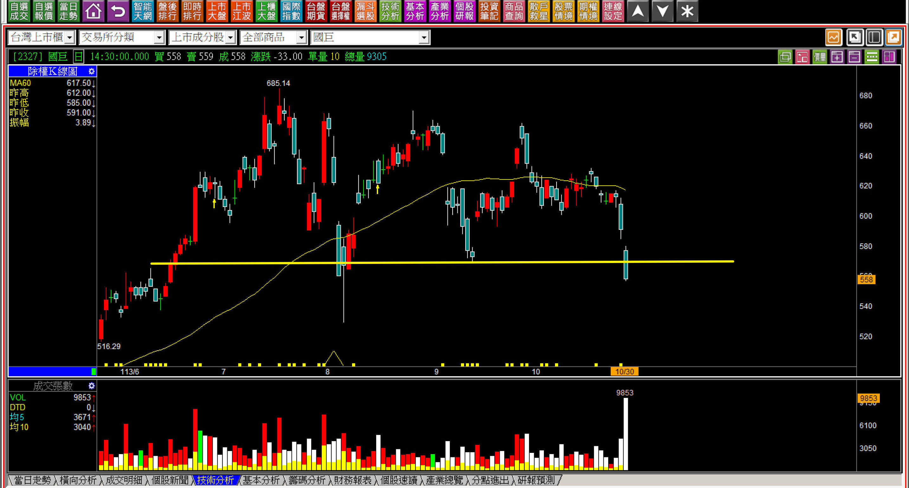

不論是哪一種，對於「明日K線」來說，接下來都很難再看到股價的攻擊或者拉抬，但是如果這是手上的持股，就真的得要好好檢視基本面，因為股價往往提前反應一家公司未來的營運狀況，頭部成型，就是市場總有人比我們早知道這家公司不值得這個股價，而且知道已經超過三個月以上。