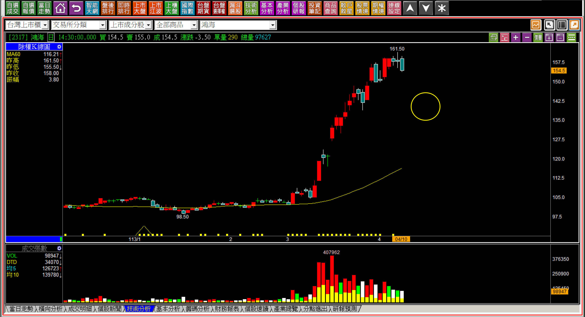
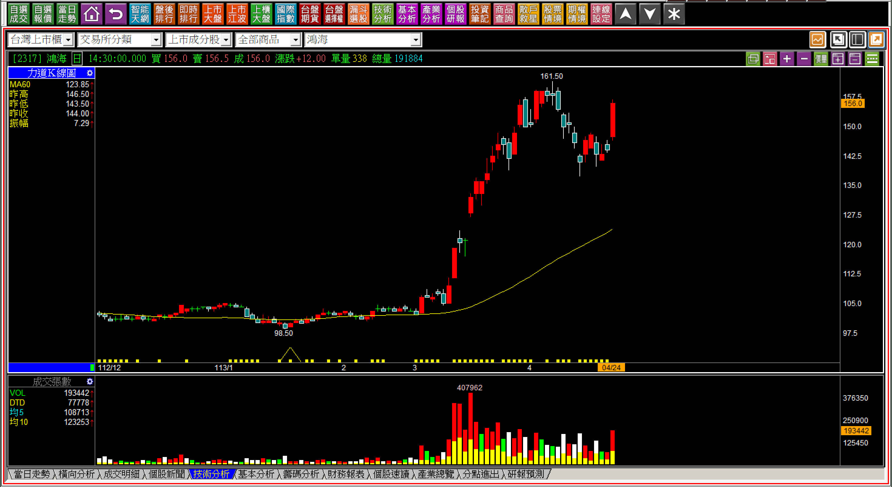
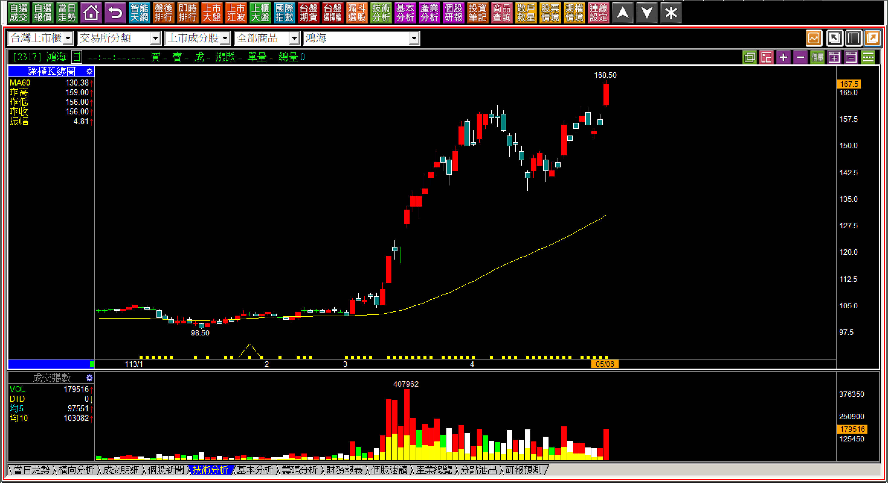
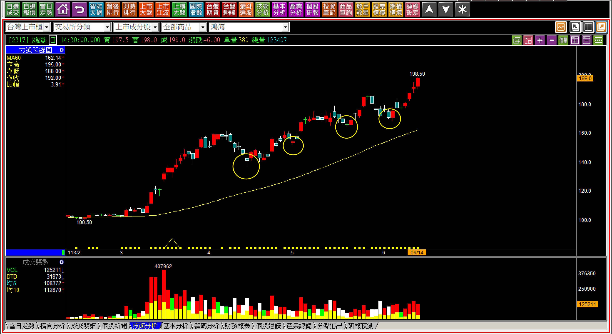
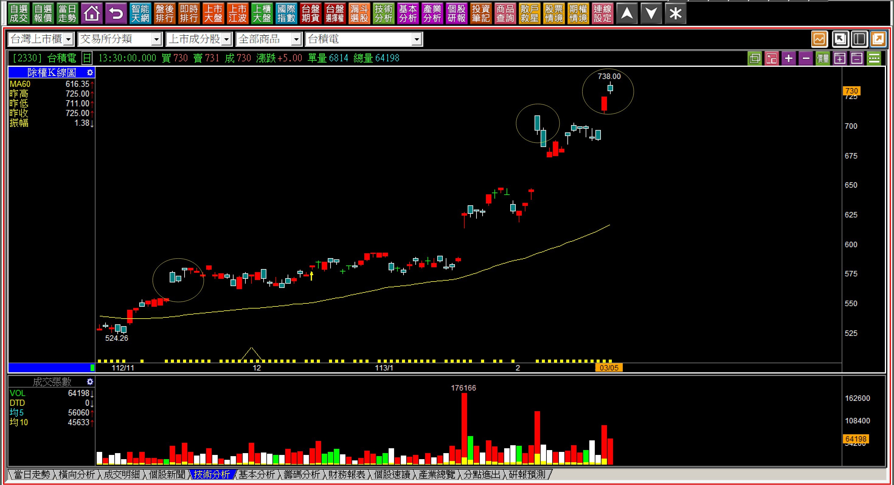
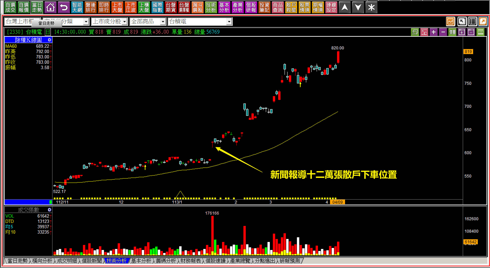
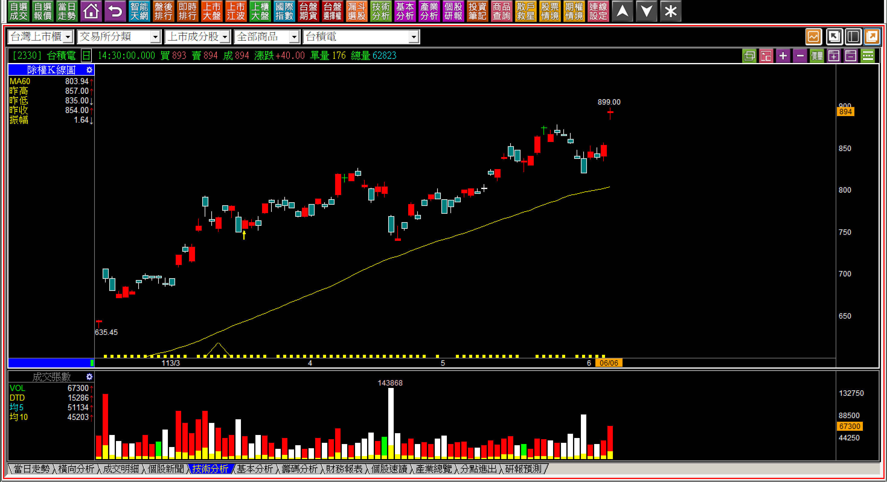
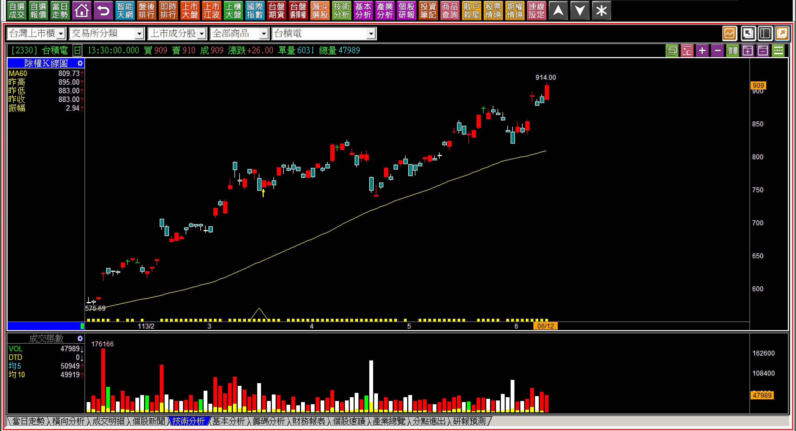
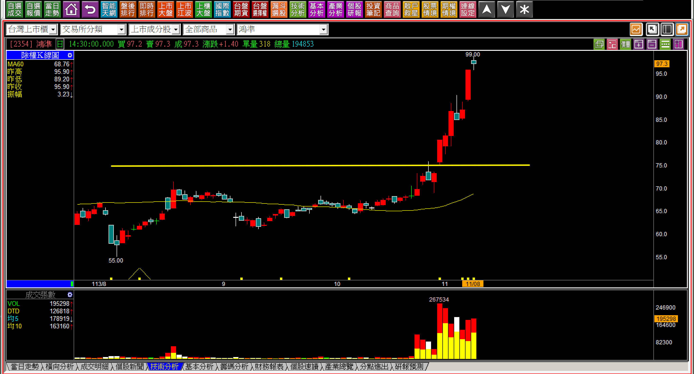
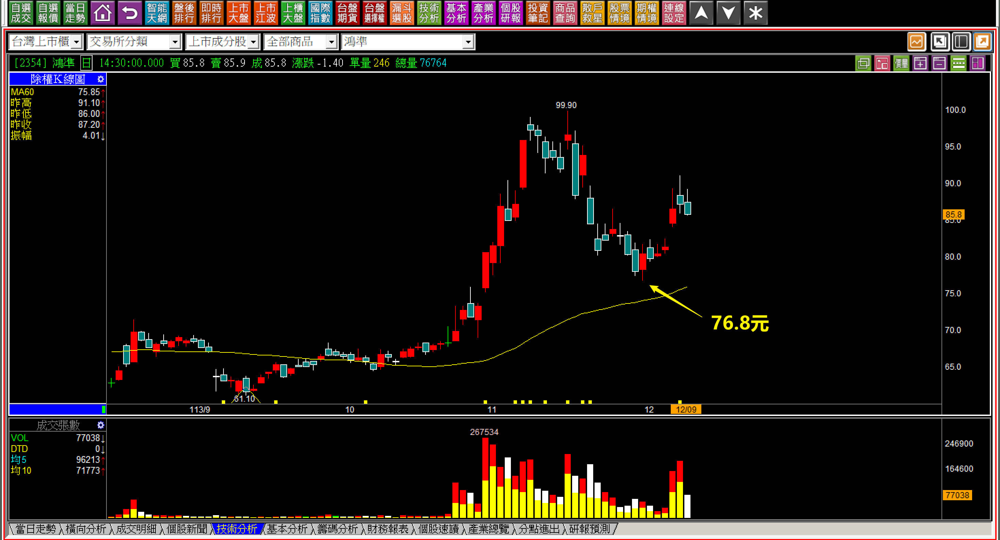

# 【明日K線】「多方波動的確認點」篇

任何主力、法人、市場資金，在做交易的時候想的，目的都不會是把股價做出多方趨勢給人看的。

他們可能會知道自己的大量進場，資訊會有法人主力買賣超，會變成長紅黑，會有指標翻正，可能會做很多煙霧迷惑投資人，但不會花時間跟錢去搞成長期多頭趨勢，因為太困難也燒錢。

再大的資金都會考慮到「順應趨勢」，短期趨勢可以，沒辦法獨自製造長期趨勢。

這就是「趨勢是價格方面最重要的事」的原因，即使是主力，也會利用環境趨勢來幫助自己達到目的，只有散戶喜歡逆勢而為，例如飆漲的股票跑去放空，跌到破底的加碼買進。

多方趨勢的判斷有很多種類可以辨別，季線的上下彎是最簡單的一種，因為現在的軟體很普及，手機APP的股市報價軟體也會幫我們畫好季線，所以要一眼看出並不困難。所有判斷趨勢方向且與交易決策直接關聯的，就是「多空波動原理」。

**多方波動原理與明日K線的關聯**

我先說一個小小實例，這幾年，身邊有很多對股市並不算熟悉，但是有在投資的人，普遍投資年報酬率都來到驚人的六成，那麼這些人從七月一日開始，要怎樣應對市場？股票找機會獲利了結？還是繼續抱著，看能不能超過五年？

我們每天都在面臨交易抉擇，就算決定今天都不動作，也是一種抉擇。

**多方波動原理有兩個最大的考驗問題：**

一、第一次的拉回，幅度無法預期。
二、上一次的低點沒破、上一次的高點越過，都是多方持續的判斷點，只是這兩點距離很大。

**決定中長期投資之前的認知**

當股價從原本的整理型態突破、創新高之後，展開多方走勢，問題只是強弱而已，但就算遇到強勢，第一次波動的回檔會回到哪？是中期投資要面臨的兩大考驗之一。有的股票小幅回檔、有的卻是直接回到起漲點，熬過了第一次的回檔才是真正投資的開始。

是的，持股在獲利中的持有，才是投資；套牢不是，因為你無法分辨自己真的看好？還是只是在等解套。

**113-04-10鴻海(2317)**

這個圈，就是明日K線的推估，意思是股價要中期持有，就得要忍受第一波回檔，而多方波動的問題就是這第一個回檔，無法預期，必須要忍耐回檔的幅度，直到股價再創新高，才是多方趨勢的繼續。

那會繼續多方嗎？在這種通膨之下，理論上會，如果不會，當初就不需要花錢把股價突破還權的歷史新高，這一點跟台積電，或者多數績優股都是一樣的道理。

**113-04-24鴻海(2317)**

此處已經可以確認第一個回檔低點在哪了，也知道再突破新高，才確認是多方波動。

所以下一步就是等股價創新高後，才能確認多方波動的繼續，要知道，大多數散戶現在根本就沒有鴻海了，早就已經解套賣掉，就跟台積電的股東一樣，最強的一段根本就沒持有。

**113-05-06鴻海(2317)**

這裡等於是多方波動的確認，因為多方波動本來就是高點比前一次高點高，就是明日K線的答案，只可惜，多數投資人上一次高點沒賣，得熬一個月，所以變成這邊有高賣一趟，後面還有一大段漲勢都錯過，那當初是在等什麼？

**113-06-14鴻海(2317)**

從這邊的股價再回顧，股價當然就是繼續多方波動。

明日K線的判斷意義在於第一張圖的時候，還沒有第一次回檔的時候，就要已經先規劃到這邊，過程不可能每天怎樣走都準確預測到，但是中期股價會這樣表現不意外，就是以明日K線來思考應有的動作功能。

**小結：只要股價有創新高，問題就不大了。**

**多方波動的第二個要點**

多方波動的第二的要點，剛好就是股價創新高(突破前高)。因為多方波動判斷點是前低沒有被跌破、前高被越過，這個「越過」當然就是創新高。

所以對於明日K線的判斷，是股價到底有沒有越過前高，越過前高之後，下一個判斷點才又是前低有沒有跌破。

**113-03-05台積電(2330)**

把握每一次突破前高創新高的價位，不要輕易的出脫持股，這是依循多方波動的重要邏輯，必須知道，一旦賣掉，萬一股價就是多方波動持續進行，可不是再買下一檔可以彌補回來的績效。

**113-04-09台積電(2330)**

技術分析很單純，理論不複雜，可是散戶永遠都是短線心理，尤其是先被套，才解套，常常就會先出一趟，打算以後再低接，卻沒想過，萬一接下來都不回檔怎麼辦？

相信這樣的解說，讀者可以理解為什麼學K線，還需要明日K線的輔助判斷了。

**113-06-06台積電(2330)**

只要股價突破前高，再創新高，要保持良好的習慣，因為股價正在依照多方波動，所以下一點就是回檔只要沒有跌破前低，都沒有出脫股票的理由，這才是中期投資持有的判斷。

明日起就是股價多方繼續表演的時間開始。

**113-06-12台積電(2330)**

有人可能會想，那萬一跌破前次低點，這樣不就到手的獲利又跑掉了嗎？

會這樣想的人都沒有認真想過，那萬一股價繼續一大段多頭，買得回來嗎？明日K線就是要具備對未來股價走勢的預判能力，藉此找到最符合自己需求的投資目的，股價可能的走勢。多方波動原理本來就是最基礎，且最能幫助到投資的基本原理。

**強勢股往往都會有這個多方波動的考驗**

當股價短期快速強勢，甚至直接呈現日出攻擊狀態，下一步就是考驗持有者到底是要「價差交易」，還是打算「中期持有」，面對波動狀態的確認。

**113-11-08鴻準(2354)日出攻擊進行中**

不論選擇哪一種，都要確認之後不改變，不然過程中就會總是後悔不已，既然已經進入日出攻擊狀態，價差交易者通常會選擇日出攻擊結束出場，已經不會考慮忍耐第一次波動的回檔。

 所以明日K線判斷，只是做價差交易唯一的判斷點就是等待日出攻擊結束，這時候完全不要去想波動狀態，因為股價根本就還沒有波動，無法確認第一次回檔的幅度會有多大？

**113-12-09鴻準(2354)**

以事後論來檢視當時對於明日K線的判斷，股價第一個波動回檔點就是76.8元，離日出攻擊結束95.9元相差19元，價差交易者應該是無法忍受這樣的回吐幅度，至於投資目的，那就因人而異了。

以此處而言，未來需要突破99.9元才可以是多方波動的確認點。

**後記：114-12-18鴻準(2354)**

明日K線的認知就是下一個突破才是繼續多方波動，結果都沒有出現。