# 【明日K線】「漲停板出現後再繼續上漲的機率」篇

一般人存在著「只要是買進股票，就有一種股價目前是高還是低」的對比，也有著自己如果現在買，算是買高了或者買低了的判斷點存在，當然用的是今天以前的股價來比。有了這個想法，就很難體認到：**今天把股價拉漲停的人，他們耗費了多少代價？心態目的是什麼？**

若打算理解漲停板後的明日起走勢，就得先從「漲停板的當日」來了解。

**113-03-12新產(2850)**

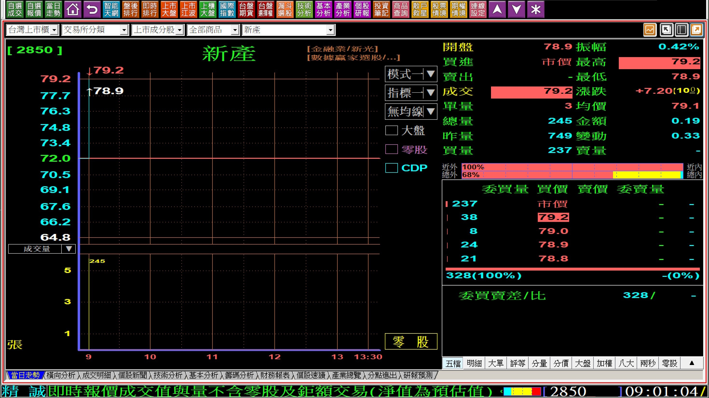

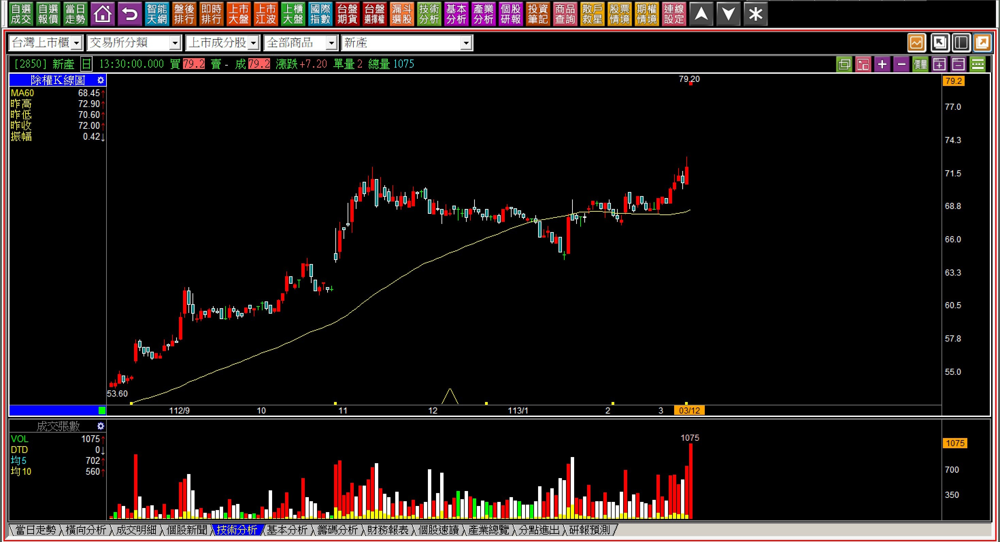

這是冷門績優的產險股，長年以來別說漲停板了，就算要看到一天內有5%以上的上漲也不多見，所以先試著感受一下，當你一開盤不久就看到股價漲停板，想法會是什麼？是會積極去排隊等待買進嗎？還是乾脆放棄，換看下一檔？假如是因為股價已經漲停板，你不會買，應該要思考的癥結點是：「這個價位不就是明天的平盤而已嗎？」

然後，就對這個價位79.2元，後來股價漲到105元、121元的這些事實無感，因為如果有感，就等於承認自己當時判斷錯誤了。

為什麼明天的平盤價與今天的漲停價是一樣的數字，人的感受卻截然不同呢？更重要的是，出現了創新高的漲停價之後，未來如果再漲停，或者股價繼續上漲，這樣的機率比較高？還是選擇弱勢股、看起來有底部的股票機率高？

這是值得深思的問題，因為人的理性判斷與行為做法通常不一致。

只要股價沒有回到第一根創新高的漲停板之下，都是強勢的表現，都還不需要考慮出場的問題。

**113-05-02新產(2850)**

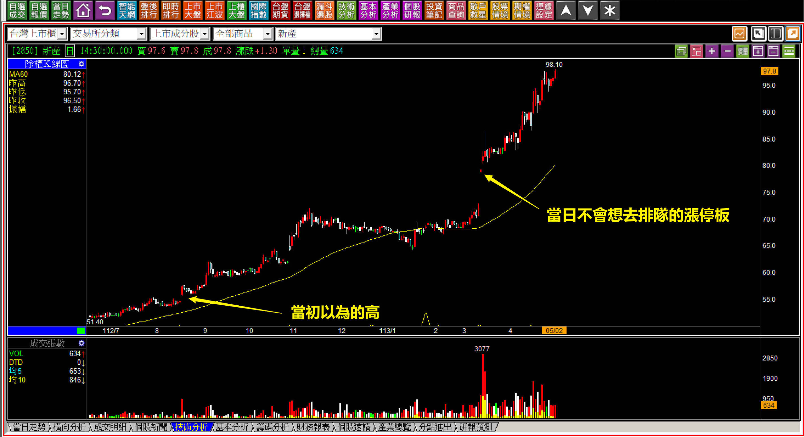

回頭看以前的高，漲上去之後卻算是低，都是視覺上的感受。

一般散戶的觀點，往往就是以當下所看到的股價高低，憑著感覺判斷自己敢不敢進場買，也就是這個原因，交易者必須要更加往攻擊的可能性孰高孰低思考，不應該繼續跟著一般散戶，持續犯下同樣的思維盲點錯誤。

**哪一檔股票的漲停機率高？**

這是我今年以來講座中很常用的解說對比，我來訂一個主題：「你覺得以下兩張K線圖，哪一檔股票『明天漲停板』的機率高呢？」

**選項一：瀚宇博(5469)**

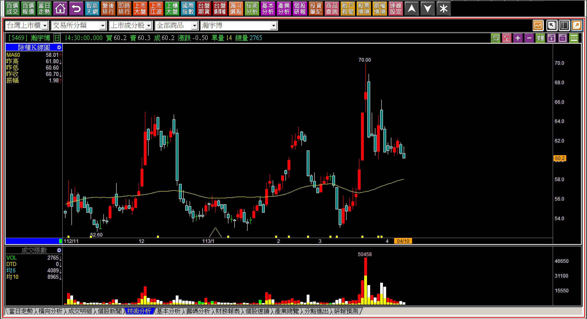

**選項二：亞翔(6139)**

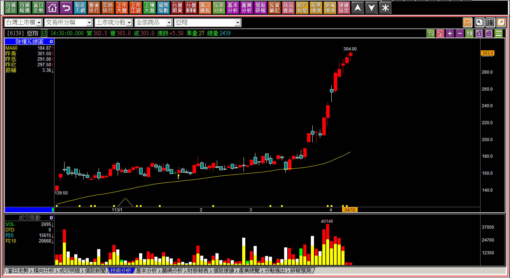

這是同一天的兩檔股票走勢，明天哪一檔的漲停機率高？我相信人們都看得懂，強勢的股票因為有主力的拉抬，且攻擊持續進行中，大家都知道亞翔的漲停機會高，可是，真的要花錢下去買進，人們選的卻往往是還沒漲的、弱勢的。

漸漸的就會忽略了K線的力量，不理會漲停的機會，只重視自己擔憂的下跌風險，於是對K線的判斷越來越沒有能力，從價格判斷變回到感覺判斷。

**隔日選項一：瀚宇博(5469)**

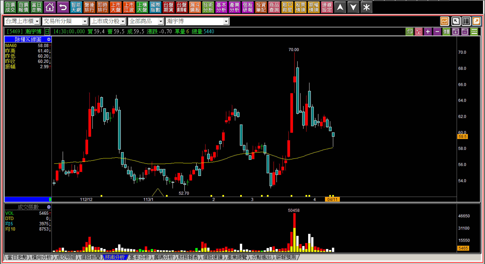

**隔日選項二：亞翔(6139)**

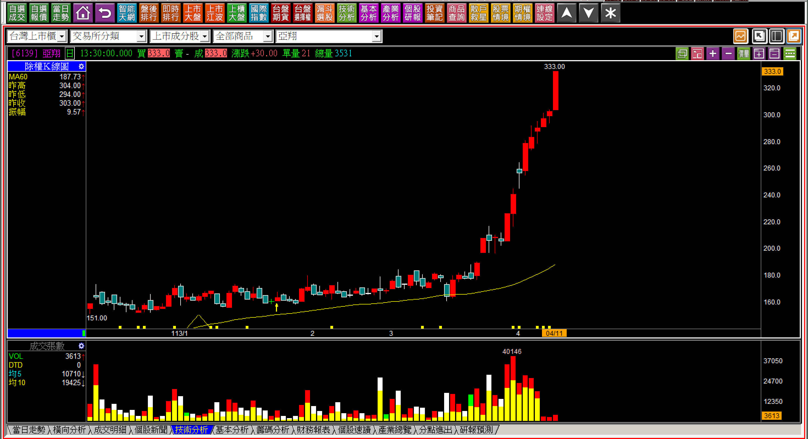

第二天，亞翔漲停板，瀚宇博依然下跌，這樣就是認同答案了嗎？可能有人認為，那是一個巧合罷了。所以站在明日K線判斷，我們從這裡當成問題再重新想一下：「上圖兩檔股票，明天哪一檔繼續上漲的機率高？是跌的那一檔，還是前一天漲停板的？」

可以很肯定地說，的確大多數投資人都會選擇亞翔，可是真的一定要要花錢下去買進，依然選的是去買弱勢的那一檔等機會。

**再隔日解答：瀚宇博(5469)**

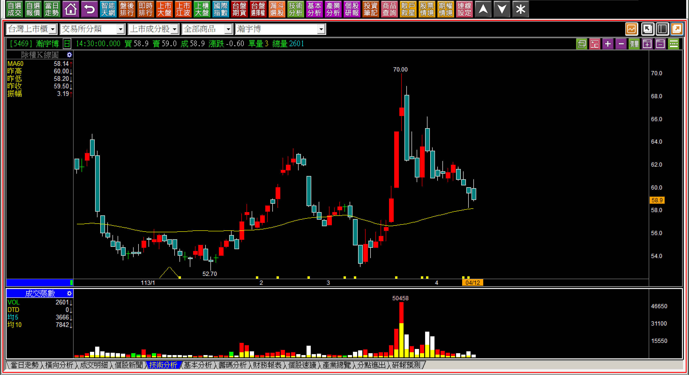

**再隔日解答：亞翔(6139)**

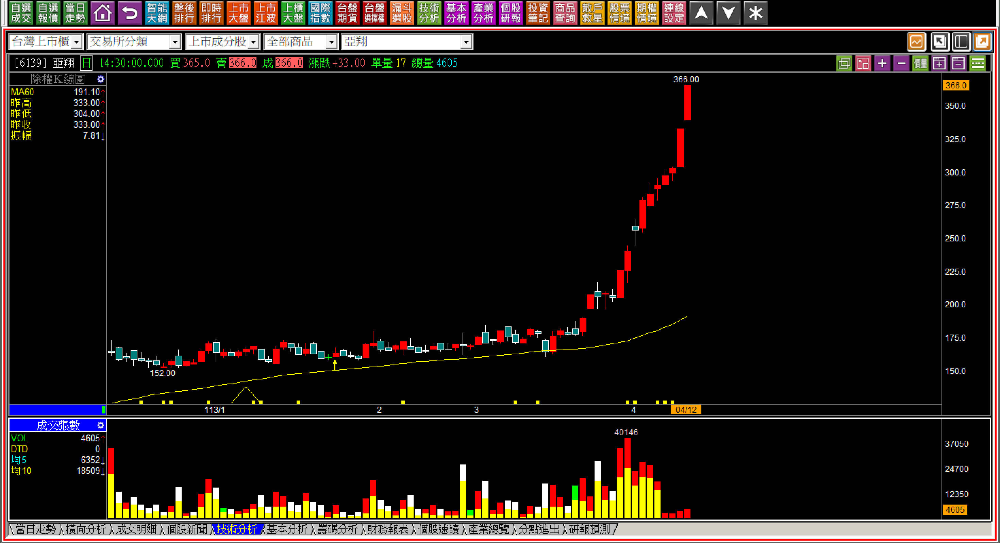

結果強的還是強、弱的還是弱。知道漲停板強勢的繼續上漲的機率高，但是真的要選擇買一檔，投資人照樣選看起來低的，這是人性的問題。

所以，K線的學習與交易的判斷，最大的障礙就是『知道但是就是做不到』，明知道要應對明天之後的走勢，今天應該汰弱留強，應該要選漲停板機率高的個股，人們依然是看對、做錯。

當股價創新高之後，漲停機率就開始上升了，可是多數人選擇的就是賣掉獲利了結，錢轉進漲停機率大幅下降的弱勢個股，寧可慢慢等待。就是這個特性，我們在交易上更需要認清，漲停板的機率來自於：**到底股價有沒有主力在其中拉抬**。

這也是明日K線判斷的關鍵，是判斷力量是否已經進駐，而不是判斷感覺哪一檔比較安全。

**強勢判斷總在剛創新高時**

**113-02-29亞力(1514)創新高漲停板**

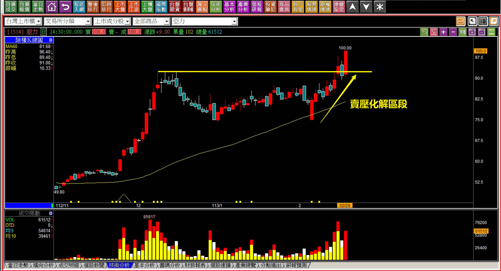

經歷過了賣壓化解，也就是攻擊意圖之後，是散戶不願意追高的狀態。明日K線的重點在於訂下賣壓化解區段，股價只要不回到這個區段以下，就是攻擊狀態，保持耐心也看得懂停損點應該要在哪。

**113-04-10亞力(1514)**

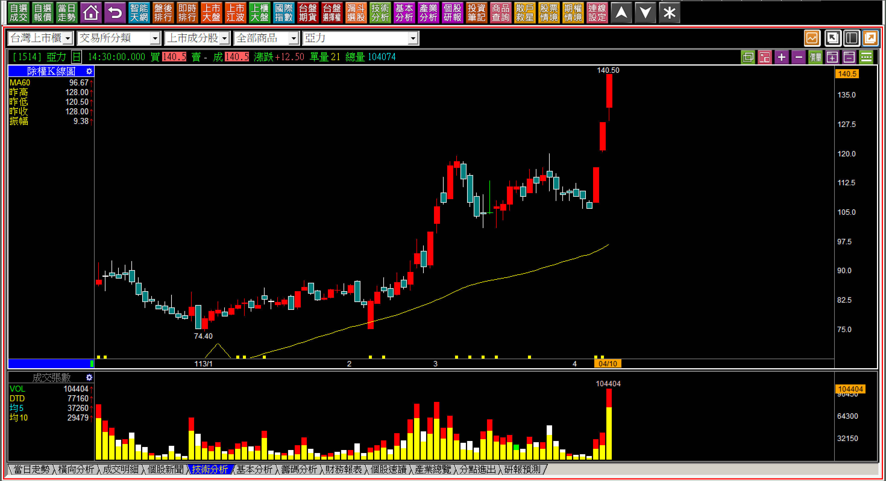

一般散戶是不會抱到這個階段的，震盪之後就賣了，根本留不到連續三根漲停板，原因在於對交易狀態過於短線心裡，對於強勢股不夠堅持，對於漲停板的認知錯誤，漲停板是需要資金拉抬的，資金只為了自己打算，不是股價高或者低。

**113-04-12亞力(1514)**

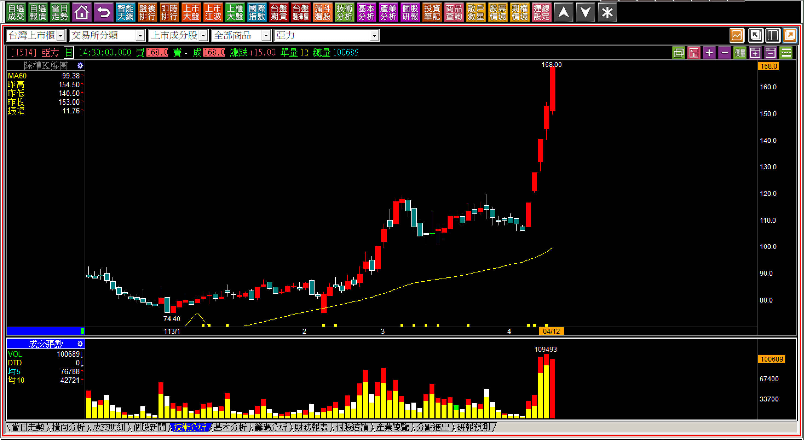

可以試想到底是已經創新高漲停板的股價，再漲停板的機會高？還是低檔底部型態完整的股票，連續漲停板的機會高？但是人們盡可能地不去研究力量方面的問題，只想著等到強勢過後才慢慢的佈局，就會得到以下的結果。

**113-06-07亞力(1514)**

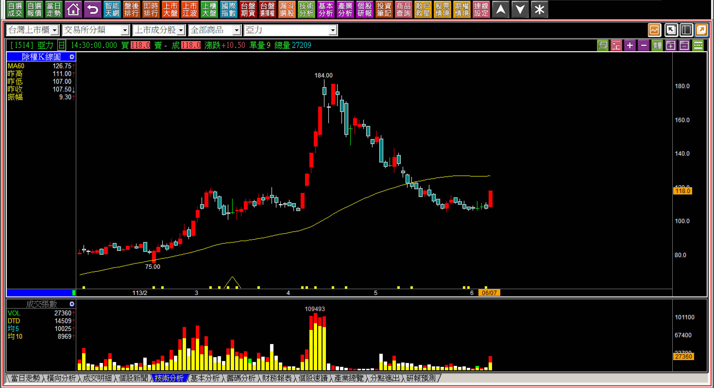

這裡並非創新高的漲停，只算是跌深的反彈。

看起來好像是前一天有買就可以賺到漲停，但其實持有一個半月已經崩潰了心態，且股價漲停板前無任何可循之跡。明日K線的關鍵就是判斷未來走勢，並不是比賽耐心。

單純要說上漲的機率孰高？當然是創新高且漲停板的股票機會最高，只不過投資人選的是往往是機率低的股票，打算用耐心持有來取代。