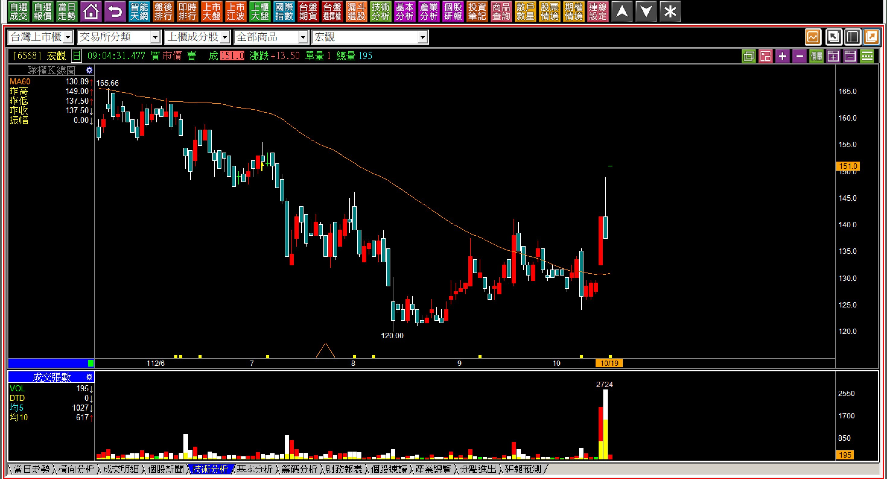
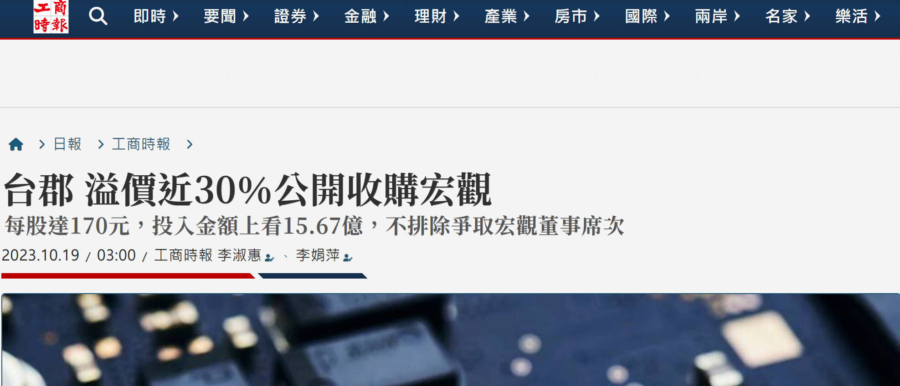
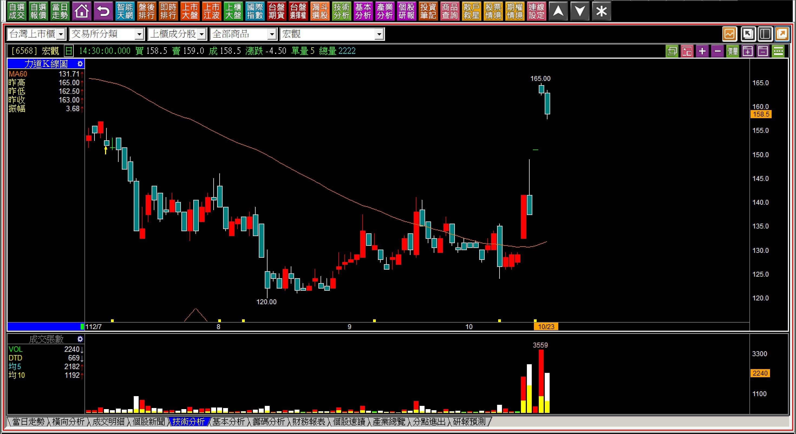
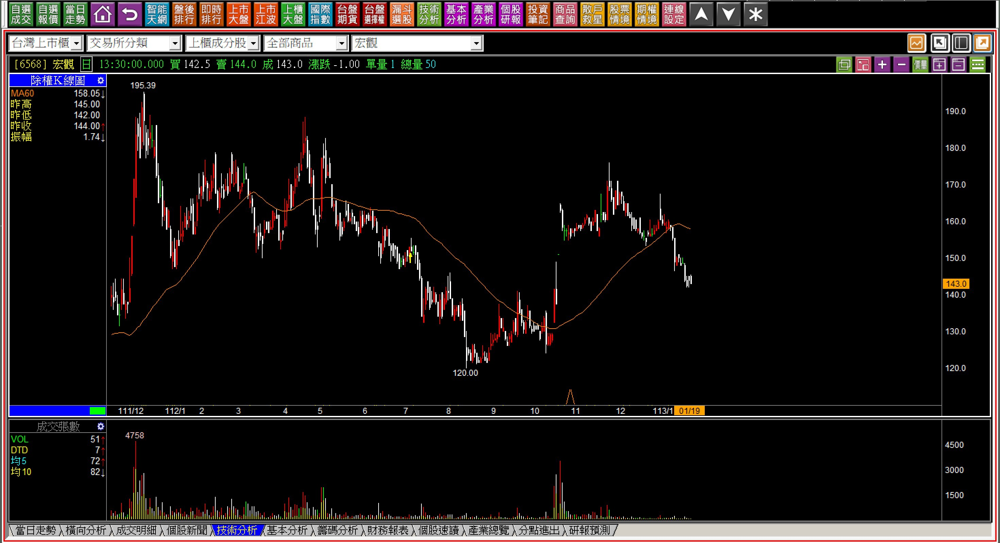
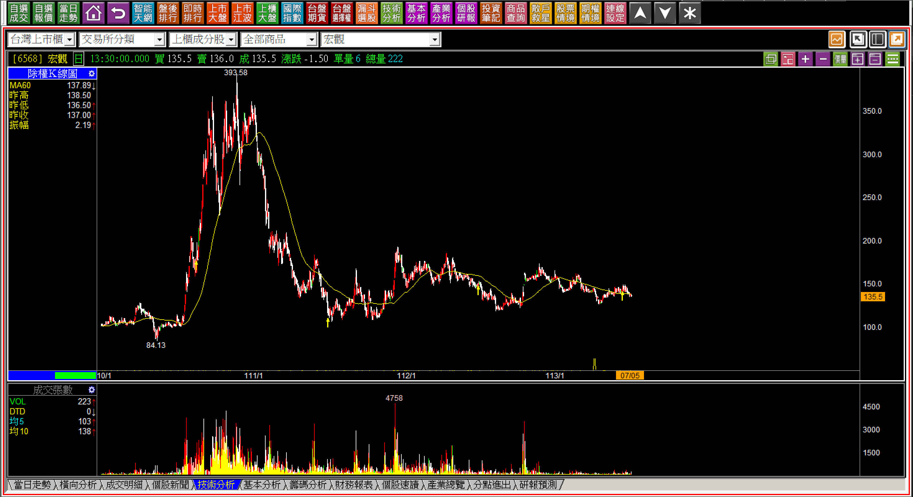
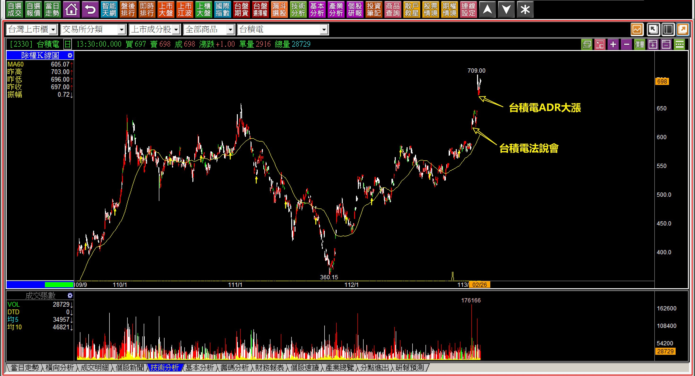
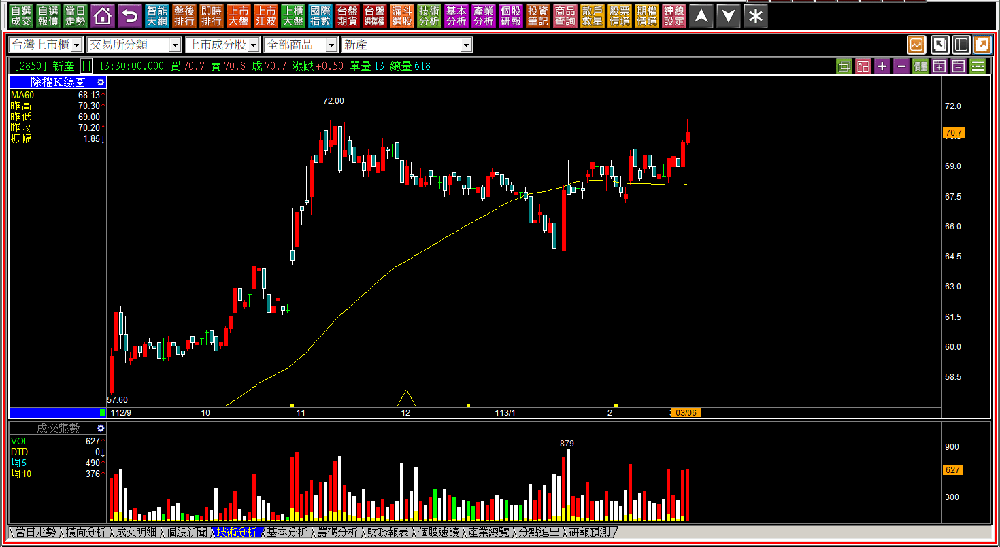
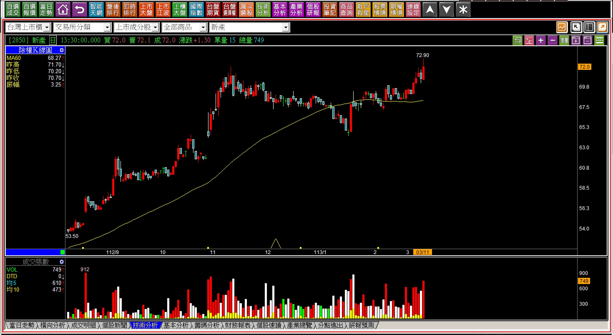
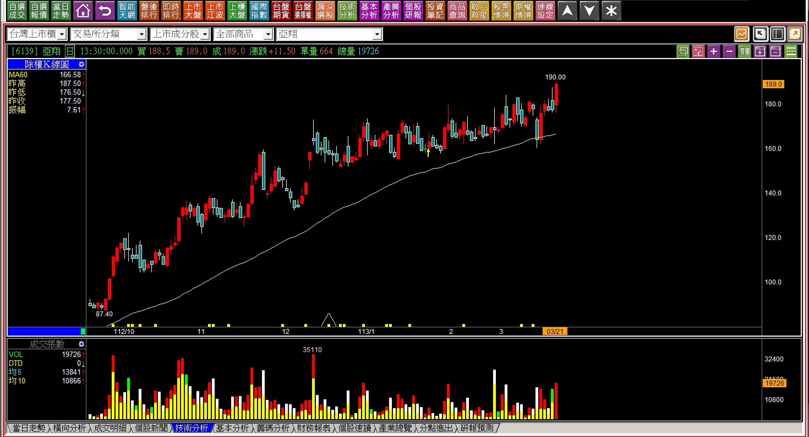
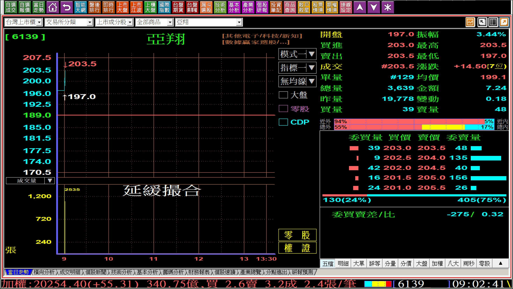

# 【明日K線】「賣壓化解」篇

「賣壓化解」是一個股價進行的過程，其實也是一個「觀念」，並不像是一般的技術分析理論找買賣點。

通常人們會聽到：「突破買進」，指的是頸線突破之後是買點的意義，鮮少人會進一步去理解為什麼這是買點？原因在於過往有過的套牢籌碼，被有意圖的資金吃下，這個過程就是「賣壓化解」，所以這是對觀念的認知程度。

對於明日K線來說，股價可以被預期到有哪些可能性？都是明日K線應用的範圍，所以如果頸線被突破，隔日理論上就可以畫出三種狀態：跳空攻擊、推升攻擊、根本就不攻擊又跌破頸線。那麼再往前推一天，也就是正在賣壓化解的過程中，明日K線有哪些可以預期的呢？

當然我們也可以簡單地說：化解、不化解。不過明日K線還需要考慮到環境背景條件，也就是市場上的利多利空訊息判斷，用以解讀到底股價的上漲是真的有力量化解、還是股價只不過是被消息面帶上而已。

假如是利多消息，那就不應該漲了又回檔，讓還來不及進場的人有更低點可以買進。

**宏觀(6568)被台郡收購的消息**

112年十月十九日，媒體報導台郡溢價30%收購宏觀，這家已經被公司澄清沒有做低軌衛星的公司，收購價格為170元。一般我們看到這樣的訊息，就會誤以為股價至少會漲到靠近170元才是，但是K線圖上已經很清晰，消息一出跳空漲停一條線的上方，都是過往的套牢區段，也就是賣壓依然存在，而利多帶給人們的感受歸感受，不是資金力量。

就算進去佔點便宜的人，心裡想的也是撈一點就走，那麼沒有賣壓化解的力量，明日股價會繼續一條線嗎？

**112-10-23宏觀(6568)**

股價的確來到165元，但隨即就往下掉，可以預測到的是股價不會超過170元，一個人頂多也只能買一張應賣，那就表示沒有賣壓化解的力量存在，多餘的籌碼也還是會被倒出來。

**113-01-19宏觀(6568)**

事後回頭看這一段，除了打算把手上的一張股票丟給台郡的人之外，完全沒有任何化解更高檔賣壓的力量，所以雖然前一年的股價就是頂多到170元，可以理解的就是收購結束時，股價就會重新回到原本的狀態，那什麼是原本的狀態？

**113-07-05宏觀(6568)**

縮小K線圖就可以看到，在110年的那一段就是股價被低軌衛星作為題材的飆漲區段，而112年被公開收購時期，上方就是滿滿的套牢，沒有賣壓化解的力量對於明日K線的判斷是最簡單的，加上170元收購價當作天花板，後面的走勢本來就可以預期。

有很多人以為被公開收購是一項利多，其實被公開收購後在多頭市場算是利空，因為股價被定了天花板，就等於交易的獲利有限，但是風險就是股價回到基本面，或者回到原本的空頭趨勢，這怎樣看都不會是利多。

**台積電(2330)法說會報喜後**

113年初，台積電先有法說會的報喜訊息，再有ADR率先大漲的刺激，股價用兩個跳空上漲化解了賣壓。看到這樣的賣壓化解，能否推演到未來台積電的走勢就是展開攻擊呢？

相信沒有，現在會看好台積電的人是因為股價已經來到千元，對比當時668元的化解突破來說，當然就覺得那時是機會，可是每個人都經歷過那段時間，在當時才不到700元的時候有看好嗎？

明日K線當然是看不到的，可是在發生的時候就已經推演出答案，賣壓化解雖然簡單卻讓人還是受限於高低感覺問題，這才是明日K線作為反覆熟練技術分析判斷的原因。

**賣壓化解的前一天**

股市裡有一句俗話：「會靠近就會越過、不會越過根本就不需要靠近。」984元的台積電在當天是歷史新高，離千元大關只剩下36元，那就表示會越過，判斷這一點不難，賣壓化解也有這樣的意味存在，也因為漲跌幅10%，任何一個明天都有機會化解賣壓越過高點。

這裡說到「前一天」是統稱，並不是剛剛好有辦法判斷股價可以在突破的「前一天」看得出來，而是以現在的漲跌幅10%範圍，只要現在的股價在上漲10％的範圍內，就會創下新高，就是屬於這個統稱的範圍。

**112-03-06新產(2850)**

新產在一月份先有回檔，然後慢慢地推向高點，就是賣壓化解的過程，直到越來越靠近，這就表示從這一天開始，明天起隨時都有機會完成，常態在看盤的人，本來就會對高檔區域、賣壓化解的股票有興趣，自然能推出這樣的結論，散戶習慣低檔找機會，不會理解賣壓化解的重要性。

**113-03-11新產(2850)**

這一根賣壓化解「完成」，即便是成交量低到每日不到千張的新產，這個突破與化解完畢，本來就是可以預期到的，雖然不見得是明日，也不知道會是未來的哪一天，但是明日K線的意義就是看得懂，知道將來會發生，發生時要判斷的交易決策。

**賣壓化解前的準備工作**

結合攻擊意圖的呈現，當股價慢慢的往前高邁進，就必須要考慮市場當下對於這家公司是不是有利多的解讀，不論是否真正的利多，短期內只要有看起來像是利多的好消息，就會先讓短線賣盤縮手，有利於股價不需要成交量就拉高。

對於成交量來說，更高價的量越大，就是當時的套牢量越大，表示股價如果要化解賣壓，當日通常是有量的，自救型突破的賣壓化解例外。

**113-03-21亞翔(6139)**

理解了股價創新高的第一天出現，就是賣壓化解完畢之後，答案就很單純了，一是跳空攻擊、二是推升攻擊、三是不攻擊又跌回攻擊意圖之下，這就是對隔日的判斷。

**113-03-21亞翔(6139) 09:02**

這是明日K線的重要判斷，如果沒有前一天先看清賣壓化解完畢，也就沒有隔日的三種推演，這裡就看不出來股價呈現的就是「跳空攻擊」，以為就是個跳空開高。

攻擊有很多細節可以辨認，但是沒有賣、提早錯賣，都是絕對令人扼腕的事情，賣壓化解後的明日K線就是幫忙釐清自己面對股價應該怎樣應對，不是技術分析很困難，而是人性的問題反覆不斷阻礙交易順利，明日K線目的就是為了改變人性的障礙。