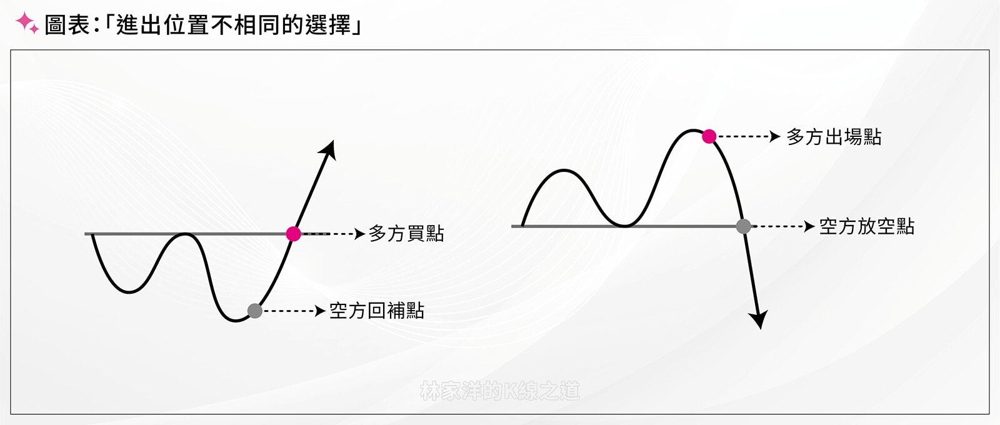
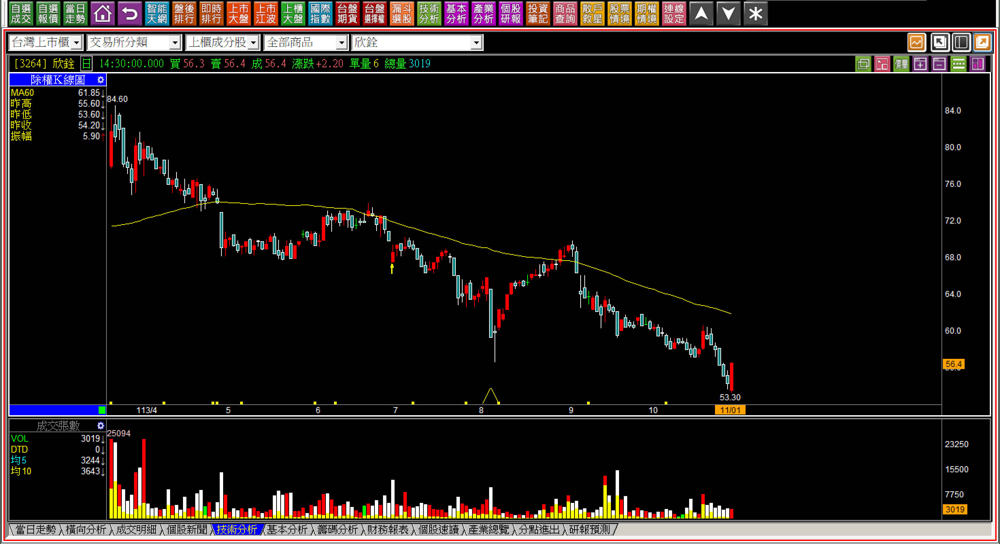
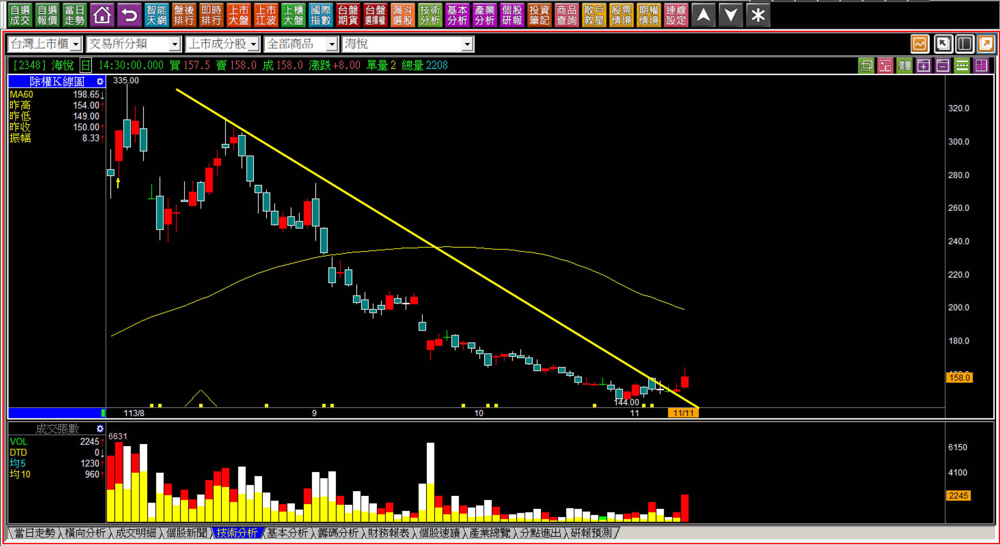
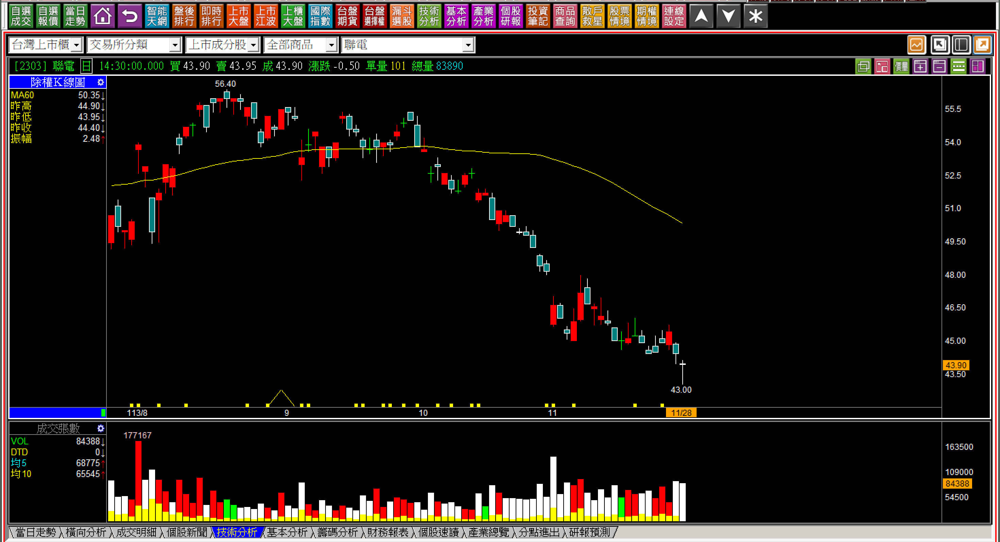
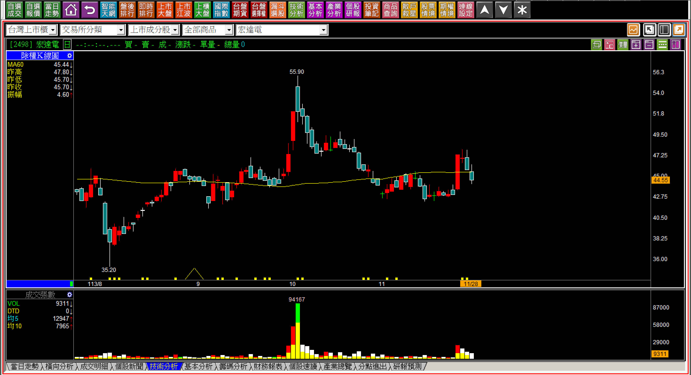
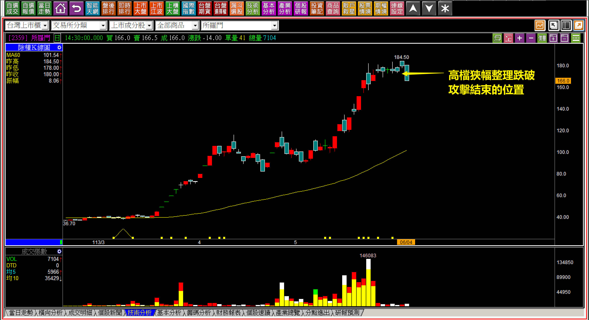
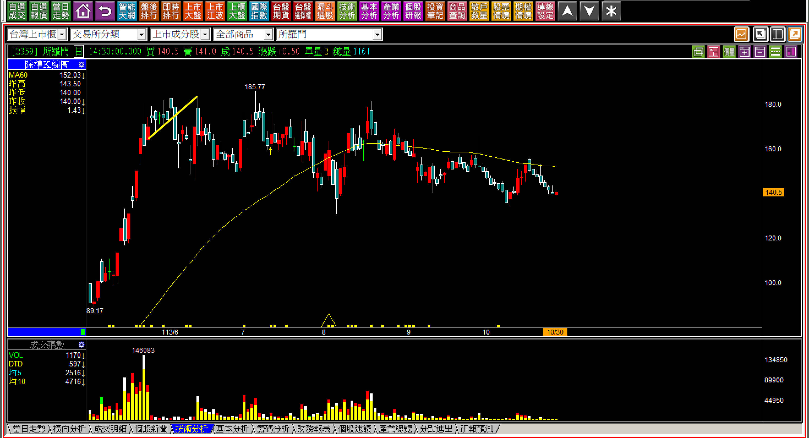
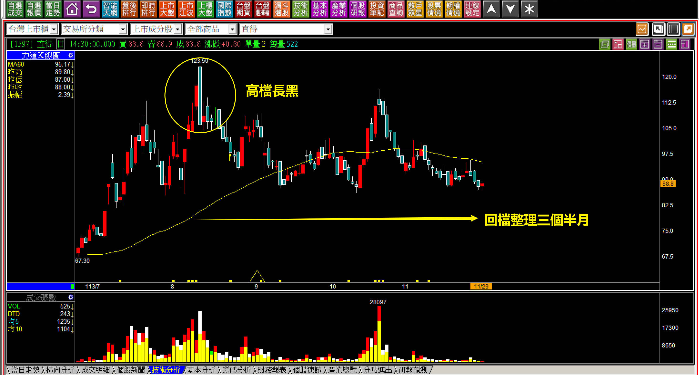
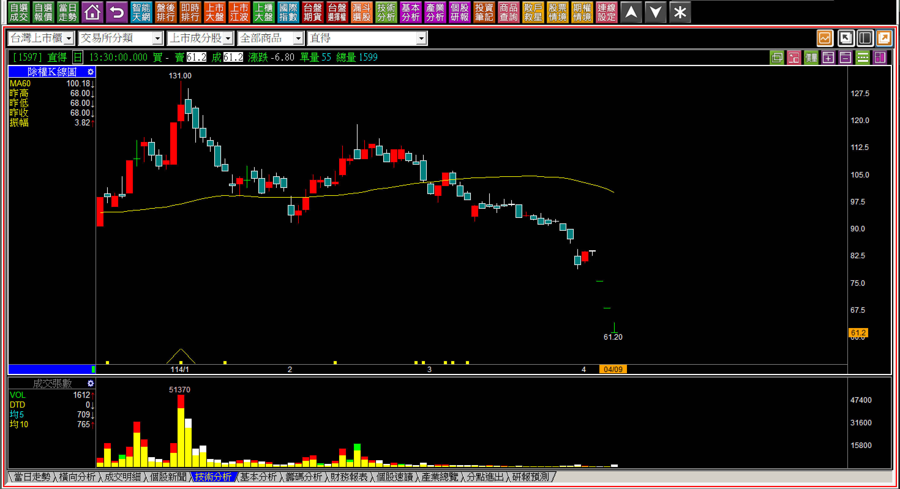

# 【明日K線】「進場」與「出場」對明日K線的判斷不一樣

這是明日K線單元的倒數第二篇，還有一篇即將完結，雖然明日K線的應用不是簡單幾篇可以涵蓋，但是相信理解明日K線的意義，會對K線判斷與實際運用有更多幫助。

進場、出場的意義不同，這是交易者一定要有的觀念。

同樣是「買進的動作」買進股票做多，跟空單回補，一個是進場、一個是出場，請讀者先停在這個地方，好好的思考到底有什麼不同之處。進場就得要考慮到未來的走勢是否與預期相符，但如果是出場意義就不用考慮未來走勢，換句話說，進場買進多單需要考慮到未來股價有沒有拉抬的力量，但是空單回補就只有一個任務，補在低點就可以。

因為這個觀念影響到了在市場悲觀的時期，交易應該要選強勢還是弱勢？投資買了低檔會遇到什麼問題。

**對比三檔落底之後的股票各自的進場問題**

這一段要談的是，如果打算要逢低買進股票，各自會遇到的問題。

以海悅(2348)、欣銓(3264)、聯電(2303)股價跌破低點「之後」的狀態來說明，都是大盤沒有轉空之前，個股股價都已經經歷過一段時間的空方走勢，欣銓是遇到了紅K包覆的轉折吞噬，不過在11/29股價又略創新低，海悅突破下降壓力線之後，股價開始往上明顯反彈，聯電則是創下新低價之後，大家發現股價定然比已經虧了十年的宏達電都還要低。

**113-11-01欣銓(3264)紅K吞噬**

**

**

紅K吞噬代表空方力竭的意義，在股價沒有再次破底之前，這個空方力竭是有效的。

**113-11-11海悅(2348)下降壓力線突破**

**

**

突破下降壓力線對於正在進行中的股價來說，是一種趨勢上的改變，也代表著這一次的空方趨勢結束。

結束後依然可能再跌破，這是需要注意的地方，不是突破下降壓力線一定會翻多。

**113-11-28聯電(2303)股價低於宏達電**

單純以財報來看，怎樣都是聯電的投資價值優於宏達電，但這並不代表投資人買進比較值得的股票，接下來的績效就會比較好，畢竟股價由市場資金決定。

所謂的「進場」，指的就是原本手上沒有部位，經歷了一個動作知道變成了持有部位，不論是做多還是做空。

進場之後，就會被賦予了一個「義務」，就是未來需要考慮出場該如何判斷，出場變成空手之後，就沒有義務還要再進場，這表示如果是進場，就得考慮股價的變化，出場不用。

上述三個例子假如買進，當時都算是買低，雖然當日買在低檔，但是如果有買進，要不要考慮明天之後的走勢？

當然要，可是卻沒有任何依據可以考慮。如果是空單的回補，不必考慮以後會如何。

**出場之後股價已經「事不關己」**

多單的出場之後，股價會不會跌？已經與我們無關，所以對比來說明日K線完全不需要再判斷這樣的股價以後的走勢會如何，就算是主力沒有出貨完畢，那也是主力的事。

**113-06-04所羅門(2359)**

依照攻擊K線的判斷，這是股價不攻擊的出場，對於交易者來說出場之後也就不需要再考慮股價之後會如何。可是如果是散戶所認知的技術分析，他們會以為既然技術分析這麼厲害，那就多單賣掉還可以順道放空。這就是沒有進出場概念的人常有的思維方式。

**113-10-30所羅門(2359)**

用通俗的話說，多單出場之後，並不代表股價就會溜滑梯一樣的往下跌，表示出場不是反向進場的意思。可是散戶就喜歡事後論，又以為既然多單應該要出場了，那之後就可以區間整理箱底買進、箱頂賣出，這也是錯誤觀念。

必須要理解進場與出場之間的定位不同。

**本來沒事，錯誤的認知就會有事**

如果對於出場的觀念清晰，就不會打算佔便宜，若要進場，就會專注在K線力量的判斷。

假如以為進出場就是買賣而已，對於未來的判斷就會越來越錯誤，例如剛剛談到的區間整理就會有人以為策略就是箱頂賣、箱底買，這是交易上的可怕觀念，因為箱底是買低，如果跌破區間，股價只會更低，而買低的人更不可能更低變成賣掉，就又慢慢的變成了攤平模式。

**113-11-29直得(1597)**

這是在去年底我對於高檔區間的說明跌幅，說明買進需要考慮未來會不會漲，並不是覺得不會跌就可以。漲，並不是覺得不會跌就可以買了。

**114-04-09直得(1597)**

通常散戶思維就是買賣位置，就會不小心以為應該要賣出的就是可以放空，空單回補點還可以翻多，並非如此，股價不是非多即空的標準。