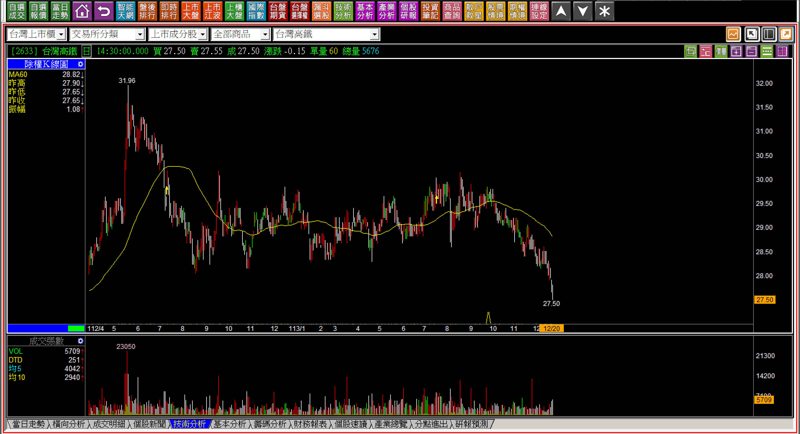
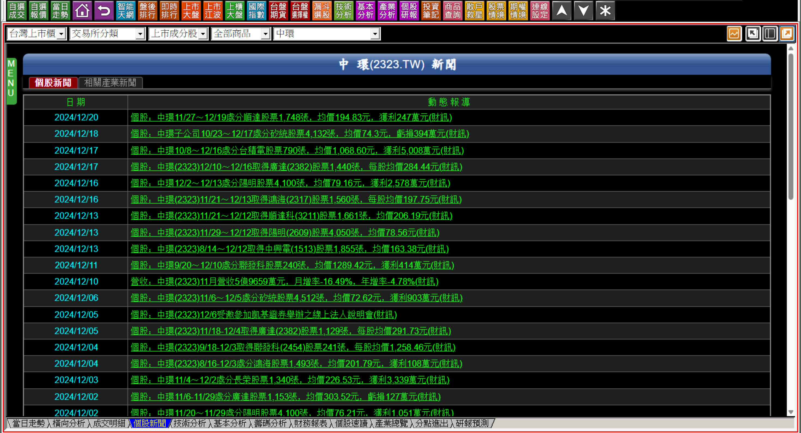
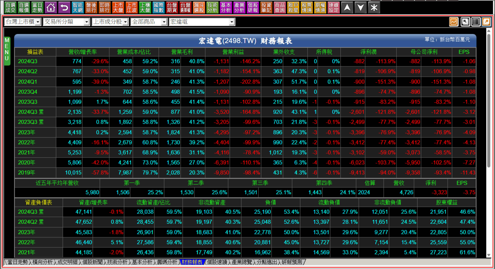
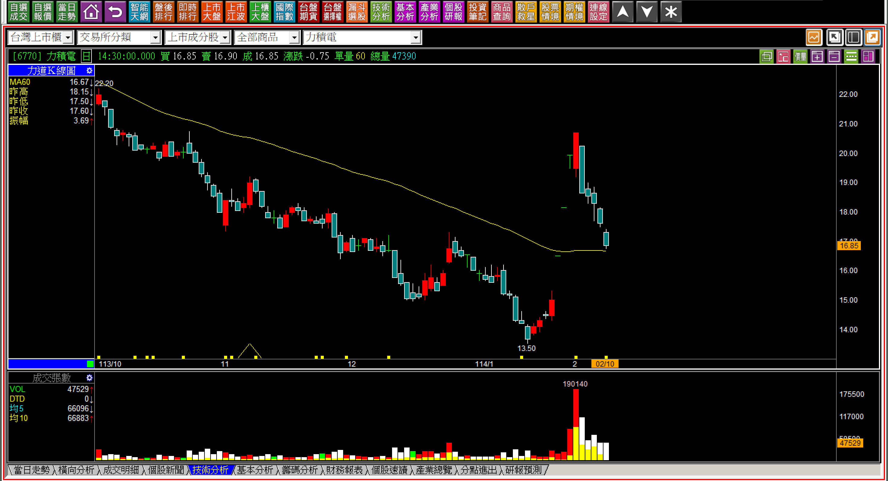

# 【明日K線】明日股價不樂觀的個股K線

這篇教學本來原名應該是：「看不到明日的K線」，但是後來想想，這個說法太嚴重了容易誤解，而且與其說是K線的教學，不如說本文是投資的選擇判斷，站在使用技術分析的立場，優先應該要考慮的就是「不宜進場」的類型，除了K線結構之外，很自然地也會連基本面或者公司的狀態，做如此的角度考慮。

今天談到的不僅僅是公司個別狀況，也有產業狀況，因為上市櫃公司實在無法一一舉例，而現在的K線已經呈現出「看得出來預期得到的問題」是什麼樣貌還是可以理解，所以匯集成為一篇教學判斷文章，希望對讀者們的『投資』層面的判斷有幫助。

**政策問題的個股**

高鐵(2633)是BOT案，當初五大原始股東付出的是特別股，也就是可以領債息，卻又享有股權的特別股，結果衍生出殷琦復仇記，因為五大原始股東被用過即丟，先在轉虧為盈的那一年，製造高鐵快要破產的輿論印象，然後減資再增資，這一增資交通部佔股44%，等於原始股東都被幹掉。

原始特許期50年，交通部成為第一大股東之後，延長了特許期成為75年，意思就是75年後高鐵會收歸國有，本來應該是五大原始股東從2000年開始興建，建成之後五十年可以享有收益，相當於地上權的概念，結果被趕出去之後，高鐵變成了政策工具。

例如某年罷免，結果端午節連假高鐵沒有優惠，卻在罷免投票週優惠票價，大量北漂民眾返鄉投票，這種事情我們沒有證據直接與罷免案有關係，但是聯想就很容易想到，高鐵的股東享有的營運利益根本就不值得投資，以後股權有一天也不會是你的，高鐵股價在2024年再創下兩年半新低價。

雖然近期有反彈，但是明顯的長期套牢壓力是很大的阻礙。

K線上有很大的頭部形成，這是對股東的一種傷害。雖然高鐵的股本達到5000億的規模，也是MSCI成分股，但是如果有問題都以後再說，是金融市場的鴕鳥特徵，如果讀者們有那種「股票長期投資，留著將來也是下一代的資產」這種想法，那高鐵絕對不是你想要的選擇，因為特許權過了之後收歸國有。

**黃昏產業股**

說實話台股的黃昏產業非常多，黃昏產業指的是不用大陸的削價競爭，是這些公司的營運項目我們根本已經看不到商品，最明顯的例子就是CDR，當初錸德信誓旦旦的說要跨入太陽能產業，十五年過去了，什麼都沒做，就是一種緩兵之計，延緩投資市場對他們的絕望程度而已。

那CDR公司現在在幹嘛？看看中環的新聞報導就會知道了。

你猜一家公司的老闆，知道還是不知道自己公司的資金在幹嘛？尤其這種新聞公告已經持續超過八年以上了，都是在買賣股票，政府監管機關不管，公司治理放一邊，這對於我們來說，根本就是看不到明天價值的公司。

這種黃昏產業，CDR是其一，宏達電的智慧手機雖然產業不是，但是公司是。

**拖延戰術直到天荒地老**

對於空手者來說，有些公司你應該這輩子都不應該投資，因為從價值消失之後，老闆根本就只是在過自己富人的日子，壓根沒有要幫股東翻身的態度，每年六月就聽到董事長說：「展望明年，希望可以幫股東賺錢」，然後呢？這家公司就是開著門營運沒有任何新鮮事，也沒有好產品。

接下來就是每年喊VR，遇到元宇宙話題就說元宇宙元年，沒有人相信就改說製造了第一隻元宇宙手機，根本就是一台中階低價的普通手機，對於投資界來說，任何還會買宏達電股票的人，不是笨，就是不懷好意。

不是要看每股盈餘，負數九年了也沒有新鮮事。

從2018年開始營收100億、隔年腰斬、到了2023年只剩下44億，2024年前三季營收只有21億，假如還要再假裝給股東希望的話，幾乎就是一家詐騙公司了。可以預期的是再這樣下去，這家公司就是下市倒閉的命運而已。

**中國大陸傾銷的受害股**

2024年中國又開始傾銷記憶體，DDR4一次對半砍價，然後就是成熟製程的半導體，所以南科、聯電股價都崩跌，這些被傾銷的受害股，短期內都看不到未來改變的機會。

以我的經驗來說，「地雷疑慮股」都有一種特色，就是老闆通常廢話很多，都要給股東做夢，力積電就是這一類型兼具多項有問題的毛病於一身，有著蹭台積電熱度的股名，骨子裡就是力晶的再翻版。

過往我們談過，在庫存過剩的時代，多數成熟製程公司選擇與客戶共體時艱，只有力積電要求客戶履約，否則要付違約金，這就讓當年的每股盈餘達到最高峰，此後客戶心寒，力積電的營收盈餘下降的速度比起大陸的傾銷還要快很多、早很多。

幾乎又是一個沒有明天的企業，連閱讀新聞都沒有價值。我知道前陣子有新聞談到力積電宣布跨往先進製程發展有成，包括中介層(Interposer)與3D晶圓堆疊，合計單月最大產能已經可以達到4萬片12吋晶圓，當中，中介層月產能也有數千片的產能配置，正式進駐高毛利的3D AI代工市場，不過說真的，我不是很相信這家公司。

明日股價不樂觀的企業，是絕對、優先、盡快怎樣都要避開的投資，明日K線指的就是對明日之後股價的判斷，這些特質使得我們一定要留意不要踩雷。

**114-02-10力積電(6770)**

目前的股價看起來就是又在20元附近套了19萬張散戶，有人認為我對於公司的成見比較深，實際上看過太多老闆的誑語，甚至有過博達的下市風暴，在還沒有看到營收真正的成長出現之前，對於明日K線的判斷，就是眼見才可以為憑。

**補充：主力色彩濃厚股**

關於主力股，在我那個年代因為沒有網路、僅靠電視廣播報紙，以訛傳訛、內神通外鬼、與記者配合的惡質主力非常多，加上丙種資金盛行，股票檔數較少沒有現在這麼多選擇，所以那時古董張等人的時代漸漸地過去，主流媒體因為網路盛行，一般傳統的主力模式漸漸的已經失效。

但是人心是一樣的，鬼故事很多，例如之前談過的品安(8088)，我大約還知道將近十檔約在十多年前就有惡質主力色彩的公司，這些只要有過當時經驗的投資人，會永遠都不想碰的，也算是在這篇說明的範圍中，但是因為講出來等於是很大篇幅的歷史故事，未來有機會我在公開文來聊聊這個「話題」當作故事參考即可。